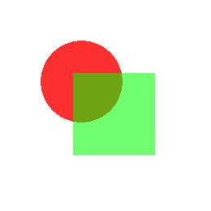

.. vim: syntax=rst

2D绘图
========

emWin 包含一个完整的2D绘图图形库，提供了非常多的API函数，包括画点、画线，绘制矩形、圆、椭圆、扇形、
多边形和位图等平面图形，甚至还能生成二维码。本章节就为大家讲解2D图形库的一些基本绘图函数，
图形库中的位图绘制和显示我们放到下一章节单独讲解。表格 较为常用的基本2D绘图API函数表_ 列出了部分比较常用的2D绘图API函数。

基本绘图
~~~~~~~~~~~~

绘图API
^^^^^^^^^^^^^

GUI_SetLineStyle()
''''''''''''''''''''''''''''''''''

设置直线的绘制样式。

.. code-block:: c
    :caption: 代码清单:2D绘图-1 函数原型
    :name: 代码清单:2D绘图-1
    :linenos:

    U8 GUI_SetLineStyle(U8 LineStyle);

1) LinStyle：
新的直线样式。

..

   可用的参数有：

   GUI_LS_SOLID：直线将绘制为视线（默认）；

   GUI_LS_DASH：直线将被绘制为虚线；

   GUI_LS_DOT：直线将被绘制为点线；

   GUI_LS_DASHDOT：线条将绘制成一个破折号和一个点交替的形式；

   GUI_LS_DASHDOTDOT：线条将绘制成破折号和双点交替的形式。

GUI_DrawLine()
''''''''''''''''''''''''''

从指定起点绘制一条线到当前窗口中的指定终结点(绝对坐标)。

.. code-block:: c
    :caption: 代码清单:2D绘图-2 函数原型
    :name: 代码清单:2D绘图-2
    :linenos:

    void GUI_DrawLine(int x0, int y0, int x1, int y1);

1) x0：
起始位置的X轴坐标；

2) y0：
起始位置的Y轴坐标；

3) x1：
终点位置的X轴坐标；

4) y1：
终点位置的Y轴坐标。

GUI_DrawRect()
''''''''''''''''''''''''''

在当前窗口中的指定位置绘制矩形。

.. code-block:: c
    :caption: 代码清单:2D绘图-3 函数原型
    :name: 代码清单:2D绘图-3
    :linenos:

    void GUI_DrawRect(int x0, int y0, int x1, int y1);

5) x0：
矩形右上角的X轴坐标；

6) y0：
矩形右上角的Y轴坐标；

7) x1：
矩形左下角的X轴坐标；

8) y1：
矩形左下角的Y轴坐标。

GUI_FillRect()
''''''''''''''''''''''''''

在当前窗口中的指定位置绘制带填充的矩形。

.. code-block:: c
    :caption: 代码清单:2D绘图-4 函数原型
    :name: 代码清单:2D绘图-4
    :linenos:

    void GUI_FillRect(int x0, int y0, int x1, int y1);

参数同上，但效果不同。

GUI_DrawRoundedFrame()
''''''''''''''''''''''''''''''''''''''''''

在当前窗口中的指定位置绘制圆角矩形框，可指定圆角大小和边框宽度。

.. code-block:: c
    :caption: 代码清单:2D绘图-5 函数原型
    :name: 代码清单:2D绘图-5
    :linenos:

    void GUI_DrawRoundedFrame(int x0, int y0, int x1, int y1, int r, int w);

1) x0：
矩形右上角的X轴坐标；

2) y0：
矩形右上角的Y轴坐标；

3) x1：
矩形左下角的X轴坐标；

4) y1：
矩形左下角的Y轴坐标；

5) r：
圆角半径；

6) w：
边框宽度。

GUI_FillRoundedRect()
'''''''''''''''''''''''''''''''''''''''''

在当前窗口中的指定位置绘制带填充的圆角矩形。

.. code-block:: c
    :caption: 代码清单:2D绘图-6 函数原型
    :name: 代码清单:2D绘图-6
    :linenos:

    void GUI_FillRoundedRect(int x0, int y0, int x1, int y1, int r);

1) x0：
矩形右上角的X轴坐标；

2) y0：
矩形右上角的Y轴坐标；

3) x1：
矩形左下角的X轴坐标；

4) y1：
矩形左下角的Y轴坐标；

5) r：
圆角半径。

GUI_DrawGradientV()
'''''''''''''''''''''''''''''''''''

绘制使用垂直渐变颜色填充的矩形。

.. code-block:: c
    :caption: 代码清单:2D绘图-7 函数原型
    :name: 代码清单:2D绘图-7
    :linenos:

    void GUI_DrawGradientV(int x0, int y0, int x1, int y1,
                        GUI_COLOR Color0, GUI_COLOR Color1);

1) x0：
矩形右上角的X轴坐标；

2) y0：
矩形右上角的Y轴坐标；

3) x1：
矩形左下角的X轴坐标；

4) y1：
矩形左下角的Y轴坐标；

5) Color0：
要在矩形最顶层绘制的颜色；

6) Color1：
要在矩形最底层绘制的颜色。

GUI_DrawGradientRoundedV()
''''''''''''''''''''''''''''''''''''''''''''''''''

绘制使用水平渐变颜色填充的圆角矩形。

.. code-block:: c
    :caption: 代码清单:2D绘图-8 函数原型
    :name: 代码清单:2D绘图-8
    :linenos:

    void GUI_DrawGradientRoundedV(int x0, int y0, int x1, int y1, int rd,
                                GUI_COLOR Color0, GUI_COLOR Color1);

1) x0：
矩形右上角的X轴坐标；

2) y0：
矩形右上角的Y轴坐标；

3) x1：
矩形左下角的X轴坐标；

4) y1：
矩形左下角的Y轴坐标；

5) rd：
圆角半径；

6) Color0：
要在矩形最顶层绘制的颜色；

7) Color1：
要在矩形最底层绘制的颜色。

基本绘图实验
^^^^^^^^^^^^^^^^^^

代码分析
''''''''

下面我们在模拟器上使用上述绘图API编写一段程序，看看实际效果，程序见 代码清单:2D绘图-9_ 。

.. code-block:: c
    :caption: 代码清单:2D绘图-9 MainTask函数
    :name: 代码清单:2D绘图-9
    :linenos:

    void MainTask(void)
    {
        GUI_Init();

        /* 设置背景色 */
        GUI_SetBkColor(GUI_WHITE);
        GUI_Clear();
        /* 绘制破折号直线 */
        GUI_SetColor(GUI_BLACK);
        GUI_SetLineStyle(GUI_LS_DASH);
        GUI_DrawLine(70, 10, 170, 110);
        /* 绘制点直线 */
        GUI_SetLineStyle(GUI_LS_DOT);
        GUI_DrawLine(50, 10, 170, 130);
        /* 绘制实心直线 */
        GUI_SetLineStyle(GUI_LS_SOLID);
        GUI_DrawLine(30, 10, 170, 150);
        GUI_SetPenSize(4);
        GUI_DrawLine(10, 10, 170, 170);
        /* 绘制矩形 */
        GUI_SetColor(GUI_BLUE);
        GUI_DrawRect(210, 10, 290, 90);
        GUI_FillRect(310, 10, 390, 90);
        /* 绘制圆角矩形 */
        GUI_SetColor(GUI_ORANGE);
        GUI_DrawRoundedFrame(210, 110, 290, 190, 20, 8);
        GUI_FillRoundedRect(310, 110, 390, 190, 20);
        /* 绘制渐变色圆角矩形 */
        GUI_DrawGradientRoundedV(410, 10, 490, 190, 20, GUI_LIGHTMAGENTA,
                                GUI_LIGHTCYAN);

        while (1) {
            GUI_Delay(100);
        }
    }

基本绘图的API函数较为简单，有不明白的地方可以查阅前面的内容和官方API参考手册。
这里需要注意的是，GUI_SetLineStyle()函数只有在画笔大小为1的时候才有效，画线函数的坐标x0的值必须小于x1的值，否则函数无法显示。

实验现象
''''''''

实验结果如图 实验结果_ 所示，本实验只是让读者熟悉绘制API的使用，比较简单。

Alpha混合
~~~~~~~~~~~~~~~~~~~

Alpha混合（Alpha Blending）是一种将半透明前景色与背景色相结合产生新的混合色，从而实现透明度效果的过程。
前景色的半透明度可以从完全透明到完全不透明不等。如果前景色完全透明，则新的混合色就是背景色；相反，如果它是完全不透明的，
则新的混合色就是前景色。半透明度可以在这些极端值之间变化。混合颜色由前景色和背景色以及各自的透明度通过加权平均计算得出。

绘图API
^^^^^^^^^^^^^

GUI_EnableAlpha()
'''''''''''''''''''''''''''''''''

启用或禁用自动 Alpha 混合。

.. code-block:: c
    :caption: 代码清单:2D绘图-10 函数原型
    :name: 代码清单:2D绘图-10
    :linenos:

    unsigned GUI_EnableAlpha(unsigned OnOff);

1) OnOff：
1 启用自动 Alpha 混合，0 禁用。

..

   返回值：设置前的状态。

GUI_SetAlpha ()
'''''''''''''''''''''''''''''''''

为所有后续绘图操作启用软件Alpha混合。

.. code-block:: c
    :caption: 代码清单:2D绘图-11 函数原型
    :name: 代码清单:2D绘图-11
    :linenos:

    unsigned GUI_SetAlpha(U8 Value);

1) Value：
要用于所有后续绘图操作的 Alpha 值，默认为完全不透明。

..

   返回值：上一次Alpha混合的值。

注意：在标有ARGB后缀的emWin核心库中，Alpha通道值为0表示完全透明，255表示完全不透明。
而无此后缀的核心库则相反，255表示完全透明，0表示完全不透明。

Alpha混合实验
^^^^^^^^^^^^^^^^^^^^^^^^^

在模拟器上编写一段程序，熟悉上述绘图API函数的使用，程序见 代码清单:2D绘图-12_ 。

代码分析
''''''''

.. code-block:: c
    :caption: 代码清单:2D绘图-12 MainTask函数
    :name: 代码清单:2D绘图-12
    :linenos:

    void MainTask(void)
    {
        GUI_Init();

        /* 设置背景颜色 */
        GUI_SetBkColor(GUI_WHITE);
        GUI_Clear();
        /* 使能自动Alpha混合 */
        GUI_EnableAlpha(1);
        /* 将Alpha数值添加到颜色中并显示 */
        GUI_SetColor(0xFF0000 | (0xE0uL << 24));
        GUI_FillCircle(100, 100, 50);
        GUI_SetColor(0x00FF00 | (0x60uL << 24));
        GUI_FillRect(90, 90, 190, 190);
        /* 禁止自动Alpha混合 */
        GUI_EnableAlpha(0);

        while (1) {
            GUI_Delay(100);
        }
    }

Alpha 混合完全自动执行，用户只需要调用GUI_EnableAlpha()使能 Alpha 混合，然后在设置颜色的时候添加Alpha通道值即可。
32位ARGB颜色空间的最高8位用作Alpha值的设置。由于Alpha混合会增加处理器的负担，所以在使用完后一定记得禁止自动Alpha混合。
需要注意一点，如果使用emWin官方定义好的颜色宏来指定图形颜色，那么Alpha混合是无效的，只能直接输入十六进制的颜色数值才能让Alpha混合起效，具体原因目前暂不清楚。

实验现象
''''''''

Alpha混合实验在模拟器上的运行结果如图 模拟器实验结果_ 所示。

多边形和圆相关绘图
~~~~~~~~~~~~~~~~~~~~~~~~~

.. _绘图api-2:

绘图API
^^^^^^^^^^^^^

GUI_DrawPolygon()
'''''''''''''''''''''''''''''''''

在当前窗口中绘制由点列表定义的多边形轮廓。

.. code-block:: c
    :caption: 代码清单:2D绘图-13 函数原型
    :name: 代码清单:2D绘图-13
    :linenos:

    void GUI_DrawPolygon(const GUI_POINT * pPoint, int NumPoints, int x, int y);

1) pPoint：
指向需要显示的多边形的点列表指针；

2) NumPoints：
点列表中指定的点数；

3) x：
多边形各点在x轴上的整体偏移量；

4) y：
多边形各点在y轴上的整体偏移量。

此函数用于绘制多边形线框，线框的样式可通过GUI_SetLineStyle()函数修改，也就是说，
更改直线的绘制样式可以让GUI_DrawPolygon()绘制出相应样式的多边形线框。点列表中的各点必须按顺序排列，否则出错。

GUI_FillPolygon()
'''''''''''''''''''''''''''''''''

在当前窗口中绘制由点列表定义的带填充的多边形。

.. code-block:: c
    :caption: 代码函数原型
    :name: 代码函数原型
    :linenos:

    void GUI_FillPolygon(const GUI_POINT * pPoint, int NumPoints, int x, int y);

1) pPoint：
指向需要显示的多边形的点列表指针；

2) NumPoints：
点列表中指定的点数；

3) x：
多边形各点在x轴上的整体偏移量；

4) y：
多边形各点在y轴上的整体偏移量。

此函数用于绘制填充多边形，不受GUI_SetLineStyle()函数的影响。点列表中的各点必须按顺序排列，否则出错。

GUI_DrawCircle()
''''''''''''''''''''''''''''''''

在当前窗口中的指定位置绘制指定尺寸的线框圆。

.. code-block:: c
    :caption: 代码清单:2D绘图-14 函数原型
    :name: 代码清单:2D绘图-14
    :linenos:

    void GUI_DrawCircle(int x0, int y0, int r);

1) x0：
圆心x轴坐标；

2) y0：
圆心y轴坐标；

3) r：
圆的半径。

GUI_FillCircle()
''''''''''''''''''''''''''''''''

在当前窗口中的指定位置绘制指定尺寸的填充圆。

.. code-block:: c
    :caption: 代码清单:2D绘图-15 函数原型
    :name: 代码清单:2D绘图-15
    :linenos:

    void GUI_FillCircle(int x0, int y0, int r);

参数同上，但效果不同。

GUI_DrawEllipse()
'''''''''''''''''''''''''''''''''

在当前窗口的指定位置绘制指定尺寸的线框椭圆。

.. code-block:: c
    :caption: 代码清单:2D绘图-16 函数原型
    :name: 代码清单:2D绘图-16
    :linenos:

    void GUI_DrawEllipse(int x0, int y0, int rx, int ry);

1) x0：
圆心x轴坐标；

2) y0：
圆心y轴坐标；

3) rx：
x轴方向的半径；

4) ry：
y轴方向的半径。

GUI_FillEllipse()
'''''''''''''''''''''''''''''''''

在当前窗口的指定位置绘制指定尺寸的填充椭圆。

.. code-block:: c
    :caption: 代码清单:2D绘图-17 函数原型
    :name: 代码清单:2D绘图-17
    :linenos:

    void GUI_FillEllipse(int x0, int y0, int rx, int ry);

参数同上，但效果不同。

GUI_DrawArc()
'''''''''''''''''''''''''

在当前窗口的指定位置绘制指定尺寸的圆弧。 圆弧是线框圆的一部分。

.. code-block:: c
    :caption: 代码清单:2D绘图-18 函数原型
    :name: 代码清单:2D绘图-18
    :linenos:

    void GUI_DrawArc(int xCenter, int yCenter, int rx, int ry, int a0, int
                    a1);

1) xCenter：
圆弧的圆心x轴坐标；

2) yCenter：
圆弧的圆心y轴坐标；

3) rx：
x轴方向的半径；

4) ry：
y轴方向的半径；

5) a0：
起始角度；

6) a1：
终止角度。

多边形和圆相关绘图实验
^^^^^^^^^^^^^^^^^^^^^^^^^^^^^^^

代码分析
''''''''

.. code-block:: c
    :caption: 代码清单:2D绘图-19 MainTask函数
    :name: 代码清单:2D绘图-19
    :linenos:

    void MainTask(void)
    {
        GUI_Init();

        /* 设置背景色 */
        GUI_SetBkColor(GUI_WHITE);
        GUI_Clear();

        /* 绘制三角形 */
        GUI_POINT TrianglePoint[] = {
            {  0,  0 },
            {  0, 80 },
            { 60,  0 },
        };
        GUI_SetColor(GUI_RED);
        GUI_FillPolygon(TrianglePoint, 3, 20, 20);
        /* 绘制虚线多边形 */
        GUI_POINT PolygonPoint[] = {
            { 30, 30 },
            {  0, 96 },
            { 83, 96 },
            { 72,  6 }
        };
        GUI_SetColor(GUI_BLACK);
        GUI_SetLineStyle(GUI_LS_DOT);
        GUI_DrawPolygon(PolygonPoint, 4, 98, 15);
        /* 绘制正六边形 */
        GUI_POINT _aPointHexagon[] = {
            {  0, -30 },
            { 26, -15 },
            { 26,  15 },
            {  0,  30 },
            {-26,  15 },
            {-26, -15 },
        };
        GUI_SetColor(GUI_GREEN);
        GUI_FillPolygon(&_aPointHexagon, 6, 50, 138);
        /* 绘制立方体正面 */
        GUI_POINT SolidCube_Front[] = {
            {  40, 140},
            { 140, 140},
            { 140,  40},
            {  40,  40},
        };
        GUI_SetColor(0x4a51cc);
        GUI_FillPolygon(SolidCube_Front, 4, 150, 200);
        /* 绘制立方体右侧 */
        GUI_POINT SolidCube_RightPoint[] = {
            { 140, 140 },
            { 176, 104 },
            { 176,   4 },
            { 140,  40 },
        };
        GUI_SetColor(0x4d4b9d);
        GUI_FillPolygon(SolidCube_RightPoint, 4, 150, 200);
        /* 绘制立方体顶部 */
        GUI_POINT SolidCube_TopPoint[] = {
            {  40, 40 },
            { 140, 40 },
            { 176,  4 },
            {  76,  4 },
        };
        GUI_SetColor(0x585fe8);
        GUI_FillPolygon(SolidCube_TopPoint, 4, 150, 200);
        /* 绘制线框圆 */
        GUI_SetColor(GUI_CYAN);
        GUI_DrawCircle(181, 111, 35);
        /* 绘制填充圆 */
        GUI_SetColor(GUI_MAGENTA);
        GUI_FillCircle(261, 111, 35);
        /* 绘制线框椭圆 */
        GUI_SetColor(GUI_BLUE);
        GUI_DrawEllipse(48, 270, 25, 50);
        /* 绘制填充椭圆 */
        GUI_SetColor(GUI_ORANGE);
        GUI_FillEllipse(88, 270, 60, 38);
        while (1) {
            GUI_Delay(100);
        }
    }

使用GUI_SetColor()函数来设置填充的颜色，调用GUI\_ FillPolygon()函数进行填充。

下面讲解一下正方体的绘制方法。不过在讲解之前，先给大家补充一种画空间几何直观图的方法：斜二测画法。

斜二测画法的口诀是：平行改斜垂依旧，横等纵半竖不变。这里补充斜二测画法，主要是为了做坐标的计算。
emWin没有集成3D图形库，因此如果我们需要绘制3D图形，就需要自己计算坐标。图 斜二测画法示意图_ 是一个2*2*2的正方体，
由口诀的第一句话，可以知道角OBB’等于45°，第二句话说明了AA’和BB’的长度等于原来的长度的二分之一。
由此，我们就可以计算出整个正方体所有顶点的坐标值。将所得的坐标值分为三个面存放到在各自的点列表数组中，
然后利用GUI_FillPolygon()函数，就可以绘制出来正方体了。

注意：emWin的默认显示坐标中，y轴的正方向是朝下的，计算正方体各面坐标时需要将其考虑在内。

如果只是绘制线框正方体，那到这一步就已经完成了。但如果是绘制带颜色填充的正方体，那么还需要给每个可见的面上色。
由于光源与立方体的位置，决定了三个面颜色的不同。那如何给正方体上色呢？最简单粗暴的办法就是先用excel软件自带的形状绘制一个立方体，
再利用网页工具“在线取色器”对正方体取色，就可以得到每个面的颜色。Win10用户，可以使用画图3D工具的取色器来获取颜色值。
获取的颜色值为16进值码，通过网页工具“RGB颜色值与十六进制颜色码转换工具”最终转换为RGB颜色值。

实验现象
''''''''

最后得到的结果如图 多边形和圆相关绘图实验结果_ 。而且利用上面的方法画出来的立体图形的空间观感较好。

绘制二维码
~~~~~~~~~~~~~

emWin从5.34版本开始新增了可以生成和显示二维码（QR Code）的功能，这个功能一共只有四个API函数，而且使用起来非常的方便。
有了这个功能，就不需要在工程中额外包含二维码库了。有关二维码的相关知识，
请参考《【野火】零死角玩转STM32—F429挑战者V2》第48章二维码识别章节。

.. _绘图api-3:

绘图API
^^^^^^^^^^^^^

GUI_QR_Create()
'''''''''''''''''''''''''''

创建一张二维码位图。

.. code-block:: c
    :caption: 代码清单:2D绘图-20 函数原型
    :name: 代码清单:2D绘图-20
    :linenos:

    GUI_HMEM GUI_QR_Create(const char * pText, int PixelSize, int EccLevel, int Version);

1) pText：
需要制作成二维码的UTF-8编码的文本；

2) PixelSize：
单个数据色块的大小 (以像素为单位)；

3) EccLevel：
要使用的纠错编码等级，可选的纠错编码等级如下：

..

   GUI_QR_ECLEVEL_L：可以恢复7%的数据；

   GUI_QR_ECLEVEL_M：可以恢复15%的数据；

   GUI_QR_ECLEVEL_Q：可以恢复25%的数据；

   GUI_QR_ECLEVEL_H：可以恢复30%的数据。

4) Version：
二维码版本号，用于规定生成的二维码的尺寸。如果设置为0（推荐），将自动计算大小。必须介于1和40之间。如果它小于给定文本与给定EccLevel所需的值，则该函数将失败。

返回值：成功时返回位图的句柄，出错时返回0。

GUI_QR_Delete()
'''''''''''''''''''''''''''

释放用于二维码的内存。

.. code-block:: c
    :caption: 代码清单:2D绘图-21 函数原型
    :name: 代码清单:2D绘图-21
    :linenos:

    void GUI_QR_Delete(GUI_HMEM hQR);

1) hQR：需要删除的二维码句柄。

如果不再使用二维码，则应将其删除，以免出现某些未知错误。

GUI_QR_Draw()
'''''''''''''''''''''''''

在指定的位置绘制指定的 二维 码。

.. code-block:: c
    :caption: 代码清单:2D绘图-22 函数原型
    :name: 代码清单:2D绘图-22
    :linenos:

    void GUI_QR_Draw(GUI_HMEM hQR, int xPos, int yPos);

1) hQR：
需要显示的二维码句柄；

2) xPos：
需要显示位置的x轴坐标；

3) yPos：
需要显示位置的y轴坐标。

GUI_QR_GetInfo()
''''''''''''''''''''''''''''''''

返回包含有关指定 二维码代码信息的结构体。

.. code-block:: c
    :caption: 代码清单:2D绘图-23 函数原型
    :name: 代码清单:2D绘图-23
    :linenos:

    void GUI_QR_GetInfo(GUI_HMEM hQR, GUI_QR_INFO *pInfo);

1) hQR：
二维码句柄；

2) pInfo：
指向 GUI_QR_INFO 类型的 结构体指针。

GUI_QR_INFO结构体的元素如 代码清单:2D绘图-24_ 所示。

.. code-block:: c
    :caption: 代码清单:2D绘图-24 GUI_QR_INFO结构体元素
    :name: 代码清单:2D绘图-24
    :linenos:

    typedef struct {
        int Version;  // 二维码的版本号
        int Width;    // 数据色块的个数
        int Size;     //位图的大小(以像素为单位)
    } GUI_QR_INFO;

二维码绘图实验
^^^^^^^^^^^^^^^^^^^

代码分析
''''''''

.. code-block:: c
    :caption: 代码清单:2D绘图-25 MainTask函数
    :name: 代码清单:2D绘图-25
    :linenos:

    void MainTask(void)
    {
        GUI_HMEM hQR;

        char QR_String[] = "http://www.firebbs.cn/forum.
                        php?mod=forumdisplay&fid=99";
        GUI_Init();

        /* 设置背景色 */
        GUI_SetBkColor(GUI_WHITE);
        GUI_Clear();
        /* 创建二维码对象 */
        hQR = GUI_QR_Create(QR_String, 5, GUI_QR_ECLEVEL_H, 0);
        /* 绘制二维码到LCD */
        GUI_QR_Draw(hQR, 10, 10);
        /* 删除二维码对象 */
        GUI_QR_Delete(hQR);
        while (1) {
            GUI_Delay(100);
        }
    }

首先创建一个二维码位图，内容是野火电子论坛emWin/ucgui专区的网址，每个数据色块的宽度为5个像素，
纠错等级设置为最高，自动调整位图大小。然后将二维码绘制到LCD屏，绘制完成后删除二维码位图。

实验现象
''''''''

在模拟器上运行上述代码，其结果如图 二维码实验结果_ 所示。

2D绘图综合实验
~~~~~~~~~~~~~~~~~~~~~~~~

代码分析
^^^^^^^^^^^^

(1) 多边形的点列表定义

.. code-block:: c
    :caption: 代码清单:2D绘图-26 多边形的点列表
    :name: 代码清单:2D绘图-26
    :linenos:

    GUI_RECT BasicRect = {10, 10, 100, 105};
    static const unsigned aValues[] = {100, 135, 190, 240, 340, 360};
    static const GUI_COLOR aColor[] = {GUI_BLUE, GUI_GREEN, GUI_RED,
                                    GUI_CYAN, GUI_MAGENTA, GUI_YELLOW
                                    };
    static const char QR_TEXT[] = "http://www.firebbs.cn";
    static const GUI_POINT _aPointArrow[] = {
        {  0,   0 },
        {-40, -30 },
        {-10, -20 },
        {-10, -70 },
        { 10, -70 },
        { 10, -20 },
        { 40, -30 },
    };
    static const GUI_POINT DashCube_BackPoint[] = {
        { 76 , 104 },
        { 176, 104 },
        { 176,   4 },
        {  76,   4 }
    };
    static const GUI_POINT DashCube_LeftPoint[] = {
        { 40, 140 },
        { 76, 104 },
        { 76,   4 },
        { 40,  40 }
    };
    static const GUI_POINT DashCube_BottonPoint[] = {
        {  40, 140 },
        { 140, 140 },
        { 176, 104 },
        {  76, 104 }
    };
    static const GUI_POINT DashCube_TopPoint[] = {
        {  40, 40 },
        { 140, 40 },
        { 176,  4 },
        {  76,  4 },
    };
    static const GUI_POINT DashCube_RightPoint[] = {
        { 140, 140 },
        { 176, 104 },
        { 176,   4 },
        { 140,  40 },
    };
    static const  GUI_POINT DashCube_FrontPoint[] = {
        {  40, 140},
        { 140, 140},
        { 140,  40},
        {  40,  40},
    };

以上代码的内容包括：一个矩形起始坐标和终点坐标的数组BasicRect，用于绘制饼图的角度值数组aValues和颜色数组aColor，
用于生成二维码的字符串QR_TEXT，以及用于绘制正方体六个面的多边形点列表数组。GUI_RECT在文本显示章节有过介绍，
现在我们来看看GUI_COLOR和GUI_POINT的原型，见 代码清单:2D绘图-27_ 。

.. code-block:: c
    :caption: 代码清单:2D绘图-27 GUI_COLOR和GUI_POINT的原型
    :name: 代码清单:2D绘图-27
    :linenos:

    /*GUI_COLOR原型 */
    typedef U32 LCD_COLOR;
    typedef LCD_COLOR       GUI_COLOR;

    /*GUI_POINT原型 */
    typedef struct {
        I16P x,y;
    } GUI_POINT;

从GUI_POINT的原型可以看出，多边形的点列表实际上是一个结构体数组。

(2) 饼图绘制

.. code-block:: c
    :caption: 代码清单:2D绘图-28 饼图绘制函数（MainTask.c）
    :name: 代码清单:2D绘图-28
    :linenos:

    /**
    * @brief 饼图绘图函数
    * @note 无
    * @param x0：饼图圆心的x坐标
    *        y0：饼图圆心的y坐标
    *        r：饼图半径
    * @retval 无
    */
    static void Pie_Chart_Drawing(int x0, int y0, int r)
    {
        int i, a0 = 0, a1 = 0;

        for (i = 0; i < GUI_COUNTOF(aValues); i++) {
            if (i == 0) a0 = 0;
            else a0 = aValues[i - 1];
            a1 = aValues[i];
            GUI_SetColor(aColor[i]);
            GUI_DrawPie(x0, y0, r, a0, a1, 0);
        }
    }

在Pie_Chart_Drawing函数中通过循环调用GUI_DrawPie来实现绘制饼图的效果，每次绘制的扇形的起始和终止角度由aValues数组指定，
扇形的颜色由aColor数组指定。首先判断将要绘制的是否为第一个扇形，如果是的话就将第一个扇形的起始角度a0设为0，接着指定颜色开始绘制。
当然读者也可以在角度数组中把第一个元素也就是第一个扇形的起始角度定为0，这样就不用判断了。需要注意的是，emWin的圆相关API函数，角度的增加方向都是逆时针。

(3) 二维码生成

.. code-block:: c
    :caption: 代码清单:2D绘图-29 二维码生成函数（MainTask.c）
    :name: 代码清单:2D绘图-29
    :linenos:

    /**
    * @brief 二维码生成
    * @note 无
    * @param pText：二维码内容
    *        PixelSize：二维码数据色块的大小，单位：像素
    *        EccLevel：纠错编码级别
    *        x0：二维码图像在LCD的坐标x
    *        y0：二维码图像在LCD的坐标y
    * @retval 无
    */
    static void QR_Code_Drawing(const char *pText, int PixelSize,
                                int EccLevel, int x0, int y0)
    {
        GUI_HMEM hQR;

        /* 创建二维码对象 */
        hQR = GUI_QR_Create(pText, PixelSize, EccLevel, 0);
        /* 绘制二维码到LCD */
        GUI_QR_Draw(hQR, x0, y0);
        /* 删除二维码对象 */
        GUI_QR_Delete(hQR);
    }

二维码生成的API函数在前面已经有过讲解，这里只是重新封装了一下。如有不明白的地方，请参考之前的内容以及《STemWin5.44参考手册》相关内容。

(4) 2D绘图

.. code-block:: c
    :caption: 代码清单:2D绘图-30 2D绘图函数（MainTask.c）
    :name: 代码清单:2D绘图-30
    :linenos:

    /**
    * @brief 2D绘图函数
    * @note 无
    * @param 无
    * @retval 无
    */
    /* 用于存放多边形旋转后的点列表 */
    GUI_POINT aArrowRotatedPoints[GUI_COUNTOF(_aPointArrow)];
    static void _2D_Graph_Drawing(void)
    {
        I16 aY[125] = {0};
        int i;
        float pi = 3.1415926L;
        float angle = 0.0f;

        /* 绘制各种矩形 */
        GUI_SetColor(GUI_GREEN);
        GUI_DrawRectEx(&BasicRect);
        BasicRect.x0 += 116;
        BasicRect.x1 += 116;
        GUI_FillRectEx(&BasicRect);
        GUI_SetColor(GUI_RED);
        GUI_DrawRoundedRect(240, 10, 330, 105, 10);
        GUI_DrawRoundedFrame(352, 10, 442, 105, 10, 10);
        GUI_FillRoundedRect(468, 10, 558, 105, 10);
        GUI_DrawGradientRoundedH(584, 10, 674, 105, 10, GUI_LIGHTMAGENTA,
                                GUI_LIGHTCYAN);
        GUI_DrawGradientRoundedV(700, 10, 790, 105, 10, GUI_LIGHTMAGENTA,
                                GUI_LIGHTCYAN);

        /* 绘制线条 */
        GUI_SetPenSize(10);
        GUI_SetColor(GUI_YELLOW);
        GUI_DrawLine(10, 140, 100, 240);

        /* 绘制多边形 */
        GUI_SetColor(GUI_RED);
        GUI_FillPolygon(_aPointArrow, 7, 190, 205);
        /* 旋转多边形 */
        angle = pi / 2;
        GUI_RotatePolygon(aArrowRotatedPoints,
                        _aPointArrow,
                        (sizeof(_aPointArrow) / sizeof(_aPointArrow[0])),
                        angle);
        GUI_FillPolygon(&aArrowRotatedPoints[0], 7, 220, 250);

        /* 绘制线框正方体 */
        GUI_SetPenSize(1);
        GUI_SetColor(0x4a51cc);
        GUI_SetLineStyle(GUI_LS_DOT);
        GUI_DrawPolygon(DashCube_BackPoint, 4, 210, 145);
        GUI_DrawPolygon(DashCube_LeftPoint, 4, 210, 145);
        GUI_DrawPolygon(DashCube_BottonPoint, 4, 210, 145);
        GUI_SetPenSize(2);
        GUI_SetLineStyle(GUI_LS_SOLID);
        GUI_DrawPolygon(DashCube_TopPoint, 4, 210, 145);
        GUI_DrawPolygon(DashCube_RightPoint, 4, 210, 145);
        GUI_DrawPolygon(DashCube_FrontPoint, 4, 210, 145);

        /* 绘制圆 */
        GUI_SetColor(GUI_LIGHTMAGENTA);
        for (i = 10; i <= 70; i += 10) {
            GUI_DrawCircle(560, 217, i);
        }
        GUI_SetColor(GUI_LIGHTCYAN);
        GUI_FillCircle(713, 217, 70);

        /* 绘制椭圆 */
        GUI_SetColor(GUI_BLUE);
        GUI_FillEllipse(80, 393, 50, 70);
        GUI_SetPenSize(2);
        GUI_SetColor(GUI_WHITE);
        GUI_DrawEllipse(80, 393, 50, 10);

        /* 绘制圆弧 */
        GUI_SetPenSize(10);
        GUI_SetColor(GUI_GRAY_3F);
        GUI_DrawArc(240, 393, 80, 80, -30, 210);

        /* 绘制折线图 */
        for (i = 0; i< GUI_COUNTOF(aY); i++) {
            aY[i] = rand() % 100;
        }
        GUI_SetColor(GUI_BLACK);
        GUI_DrawGraph(aY, GUI_COUNTOF(aY), 350, 340);

        /* 绘制饼图 */
        Pie_Chart_Drawing(560, 393, 60);

        /* 绘制二维码 */
        QR_Code_Drawing(QR_TEXT, 5, GUI_QR_ECLEVEL_M, 650, 330);
    }

以上代码中的GUI_RotatePolygon函数是用来旋转多边形坐标的，官方在2DGL_DrawPolygon.c中演示了如何旋转多边形。

例程路径如下：\ **SeggerEval_WIN32_MSVC_MinGW_GUI_V548\Sample\Tutorial**

(5) Alpha混合

.. code-block:: c
    :caption: 代码清单:2D绘图-31 Alpha混合函数（MainTask.c）
    :name: 代码清单:2D绘图-31
    :linenos:

    /**
    * @brief Alpha混合
    * @note 无
    * @param 无
    * @retval 无
    */
    static void Alpha_Blending(void)
    {
        /* 显示字符 */
        GUI_SetColor(GUI_BLACK);
        GUI_SetTextMode(GUI_TM_TRANS);
        GUI_SetFont(GUI_FONT_32B_ASCII);
        GUI_DispStringHCenterAt("Alpha blending", 223, 203);

        /* 开启自动Alpha混合 */
        GUI_EnableAlpha(1);
        /* 将Alpha数值添加到颜色中并显示 */
        GUI_SetColor((0xC0uL << 24) | 0xFF0000);
        GUI_FillRect(20, 20, 235, 235);
        GUI_SetColor((0x80uL << 24) | 0x00FF00);
        GUI_FillRect(110, 110, 325, 325);
        GUI_SetColor((0x40uL << 24) | 0x0000FF);
        GUI_FillRect(210, 210, 425, 425);
        /* 关闭自动Alpha混合 */
        GUI_EnableAlpha(0);
    }

2D绘图和Alpha混合代码中的API函数基本都在之前的内容中讲解过，如有不清楚的可回看前面的内容，或查阅《STemWin5.44参考手册》相关内容。

实验现象
^^^^^^^^^^^^

2D绘图综合实验效果如图 2D绘图综合实验效果图_ 所示，
Alpha混合效果如图 Alpha混合效果图_ 所示。

