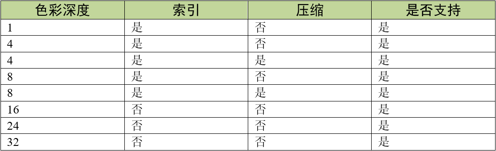
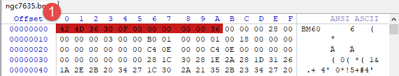
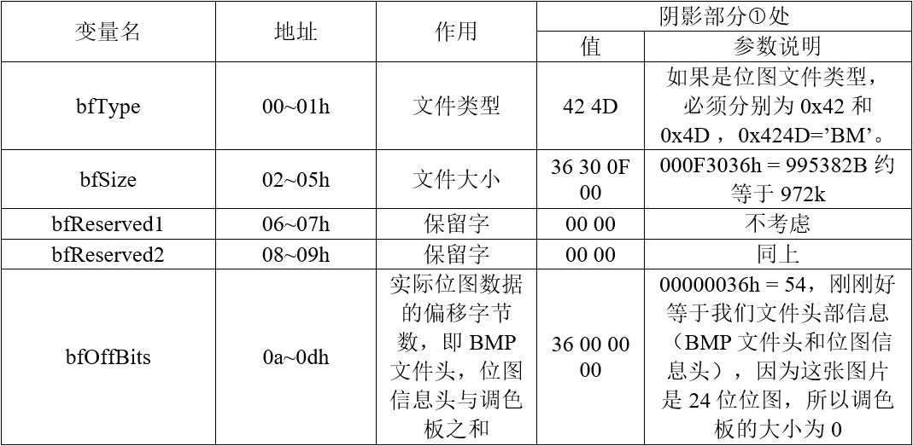
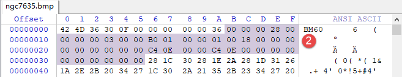
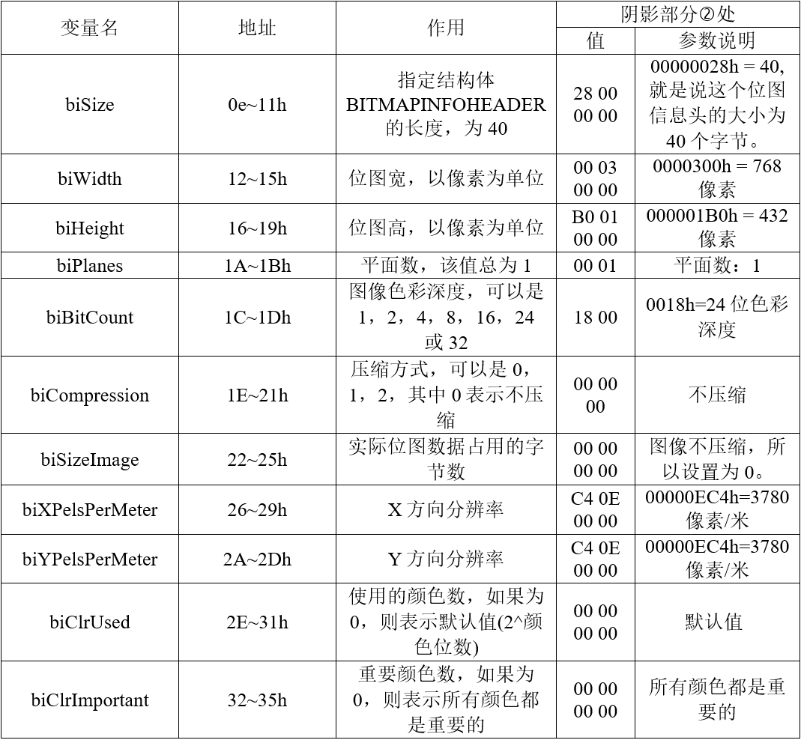
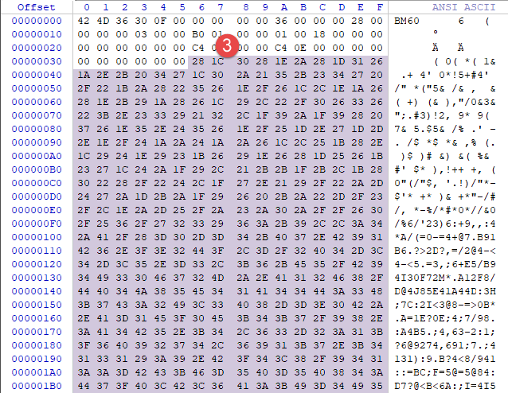
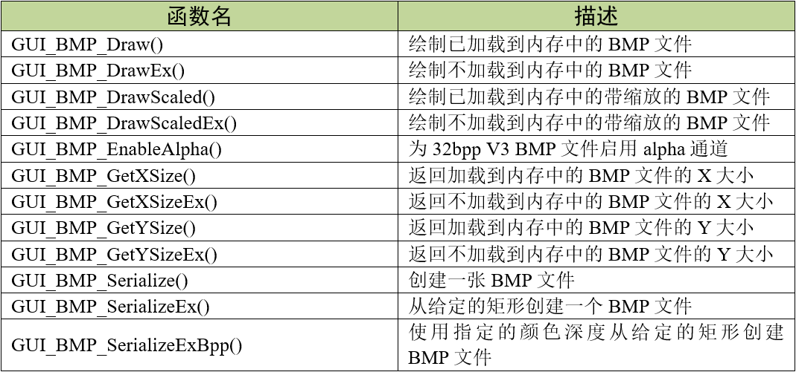
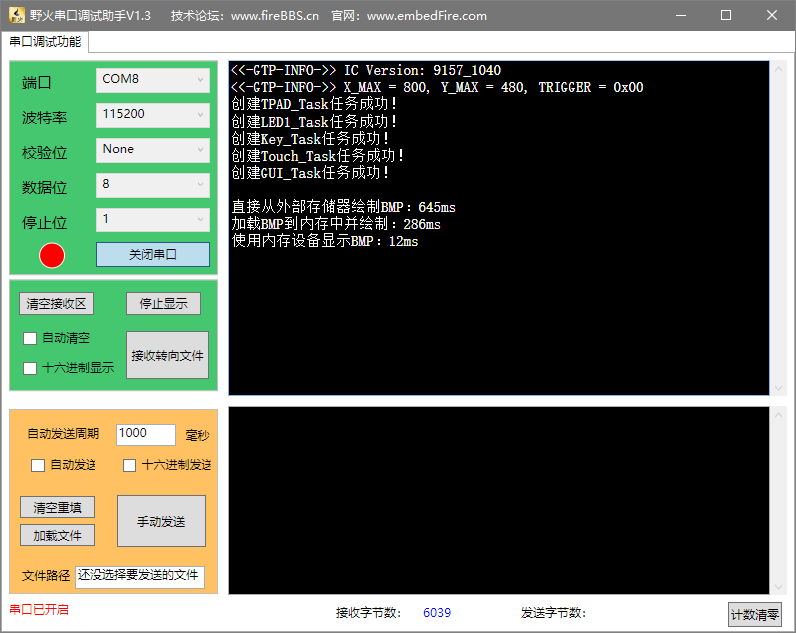

.. vim: syntax=rst

BMP图片显示
=============

emWin支持BMP图片的显示，提供的API函数主要支持两种图片显示方式：一种是从外部存储器中读取数据并显示，
一边读一边显示，占用RAM空间小，但显示速度很慢；另一种是从外部存储器把图片数据全部读取出来再显示，显示速度较快，但占用大量RAM空间。

emWin支持BMP文件格式版本3，它包含几种不同的图像格式，如表格 emWin支持的BMP格式_ 所示：

BMP图片格式
~~~~~~~~~~~~~~~~~~~~~~~~~~~~~~~

BMP文件格式，又称为位图（Bitmap）或是DIB(Device-Independent Device，设备无关位图)，
是Windows系统中广泛使用的图像文件格式。BMP文件保存了一幅图像中所有的像素。

BMP格式可以保存单色位图、16色或256色索引模式像素图、24位真彩色图象，
每种模式中单一像素点的大小分别为1/8字节，1/2字节，1字节和32字节。目前最常见的是256位色BMP和24位色BMP。

BMP文件格式还定义了像素保存的几种方法，包括不压缩、RLE压缩等。常见的BMP文件大多是不压缩的。

BMP文件的数据可以分为四个部分：

-   1) BMP文件头：
    存放了有关文件的格式、大小等信息。我们仅讨论24位色不压缩的BMP，所以文件头中的信息基本不需要注意；

-   2) 位图信息头：
    包括图像大小、位平面数、压缩方式、颜色索引等信息。在位图信息头之中，只有“大小”这一项对我们比较有用。
    图像的宽度和高度都是一个32位整数，在文件中的地址分别为0x0012和0x0016。

-   3) 调色板：
    索引与其对应的颜色的映射表。16色或256色BMP有颜色表，但在24位色BMP文件则没有，我们这里不考虑。

-   4) 位图数据：
    实际的像素数据。

因此总的来说BMP图片的优点是简单。下面我们使用WinHex软件(跟UltraEdit软件功能类似)来分析一下BMP图像的文件内容。

BMP文件头
^^^^^^^^^^^^^^^^^^

图 BMP文件头部信息_ 的阴影部分处是某张BMP图片文件的头部信息，具体说明参考表格 BMP文件头说明_ 。

3到14字节的意义可以用一个结构体来描述，见 代码清单:BMP-1_ 。

.. code-block:: c
    :caption: 代码清单:BMP-1 BMP文件信息数据结构体
    :name: 代码清单:BMP-1
    :linenos:

    typedef struct tagBITMAPFILEHEADER
    {
    //attention: sizeof(DWORD)=4  sizeof(WORD)=2
    DWORD bfSize;     //文件大小
    WORD bfReserved1;  //保留字，不考虑
    WORD bfReserved2;  //保留字，同上
    DWORD bfOffBits;  //实际位图数据的偏移字节数，即前三个部分长度之和
    } BITMAPFILEHEADER,tagBITMAPFILEHEADER;

位图信息头
^^^^^^^^^^^^^

剩下的部分就是位图信息头，也就是 图位图信息头_ 的处，具体说明参考 表位图信息头_ 。

位图信息头结构体，见代码清单:BMP-2。

.. code-block:: c
    :caption: 代码清单:BMP-2 位图信息头内容
    :name: 代码清单:BMP-2
    :linenos:

    typedef struct tagBITMAPINFOHEADER
    {
    //attention: sizeof(DWORD)=4  sizeof(WORD)=2
    DWORD biSize;          //指定此结构体的长度，为40
    LONG biWidth;          //位图宽，说明本图的宽度，以像素为单位
    LONG biHeight;         //位图高，指明本图的高度，像素为单位
    WORD biPlanes;         //平面数，为1
    WORD biBitCount;     //采用颜色位数，可以是1，2，4，8，16，24新的可以是32
    DWORD biCompression;    //压缩方式，可以是0，1，2，其中0表示不压缩
    DWORD biSizeImage;      //实际位图数据占用的字节数
    LONG biXPelsPerMeter;   //X方向分辨率
    LONG biYPelsPerMeter;   //Y方向分辨率
    DWORD biClrUsed;        //使用的颜色数，如果为0，则表示默认值(2^颜色位数)
    DWORD biClrImportant;   //重要颜色数，如果为0，则表示所有颜色都是重要的
    } BITMAPINFOHEADER,tagBITMAPINFOHEADER;

由于使用的是24位的位图，所以没有调色板，位图的大小为768*432。

图像像素数据
^^^^^^^^^^^^^^^^^^

本节使用色彩深度为24位真彩色的BMP图片进行讲解，则54字节之后就是像素部分，如图 BMP像素数据_ 的阴影部分③处。

以上内容就是对BMP图像文件的介绍。如果想要了解其中更多的细节，可以上网搜索相关的内容。

BMP显示相关API
~~~~~~~~~~~~~~~~~~~~~~~~~~~~~~

GUI_BMP_Draw()
^^^^^^^^^^^^^^^^^^^^^^

在当前窗口中的指定位置绘制一个已加载到内存中的bmp文件。

.. code-block:: c
    :caption: 代码清单:BMP-3 函数原型
    :name: 代码清单:BMP-3
    :linenos:

    int GUI_BMP_Draw(const void *pFileData, int x0, int y0);

1) pFileData：指向bmp文件所在的内存区域起始地址的指针；

2) x0：位图左上角在屏幕上的x位置；

3) y0：位图左上角在屏幕上的y位置。

返回值：绘制成功返回0，绘制失败返回非0。

GUI_BMP_DrawEx()
^^^^^^^^^^^^^^^^^^^^^^^^^^^^^^^^^

在当前窗口的指定位置绘制不需要加载到内存中的bmp文件。

.. code-block:: c
    :caption: 代码清单:BMP-4 函数原型
    :name: 代码清单:BMP-4
    :linenos:

    int GUI_BMP_DrawEx(GUI_GET_DATA_FUNC *pfGetData, void *p, int x0, int y0);

1) pfGetData：
指向用于获取数据的函数的指针；

2) p：
传递给pfGetData指向的函数的空指针；

3) x0：
位图左上角在屏幕上的x位置；

4) y0：
位图左上角在屏幕上的y位置。

返回值：绘制成功返回0，绘制失败返回非0。

BMP图片显示实验
~~~~~~~~~~~~~~~~~~~~~~~~~

接下来我们通过一个实验来讲解如何简单的显示一张BMP图片，更多API函数的演示实验可参考官方例程2DGL_DrawBMP.c，例程路径如下：

**SeggerEval_WIN32_MSVC_MinGW_GUI_V548\\Sample\\Tutorial\\2DGL_DrawBMP.c**

代码分析
^^^^^^^^^^^^

绘制外部存储器（SD卡）中的BMP
'''''''''''''''''''''''''''''''''''

.. code-block:: c
    :caption: 代码清单:BMP-5 ShowBMPEx函数（MainTask.c文件）
    :name: 代码清单:BMP-5
    :linenos:

    /**
    * @brief 直接从外部存储器中绘制BMP图片
    * @note 无
    * @param sFilename：需要加载的图片名
    *        x0：图片左上角在屏幕上的横坐标
    *        y0：图片左上角在屏幕上的纵坐标
    * @retval 无
    */
    static void ShowBMPEx(const char *sFilename, int x0, int y0)
    {
        /* 进入临界段 */
        taskENTER_CRITICAL();
        /* 打开图片 */
        result = f_open(&file, sFilename, FA_READ);
        if ((result != FR_OK)) {
            printf("文件打开失败！\r\n");
        }
        /* 退出临界段 */
        taskEXIT_CRITICAL();

        /* 绘制图片 */
        GUI_BMP_DrawEx(_GetData, &file, x0, y0);
    }

由 代码清单:BMP-5_ 所示，由于是从外部存储器绘制图片，在本实验中是从SD卡加载，所以必须通过文件系统函数f_open函数打开图片文件。
图片打开成功后调用GUI_BMP_DrawEx函数绘制，但是这个函数还需要一个专门的数据读取函数才能绘制图片，见 代码清单:BMP-6_ 。

.. code-block:: c
    :caption: 代码清单:BMP-6 \_GetData函数（MainTask.c文件）
    :name: 代码清单:BMP-6
    :linenos:

    /**
    * @brief 从外部存储器中读取数据
    * @note 无
    * @param
    * @retval NumBytesRead：读到的字节数
    */
    static char _acBuffer[1024 * 4];
    int _GetData(void *p, const U8 **ppData, unsigned NumBytesReq, U32 Off)
    {
        static int FileAddress = 0;
        UINT NumBytesRead;
        FIL *Picfile;

        Picfile = (FIL *)p;

        /* 检查缓冲区大小 */
        if (NumBytesReq > sizeof(_acBuffer)) {
            NumBytesReq = sizeof(_acBuffer);
        }

        /*偏移量 */
        if (Off == 1)
            FileAddress = 0;
        else
            FileAddress = Off;
        result = f_lseek(Picfile, FileAddress);

        /* 进入临界段 */
        taskENTER_CRITICAL();
        /* 读取图片数据 */
        result = f_read(Picfile, _acBuffer, NumBytesReq, &NumBytesRead);
        /* 退出临界段 */
        taskEXIT_CRITICAL();

        *ppData = (const U8 *)_acBuffer;

        /* 返回以读到的字节数 */
        return NumBytesRead;
    }

如 代码清单:BMP-6_ 所示，_GetData函数用于读取外部存储器中的图片数据，
每调用一次就读取图片一整行的像素数据，请确保数据缓冲区_acBuffer[]的大小足够装下一整行像素数据。

\_GetData函数将作为GUI_BMP_DrawEx函数的其中一个参数使用，当emWin从外部存储器直接绘制图片时，这个读取函数必须要有。

绘制已加载到内存中的BMP
''''''''''''''''''''''''''''

.. code-block:: c
    :caption: 代码清单:BMP-7 绘制已加载到内存中的图片（MainTask.c文件）
    :name: 代码清单:BMP-7
    :linenos:

    /**
    * @brief 加载BMP图片到内存中并绘制
    * @note 无
    * @param sFilename：需要加载的图片名
    *        x0：图片左上角在屏幕上的横坐标
    *        y0：图片左上角在屏幕上的纵坐标
    * @retval 无
    */
    static void ShowBMP(const char *sFilename, int x0, int y0)
    {
        WM_HMEM hMem;

        /* 进入临界段 */
        taskENTER_CRITICAL();
        /* 打开图片 */
        result = f_open(&file, sFilename, FA_READ);
        if ((result != FR_OK)) {
            printf("文件打开失败！\r\n");
            _acbuffer[0]='\0';
        }

        /* 申请一块动态内存空间 */
        hMem = GUI_ALLOC_AllocZero(file.fsize);
        /* 转换动态内存的句柄为指针 */
        _acbuffer = GUI_ALLOC_h2p(hMem);

        /* 读取图片数据到动态内存中 */
        result = f_read(&file, _acbuffer, file.fsize, &f_num);
        if (result != FR_OK) {
            printf("文件读取失败！\r\n");
        }
        /* 读取完毕关闭文件 */
        f_close(&file);
        /* 退出临界段 */
        taskEXIT_CRITICAL();

        GUI_BMP_Draw(_acbuffer, x0, y0);

        /* 释放内存 */
        GUI_ALLOC_Free(hMem);
    }

如 代码清单:BMP-7_ 所示，绘制已加载到内存的BMP的操作与直接从外部存储器绘制的操作略有不同，
并且没有了专门的数据读取函数。首先还是必须要用f_open打开BMP图片文件，然后不同的是用GUI_ALLOC_AllocZero函数申请一块动态内存，
并且用GUI_ALLOC_h2p把这段动态内存的句柄转为指针_acbuffer，方便之后使用，接着用f_read函数把图片数据读到刚刚申请到的动态内存中，
读取完成后关闭文件，使用GUI_BMP_Draw函数将动态内存中的BMP数据绘制到LCD上，如果之后的程序不再使用这张BMP，就必须使用GUI_ALLOC_Free函数释放动态内存。

使用内存设备绘制BMP
'''''''''''''''''''''

GUI_BMP_Draw函数是直接从动态内存中读取数据，所以速度相比从外部存储器绘制要快不少。
但这还不是最快的，利用emWin的内存设备还可以将刷图速度继续提升到几十个ms的量级，见 代码清单:BMP-8_ 。

.. code-block:: c
    :caption: 代码清单:BMP-8 LoadBMP_UsingMEMDEV 函数(MainTask.c文件)
    :name: 代码清单:BMP-8
    :linenos:

    /**
    * @brief 加载BMP图片数据到内存设备
    * @note 无
    * @param sFilename：需要加载的图片名
    *        ScaledMode：是否启用缩放，0不启用，1启用
    *        Num：缩放系数的分子
    *        Denom：缩放系数的分母
    * @retval 无
    */
    WM_HMEM hMem;
    GUI_MEMDEV_Handle hBMP;
    static void LoadBMP_UsingMEMDEV(const char *sFilename, int x0, int y0)
    {
        /* 进入临界段 */
        taskENTER_CRITICAL();
        /* 打开图片 */
        result = f_open(&file, sFilename, FA_OPEN_EXISTING | FA_READ);
        if ((result != FR_OK)) {
            printf("文件打开失败！\r\n");
            _acbuffer[0] = '\0';
        }

        /* 申请一块动态内存空间 */
        hMem = GUI_ALLOC_AllocZero(file.fsize);
        /* 转换动态内存的句柄为指针 */
        _acbuffer = GUI_ALLOC_h2p(hMem);

        /* 读取图片数据到动态内存中 */
        result = f_read(&file, _acbuffer, file.fsize, &f_num);
        if (result != FR_OK) {
            printf("文件读取失败！\r\n");
        }
        /* 读取完毕关闭文件 */
        f_close(&file);
        /* 退出临界段 */
        taskEXIT_CRITICAL();
        /* 创建内存设备 */
        hBMP = GUI_MEMDEV_CreateEx(x0, y0,            /* 起始坐标 */
                        GUI_BMP_GetXSize(_acbuffer), /* x方向尺寸 */
                        GUI_BMP_GetYSize(_acbuffer), /* y方向尺寸 */
                        GUI_MEMDEV_HASTRANS);        /* 带透明度的内存设备 */
        /* 选择内存设备 */
        GUI_MEMDEV_Select(hBMP);
        /* 绘制BMP到内存设备中 */
        GUI_BMP_Draw(_acbuffer, x0, y0);
        /* 选择内存设备，0表示选中LCD */
        GUI_MEMDEV_Select(0);
    }

如 代码清单:BMP-8_ 所示，把BMP图片数据加载到内存设备中的步骤其实和 代码清单:BMP-8_ 差不多的，
都是先用f_open函数打开BMP文件，然后用GUI_ALLOC_AllocZero函数申请一块动态内存，并且用GUI_ALLOC_h2p把这段动态内存的句柄转为指针_acbuffer，
方便之后使用，接着用f_read函数把图片数据读到刚刚申请到的动态内存中，读取完成后关闭文件。

不同的操作是，代码清单:BMP-8_ 使用GUI_MEMDEV_CreateEx函数创建一个带透明度的内存设备，
然后GUI_MEMDEV_Select函数激活内存设备，
再调用GUI_BMP_Draw函数把图片数据绘制到内存设备，绘制完成后重复调用一次GUI_MEMDEV_Select函数选择LCD，方便之后的操作。

目前 代码清单:BMP-8_ 完成的工作只是把BMP数据搬到内存设备中，真正的显示需要调用专门的函数完成，见 代码清单:BMP-9_ 。

MainTask函数
''''''''''''''''''''''

.. code-block:: c
    :caption: 代码清单:BMP-9 MainTask函数（MainTask.c文件）
    :name: 代码清单:BMP-9
    :linenos:

    /**
    * @brief GUI主任务
    * @note 无
    * @param 无
    * @retval 无
    */
    void MainTask(void)
    {
        int i = 0;

        GUI_SetFont(GUI_FONT_20B_ASCII);
        GUI_SetTextMode(GUI_TM_XOR);

        /* 加载BMP图片数据到内存设备 */
        LoadBMP_UsingMEMDEV("0:/image/ngc7635.bmp",
                            (LCD_GetXSize()-768)/2,
                            (LCD_GetYSize()-432)/2);

        while (1) {
            i++;
            switch (i) {
            case 1:
                t0 = GUI_GetTime();
                /* 直接从外部存储器绘制BMP图片 */
                ShowBMPEx("0:/image/ngc7635.bmp",
                        (LCD_GetXSize()-768)/2,
                        (LCD_GetYSize()-432)/2);
                t1 = GUI_GetTime();
                GUI_DispStringAt("GUI_BMP_DrawEx()", 0, 0);
                printf("\r\n直接从外部存储器绘制BMP：%dms\r\n",t1 - t0);
                break;
            case 2:
                t0 = GUI_GetTime();
                /* 加载BMP图片到内存中并绘制 */
                ShowBMP("0:/image/ngc7635.bmp",
                        (LCD_GetXSize()-768)/2,
                        (LCD_GetYSize()-432)/2);
                t1 = GUI_GetTime();
                GUI_DispStringAt("GUI_BMP_Draw()", 0, 0);
                printf("加载BMP到内存中并绘制：%dms\r\n",t1 - t0);
                break;
            case 3:
                /* 显示内存设备中的BMP图片 */
                t0 = GUI_GetTime();
                /* 从内存设备写入LCD */
                GUI_MEMDEV_CopyToLCDAt(hBMP,
                                    (LCD_GetXSize()-768)/2,
                                    (LCD_GetYSize()-432)/2);
                t1 = GUI_GetTime();
                GUI_DispStringAt("USE MEMDEV", 0, 0);
                printf("使用内存设备显示BMP：%dms\r\n",t1 - t0);
                break;
            default:
                i = 0;
                break;
            }
            GUI_Delay(2000);
            GUI_Clear();
        }
    }

本实验我们用三种BMP绘制方法绘制同一张图片，看看每种方法各自需要多少时间。
如 代码清单:BMP-9_ 所示，首先在一开始先加载BMP数据到内存设备中以备之后使用，
然后在while循环中调用ShowBMPEx、ShowBMPEx和GUI_MEMDEV_CopyToLCDAt，分别记录各自花费的时间并通过串口1打印出来。

GUI_MEMDEV_CopyToLCDAt函数是内存设备专用函数，作用是将内存设备中的内容搬到LCD中，
使用前请一定确保没有激活任何内存设备，否则函数无法正常使用。此函数绘制BMP图片速度很快，
其他任何地方需要显示BMP图片都可以调用此函数，只要内存设备没被删掉。

讲到这里可能有人已经看出来了，本实验中的内存设备实际是作为加速高质量BMP图片显示速度的一种手段而存在的，
本质上emwin还是只有两种BMP图片显示方式。代码清单:BMP-8_ 中使用内存设备替代了GUI_BMP_Draw函数的显示过程，
其实GUI_BMP_DrawEx函数的显示过程同样可以用内存设备来加速。

使用内存设备的方式可以说是以较多的SDRAM空间占用换取图片超快的显示速度，
此方式在野火H743 Pro和H750 Pro等使用32位宽SDRAM的开发板上，显示速度还可以进一步提高。

实验现象
^^^^^^^^^^^^

BMP图片显示实验的实验现象如图 BMP图片显示实验现象_ 和图 串口助手打印的信息_ 所示，
可以在LCD上看到GUI_BMP_DrawEx函数的BMP有很明显的从下到上的显示过程，GUI_BMP_Draw函数稍微好些，
但也还是有比较显眼的显示过程，而使用内存设备的BMP几乎看不到显示过程，闪一下就出来了。

在串口助手上也可以看到三种方式所消耗的时间，内存设备方式刷图消耗的时间相比于前两种有非常显著的差距。

