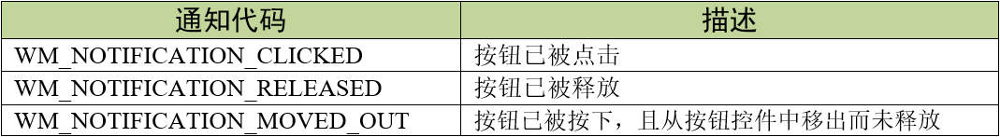
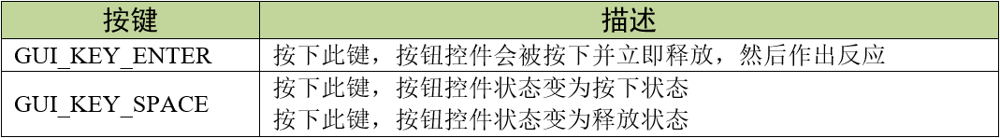
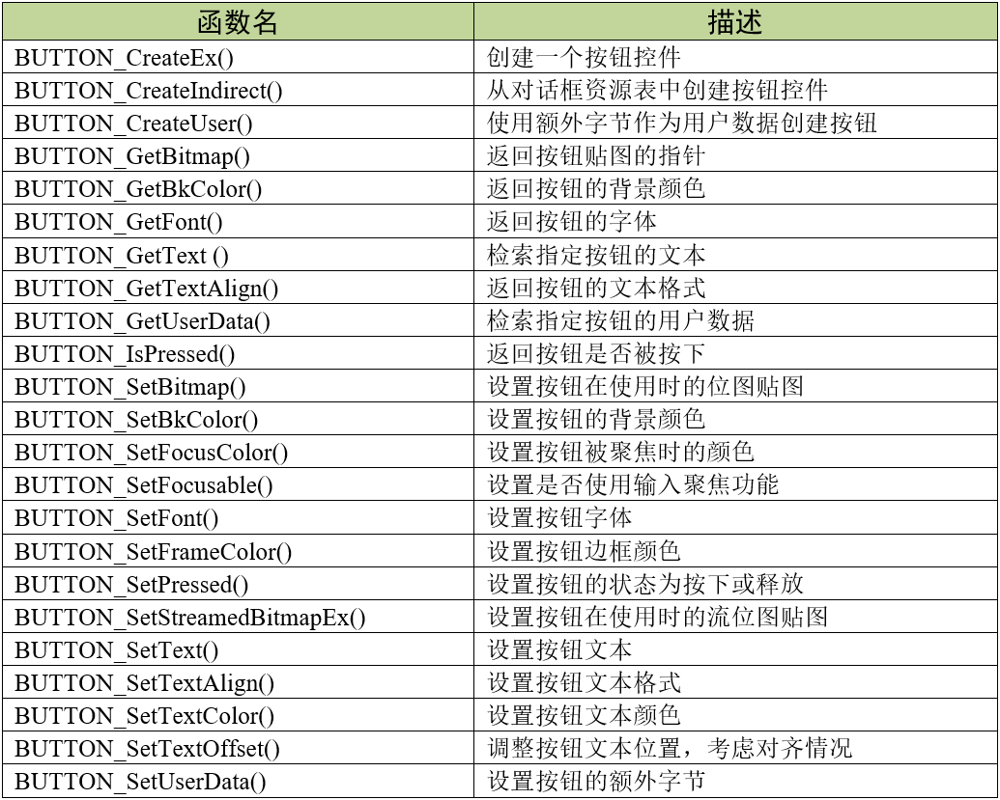
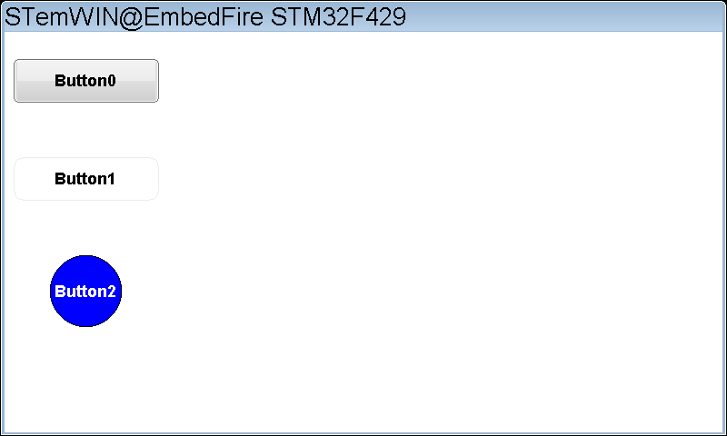
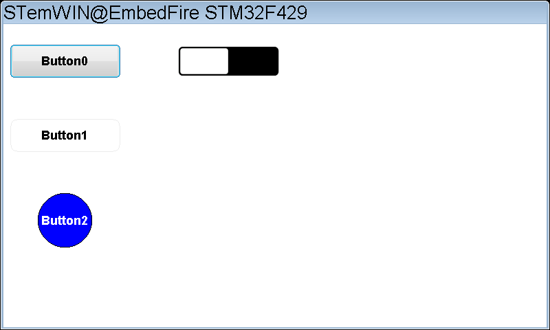
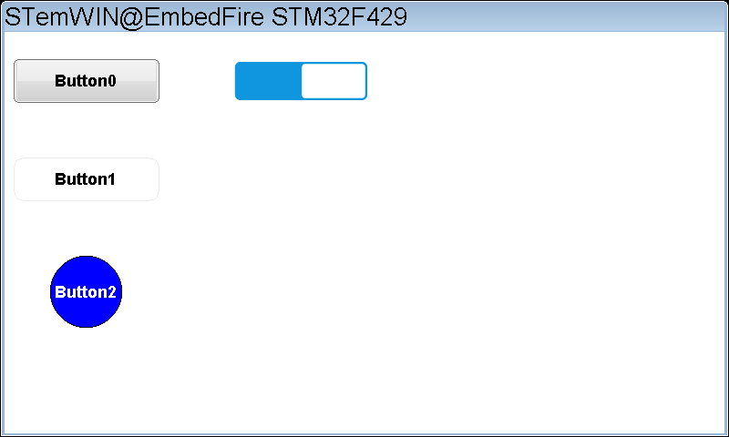

.. vim: syntax=rst

按钮控件
=============

emWin提供了三种按键式的控件，分别是：按钮（Button）、复选框（Checkbox）和单选按钮（Radio button）。本章我们先学习使用按钮控件。

按钮控件主要用于触屏设备的交互，可以说是用户最重要的界面元素之一。按钮控件具有输入焦点，
所以也可以响应GUI_KEY_SPACE和GUI_KEY_ENTER键盘消息。按钮中可以显示文本，也可以用位图贴图，甚至可以更改按钮形状。

emWin中的按钮样式如图 18‑1所示。

图 不同效果的按钮样式_ 中左侧是不带皮肤的经典按钮样式，右侧是V5.28版本以后自带皮肤效果的按钮样式。

按钮控件支持三种通知代码，以区分不同的按钮动作。如表格 按钮支持的通知代码_ 所示。

这三种通知代码是作为WM_NOTIFY_PARENT消息的一部分发送到其父窗口的。当用户点击按钮后，
窗口管理器向父窗口发送WM_NOTIFY_PARENT消息时，会在消息结构的Data.v成员中附加相应的通知代码，
用户程序可以读取此成员来检测不同的按钮动作以及实现各种功能。

按钮控件支持输入焦点，支持键盘或其他类似键盘的外部输入设备对按钮的控制。如果按钮控件已被聚焦，
那它可以接收表格 按钮控件支持的键盘消息_ 中的按键消息。

创建按钮控件
~~~~~~~~~~~~~~~~~~

按钮控件API
^^^^^^^^^^^^^^^^^^^

按钮控件的 API 函数较多，这里我们只列出一些比较常用的，见表格 按钮API函数_ 。完整的API函数请查阅emWin官方手册。

按钮控件创建函数
^^^^^^^^^^^^^^^^^^^^^^^^

BUTTON_CreateEx()
'''''''''''''''''

在指定位置创建指定大小的按钮控件。

.. code-block:: c
    :caption: 代码清单:按钮-1 按钮创建函数
    :name: 代码清单:按钮-1
    :linenos:

    BUTTON_Handle BUTTON_CreateEx(int x0, int y0, int xSize, int ySize,
                                WM_HWIN hParent, int WinFlags,
                                int ExFlags, int Id);

1) x0：
按钮控件在父坐标中的最左侧像素；

2) y0：
按钮控件在父坐标中的最顶侧像素；

3) xSize：
按钮的水平尺寸，以像素为单位；

4) ySize：
按钮的垂直尺寸，以像素为单位；

5) hParent：
父窗口句柄。如果为0，则将桌面窗口作为其父窗口；

6) WinFlags：
窗口创建标志。由于控件本质上是窗口，所以按钮控件在创建时可以使用几乎所有的窗口创建标志。
这些标志中按钮最常用的是WM_CF_SHOW。全部创建标志请参考emWin手册的窗口管理器章节；

7) ExFlags：
预留，未使用；

8) 控件ID号
。

返回值：创建成功后返回已创建的按钮控件句柄，创建失败则返回0。

BUTTON_CreateIndirect()
'''''''''''''''''''''''

.. code-block:: c
    :caption: 代码清单:按钮-2 对话框方式创建按钮函数
    :name: 代码清单:按钮-2
    :linenos:

    BUTTON_Handle BUTTON_CreateIndirect(const GUI_WIDGET_CREATE_INFO *pCreateInfo,
                                        WM_HWIN hWinParent, int x0,
                                        int y0, WM_CALLBACK * cb);

1) pCreateInfo：
指向GUI_WIDGET_CREATE_INFO结构的指针；

2) hParent：
父窗口的句柄；

3) x0：
按钮控件在父坐标中的最左边像素；

4) y0：
按钮控件在父坐标中的最顶部像素；

5) cb：
回调函数指针。

此函数的第一个参数指向的是 **代码清单:控件基础-3** 的资源表结构，但不使用其中的Flag参数和para参数。

按钮控件基础实验
~~~~~~~~~~~~~~~~~~~~~~~~

接下来我们来讲解如何以对话框的方式间接创建一个按钮控件，通过API函数直接创建的实验可参考官方例程WIDGET_ButtonSimple.c，例程路径如下：

**SeggerEval_WIN32_MSVC_MinGW_GUI_V548\\Sample\\Tutorial\\WIDGET_ButtonSimple.c**

代码分析
^^^^^^^^^^^^

创建对话框
''''''''''''''''

.. code-block:: c
    :caption: 代码清单:按钮-3 创建对话框（ButtonDLG.c文件）
    :name: 代码清单:按钮-3
    :linenos:

    /* 控件ID */
    #define ID_FRAMEWIN_0 (GUI_ID_USER + 0x00)
    #define ID_BUTTON_0 (GUI_ID_USER + 0x01)
    #define ID_BUTTON_1 (GUI_ID_USER + 0x02)
    #define ID_BUTTON_2 (GUI_ID_USER + 0x03)

    /* 资源表 */
    static const GUI_WIDGET_CREATE_INFO _aDialogCreate[] = {
        { FRAMEWIN_CreateIndirect, "Framewin", ID_FRAMEWIN_0, 0, 0, 800,
        480, 0, 0x0, 0 },
        { BUTTON_CreateIndirect, "Button0", ID_BUTTON_0, 10, 30, 160, 48,
        0, 0x0, 0 },
        { BUTTON_CreateIndirect, "Button1", ID_BUTTON_1, 10, 138, 160, 48,
        0, 0x0, 0 },
        { BUTTON_CreateIndirect, "Button2", ID_BUTTON_2, 50, 246, 80, 80,
        0, 0x0, 0 },
    };

    /**
    * @brief 以对话框方式间接创建控件
    * @note 无
    * @param 无
    * @retval hWin：资源表中第一个控件的句柄
    */
    WM_HWIN CreateFramewin(void)
    {
        WM_HWIN hWin;

        hWin = GUI_CreateDialogBox(_aDialogCreate, GUI_COUNTOF(
            _aDialogCreate), _cbDialog, WM_HBKWIN, 0, 0);
        return hWin;
    }

如 代码清单:按钮-3_ 所示，创建资源表和步骤和框架窗口实验一样，首先需要定义控件ID。
在 代码清单:按钮-3_ 中我们按照先后顺序定义了四个ID：一个框架窗口ID和三个按钮控件ID。

接着定义一个GUI_WIDGET_CREATE_INFO类型的资源表数组，其中包含一个框架窗口控件和两个按钮控件。
需要注意的是，和上一章的框架窗口一样，以对话框方式创建的按钮控件无法在资源表中设置类似WM_CF_MEMDEV这样的窗口创建标志，
因为资源表结构中并没有和窗口创建标志等效的参数。如果需要使用窗口创建标志，可以尝试调用WM_SetCreateFlags函数来设置。

三个按钮控件的资源表参数设置除了拥有自己的起始坐标和尺寸和没有用到ExFlags参数和Para参数以外，
与框架窗口资源表几乎是相同的。这里需要说明的是，按钮控件的起始坐标是相对于对话框（这里是框架窗口控件）的客户窗口的。

资源表定义完成后，调用GUI_CreateDialogBox函数创建一个非阻塞式对话框，通过GUI_COUNTOF可以得到资源表数组的元素个数，
_cbDialog是对话框回调函数，在其中初始化控件以及处理子控件的消息。这个对话框以桌面窗口作为它的父窗口。

创建成功后GUI_CreateDialogBox函数会返回资源表中第一个控件的句柄，此时屏幕上并不会显示对话框，只有在下一次刷新屏幕时才会显示出来。

对话框回调函数
''''''''''''''''

对话框创建成功之后还不够，还需要编写一个用来初始化控件和处理子控件消息的对话框回调函数，见 代码清单:按钮-4_ 。

.. code-block:: c
    :caption: 代码清单:按钮-4 对话框回调函数（ButtonDLG.c文件）
    :name: 代码清单:按钮-4
    :linenos:

    /**
    * @brief 对话框回调函数
    * @note 无
    * @param pMsg：消息指针：消息指针
    * @retval 无
    */
    static void _cbDialog(WM_MESSAGE *pMsg)
    {
        WM_HWIN hItem;
        int NCode;
        int Id;
        static U8 button_3_flag = 0, button_4_flag = 0;

        switch (pMsg->MsgId) {
        case WM_INIT_DIALOG:
            /* 初始化Framewin控件 */
            hItem = pMsg->hWin;
            FRAMEWIN_SetText(hItem, "STemWIN@EmbedFire STM32F429");
            FRAMEWIN_SetFont(hItem, GUI_FONT_32_ASCII);
            FRAMEWIN_SetTitleHeight(hItem, 32);
            /* 初始化Button0 */
            hItem = WM_GetDialogItem(pMsg->hWin, ID_BUTTON_0);
            BUTTON_SetFont(hItem, GUI_FONT_20B_1);
            /* 初始化Button1 */
            hItem = WM_GetDialogItem(pMsg->hWin, ID_BUTTON_1);
            WM_SetCallback(hItem, _cbButton1);
            /* 初始化Button2 */
            hItem = WM_GetDialogItem(pMsg->hWin, ID_BUTTON_2);
            WM_SetCallback(hItem, _cbButton2);
            break;
        case WM_NOTIFY_PARENT:
            Id = WM_GetId(pMsg->hWinSrc);
            NCode = pMsg->Data.v;
            switch (Id) {
            case ID_BUTTON_0: // Notifications sent by 'Button0'
                switch (NCode) {
                case WM_NOTIFICATION_CLICKED:
                    break;
                case WM_NOTIFICATION_RELEASED:
                    LED1_TOGGLE;
                    break;
                }
                break;
            case ID_BUTTON_1: // Notifications sent by 'Button1'
                switch (NCode) {
                case WM_NOTIFICATION_CLICKED:
                    break;
                case WM_NOTIFICATION_RELEASED:
                    LED2_TOGGLE;
                    break;
                }
                break;
            case ID_BUTTON_2: // Notifications sent by 'Button2'
                switch (NCode) {
                case WM_NOTIFICATION_CLICKED:
                    BEEP_ON;
                    break;
                case WM_NOTIFICATION_RELEASED:
                    BEEP_OFF;
                    break;
                }
                break;
            }
            break;
        default:
            WM_DefaultProc(pMsg);
            break;
        }
    }

1. WM_INIT_DIALOG消息

如 代码清单:按钮-4_ 所示，首先从消息结构中获取框架窗口的句柄，为初始化窗口做准备。
成功获取框架窗口后设置标题栏文本为 **STemWIN@EmbedFire STM32F429** ，设置框架窗口的标题栏高度为32像素，字体大小32像素。

按钮的相关API函数几乎都是使用句柄来操作的，但在建立对话框资源表的时候并没有定义它的句柄，
那就需要通过WM_GetDialogItem函数来自动建立并获取按钮的句柄。不光是按钮控件，所有对话框中的子控件全部都得使用此函数获取自己的句柄。
我们将Button0保持系统默认的样式，设置按钮文本的字体大小为20B，其余基本参数在资源表中已经配好了，
不需要额外的初始化配置。同时使用修改控件回调函数的方式自定义Button1和button2的外观，用WM_SetCallback函数进行重定向。

2. WM_NOTIFY_PARENT消息

这个消息是对话框回调函数的重点，所有对话框子控件的具体行为逻辑都在此消息中设置和处理。
在此消息中以控件ID来区分各个不同的控件。使用WM_GetId函数从消息结构中提取出发送此条消息的源控件ID号，
并从消息结构的Data.v成员参数中提取通知代码。然后使用switch语句嵌套的方式判断当前是哪个控件发送的消息以及附加的通知代码类型。

在 代码清单:按钮-4_ 中，通过判断按钮的通知代码可以知道按钮当前是已被按下还是已被释放。
我们让Button0在被释放的时候反转LED1，Button1被释放时反转LED2，Button2被按下时开启蜂鸣器，被释放时关闭蜂鸣器。
这样便实现了一种简单的通过emWin按钮控件控制外设的功能。

3. 其他消息

所有我们不关心或者没有用到的系统消息都可以调用默认消息处理函数WM_DefaultProc进行处理。

按钮自定义回调函数代码分析
''''''''''''''''''''''''''''''''

按钮控件本质上也是窗口，所以其内部也是有默认的回调函数的，通过WM_SetCallback函数可以把按钮回调函数重定向为自定义回调，
这样就能实现各种各样的按钮效果。自定义回调函数见 代码清单:按钮-5_ 。

.. code-block:: c
    :caption: 代码清单:按钮-5 按钮自定义回调函数
    :name: 代码清单:按钮-5
    :linenos:

    /**
    * @brief Button1控件回调函数
    * @note 无
    * @param pMsg：消息指针：消息指针
    * @retval 无
    */
    static void _cbButton1(WM_MESSAGE *pMsg)
    {
        GUI_RECT Rect;

        switch (pMsg->MsgId) {
        case WM_PAINT:
            /* 获取客户区坐标 */
            WM_GetClientRect(&Rect);
            /* 判断按钮是否被按下 */
            if (BUTTON_IsPressed(pMsg->hWin)) {
                /* 绘制按下状态的按钮图形 */
                GUI_SetColor(GUI_GRAY_C8);
                GUI_FillRoundedRect(Rect.x0, Rect.y0, Rect.x1, Rect.y1, 5);
                GUI_SetBkColor(GUI_GRAY_C8);
                GUI_SetColor(0xA0ECECEC);
                GUI_DrawRoundedRect(Rect.x0, Rect.y0, Rect.x1, Rect.y1, 5);
            } else {
                /* 绘制释放状态的按钮图形 */
                GUI_SetColor(GUI_WHITE);
                GUI_FillRoundedRect(Rect.x0, Rect.y0, Rect.x1, Rect.y1, 5);
                GUI_SetBkColor(GUI_WHITE);
                GUI_SetColor(0xA0ECECEC);
                GUI_DrawRoundedRect(Rect.x0, Rect.y0, Rect.x1, Rect.y1, 5);
            }
            /* 绘制按钮文本 */
            GUI_SetColor(GUI_BLACK);
            GUI_SetFont(&GUI_Font20B_ASCII);
            GUI_DispStringInRect("Button1", &Rect, GUI_TA_HCENTER |
                                GUI_TA_VCENTER);
            break;
        default:
            BUTTON_Callback(pMsg);
        }
    }

    /**
    * @brief Button2控件回调函数
    * @note 无
    * @param pMsg：消息指针：消息指针
    * @retval 无
    */
    static void _cbButton2(WM_MESSAGE *pMsg)
    {
        GUI_RECT Rect;

        switch (pMsg->MsgId) {
        case WM_PAINT:
            /* 获取客户区坐标 */
            WM_GetClientRect(&Rect);
            /* 判断按钮是否被按下 */
            if (BUTTON_IsPressed(pMsg->hWin)) {
                /* 绘制按下状态的按钮图形 */
                GUI_SetColor(GUI_RED);
                GUI_SetBkColor(GUI_RED);
                GUI_FillEllipse(Rect.x1 / 2, Rect.y1 / 2, Rect.x1 / 2,
                                Rect.y1 / 2);

                GUI_SetColor(GUI_BLACK);
                GUI_DrawEllipse(Rect.x1 / 2, Rect.y1 / 2, Rect.x1 / 2,
                                Rect.y1 / 2);
            } else {
                /* 绘制释放状态的按钮图形 */
                GUI_SetColor(GUI_BLUE);
                GUI_SetBkColor(GUI_BLUE);
                GUI_FillEllipse(Rect.x1 / 2, Rect.y1 / 2, Rect.x1 / 2,
                                Rect.y1 / 2);

                GUI_SetColor(GUI_BLACK);
                GUI_DrawEllipse(Rect.x1 / 2, Rect.y1 / 2, Rect.x1 / 2,
                                Rect.y1 / 2);
            }
            /* 绘制按钮文本 */
            GUI_SetFont(&GUI_Font20B_ASCII);
            GUI_SetColor(GUI_WHITE);
            GUI_DispStringInRect("Button2", &Rect, GUI_TA_HCENTER |
                                GUI_TA_VCENTER);
            break;
        default:
            BUTTON_Callback(pMsg);
        }
    }

在 代码清单:按钮-5_ 中，我们给Button1和Button2分别自定义了各自的回调函数，实现圆角矩形和圆形两种不同的按钮样式。
在自定义回调函数中定义了一个GUI_RECT类型的变量Rect，用来存放按钮客户区的坐标，以便之后进行绘图操作。

1. WM_PAINT消息

既然是自定义按钮样式，那就得在WM_PAINT消息内对按钮进行重新绘制。在自定义回调函数的WM_PAINT消息中，
首先通过WM_GetClientRect函数获取按钮客户区的左上点坐标和右下点坐标，这个坐标实际上是从对话框资源表中设置的按钮大小得来的，
然后通过BUTTON_IsPressed函数判断按钮是被按下还是被释放，为1时按钮被按下，为0时按钮被释放，接着根据不同的按钮状态绘制对应不同状态的外观样式。

代码清单:按钮-5_ 中需要说明的一点是，因为获取到的坐标参数不是圆的坐标参数，所以无法使用GUI_DrawCircle函数来画圆，
只能使用椭圆绘制函数GUI_DrawlEllipse进行绘制。

2. default消息

除了 WM_PAINT 消息以外，其它没用上的所有消息都需要还给按钮控件默认的回调函数BUTTON_Callback进行处理，否则整个按钮功能就得乱套了。

实验现象
^^^^^^^^^^^^

经过上述实验操作，我们得到了三个具有不同功能的按钮，同时其中两个不同于emWin默认样式。
实际实验效果如图 按钮控件基础实验结果_ 所示。

按钮贴图实验
~~~~~~~~~~~~~~~~~~

看完上面的基础实验，可能有人就会问了：如果我想自定义的按钮样式太复杂，直接绘制的实现效果不够理想甚至根本实现不了怎么办？
没关系，emWin还提供了另外的解决办法，那就是直接给按钮控件贴图。其实除了按钮控件，其他很多的控件都可以贴图，
而且贴图的实现方式有好几种。本小节先讲解按钮控件最基础的贴图方法，其他控件的基础贴图会放到相应章节讲解。

按钮可以使用位图或者流位图来贴图，本实验我们以位图为例演示如何为按钮控件贴图。实验使用如图 实验选用的贴图_ 所示的两种贴图，
左边是按钮被关闭时的效果，右边是按钮被打开时的效果。

这些贴图的C文件制作步骤实际上跟显示位图章节中讲解的几乎是一样的，在此就不再赘述了。
唯一的差别就是在保存格式的时候选择HighColor(565)而不是TrueColor，因为按钮控件的贴图一般不需要那么丰富的色彩，
而且过高的色彩深度反而会给系统造成负担，可能导致系统流畅度降低。

代码分析
^^^^^^^^^^^^

本实验的功能相对比较简单，主要是在按钮控件基础实验的代码上新增两个按钮，并在这两个按钮控件上进行位图贴图。
以下代码分析均隐藏了部分和本次实验无关的代码。完整代码请参考本章相关例程。

创建对话框
''''''''''''''''

.. code-block:: c
    :caption: 代码清单:按钮-6 创建对话框
    :emphasize-lines: 3,9-10
    :name: 代码清单:按钮-6
    :linenos:

    /* 控件ID */
    #define ID_FRAMEWIN_0 (GUI_ID_USER + 0x00)
    #define ID_BUTTON_3 (GUI_ID_USER + 0x04)

    /* 资源表 */
    static const GUI_WIDGET_CREATE_INFO _aDialogCreate[] = {
        { FRAMEWIN_CreateIndirect, "Framewin", ID_FRAMEWIN_0, 0, 0, 800,
        480, 0, 0x0, 0 },
        { BUTTON_CreateIndirect, "", ID_BUTTON_3, 244, 30, 165, 48, 0, 0x0,
        0 },
    };

    /* 声明位图文件 */
    extern GUI_CONST_STORAGE GUI_BITMAP bmBUTTON_OFF;
    extern GUI_CONST_STORAGE GUI_BITMAP bmBUTTON_ON;

    /**
    * @brief 以对话框方式间接创建控件
    * @note 无
    * @param 无
    * @retval hWin：资源表中第一个控件的句柄
    */
    WM_HWIN CreateFramewin(void)
    {
        WM_HWIN hWin;

        hWin = GUI_CreateDialogBox(_aDialogCreate, GUI_COUNTOF(
            _aDialogCreate), _cbDialog, WM_HBKWIN, 0, 0);
        return hWin;
    }

在 代码清单:按钮-6_ 粗体部分中，增加了ID_BUTTON_3按钮ID，并在对话框资源表中添加Button3的相关基础属性，因为要贴图，
所以按钮上的文本信息就不需要填了。不过被贴图的按钮的尺寸必须大于等于贴图本身的尺寸，否则贴图显示不正常。
接着使用extern关键字声明存放在其他文件中的贴图，被声明的贴图结构如 代码清单:按钮-7_ 所示，由于篇幅限制就不列出贴图数据了。

.. code-block:: c
    :caption: 代码清单:按钮-7 按钮贴图数据结构（BUTTON_Bitmap.c文件）
    :name: 代码清单:按钮-7
    :linenos:

    GUI_CONST_STORAGE GUI_BITMAP bmBUTTON_OFF = {
        165, // xSize
        48, // ySize
        330, // BytesPerLine
        16, // BitsPerPixel
        (unsigned char *)_acBUTTON_OFF,  // Pointer to picture data
        NULL,  // Pointer to palette
        GUI_DRAW_BMP565
    };

    GUI_CONST_STORAGE GUI_BITMAP bmBUTTON_ON = {
        165, // xSize
        48, // ySize
        330, // BytesPerLine
        16, // BitsPerPixel
        (unsigned char *)_acBUTTON_ON,  // Pointer to picture data
        NULL,  // Pointer to palette
        GUI_DRAW_BMP565
    };

上述代码中主要是两个GUI_BITMAP类型的结构体，存储了按钮贴图的尺寸、色彩深度、图像数据等基本信息。

代码清单:按钮-6_ 所展示的这一部分与上一个实验相比实际上并没有什么不同，
就是一个正常的在对话框中新增控件的操作，真正需要注意的是对话框回调函数中对贴图的处理。

对话框回调函数
''''''''''''''''

.. code-block:: c
    :caption: 代码清单:按钮-8 对话框回调函数
    :emphasize-lines: 21-23,29-46
    :name: 代码清单:按钮-8
    :linenos:

    /**
    * @brief 对话框回调函数
    * @note 无
    * @param pMsg：消息指针：消息指针
    * @retval 无
    */
    static void _cbDialog(WM_MESSAGE* pMsg)
    {
        WM_HWIN hItem;
        int     NCode;
        int     Id;
        static  U8  button_3_flag = 0;

        switch (pMsg->MsgId) {
        case WM_INIT_DIALOG:
            /* 初始化Framewin控件 */
            hItem = pMsg->hWin;
            FRAMEWIN_SetText(hItem, "STemWIN@EmbedFire STM32F429");
            FRAMEWIN_SetFont(hItem, GUI_FONT_32_ASCII);
            FRAMEWIN_SetTitleHeight(hItem, 32);
            /* 初始化Button3 */
            hItem = WM_GetDialogItem(pMsg->hWin, ID_BUTTON_3);
            BUTTON_SetBitmap(hItem, BUTTON_BI_UNPRESSED, &bmBUTTON_OFF);
            break;
        case WM_NOTIFY_PARENT:
            Id = WM_GetId(pMsg->hWinSrc);
            NCode = pMsg->Data.v;
            switch (Id) {
            case ID_BUTTON_3: // Notifications sent by 'Button3'
                /* 获取控件句柄 */
                hItem = WM_GetDialogItem(pMsg->hWin, ID_BUTTON_3);
                switch (NCode) {
                case WM_NOTIFICATION_CLICKED:
                    break;
                case WM_NOTIFICATION_RELEASED:
                    /* Button3已被释放 */
                    button_3_flag = ~button_3_flag;
                    if (button_3_flag != 0) {
                        BUTTON_SetBitmap(hItem, BUTTON_BI_UNPRESSED,
                                        &bmBUTTON_ON);
                    } else
                        BUTTON_SetBitmap(hItem, BUTTON_BI_UNPRESSED,
                                        &bmBUTTON_OFF);
                    break;
                }
                break;
            }
            break;
        default:
            WM_DefaultProc(pMsg);
            break;
        }
    }

实现按钮控件贴图的关键，就是使用BUTTON_SetBitmap函数。此函数可以用来设置并显示在指定的按钮控件中需要使用的位图。

1. WM_INIT_DIALOG消息

如 代码清单:按钮-8_ 所示，Button3的初始化贴图在此消息中完成。
此消息的粗体部分首先通过WM_GetDialogItem函数来自动建立并获取Button3的句柄。
然后使用BUTTON_SetBitmap函数给Button3贴上一个默认为释放状态的按钮图形bmBUTTON_OFF。
此函数的第二个参数可以选择不同的按钮状态，以设置不同的贴图图形，共有三个选项可选：
按钮已被按下BUTTON_BI_PRESSED、按钮没有被按下BUTTON_BI_UNPRESSED和按钮已被禁止BUTTON_BI_DISABLED。

2. WM_NOTIFY_PARENT消息

初始化贴图完成后，还需要在此消息中，根据不同的按钮状态切换贴图。本实验选用的按钮贴图分为开和关两种，
只需要在按钮以释放的通知代码WM_NOTIFICATION_RELEASED内，根据变量button_3_flag记录的按钮状态调用BUTTON_SetBitmap函数来回切换两种贴图即可。

3. 其他消息

所有我们不关心或者没有用到的系统消息都可以调用默认消息处理函数WM_DefaultProc进行处理。

实现现象
^^^^^^^^^^^^

按钮贴图实验的现象如图 按钮贴图未被点击时的效果_ 和图 18‑5所示，可以看到在上一个实验的基础上新增的Button3按钮在关闭和打开时的贴图效果。

