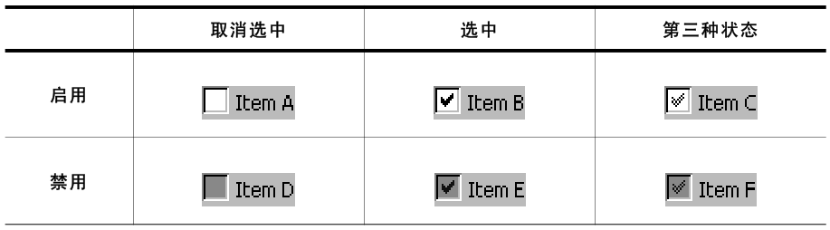
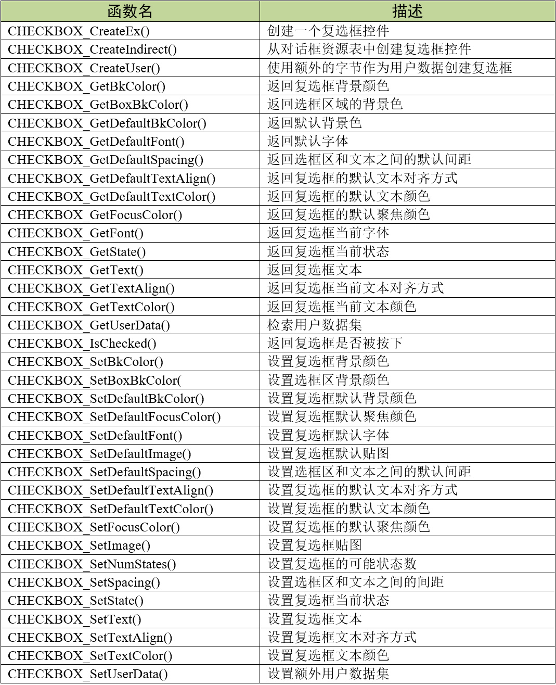
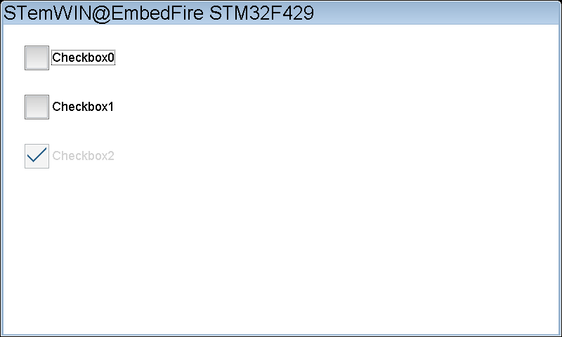
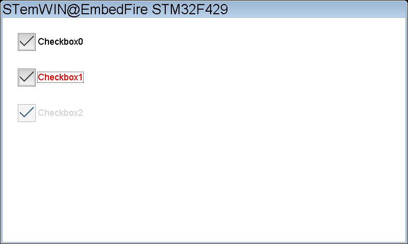
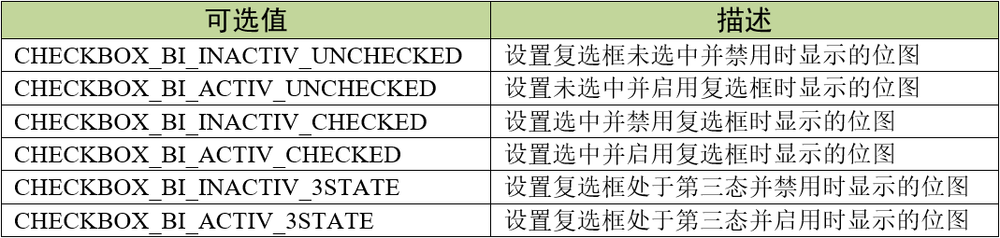
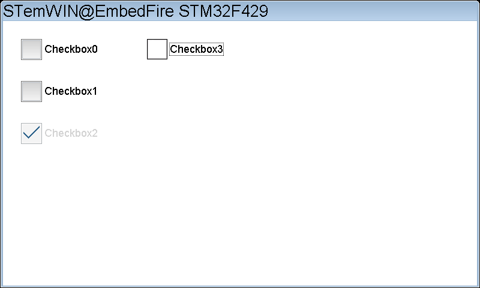
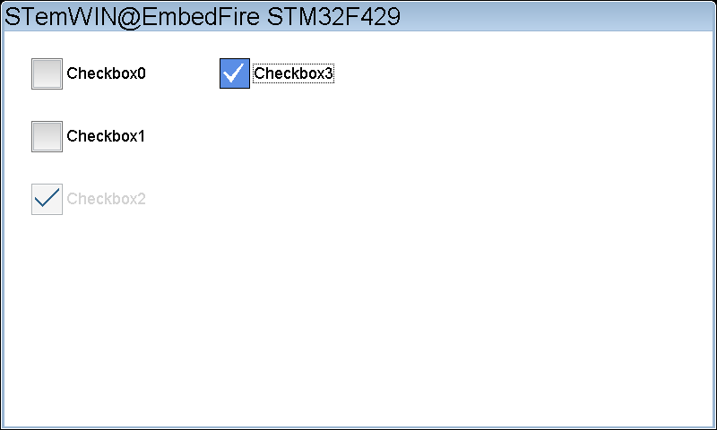

.. vim: syntax=rst

复选框控件
============

复选框（Checkbox）是一种经常用于选择多种选项的控件。用户可以选中或者取消选中复选框，并且可以一次选中任意数量的复选框。
被禁用的复选框会显示为灰色，如表格 复选框外观_ 所示。

V5.28后自带Flex皮肤效果的复选框外观如图 带皮肤效果的复选框_ 所示。

复选框控件支持4种通知代码和一种键盘消息，见表格 复选框支持的通知代码和按键消息_ 。

以上四种通知代码是作为WM_NOTIFY_PARENT消息的一部分发送到其父窗口的。当用户点击按钮后，
窗口管理器向父窗口发送WM_NOTIFY_PARENT消息时，会在消息结构的Data.v成员中附加相应的通知代码，
用户程序可以读取此成员来检测不同的复选框动作以及实现各种功能。

创建复选框控件
~~~~~~~~~~~~~~~~~~~

复选框控件API
^^^^^^^^^^^^^^^^^^^^^^^^

复选框控件创建函数
^^^^^^^^^^^^^^^^^^^^^^^^^

CHECKBOX_CreateEx()
'''''''''''''''''''''''''''''''''''

在指定位置创建具有指定大小的复选框控件。

.. code-block:: c
    :caption: 代码清单:复选框-1 复选框创建函数
    :name: 代码清单:复选框-1
    :linenos:

    CHECKBOX_Handle CHECKBOX_CreateEx(int x0, int y0,
                                    int xSize, int ySize,
                                    WM_HWIN hParent, int WinFlags,
                                    int ExFlags, int Id);

1) x0：
复选框控件在父坐标中的最左侧像素；

2) y0：
复选框控件在父坐标中的最顶侧像素；

3) xSize：
复选框的水平尺寸，以像素为单位；

4) ySize：
复选框的垂直尺寸，以像素为单位，此参数可用来修改选框区域的大小；

5) hParent：
父窗口句柄。如果为0，则将桌面窗口作为其父窗口；

6) WinFlags：
窗口创建标志。由于控件本质上是窗口，所以复选框控件在创建时可以使用几乎所有的窗口创建标志。
这些标志中按钮最常用的是WM_CF_SHOW。全部创建标志请参考emWin手册的窗口管理器章节；

7) ExFlags：
预留，未使用；

8) Id：
控件ID号。

返回值：创建成功后返回已创建的复选框控件句柄，创建失败则返回0。

如果此函数的xSize或ySiz e参数为0，则使用默认复选标记位图的大小(11 x 11像素)加上效果大小作为复选框的默认大小。
完整的显示整个复选框控件包含选框区域、文本和框与文本之间的间距，想要完整显示整个复选框，那么xSize就必须足够大。

CHECKBOX_CreateIndirect()
'''''''''''''''''''''''''''''''''''''''''''''''''

从对话框资源表中创建复选框控件。

.. code-block:: c
    :caption: 代码清单:复选框-2 对话框方式创建复选框函数
    :name: 代码清单:复选框-2
    :linenos:

    CHECKBOX_Handle CHECKBOX_CreateIndirect(const GUI_WIDGET_CREATE_INFO *pCreateInfo,
                                            WM_HWIN hWinParent,
                                            int x0, int y0,
                                            WM_CALLBACK * cb);

1) pCreateInfo：
指向GUI_WIDGET_CREATE_INFO结构的指针；

2) hParent：
父窗口的句柄；

3) x0：
复选框控件在父坐标中的最左边像素；

4) y0：
复选框控件在父坐标中的最顶部像素；

5) cb：
回调函数指针。

此函数的第一个参数指向的是 **代码清单:控件基础-3** 的资源表结构，但不使用其中的Flag参数和para参数。

复选框基础实验
~~~~~~~~~~~~~~~~~~~

接下来我们来讲解如何以对话框的方式间接创建一个复选框控件，通过API函数直接创建的实验可参考官方例程WIDGET_Checkbox.c，例程路径如下：

**SeggerEval_WIN32_MSVC_MinGW_GUI_V548\\Sample\\Tutorial\\WIDGET_Checkbox**

代码分析
^^^^^^^^^^^^

对话框创建代码分析
''''''''''''''''''''''

.. code-block:: c
    :caption: 代码清单:复选框-3 创建对话框（CheckboxDLG.c文件）
    :name: 代码清单:复选框-3
    :linenos:

    /* 控件ID */
    #define ID_FRAMEWIN_0   (GUI_ID_USER + 0x00)
    #define ID_CHECKBOX_0   (GUI_ID_USER + 0x02)
    #define ID_CHECKBOX_1   (GUI_ID_USER + 0x03)
    #define ID_CHECKBOX_2   (GUI_ID_USER + 0x04)

    /* 资源表 */
    static const GUI_WIDGET_CREATE_INFO _aDialogCreate[] = {
        { FRAMEWIN_CreateIndirect, "Framewin", ID_FRAMEWIN_0, 0, 0, 800,
        480, 0, 0x0, 0 },
        { CHECKBOX_CreateIndirect, "Checkbox0", ID_CHECKBOX_0, 30, 30, 130,
        35, 0, 0x0, 0 },
        { CHECKBOX_CreateIndirect, "Checkbox1", ID_CHECKBOX_1, 30, 100,
        130, 35, 0, 0x0, 0 },
        { CHECKBOX_CreateIndirect, "Checkbox2", ID_CHECKBOX_2, 30, 170,
        130, 35, 0, 0x0, 0 },
    };

    /**
    * @brief 以对话框方式间接创建控件
    * @note 无
    * @param 无
    * @retval hWin：资源表中第一个控件的句柄
    */
    WM_HWIN CreateFramewin(void)
    {
        WM_HWIN hWin;

        hWin = GUI_CreateDialogBox(_aDialogCreate, GUI_COUNTOF(
            _aDialogCreate), _cbDialog, WM_HBKWIN, 0, 0);
        return hWin;
    }

在 代码清单:复选框-3_ 中我们按照先后顺序定义了四个ID：一个框架窗口ID和三个复选框控件ID。
当然也可以使用emWin预定义好的复选框控件ID，但最多只有10个ID可供使用。

接着定义一个GUI_WIDGET_CREATE_INFO类型的资源表数组，其中包含一个框架窗口控件和三个复选框控件，
在资源表中初始化一些基本参数，如坐标位置、尺寸和窗口创建标志之类的，控件的其他属性都放到对话框回调函数中设置。
这里需要说明的是，从emWinV5.28开始，复选框控件默认使能皮肤，可以通过ySize参数来调整选项方框的大小，之前的版本的经典皮肤无法直接调整大小。

资源表定义完成后，调用GUI_CreateDialogBox函数创建一个非阻塞式对话框，通过GUI_COUNTOF可以得到资源表数组的元素个数，
_cbDialog是对话框回调函数，在其中初始化控件以及处理子控件的消息。这个对话框以桌面窗口作为它的父窗口。

对话框回调函数代码分析
'''''''''''''''''''''''''''

.. code-block:: c
    :caption: 代码清单:复选框-4 对话框回调函数（CheckboxDLG.c文件）
    :name: 代码清单:复选框-4
    :linenos:

    /**
    * @brief 对话框回调函数
    * @note pMsg：消息指针
    * @param 无
    * @retval 无
    */
    static void _cbDialog(WM_MESSAGE *pMsg)
    {
        WM_HWIN hItem;
        int NCode;
        int Id;

        switch (pMsg->MsgId) {
        case WM_INIT_DIALOG:
            /* 初始化Framewin控件 */
            hItem = pMsg->hWin;
            FRAMEWIN_SetFont(hItem, GUI_FONT_32_ASCII);
            FRAMEWIN_SetTitleHeight(hItem, 32);
            FRAMEWIN_SetText(hItem, "STemWIN@EmbedFire STM32F429");
            /* 初始化Checkbox0 */
            hItem = WM_GetDialogItem(pMsg->hWin, ID_CHECKBOX_0);
            CHECKBOX_SetText(hItem, "Checkbox0");
            CHECKBOX_SetFont(hItem, GUI_FONT_20_ASCII);
            /* 初始化Checkbox1 */
            hItem = WM_GetDialogItem(pMsg->hWin, ID_CHECKBOX_1);
            CHECKBOX_SetText(hItem, "Checkbox1");
            CHECKBOX_SetFont(hItem, GUI_FONT_20_ASCII);
            /* 初始化Checkbox2 */
            hItem = WM_GetDialogItem(pMsg->hWin, ID_CHECKBOX_2);
            CHECKBOX_SetText(hItem, "Checkbox2");
            CHECKBOX_SetFont(hItem, GUI_FONT_20_ASCII);
            CHECKBOX_SetTextColor(hItem, GUI_LIGHTGRAY);
            CHECKBOX_SetState(hItem, 1);
            WM_DisableWindow(hItem);
            break;
        case WM_NOTIFY_PARENT:
            Id = WM_GetId(pMsg->hWinSrc);
            NCode = pMsg->Data.v;
            switch (Id) {
            case ID_CHECKBOX_0: // Notifications sent by 'Checkbox0'
                hItem = WM_GetDialogItem(pMsg->hWin, ID_CHECKBOX_0);
                switch (NCode) {
                case WM_NOTIFICATION_CLICKED:
                    if (CHECKBOX_GetState(hItem)) {
                        LED2_ON;
                    } else {
                        LED2_OFF;
                    }
                    break;
                case WM_NOTIFICATION_RELEASED:
                    break;
                case WM_NOTIFICATION_VALUE_CHANGED:
                    break;
                }
                break;
            case ID_CHECKBOX_1: // Notifications sent by 'Checkbox1'
                hItem = WM_GetDialogItem(pMsg->hWin, ID_CHECKBOX_1);
                switch (NCode) {
                case WM_NOTIFICATION_CLICKED:
                    if (CHECKBOX_GetState(hItem))
                        CHECKBOX_SetTextColor(hItem, GUI_RED);
                    else
                        CHECKBOX_SetTextColor(hItem, GUI_BLACK);
                    break;
                case WM_NOTIFICATION_RELEASED:
                    break;
                case WM_NOTIFICATION_VALUE_CHANGED:
                    break;
                }
                break;
            }
            break;
        default:
            WM_DefaultProc(pMsg);
            break;
        }
    }

1. WM_INIT_DIALOG消息

在 代码清单:复选框-4_ 中设置框架窗口的标题栏高度为32像素，字体高度32像素，并在标题栏中显示 **STemWIN@EmbedFire STM32F429**。

复选框相关API函数几乎都是使用句柄来操作的，但在建立对话框资源表的时候并没有定义它的句柄，
那就需要通过WM_GetDialogItem函数来自动建立并获取复选框的句柄。成功获取到句柄后，
使用CHECKBOX_SetText函数和CHECKBOX_SetFont函数分别设置ID_CHECKBOX_0和ID_CHECKBOX_1的文本和字体大小。

对于ID_CHECKBOX_2，我们把它设为以勾选状态并且禁用它。使用CHECKBOX_SetTextColor把字体颜色涂成浅灰色，
毕竟要让复选框的样子符合被禁用时该有的外观嘛。然后使用CHECKBOX_SetState函数把ID_CHECKBOX_2设为以勾选状态。
最后也是最重要的，使用WM_DisableWindow函数禁用ID_CHECKBOX_2。因为复选框控件本质上就是窗口，
所以可以使用窗口管理器API对控件进行操作。调用该函数后窗口管理器不会将触摸消息传递给ID_CHECKBOX_2，
ID_CHECKBOX_2控件不响应触摸消息，也就实现了禁用。不止是复选框，所有的控件都可以被WM_DisableWindow函数禁用。

2. WM_NOTIFY_PARENT消息

这个消息是对话框回调函数的重点，所有对话框子控件的具体行为逻辑都在此消息中设置和处理。在此消息中以控件ID来区分各个不同的控件。

在本章开头的表格 复选框支持的通知代码和按键消息_ 中，列出了复选框有可能会附加的所有通知代码。
其中通知代码WM_NOTIFICATION_CLICKED适用于需要点击复选框后立即执行用户逻辑的情况。在本试验中，
我们让ID_CHECKBOX_0被勾选后立刻点亮LED2，未被勾选时熄灭LED2，ID_CHECKBOX_1被勾选后改变文本颜色为红色，
未被勾选时文本颜色为黑色。那么程序如何知道复选框有没有被勾选呢？通过判断CHECKBOX_GetState函数的返回值就可以知道复选框当前的状态，
以被勾选时返回1，未被勾选时返回0。

WM_NOTIFICATION_RELEASED一般适用于需要点击复选框并释放后再执行用户逻辑的情况，不过有一点需要说明的是，
复选框方框的状态图形更新时机与通知代码无关，即使在此通知代码中实现用户逻辑，方框图形也会在点击后立刻更新。

本实验在控件初始化时禁用了ID_CHECKBOX_2，所以在 WM_NOTIFY_PARENT消息中没有编写它的用户逻辑代码。
但是，如果复选框只在某些情况下才被禁止，其他情况正常使用，那就还是需要编写的。

3. 其他消息

所有我们不关心或者没有用到的系统消息都可以调用默认消息处理函数WM_DefaultProc进行处理。

实验现象
^^^^^^^^^^^^

最终的实验现象如图 未选中状态_ 和图 选中状态_ 所示，
图 未选中状态_ 是复选框未选中时的界面，图 选中状态_ 是已被选中的界面，
可以看到Checkbox1被选中后文本变为红色，Checkbox2被禁用呈现浅灰色。

复选框贴图实验
~~~~~~~~~~~~~~~~~~~

跟按钮控件一样，复选框也是可以贴图的。本小节就来讲解复选框控件的一种最基础的贴图方法。

复选框可以使用位图或者流位图来贴图，本实验我们以位图为例演示如何为复选框控件贴图。
实验使用如图 实验使用的贴图_ 所示的两种贴图，左边是复选框未被勾选时的效果，右边是复选框被勾选时的效果。

这些贴图的C文件制作步骤实际上跟显示位图章节中讲解的几乎是一样的，在此就不再赘述了。

代码分析
^^^^^^^^^^^^

本实验的功能相对比较简单，主要是在复选框控件基础实验的代码之上新增一个复选框，并在这个复选框控件上进行位图贴图。
以下代码分析隐藏了一部分和本次实验无关的代码。完整代码请参考本章相关例程。

创建对话框
''''''''''''''''''

.. code-block:: c
    :caption: 代码清单:复选框-5 创建对话框（CheckboxDLG.c文件）
    :emphasize-lines: 3,9-10,14-15
    :name: 代码清单:复选框-5
    :linenos:

    /* 控件ID */
    #define ID_FRAMEWIN_0   (GUI_ID_USER + 0x00)
    #define ID_CHECKBOX_3   (GUI_ID_USER + 0x05)

    /* 资源表 */
    static const GUI_WIDGET_CREATE_INFO _aDialogCreate[] = {
        { FRAMEWIN_CreateIndirect, "Framewin", ID_FRAMEWIN_0, 0, 0, 800,
        480, 0, 0x64, 0 },
        { CHECKBOX_CreateIndirect, "Checkbox3", ID_CHECKBOX_3, 240, 30,
        130, 35, 0, 0x0, 0 },
    };

    /* 声明位图文件 */
    extern GUI_CONST_STORAGE GUI_BITMAP bmcheckbox_true;
    extern GUI_CONST_STORAGE GUI_BITMAP bmcheckbox_false;

    /**
    * @brief 以对话框方式间接创建控件
    * @note 无
    * @param 无
    * @retval hWin：资源表中第一个控件的句柄
    */
    WM_HWIN CreateFramewin(void)
    {
        WM_HWIN hWin;

        hWin = GUI_CreateDialogBox(_aDialogCreate, GUI_COUNTOF(
            _aDialogCreate), _cbDialog, WM_HBKWIN, 0, 0);
        return hWin;
    }

在 代码清单:复选框-5_ 粗体部分中，增加了ID_CHECKBOX_3按钮ID，并在对话框资源表中添加控件的相关基础属性。
贴图的尺寸必须严格等于被贴图的复选框方框部分的尺寸，否则贴图显示不正常。接着使用extern关键字声明存放在其他文件中的贴图，
被声明的贴图结构如所示，由于篇幅限制并未列出贴图数据。

.. code-block:: c
    :caption: 代码清单:复选框-6 复选框贴图数据结构（Checkbox_bitmaps.c文件）
    :name: 代码清单:复选框-6
    :linenos:

    GUI_CONST_STORAGE GUI_BITMAP bmcheckbox_false = {
        32, // xSize
        32, // ySize
        64, // BytesPerLine
        16, // BitsPerPixel
        (unsigned char *)_accheckbox_false,  // Pointer to picture data
        NULL,  // Pointer to palette
        GUI_DRAW_BMP565
    };

    GUI_CONST_STORAGE GUI_BITMAP bmcheckbox_true = {
        32, // xSize
        32, // ySize
        64, // BytesPerLine
        16, // BitsPerPixel
        (unsigned char *)_accheckbox_true,  // Pointer to picture data
        NULL,  // Pointer to palette
        GUI_DRAW_BMP565
    };

上述代码中主要是两个GUI_BITMAP类型的结构体，存储了复选框贴图的尺寸、色彩深度、图像数据和调色板等基本信息。

对话框回调函数
''''''''''''''''''

.. code-block:: c
    :caption: 代码清单:复选框-7 对话框回调函数_cbDialog（CheckboxDLG.c文件）
    :emphasize-lines: 20-26,35-42
    :name: 代码清单:复选框-7
    :linenos:

    /**
    * @brief 对话框回调函数
    * @note pMsg：消息指针
    * @param 无
    * @retval 无
    */
    static void _cbDialog(WM_MESSAGE *pMsg)
    {
        WM_HWIN hItem;
        int NCode;
        int Id;

        switch (pMsg->MsgId) {
        case WM_INIT_DIALOG:
            /* 初始化Framewin控件 */
            hItem = pMsg->hWin;
            FRAMEWIN_SetFont(hItem, GUI_FONT_32_ASCII);
            FRAMEWIN_SetTitleHeight(hItem, 32);
            FRAMEWIN_SetText(hItem, "STemWIN@EmbedFire STM32F429");
            /* 初始化Checkbox3 */
            hItem = WM_GetDialogItem(pMsg->hWin, ID_CHECKBOX_3);
            CHECKBOX_SetText(hItem, "Checkbox3");
            CHECKBOX_SetFont(hItem, GUI_FONT_20_ASCII);
            CHECKBOX_SetSkinClassic(hItem);
            CHECKBOX_SetImage(hItem, &bmcheckbox_false,
                            CHECKBOX_BI_ACTIV_CHECKED);
            break;
        case WM_NOTIFY_PARENT:
            Id = WM_GetId(pMsg->hWinSrc);
            NCode = pMsg->Data.v;
            switch (Id) {
            case ID_CHECKBOX_3: // Notifications sent by 'Checkbox3'
                hItem = WM_GetDialogItem(pMsg->hWin, ID_CHECKBOX_3);
                switch (NCode) {
                case WM_NOTIFICATION_CLICKED:
                    if (CHECKBOX_GetState(hItem))
                        CHECKBOX_SetImage(hItem, &bmcheckbox_true,
                                        CHECKBOX_BI_ACTIV_CHECKED);
                    else
                        CHECKBOX_SetImage(hItem, &bmcheckbox_false,
                                        CHECKBOX_BI_ACTIV_UNCHECKED);
                    break;
                case WM_NOTIFICATION_RELEASED:
                    break;
                case WM_NOTIFICATION_VALUE_CHANGED:
                    break;
                }
                break;
            }
            break;
        default:
            WM_DefaultProc(pMsg);
            break;
        }
    }

在本实验中，实现复选框控件贴图的关键，就是使用CHECKBOX_SetImage函数。此函数可以用来设置并显示在指定的复选框控件中需要使用的位图。

4. WM_INIT_DIALOG消息

如 代码清单:复选框-7_ 所示，Checkbox3的一些跟贴图有关的初始化在此消息中完成。
此消息的粗体部分首先通过WM_GetDialogItem函数来自动建立并获取Checkbox3的句柄。然后设置复选框文本和文本字体大小。

接着使用CHECKBOX_SetSkinClassic函数将复选框控件设置为经典皮肤，这一步操作非常重要，
因为本教程使用的STemWinV5.44a版本默认使能Flex皮肤效果，这样会导致复选框的一些API函数无效，
其中就包括CHECKBOX_SetImage函数。所以想要给复选框贴图，必须使用经典皮肤，否则无法进行贴图。

设置好皮肤效果后，使用CHECKBOX_SetImage函数给Checkbox3贴上一个默认为选中状态的复选框图形bmcheckbox_false。
此函数的第三个参数可以选择不同的复选框状态，以设置不同的贴图图形，共有六种可选值，
见表格 CHECKBOX_SetImage函数第三个参数的所有可选值_ 。

需要注意一点，在设置复选框初始贴图的时候，正常来说应该是要选择CHECKBOX_BI_ACTIV_UNCHECKED，
但在此情况下此参数值会导致控件的尺寸被错误绘制，实际需要使用参数值CHECKBOX_BI_INACTIV_CHECKED才能正常绘制。对后续功能无影响。

5. WM_NOTIFY_PARENT消息

初始化贴图完成后，还需要在此消息中，根据不同的复选框状态切换贴图。
本实验选用的复选框贴图见表格 CHECKBOX_SetImage函数第三个参数的所有可选值_ ，分为未选中和已被选中两种，
在复选框以点击的通知代码WM_NOTIFICATION_CLICKED内，
根据CHECKBOX_GetState函数返回的复选框状态调用CHECKBOX_SetImage函数切换两种贴图即可。
此时CHECKBOX_SetImage函数的参数是能够正常使用的，不会出现错误绘制控件的情况。

6. default消息

所有我们不关心或者没有用到的系统消息都可以调用默认消息处理函数WM_DefaultProc进行处理。

实验现象
^^^^^^^^^^^^

复选框贴图实验的现象如图 复选框未被选中时的贴图效果_ 和图 复选框被选中时的贴图效果_ 所示，
可以看到在上一个实验的基础上新增的Checkbox3按钮在初始未选中和已被选中时的贴图效果。

