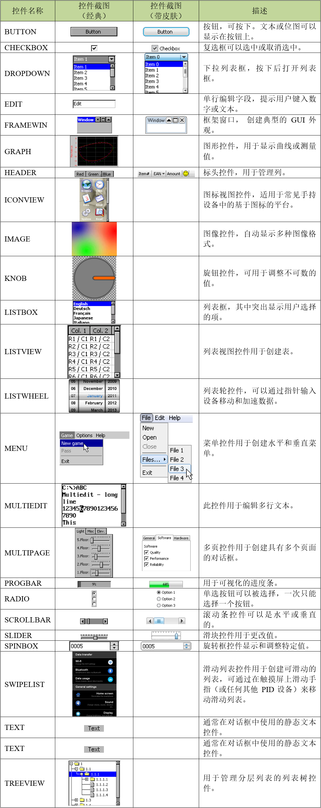
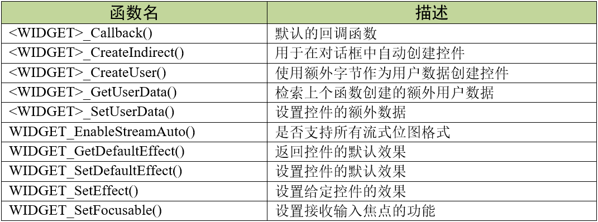

.. vim: syntax=rst

控件基础
===========

emWin中的控件又被称为小部件，是具有对象类型属性的窗口。

控件是构成用户界面的元素。他们可以对某些事件做出自动反应。例如，如果按下按钮，它会以不同的状态出现。
控件具有在其存在期间随时可以更改的属性。它们通常会在不再使用时被删除。与窗口类似，控件由句柄引用，
句柄由相应的创建函数返回。控件需要窗口管理器。创建控件后，它就像任何其他窗口一样被处理。使用窗口管理器确保在必要时正确显示和重绘。
对于应用程序或用户界面并不是必须使用控件的，但是使用控件可以减少开发时间。由于控件本质上是窗口，所以也可以使用大多数窗口管理器API函数。

支持的控件类型
~~~~~~~~~~~~~~~~~~~

目前V5.44a版本的emWin一共支持24种不同类型的控件，具体见表格 支持的控件类型_ 。

理解控件的重绘机制
~~~~~~~~~~~~~~~~~~~~~~~~~

控件根据自身属性绘制自身。由于控件实际上都是一个个窗口，所以控件的重绘也是通过调用WM_Exec()、GUI_Exec()或GUI_Delay()完成的。
当控件的属性被更改时，控件的窗口或控件的一部分会被标记为无效，但此时不立刻执行重绘，重绘操作由窗口管理器在稍后完成，
或者控件可以通过调用WM_Paint()或WM_Exec()强制执行重绘，直到所有无效窗口都被重绘。
通常在多任务环境中使用WM_Exec()更新控件和其他所有带有回调函数的窗口。和窗口不同的是，控件创建时有一个默认的回调函数，
调用GUI_Exec()会使得窗口管理器向这些控件回调函数发送 WM_PAINT消息来执行重绘操作，
所有以被标记为无效的控件的回调函数都会收到WM_PAINT消息。

如何使用控件
~~~~~~~~~~~~~~~~~~

这里我们以进度条控件为例简单介绍一下如何使用控件，可以不用关注这些函数具体怎么用，有个大概认识就好，
见 代码清单:控件基础-1_ 。常用控件的具体使用方法会在之后的章节详细讲解。

.. code-block:: c
    :caption: 代码清单:控件基础-1 创建进度条控件
    :name: 代码清单:控件基础-1
    :linenos:

    PROGBAR_Handle hProgBar;
    GUI_DispStringAt("Progress bar", 100, 20);
    hProgBar = PROGBAR_Create(100, 40, 100, 20, WM_CF_SHOW);
    PROGBAR_SetValue(hProgBar , 45);

代码清单:控件基础-1首先定义了一个进度条句柄hProgBar，然后调用PROGBAR_Create函数创建进度条。
创建控件后，可以通过调用其成员函数更改属性。例如通过PROGBAR_SetValue函数修改了进度条的值为45。
不过上述代码只是创建了控件，并不会立刻显示出来，需要调用函数WM_Exec()、GUI_Exec()或GUI_Delay()后才会显示。
创建完成的进度条如图 创建好的进度条控件_ 所示。

控件如何通信
~~~~~~~~~~~~~~~~~~

控件通常作为子窗口创建，其父窗口可以是任何类型的窗口，甚至是另一个控件。为了确保同步，
父窗口内的子窗口无论发生什么事件都应通知父窗口。当发生某个事件时，子窗口通过向父窗口发送WM_NOTIFY_PARENT消息与父窗口进行通信。
通知代码作为消息的一部分，发送哪种通知代码取决于事件的类型。大多数控件都有一个或多个通知代码，用于定义不同类型的事件。
常用控件支持的通知代码将在后续章节进行讲解。

控件皮肤
~~~~~~~~~~~~

控件的外观可以使用其成员函数来修改。某些控件支持皮肤功能，如果控件使能了皮肤功能，则控件外观由皮肤决定，
此时控件原有的某些成员函数是无效的。emWin从V5.28版本开始默认使能所有控件的皮肤，像上面提到的进度条控件，
在默认情况下类似PROGBAR_SetBarColor这种改颜色的函数是用不了的，
想要改颜色必须关掉皮肤，这个在后面会具体讲解。如果遇到控件的某个成员函数没有效果的情况，有可能就是由于使能了皮肤造成的。

控件动态内存
~~~~~~~~~~~~~~~~~~

在嵌入式应用中，由于内存碎片效应，通常不太需要使用动态内存。可以使用许多不同的策略来避免这种情况，
emWin使用了一种方法：所有对象以及运行时存储的所有数据都存储在由句柄引用的内存区域中。
这使得可以在运行时重新定位分配的内存区域，从而避免使用指针时出现的长期分配问题。因此，所有控件都由句柄引用。

控件通用API
~~~~~~~~~~~~~~~~~~~

表格 控件通用API_ 列出了与控件相关的可用API函数。这些函数对所有控件都是通用的。

<WIDGET>_CreateIndirect()

间接创建一个要在对话框中使用的控件。

.. code-block:: c
    :caption: 代码清单:控件基础-2 函数原型
    :name: 代码清单:控件基础-2
    :linenos:

    <WIDGET>_Handle <WIDGET>_CreateIndirect(const GUI_WIDGET_CREATE_INFO *
                                            pCreateInfo, WM_HWIN
                                            hWinParent, int x0, int y0,
                                            WM_CALLBACK * cb);

1) pCreateInfo：
指向GUI_WIDGET_CREATE_INFO结构的指针；

2) hParent：
父窗口的句柄；

3) x0：
控件在父坐标中的最左边像素；

4) y0：
控件在父坐标中的最顶部像素；

5) cb：
回调函数指针。

可以使用适当的前缀间接创建任何控件。例如使用BUTTON_CreateIndirect间接创建按钮控件，
使用CHECKBOX_CreateIndirect间接创建一个复选框控件，依此类推。只有在对话框中才需要使用此函数间接创建控件。
否则使用<WIDGET>_CreateEx函数直接创建即可。

在对话框中间接创建窗口和控件需要一个资源表，而GUI_WIDGET_CREATE_INFO结构对应的就是对话框资源表，
其原型如 代码清单:控件基础-3_ 所示。

.. code-block:: c
    :caption: 代码清单:控件基础-3 GUI_WIDGET_CREATE_INFO结构原型
    :name: 代码清单:控件基础-3
    :linenos:

    struct GUI_WIDGET_CREATE_INFO_struct {
        GUI_WIDGET_CREATE_FUNC * pfCreateIndirect;
        const char             * pName;
        I16                      Id;
        I16                      x0;
        I16                      y0;
        I16                      xSize;
        I16                      ySize;
        U16                      Flags;
        I32                      Para;
        U32                      NumExtraBytes;
    };

1)  pfCreateIndirect：
指向控件创建函数的指针；

2)  pName：
控件名称；

3)  Id：
控件ID；

4)  x0：
控件的最左侧坐标；

5)  y0：
控件的最顶部坐标；

6)  xSize：
控件的横向尺寸；

7)  ySize：
控件的纵向尺寸；

8)  Flags：
控件的创建标志，默认为0；

9)  para：
控件的参数，默认为0；

10) NumExtraBytes：
控件的额外字节。

对于上述资源表结构，不是所有的控件都会用到所有的资源表参数，不同控件用到的资源表参数会有所变化。
例如BUTTON控件就没有用到Flags和para参数。资源表在emWin中比较重要，下一章将要介绍的对话框就必须得用资源表，
所以请一定要熟悉和理解资源表中的各个成员参数。

