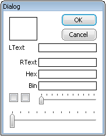
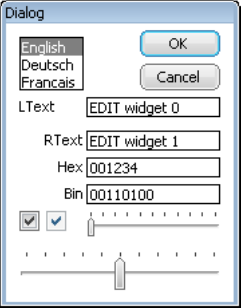
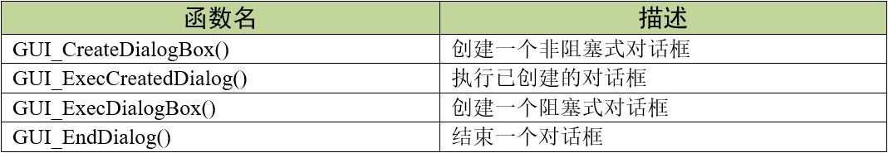

.. vim: syntax=rst

对话框基础
===========

控件可以单独创建和使用，因为它们本质上都是窗口。也可以使用对话框的形式组合在一起使用。对话框是包含一个或多个控件的窗口，
通常这种窗口是为了响应用户输入请求而构建的。它可能包含多种控件，处理用户的各种请求信息，也可能只有提示信息，告知用户一些错误或警告。
GUIBuilder也是使用对话框的形式生成代码框架。

输入焦点
~~~~~~~~~~~~

窗口管理器通过触摸屏、鼠标、键盘或其他方式记住用户最后选中的对话框、窗口或控件，并跟踪输入焦点。只有具有输入焦点的窗口才会接收键盘等外设的输入事件。

阻塞式和非阻塞式对话框
~~~~~~~~~~~~~~~~~~~~~~~~~~~~~~~

对话框窗口分为阻塞式和非阻塞式两种。

阻塞式对话框，顾名思义，是会阻塞当前执行的线程或任务的对话框，且默认情况下具有输入焦点，直到用户把它关掉，才能继续执行当前线程。
如果在阻塞式对话框中使用了GUI_ExecDialogBox()或GUI_ExecCreatedDialog()等函数，则在对话框关闭之前这些函数是不会返回的。
不过虽然叫阻塞式对话框，但它并不会阻塞其他同时显示的对话框。换句话说，阻塞式对话框不是模态对话框。

非阻塞式对话框则与阻塞式对话框相反，它不会阻塞当前调用的线程，并且GUI_ExecDialogBox()或GUI_ExecCreatedDialog()等函数在创建对话框后会立即返回。

注意，请勿在窗口回调函数中调用任何阻塞式窗口或函数，否则可能导致应用程序崩溃或出现无法预估的现象。

对话框回调函数和消息
~~~~~~~~~~~~~~~~~~~~~~~~~~~~~~

对话框其实就是一个窗口，它接收消息的方式跟系统中其他窗口是相同的。大部分消息由对话框的窗口回调函数自动处理，剩下的则传递给创建对话框时指定的回调函数。

对话框回调函数可以接收WM_INIT_DIALOG和WM_NOTIFY_PARENT两种消息。其中WM_INIT_DIALOG消息对话框专用的，这个消息在显示对话框之前立刻发送到对话框回调函数。
通常使用此消息来初始化对话框的外观和其中的各种控件。WM_NOTIFY_PARENT消息在有事件发生时，由对话框中的子窗口或控件发送到对话框，用来通知父窗口，
子窗口或控件发生了某些事情，以使这些子窗口或控件有机会对事件做出反应。但跟上一个消息不同，这个不是对话框专用消息，
只要对话框内的任何控件以子窗口的形式存在并且发生了某些事件，对话框都会收到这个消息。

创建对话框
~~~~~~~~~~~~~

创建对话框需要两个基本条件：资源表和对话框回调函数。资源表包含需要创建的控件的各种属性定义，对话框回调函数用来处理各种对话框相关的消息。
只要有这两个条件，就只需要一个函数来正式创建对话框。GUI_CreateDialogBox()函数用来创建非阻塞式对话框，GUI_ExecDialogBox()函数
用于创建阻塞式对话框。

资源表
^^^^^^^^

对话框可以根据不同的创建函数创建为非阻塞式或阻塞式。不过首先必须定义一个资源表，它定义了需要在对话框中使用的所有控件。
代码清单:对话框-1_ 是一个资源表示例代码。

.. code-block:: c
    :caption: 代码清单:对话框-1 资源表示例
    :name: 代码清单:对话框-1
    :linenos:

    static const GUI_WIDGET_CREATE_INFO _aDialogCreate[] = {
        { FRAMEWIN_CreateIndirect, "Dialog", 0, 10, 10, 180, 230, 0, 0 },
        { BUTTON_CreateIndirect, "OK", GUI_ID_OK, 100, 5, 60, 20, 0, 0 },
        { BUTTON_CreateIndirect, "Cancel", GUI_ID_CANCEL, 100, 30, 60, 20, 0, 0 },
        { TEXT_CreateIndirect, "LText", 0, 10, 55, 48, 15, TEXT_CF_LEFT, 0 },
        { TEXT_CreateIndirect, "RText", 0, 10, 80, 48, 15, TEXT_CF_RIGHT, 0 },
        { EDIT_CreateIndirect, NULL, GUI_ID_EDIT0, 60, 55, 100, 15, 0, 50 },
        { EDIT_CreateIndirect, NULL, GUI_ID_EDIT1, 60, 80, 100, 15, 0, 50 },
        { TEXT_CreateIndirect, "Hex", 0, 10, 100, 48, 15, TEXT_CF_RIGHT, 0 },
        { EDIT_CreateIndirect, NULL, GUI_ID_EDIT2, 60, 100, 100, 15, 0, 6 },
        { TEXT_CreateIndirect, "Bin", 0, 10, 120, 48, 15, TEXT_CF_RIGHT, 0 },
        { EDIT_CreateIndirect, NULL, GUI_ID_EDIT3, 60, 120, 100, 15, 0, 0 },
        { LISTBOX_CreateIndirect, NULL, GUI_ID_LISTBOX0, 10, 10, 48, 40, 0, 0 },
        { CHECKBOX_CreateIndirect, NULL, GUI_ID_CHECK0, 10, 140, 0, 0, 0, 0 },
        { CHECKBOX_CreateIndirect, NULL, GUI_ID_CHECK1, 30, 140, 0, 0, 0, 0 },
        { SLIDER_CreateIndirect, NULL, GUI_ID_SLIDER0, 60, 140, 100, 20, 0, 0 },
        { SLIDER_CreateIndirect, NULL, GUI_ID_SLIDER1, 10, 170, 150, 30, 0, 0 }
    };

从上述代码可以看到，所有对话框用到的控件都是通过<WIDGET>_CreateIndirect()函数间接创建的。资源表对于对话框来说非常重要而且使用频繁，
GUIBuilder的界面代码就是以对话框的形式生成的。资源表的具体成员组成请看\ `上一章 <#_控件通用API>`__\ 的相关介绍。

有一点需要特别注意，在创建资源表时，表中的第一个控件必须是Window控件或者FrameWin控件，不能是其他任何种类的控件，否则程序出错。

对话框回调函数
^^^^^^^^^^^^^^^^^^^^^

.. code-block:: c
    :caption: 代码清单:对话框-2 对话框回调函数原型
    :name: 代码清单:对话框-2
    :linenos:

    /* 对话框回调函数 */
    static void _cbCallback(WM_MESSAGE * pMsg)
    {
        switch (pMsg->MsgId) {
        default:
            WM_DefaultProc(pMsg);
        }
    }

有了资源表，还差一个对话框回调函数就可以创建对话框了，代码清单:对话框-2_ 显示了对话框回调函数的框架，
这个回调函数其实跟普通窗口的回调几乎是一样的，唯一不同的是对话框回调函数需要接收两种专有消息。

资源表和对话框回调函数都就位之后，只需要调用GUI_ExecDialogBox()函数即可创建一个阻塞式对话框，
见 代码清单:对话框-3_ 。函数的具体参数在之后讲解。

.. code-block:: c
    :caption: 代码清单:对话框-3 创建阻塞式对话框
    :name: 代码清单:对话框-3
    :linenos:

    /* 创建对话框 */
    GUI_ExecDialogBox(_aDialogCreate, GUI_COUNTOF(_aDialogCreate),
                    _cbCallback, 0, 0, 0);

生成的对话框效果如图 生成的对话框_ 所示，实际的外观将取决于程序设置和系统默认配置。

可以看到，对话框创建完成之后，资源表中包含的所有控件都显示了出来，但是现在的对话框并没有实质性的功能，
因为对话框回调函数中还不包含各个控件的初始化代码。控件的初始状态、控件自身的行为逻辑以及控件之间的通信等等都需要在对话框回调函数中定义。

初始化对话框
^^^^^^^^^^^^^^^^^^

对话框中的各个控件在对话框回调函数中进行初始化，见 代码清单:对话框-4_ 。

.. code-block:: c
    :caption: 代码清单:对话框-4 初始化对话框
    :name: 代码清单:对话框-4
    :linenos:

    /* 对话框回调函数 */
    static void _cbCallback(WM_MESSAGE * pMsg)
    {
        WM_HWIN hItem;
        WM_HWIN hWin;
        hWin = pMsg->hWin;
        switch (pMsg->MsgId) {
        case WM_INIT_DIALOG:
            hItem = WM_GetDialogItem(hWin, GUI_ID_EDIT0);
            EDIT_SetText(hItem, "EDIT widget 0");
            hItem = WM_GetDialogItem(hWin, GUI_ID_EDIT1);
            EDIT_SetText(hItem, "EDIT widget 1");
            EDIT_SetTextAlign(hItem, GUI_TA_LEFT);
            hItem = WM_GetDialogItem(hWin, GUI_ID_EDIT2);
            EDIT_SetHexMode(hItem, 0x1234, 0, 0xffff);
            hItem = WM_GetDialogItem(hWin, GUI_ID_EDIT3);
            EDIT_SetBinMode(hItem, 0x1234, 0, 0xffff);
            hItem = WM_GetDialogItem(hWin, GUI_ID_CHECK0);
            CHECKBOX_Check(WM_GetDialogItem(hWin, GUI_ID_CHECK0));
            hItem = WM_GetDialogItem(hWin, GUI_ID_CHECK1);
            WM_DisableWindow(WM_GetDialogItem(hWin, GUI_ID_CHECK1));
            CHECKBOX_Check(WM_GetDialogItem(hWin, GUI_ID_CHECK1));
            hItem = WM_GetDialogItem(hWin, GUI_ID_SLIDER0);
            SLIDER_SetWidth(WM_GetDialogItem(hWin, GUI_ID_SLIDER0), 5);
            hItem = WM_GetDialogItem(hWin, GUI_ID_SLIDER1);
            SLIDER_SetValue(WM_GetDialogItem(hWin, GUI_ID_SLIDER1), 50);
            hItem = WM_GetDialogItem(hWin, GUI_ID_LISTBOX0);
            LISTBOX_SetText(hItem, _apListBox);
            break;
        default:
            WM_DefaultProc(pMsg);
        }
    }

对话框回调函数接收WM_INIT_DIALOG消息，并在此消息中将对话框用到的所有控件全部初始化和进行相关配置。
初始化完成的对话框如图 初始化后的对话框_ 所示。

目前我们无需关注这些控件具体是怎么初始化的，只需要知道对话框的创建步骤就可以了，之后讲控件的时候会详细讲解对话框回调函数。

对话框API
~~~~~~~~~~~~~~~~~~

对话框相关的API函数只有4个，见表格 对话框API函数_ 。

GUI_CreateDialogBox()
^^^^^^^^^^^^^^^^^^^^^^^

创建一个非阻塞式对话框。

.. code-block:: c
    :caption: 代码清单:对话框-5 函数原型
    :name: 代码清单:对话框-5
    :linenos:

    WM_HWIN GUI_CreateDialogBox (const GUI_WIDGET_CREATE_INFO * paWidget,
                                int NumWidgets, WM_CALLBACK * cb, WM_HWIN
                                hParent, int x0, int y0);

1) paWidget：
指向对话框资源表的指针；

2) NumWidgets：
对话框中包含的控件总数；

3) cb：
指向对话框回调函数的指针；

4) hParent：
父窗口的句柄，为0时没有父窗口；

5) x0：
对话框相对于父窗口的X位置；

6) y0：
对话框相对于父窗口的Y位置。

返回值：资源表中第一个控件的句柄。

GUI_ExecCreatedDialog()
^^^^^^^^^^^^^^^^^^^^^^^^^^^^^^^^^

执行已创建的对话框。

.. code-block:: c
    :caption: 代码清单:对话框-6 函数原型
    :name: 代码清单:对话框-6
    :linenos:

    int GUI_ExecCreatedDialog(WM_HWIN hDialog);

1) hDialog：
对话框句柄。

返回传递给GUI_EndDialog()的值。

这是一个阻塞函数。在使用GUI_EndDialog()函数关闭对话框之前是不会返回的。此函数设置了WM_CF_SHOW标志，因此将在下一次刷新屏幕时绘制对话框。

GUI_ExecDialogBox()
^^^^^^^^^^^^^^^^^^^^^^^^^^^^^^^^^

创建并执行对话框。

.. code-block:: c
    :caption: 代码清单:对话框-7 函数原型
    :name: 代码清单:对话框-7
    :linenos:

    int GUI_ExecDialogBox (const GUI_WIDGET_CREATE_INFO * paWidget, int
                        NumWidgets, WM_CALLBACK * cb, WM_HWIN hParent,
                        int x0, int y0);

1) paWidget：
指向对话框资源表的指针；

2) NumWidgets：
对话框中包含的控件总数；

3) cb：
指向对话框回调函数的指针；

4) hParent：
父窗口的句柄，为0时没有父窗口；

5) x0：
对话框相对于父窗口的X位置；

6) y0：
对话框相对于父窗口的Y位置。

返回传递给GUI_EndDialog()的值。

此函数实际上相当于依次调用前两个函数创建对话框。它也是阻塞式的，在使用GUI_EndDialog()函数关闭对话框之前不会返回。
此函数设置了WM_CF_SHOW标志，因此将在下一次刷新屏幕时绘制对话框。

GUI_EndDialog()
^^^^^^^^^^^^^^^^^^^^

结束并关闭对话框，对话框及其子窗口将从内存中删除。

.. code-block:: c
    :caption: 代码清单:对话框-8 函数原型
    :name: 代码清单:对话框-8
    :linenos:

    void GUI_EndDialog(WM_HWIN hDialog, int r);

1) hDialog：
对话框句柄；

2) 该值由GUI_ExecDialogBox()函数返回。
如果关闭非阻塞对话框，则忽略此值。

调用此函数关闭对话框，在下一次执行WM_Exec()或GUI_Dela()后，对话框句柄hDialog将不再有效。
如果关闭的是非阻塞式对话框，那么此函数等效于WM_DeleteWindow()函数。
