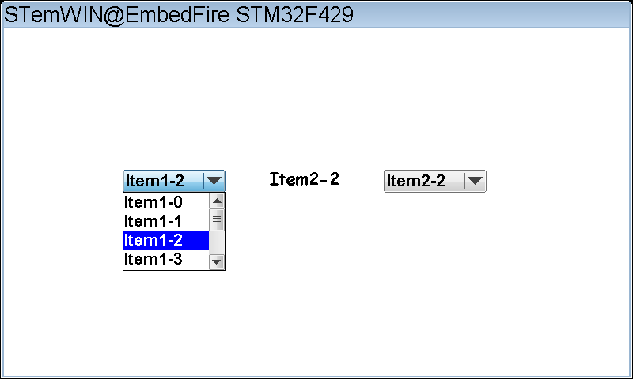

.. vim: syntax=rst

下拉框控件
=============

下拉框（Dropdown）控件是一种用于在列表中选择一个或多个元素的控件，我们经常会在网页或者手机APP中见到这种控件。
下拉框控件默认会处于非展开状态并显示当前选定的项目，如果用户点击展开了下拉框控件，则会出现一个列表供用户选择新的项目。

下拉框控件默认开启皮肤色，外观如图 下拉框外观_ 所示。

下拉框控件支持5种通知代码，以区分各种不同的操作动作，见表格 下拉框控件支持的通知代码_ 。

这5种通知代码是作为WM_NOTIFY_PARENT消息的一部分发送到其父窗口的。当用户点击按钮后，
窗口管理器会让下拉框向父窗口发送WM_NOTIFY_PARENT消息，并且会在消息结构的Data.v成员中附加相应的通知代码，
用户程序可以读取此成员来检测不同的按钮动作以及实现各种功能。

同时下拉框控件也支持输入焦点，它可以接收如表格 下拉框支持的按键消息_ 所示的按键消息。

创建下拉框控件
~~~~~~~~~~~~~~~~~~~

下拉框控件API
------------------------

下拉框控件创建函数
-----------------------

DROPDOWN_CreateEx()
^^^^^^^^^^^^^^^^^^^^^^^^^^

在指定位置创建指定大小的下拉框控件。

.. code-block:: c
    :caption: 代码清单:下拉框-1 函数原型
    :name: 代码清单:下拉框-1
    :linenos:

    DROPDOWN_Handle DROPDOWN_CreateEx(int x0, int y0, int xSize, int ySize,
                                    WM_HWIN hParent, int WinFlags, int
                                    ExFlags, int Id);

1) x0：
下拉框控件在父坐标中的最左侧像素；

2) y0：
下拉框控件在父坐标中的最顶侧像素；

3) xSize：
下拉框非展开状态的水平尺寸，以像素为单位；

4) ySize：
下拉框非展开状态的垂直尺寸，以像素为单位；

5) hParent：
父窗口句柄。如果为0，则将桌面窗口作为其父窗口；

6) WinFlags：
窗口创建标志。由于控件本质上是窗口，所以下拉框控件在创建时可以使用几乎所有的窗口创建标志。
这些标志中按钮最常用的是WM_CF_SHOW。全部创建标志请参考emWin手册的窗口管理器章节；

7) ExFlags：
下拉框额外的创建标志，可选值见表格 ExFlags可选值_ ；

8) Id：
控件ID号。

返回值：创建成功后返回已创建的下拉框控件句柄，创建失败则返回0。

DROPDOWN_CreateIndirect()
^^^^^^^^^^^^^^^^^^^^^^^^^^^^^^^^^^^

从对话框资源表中创建下拉框控件。

.. code-block:: c
    :caption: 代码清单:下拉框-2对话框方式创建下拉框函数
    :name: 代码清单:下拉框-2
    :linenos:

    DROPDOWN_Handle DROPDOWN_CreateIndirect(const GUI_WIDGET_CREATE_INFO*
                                            pCreateInfo, WM_HWIN
                                            hWinParent, int x0, int y0,
                                            WM_CALLBACK* cb);

1) pCreateInfo：
指向GUI_WIDGET_CREATE_INFO结构的指针；

2) hParent：
父窗口的句柄；

3) x0：
下拉框控件在父坐标中的最左边像素；

4) y0：
下拉框控件在父坐标中的最顶部像素；

5) cb：
回调函数指针。

此函数的第一个参数指向的是 **代码清单:控件基础-3** 的资源表结构，但不使用其中的para参数，
其中的Flags参数的可选值与表格 ExFlags可选值_ 相同。

下拉框控件基础实验
~~~~~~~~~~~~~~~~~~~~~~~~~

接下来我们来讲解如何以对话框的方式间接创建一个下拉框控件，通过API函数直接创建的实验可参考官方例程WIDGET_Dropdown.c，例程路径如下：

**SeggerEval_WIN32_MSVC_MinGW_GUI_V548\\Sample\\Tutorial\\WIDGET_Dropdown.c**

代码分析
------------

创建对话框
^^^^^^^^^^^^^

.. code-block:: c
    :caption: 代码清单:下拉框-3 创建对话框（DropdownDLG.c文件）
    :name: 代码清单:下拉框-3
    :linenos:

    /* 控件ID */
    #define ID_FRAMEWIN_0 (GUI_ID_USER + 0x00)
    #define ID_DROPDOWN_0 (GUI_ID_USER + 0x01)
    #define ID_DROPDOWN_1 (GUI_ID_USER + 0x02)
    #define ID_TEXT_0 (GUI_ID_USER + 0x03)

    /* 资源表 */
    static const GUI_WIDGET_CREATE_INFO _aDialogCreate[] = {
        { FRAMEWIN_CreateIndirect, "Framewin", ID_FRAMEWIN_0, 0, 0, 800,
        480, 0, 0x0, 0 },
        { DROPDOWN_CreateIndirect, "Dropdown1", ID_DROPDOWN_0, 150, 180,
        130, 25, 0, 0x0, 0 },
        { DROPDOWN_CreateIndirect, "Dropdown2", ID_DROPDOWN_1, 480, 180,
        130, 25, 0, 0x0, 0 },
        { TEXT_CreateIndirect, "", ID_TEXT_0, 315, 180, 130, 25, 0, 0x0, 0
        },
    };

    /**
    * @brief 以对话框方式间接创建控件
    * @note 无
    * @param 无
    * @retval hWin：资源表中第一个控件的句柄
    */
    WM_HWIN CreateFramewin(void)
    {
        WM_HWIN hWin;

        hWin = GUI_CreateDialogBox(_aDialogCreate, GUI_COUNTOF(
            _aDialogCreate), _cbDialog, WM_HBKWIN, 0, 0);
        return hWin;
    }

在 代码清单:下拉框-3_ 中我们定义了4个ID：一个框架窗口ID、2个下拉框控件ID和一个文本控件ID。
你也可以使用emWin预定义好的下拉框控件ID，但最多只有GUI_ID_DROPDOWN0到GUI_ID_DROPDOWN3，共4个ID可供使用。
上述代码中的文本控件，我们用它来显示下拉框中的某个选项。

对话框回调函数
^^^^^^^^^^^^^^^^

.. code-block:: c
    :caption: 代码清单:下拉框-4 对话框回调函数（DropdownDLG.c文件）
    :name: 代码清单:下拉框-4
    :linenos:

    /**
    * @brief 对话框回调函数
    * @note pMsg：消息指针
    * @param 无
    * @retval 无
    */
    static void _cbDialog(WM_MESSAGE * pMsg)
    {
        WM_HWIN hItem;
        int     NCode;
        int     Id;
        int     value;
        char    Dropdown_buf[8] = {0};

        switch (pMsg->MsgId) {
        case WM_INIT_DIALOG:
            /* 初始化Framewin控件 */
            hItem = pMsg->hWin;
            FRAMEWIN_SetFont(hItem, GUI_FONT_32_ASCII);
            FRAMEWIN_SetTitleHeight(hItem, 32);
            FRAMEWIN_SetText(hItem, "STemWIN@EmbedFire STM32F429");
            /* 初始化DROPDOWN0 */
            hItem = WM_GetDialogItem(pMsg->hWin, ID_DROPDOWN_0);
            DROPDOWN_SetListHeight(hItem, 100);
            DROPDOWN_SetFont(hItem, GUI_FONT_24B_1);
            DROPDOWN_AddString(hItem, "Item1-0");
            DROPDOWN_AddString(hItem, "Item1-1");
            DROPDOWN_AddString(hItem, "Item1-2");
            DROPDOWN_AddString(hItem, "Item1-3");
            DROPDOWN_AddString(hItem, "Item1-4");
            DROPDOWN_AddString(hItem, "Item1-5");
            DROPDOWN_AddString(hItem, "Item1-6");
            DROPDOWN_AddString(hItem, "Item1-7");
            DROPDOWN_SetAutoScroll(hItem, 1);
            DROPDOWN_SetScrollbarWidth(hItem, 20);
            /* 初始化DROPDOWN1 */
            hItem = WM_GetDialogItem(pMsg->hWin, ID_DROPDOWN_1);
            DROPDOWN_SetListHeight(hItem, 100);
            DROPDOWN_SetFont(hItem, GUI_FONT_24B_1);
            DROPDOWN_AddString(hItem, "Item2-0");
            DROPDOWN_AddString(hItem, "Item2-1");
            DROPDOWN_AddString(hItem, "Item2-2");
            DROPDOWN_AddString(hItem, "Item2-3");
            DROPDOWN_AddString(hItem, "Item2-4");
            DROPDOWN_AddString(hItem, "Item2-5");
            DROPDOWN_AddString(hItem, "Item2-6");
            DROPDOWN_AddString(hItem, "Item2-7");
            DROPDOWN_SetAutoScroll(hItem, 1);
            DROPDOWN_SetScrollbarWidth(hItem, 20);
            DROPDOWN_SetUpMode(hItem, 1);
            /* 初始化TEXT */
            hItem = WM_GetDialogItem(pMsg->hWin, ID_TEXT_0);
            TEXT_SetTextAlign(hItem, GUI_TA_HCENTER | GUI_TA_VCENTER);
            TEXT_SetFont(hItem, GUI_FONT_COMIC24B_ASCII);
            break;
        case WM_NOTIFY_PARENT:
            Id    = WM_GetId(pMsg->hWinSrc);
            NCode = pMsg->Data.v;
            switch (Id) {
            case ID_DROPDOWN_0: // Notifications sent by 'Dropdown0'
                switch (NCode) {
                case WM_NOTIFICATION_CLICKED:
                    break;
                case WM_NOTIFICATION_RELEASED:
                    break;
                case WM_NOTIFICATION_SEL_CHANGED:
                    hItem = WM_GetDialogItem(pMsg->hWin, ID_DROPDOWN_0);
                    value = DROPDOWN_GetSel(hItem);
                    DROPDOWN_GetItemText(hItem, value, Dropdown_buf,
                                        GUI_COUNTOF(Dropdown_buf));
                    hItem = WM_GetDialogItem(pMsg->hWin, ID_TEXT_0);
                    TEXT_SetText(hItem, Dropdown_buf);
                    break;
                }
                break;
            case ID_DROPDOWN_1: // Notifications sent by 'Dropdown1'
                switch (NCode) {
                case WM_NOTIFICATION_CLICKED:
                    break;
                case WM_NOTIFICATION_RELEASED:
                    break;
                case WM_NOTIFICATION_SEL_CHANGED:
                    hItem = WM_GetDialogItem(pMsg->hWin, ID_DROPDOWN_1);
                    value = DROPDOWN_GetSel(hItem);
                    DROPDOWN_GetItemText(hItem, value, Dropdown_buf,
                                        GUI_COUNTOF(Dropdown_buf));
                    hItem = WM_GetDialogItem(pMsg->hWin, ID_TEXT_0);
                    TEXT_SetText(hItem, Dropdown_buf);
                    break;
                }
                break;
            }
            break;
        default:
            WM_DefaultProc(pMsg);
            break;
        }
    }

1. WM_INIT_DIALOG消息

在 代码清单:下拉框-4_ 中设置框架窗口的标题栏高度为32像素，字体高度32像素，
并在标题栏中显示 **STemWIN@EmbedFire STM32F429**。

下拉框相关API函数几乎都是使用句柄来操作的，但在建立对话框资源表的时候并没有定义它的句柄，
那就需要通过WM_GetDialogItem函数来自动建立并获取下拉框的句柄。

成功获取句柄后，设置ID_DROPDOWN_0和ID_DROPDOWN_1展开状态的列表高度为100像素，设置字体大小为24，
使能自动使用滚动条并设置滚动条的宽度为20，最后使用DROPDOWN_AddString函数为两个下拉框控件各添加8个选项。
而文本控件ID_TEXT_0只设置文本对齐方式为垂直水平居中及字体24。

2. WM_NOTIFY_PARENT消息

这个消息是对话框回调函数的重点，所有对话框子控件的具体行为逻辑都在此消息中设置和处理。在此消息中以控件ID来区分各个不同的控件。

下拉框当前选中选项更改后，会进入通知代码WM_NOTIFICATION_SEL_CHANGED。在此通知代码中使用DROPDOWN_GetSel函数获取当前被选中选项的索引号，
接着根据索引号使用DROPDOWN_GetItemText函数返回对应的选项文本信息，然后通过文本控件显示在对话框中。

3. 其他消息

所有我们不关心或者没有用到的系统消息都可以调用默认消息处理函数WM_DefaultProc进行处理。

实验现象
------------

下拉框控件基础实验的实验现象如图 下拉框基础实验现象1_ 和图 下拉框基础实验现象2_ 所示。

