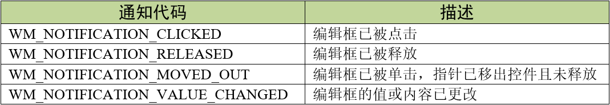
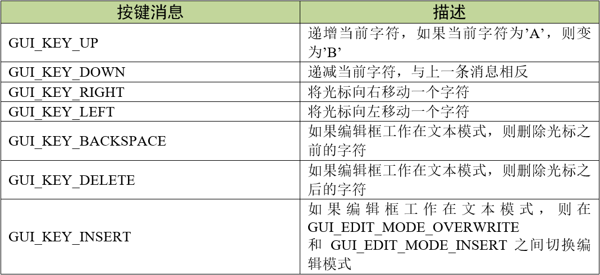
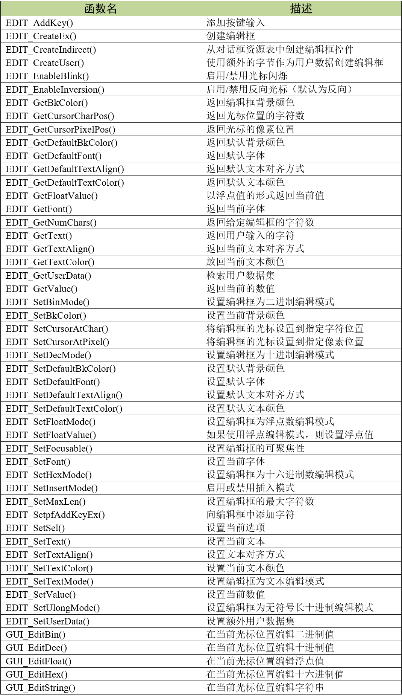
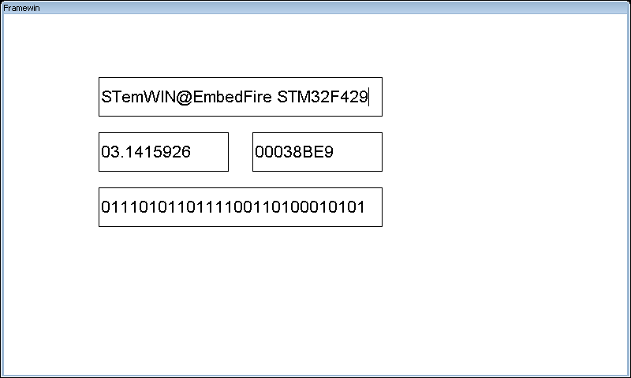
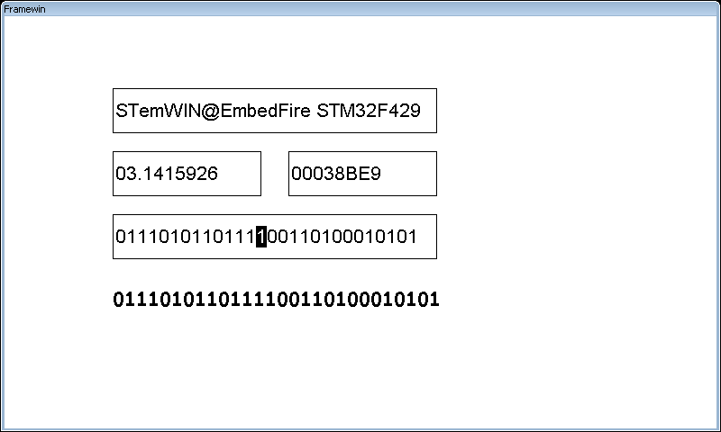

.. vim: syntax=rst

编辑框控件
===========

编辑框（EDIT）控件是emWin提供的一种用来获取外部输入信息的控件。编辑框控件在我们平时接触到的交互界面中可以说是非常常见，
例如网页或者APP中的登录界面里输入账号和密码的地方就是类似的控件。

编辑框控件的外观如图 编辑框控件外观_ 所示。

.. image:: media/EDIT/EDIT002.png
   :align: center
   :name: 编辑框控件外观
   :alt: 编辑框控件外观

编辑框控件支持4种通知代码，以区分不同的控件行为，见表格 编辑框支持的通知代码_ 。

这4种通知代码是作为WM_NOTIFY_PARENT消息的一部分发送到其父窗口的。当用户点击编辑框后，
窗口管理器向父窗口发送WM_NOTIFY_PARENT消息时，会在消息结构的Data.v成员中附加相应的通知代码，
用户程序可以读取此成员来检测不同的按钮动作以及实现各种功能。

编辑框控件支持输入焦点，支持键盘或其他类似键盘的外部输入设备对编辑框的控制。如果编辑框控件已被聚焦，
那它可以接收表格 编辑框支持的按键消息_ 中的按键消息。

创建编辑框控件
~~~~~~~~~~~~~~~~~~~

编辑框控件API
------------------------

编辑框控件创建函数
------------------------

EDIT_CreateEx()
^^^^^^^^^^^^^^^^^^^^^^^^^^^

在指定位置创建具有指定大小的编辑框控件。

.. code-block:: c
    :caption: 代码清单:编辑框-1 编辑框创建函数
    :name: 代码清单:编辑框-1
    :linenos:

    EDIT_Handle EDIT_CreateEx(int x0, int y0, int xSize, int ySize,
                            WM_HWIN hParent, int WinFlags, int ExFlags,
                            int Id, int MaxLen);

1) x0：
编辑框控件在父坐标中的最左侧像素；

2) y0：
编辑框控件在父坐标中的最顶侧像素；

3) xSize：
编辑框的水平尺寸，以像素为单位；

4) ySize：
编辑框的垂直尺寸，以像素为单位；

5) hParent：
父窗口句柄。如果为0，则将桌面窗口作为其父窗口；

6) WinFlags：
窗口创建标志。由于控件本质上是窗口，所以编辑框控件在创建时可以使用几乎所有的窗口创建标志。
这些标志中按钮最常用的是WM_CF_SHOW。全部创建标志请参考emWin手册的窗口管理器章节；

7) ExFlags：
预留，未使用；

8) Id：
控件ID；

9) MaxLen：
最大字符数。

返回值：创建成功后返回已创建的编辑框控件句柄，创建失败则返回0。

EDIT_CreateIndirect()
^^^^^^^^^^^^^^^^^^^^^^^^^^^^^^^^^^^^^^

从对话框资源表中创建编辑框控件。

.. code-block:: c
    :caption: 代码清单:编辑框-2 对话框方式创建编辑框控件
    :name: 代码清单:编辑框-2
    :linenos:

    EDIT_Handle EDIT_CreateIndirect(const GUI_WIDGET_CREATE_INFO *
                                    pCreateInfo, WM_HWIN hWinParent, int
                                    x0, int y0, WM_CALLBACK * cb);

1) pCreateInfo：
指向GUI_WIDGET_CREATE_INFO结构的指针；

2) hParent：
父窗口的句柄；

3) x0：
编辑框控件在父坐标中的最左边像素；

4) y0：
编辑框控件在父坐标中的最顶部像素；

5) cb：
回调函数指针。

此函数的第一个参数指向的是 **代码清单:控件基础-3** 的资源表结构，结构中原本可选的Flags参数和para参数也全都用上。
其中Flags与EDIT_SetTextAlign()函数的Align参数相同，para与EDIT_CreateEx()函数中的MaxLen参数相同。

编辑框控件基础实验
~~~~~~~~~~~~~~~~~~~~~~~~~

代码分析
------------

创建对话框
^^^^^^^^^^^^^

在本实验中，我们通过对话框的方式来创建文本控件，这样可以方便管理各种界面元素，
见 代码清单:编辑框-3_ 。

.. code-block:: c
    :caption: 代码清单:编辑框-3 创建对话框（EditDLG.c文件）
    :name: 代码清单:编辑框-3
    :linenos:

    /* 控件ID */
    #define ID_FRAMEWIN_0 (GUI_ID_USER + 0x00)
    #define ID_EDIT_0     (GUI_ID_USER + 0x01)
    #define ID_EDIT_1     (GUI_ID_USER + 0x02)
    #define ID_EDIT_2     (GUI_ID_USER + 0x03)
    #define ID_EDIT_3     (GUI_ID_USER + 0x04)

    /* 资源表 */
    static const GUI_WIDGET_CREATE_INFO _aDialogCreate[] = {
        { FRAMEWIN_CreateIndirect, "Framewin", ID_FRAMEWIN_0, 0, 0, 800,
        480, 0, 0x0, 0 },
        { EDIT_CreateIndirect, "Edit0", ID_EDIT_0, 120, 80, 360, 50, 0,
        0x64, 0 },
        { EDIT_CreateIndirect, "Edit1", ID_EDIT_1, 120, 150, 165, 50, 0,
        0x64, 0 },
        { EDIT_CreateIndirect, "Edit2", ID_EDIT_2, 315, 150, 165, 50, 0,
        0x64, 0 },
        { EDIT_CreateIndirect, "Edit3", ID_EDIT_3, 120, 220, 360, 50, 0,
        0x64, 0 },
        { TEXT_CreateIndirect, "", ID_TEXT_0, 120, 290, 370, 50, 0, 0x64,
        0 },
    };

    /**
    * @brief 以对话框方式间接创建控件
    * @note 无
    * @param 无
    * @retval hWin：资源表中第一个控件的句柄
    */
    WM_HWIN CreateFramewin(void)
    {
        WM_HWIN hWin;

        hWin = GUI_CreateDialogBox(_aDialogCreate, GUI_COUNTOF(
            _aDialogCreate), _cbDialog, WM_HBKWIN, 0, 0);
        return hWin;
    }

在 代码清单:编辑框-3_ 中我们定义了5个ID：一个框架窗口ID、4个编辑框控件ID和一个文本控件。
当然也可以使用emWin预定义好的编辑框控件ID，但最多只有GUI_ID_EDIT0到GUI_ID_EDIT9，共10个ID可供使用。

我们重点关注编辑框控件资源表中的倒数第二个参数MaxLen，这个参数用来设置最大字符数。
在 代码清单:编辑框-3_ 中MaxLen的参数值是0x64，表示当前编辑框控件最大可以存放100个字符。
其实这是GUIBuilder生成的默认值，可以在回调函数中修改为合适的值。

对话框回调函数
^^^^^^^^^^^^^^^^^^^^^^^^^^

.. code-block:: c
    :caption: 代码清单:编辑框-4 对话框回调函数（EditDLG.c文件）
    :name: 代码清单:编辑框-4
    :linenos:

    /**
    * @brief 对话框回调函数
    * @note 无
    * @param pMsg：消息指针
    * @retval 无
    */
    static void _cbDialog(WM_MESSAGE* pMsg)
    {
        WM_HWIN hItem;
        int     NCode;
        int     Id;
        char    EditBuff[30] = { 0 };

        switch (pMsg->MsgId) {
        case WM_INIT_DIALOG:
            /* Edit0初始化 */
            hItem = WM_GetDialogItem(pMsg->hWin, ID_EDIT_0);
            EDIT_SetText(hItem, "STemWIN@EmbedFire STM32F429");
            EDIT_SetFont(hItem, GUI_FONT_24_ASCII);
            EDIT_SetTextAlign(hItem, GUI_TA_LEFT | GUI_TA_VCENTER);
            EDIT_EnableBlink(hItem, 500, 1);
            /* Edit1初始化 */
            hItem = WM_GetDialogItem(pMsg->hWin, ID_EDIT_1);
            EDIT_SetFloatMode(hItem, 3.1415926, 0.0, 10.0, 7,
                            GUI_EDIT_NORMAL);
            EDIT_SetFont(hItem, GUI_FONT_24_ASCII);
            EDIT_SetTextAlign(hItem, GUI_TA_LEFT | GUI_TA_VCENTER);
            EDIT_EnableBlink(hItem, 500, 1);
            /* Edit2初始化 */
            hItem = WM_GetDialogItem(pMsg->hWin, ID_EDIT_2);
            EDIT_SetMaxLen(hItem, 8);
            EDIT_SetHexMode(hItem, 232425, 0, 4294967295);
            EDIT_SetFont(hItem, GUI_FONT_24_ASCII);
            EDIT_SetTextAlign(hItem, GUI_TA_LEFT | GUI_TA_VCENTER);
            EDIT_EnableBlink(hItem, 500, 1);
            /* Edit3初始化 */
            hItem = WM_GetDialogItem(pMsg->hWin, ID_EDIT_3);
            EDIT_SetMaxLen(hItem, 28);
            EDIT_SetBinMode(hItem, 123456789, 0, 268435455);
            EDIT_SetFont(hItem, GUI_FONT_24_ASCII);
            EDIT_SetTextAlign(hItem, GUI_TA_LEFT | GUI_TA_VCENTER);
            EDIT_EnableBlink(hItem, 500, 1);
            /* 初始化Text0 */
            hItem = WM_GetDialogItem(pMsg->hWin, ID_TEXT_0);
            TEXT_SetFont(hItem, GUI_FONT_COMIC24B_ASCII);
            TEXT_SetTextAlign(hItem, GUI_TA_LEFT | GUI_TA_VCENTER);
            break;
        case WM_NOTIFY_PARENT:
            Id = WM_GetId(pMsg->hWinSrc);
            NCode = pMsg->Data.v;
            switch (Id) {
            case ID_EDIT_0: // Notifications sent by 'Edit0'
                switch (NCode) {
                case WM_NOTIFICATION_CLICKED:
                    hItem = WM_GetDialogItem(pMsg->hWin, ID_EDIT_0);
                    EDIT_GetText(hItem, EditBuff, 40);
                    hItem = WM_GetDialogItem(pMsg->hWin, ID_TEXT_0);
                    TEXT_SetText(hItem, EditBuff);
                    break;
                case WM_NOTIFICATION_RELEASED:
                    break;
                case WM_NOTIFICATION_VALUE_CHANGED:
                    break;
                }
                break;
            case ID_EDIT_1: // Notifications sent by 'Edit1'
                switch (NCode) {
                case WM_NOTIFICATION_CLICKED:
                    hItem = WM_GetDialogItem(pMsg->hWin, ID_EDIT_1);
                    EDIT_GetText(hItem, EditBuff, 40);
                    hItem = WM_GetDialogItem(pMsg->hWin, ID_TEXT_0);
                    TEXT_SetText(hItem, EditBuff);
                    break;
                case WM_NOTIFICATION_RELEASED:
                    break;
                case WM_NOTIFICATION_VALUE_CHANGED:
                    break;
                }
                break;
            case ID_EDIT_2: // Notifications sent by 'Edit2'
                switch (NCode) {
                case WM_NOTIFICATION_CLICKED:
                    hItem = WM_GetDialogItem(pMsg->hWin, ID_EDIT_2);
                    EDIT_GetText(hItem, EditBuff, 40);
                    hItem = WM_GetDialogItem(pMsg->hWin, ID_TEXT_0);
                    TEXT_SetText(hItem, EditBuff);
                    break;
                case WM_NOTIFICATION_RELEASED:
                    break;
                case WM_NOTIFICATION_VALUE_CHANGED:
                    break;
                }
                break;
            case ID_EDIT_3: // Notifications sent by 'Edit3'
                switch (NCode) {
                case WM_NOTIFICATION_CLICKED:
                    hItem = WM_GetDialogItem(pMsg->hWin, ID_EDIT_3);
                    EDIT_GetText(hItem, EditBuff, 40);
                    hItem = WM_GetDialogItem(pMsg->hWin, ID_TEXT_0);
                    TEXT_SetText(hItem, EditBuff);
                    break;
                case WM_NOTIFICATION_RELEASED:
                    break;
                case WM_NOTIFICATION_VALUE_CHANGED:
                    break;
                }
                break;
            }
        default:
            WM_DefaultProc(pMsg);
            break;
        }
    }

1. WM_INIT_DIALOG消息

在 代码清单:编辑框-4_ 中我们不再设置框架窗口，直接配置编辑框控件。编辑框控件默认是文本编辑模式，
所以我们用ID_EDIT_0来显示字符串文本。EDIT_SetText函数设置需要显示的字符串文本，EDIT_SetFont函数设置字体大小为24，
EDIT_SetTextAlign函数设置文本对齐方式为左侧对齐和垂直居中对齐，EDIT_EnableBlink函数使能光标并且设置闪烁间隔时间为500ms。

设置ID_EDIT_1为浮点数编辑模式，初值为3.1415926，可编辑和显示的最小值为0.0，最大值为10.0，最多可显示小数点后7位，显示模式为正常，
即只有当数值为负值时才显示负号，否则显示前导零。设置数值文本的字体为24，对齐方式为左对齐和垂直居中对齐，使能光标并设置闪烁间隔时间为500ms。

设置ID_EDIT_2为十六进制数编辑模式，初值为十进制数232425或十六进制数0x38BE9，最小值为0，最大值为十进制数4294967295或十六进制数0xFFFFFFFF，
最大可显示8位十六进制数，然后同样的，设置数值文本的字体为24，对齐方式为左对齐和垂直居中对齐，使能光标并设置闪烁间隔时间为500ms。

设置ID_EDIT_3为二进制数编辑模式，初值为十进制数123456789，最小值为0，最大值为十进制数268435455，
最大可显示28位二进制数，最后设置数值文本的字体为24，对齐方式为左对齐和垂直居中对齐，使能光标并设置闪烁间隔时间为500ms。

从 代码清单:编辑框-4_ 可以看到，
编辑框控件的十六进制和二进制编辑模式的相关API是支持输入十进制数的，但是用户从界面上输入的只能是特定进制的数值。

2. WM_NOTIFY_PARENT消息

这个消息是对话框回调函数的重点，所有对话框子控件的具体行为逻辑都在此消息中设置和处理。在此消息中以控件ID来区分各个不同的控件。

在 代码清单:编辑框-4_ 中，当对话框收到WM_NOTIFICATION_CLICKED通知代码之后，
使用EDIT_GetText函数读取被点击的编辑框中存放的文本，然后通过TEXT_SetText函数显示出来。

3. 其他消息

所有我们不关心或者没有用到的系统消息都可以调用默认消息处理函数WM_DefaultProc进行处理。

实验现象
------------

编辑框控件基础实验的实验现象如图 编辑框控件基础实验初始现象_ 和图 编辑框被点击后的现象_ ，
可以看到有三排编辑框，第一排是字符文本模式，第二排左侧是浮点数文本模式，第二排右侧是十六进制文本模式，
第三排是二进制文本模式，当点击其中一个编辑框时，下方的文本控件会显示出相应的内容。

