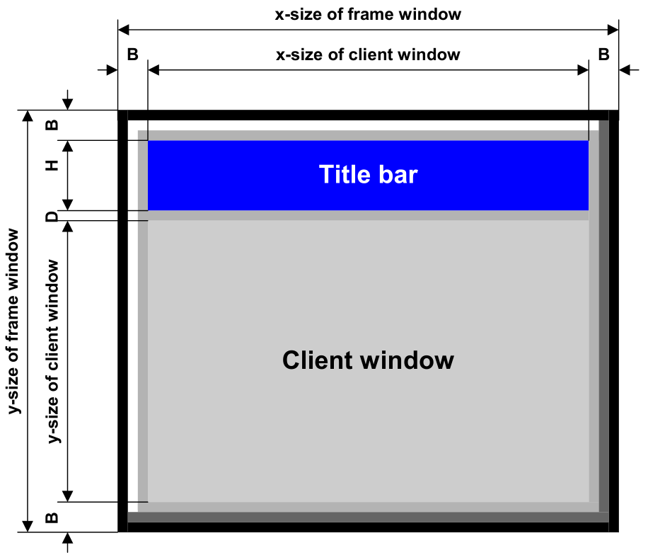
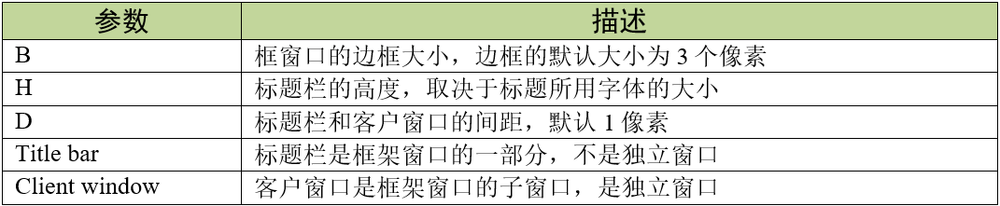
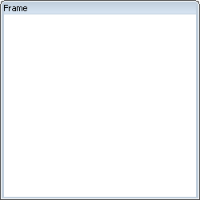
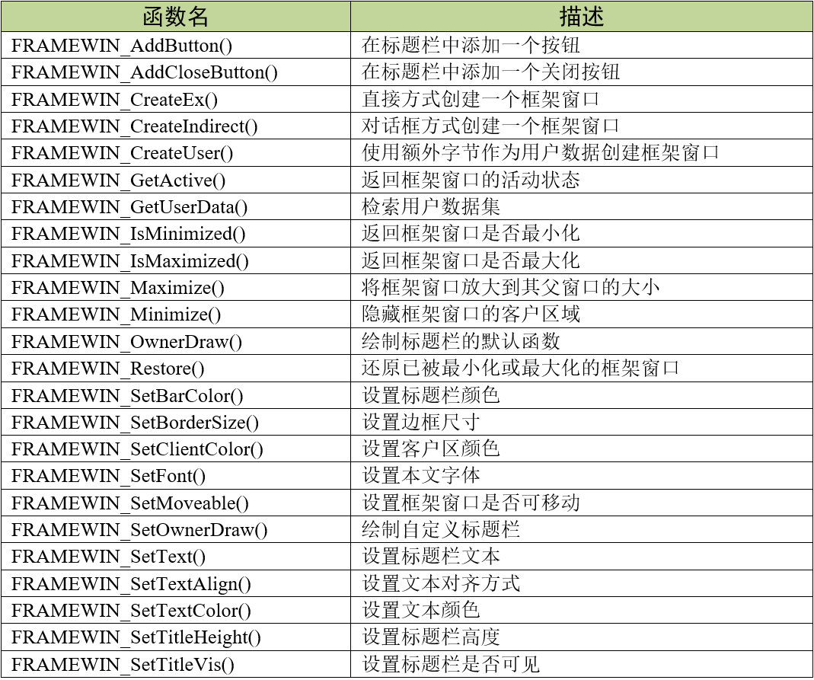
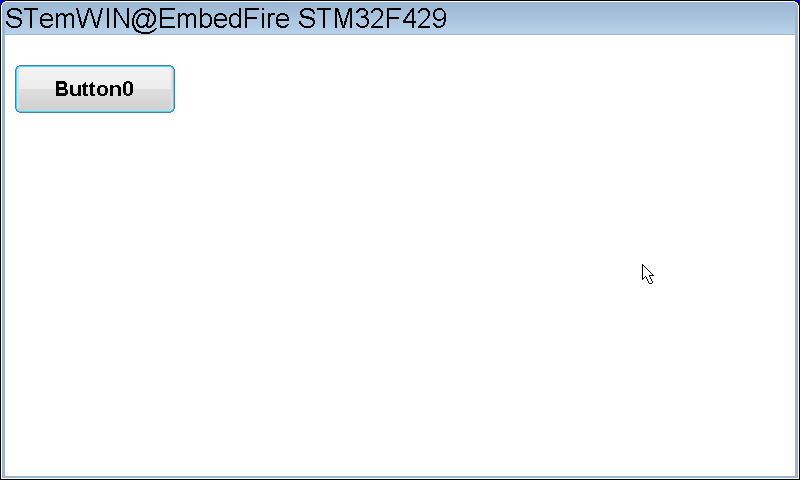

.. vim: syntax=rst

框架窗口控件
===============

框架窗口控件和Window控件都是emWin整个对话框功能的核心承载体，几乎所有使用对话框形式创建的界面，都是以这两种控件为基础的。
其中window控件实际上跟桌面窗口是同一种东西，只不过又独立做了一种控件而已。桌面窗口的基本操作在窗口管理器章节有说明，本章只对框架窗口控件进行讲解。

FRAMEWIN框架窗口控件为用户的应用程序提供了类似PC端应用程序的窗口外观。它由周围的框架、标题栏和用户区域组成。
图 框架窗口控件结构_ 展示了框架窗口控件的详细结构。

框架窗口控件实际上是由主窗口和子窗口两个部分组成。其中子窗口被称为客户窗口（Client window）。表格 框架窗口控件参数_ 是框架窗口控件的一些参数。

从V5.28版本开始，emWin默认使能了所有控件的皮肤效果。带皮肤的框架窗口控件如图 带皮肤的框架窗口控件_ 所示。

在使用框架窗口控件的时候请一定注意：框架窗口控件是有两个回调函数的，主窗口有一个，客户窗口也有一个。
主窗口回调负责绘制边框、标题栏等外观以及处理边框上按钮的消息，客户窗口回调负责绘制控件的客户区以及处理子控件的消息，
因为在框架窗口控件中创建的子控件，会以客户窗口作为他们的父窗口。大部分基础应用只需要用到客户窗口回调，
通常很少去使用主窗口的回调函数，除非是为了实现一些高级效果。emWin有一个默认的主窗口回调，
所以在直接创建框架窗口控件的时候一般情况下只需要编写客户窗口回调。如果是用对话框形式间接创建的框架窗口控件，则对话框回调函数就是控件的客户窗口回调。

创建框架窗口
~~~~~~~~~~~~~~~~~~

框架窗口API
^^^^^^^^^^^^^^^^^^^

框架窗口控件的 API 函数比较多，这里我们只列出一些比较常用的，见表格 框架窗口API_ 。完整的API函数请查阅emWin官方手册。

框架窗口创建函数
^^^^^^^^^^^^^^^^^^^^^^^^

FRAMEWIN_CreateEx()
'''''''''''''''''''''''''''''''''''

以直接方式在指定位置创建具有指定大小的框架窗口控件。

.. code-block:: c
    :caption: 代码清单:框架窗口-1 直接方式创建桌面窗口函数FRAMEWIN_CreateEx
    :name: 代码清单:框架窗口-1
    :linenos:

    FRAMEWIN_Handle FRAMEWIN_CreateEx (int x0, int y0, int xSize, int ySize,
                                        WM_HWIN hParent, int WinFlags,
                                        int ExFlags, int Id,
                                        const char * pTitle, WM_CALLBACK * cb);

1)  x0：
框架窗口控件在父坐标中的最左侧像素；

2)  y0：
框架窗口控件在父坐标中的最顶侧像素；

3)  xSize：
框架窗口的水平尺寸，以像素为单位；

4)  ySize：
框架窗口的垂直尺寸，以像素为单位；

5)  hParent：
父窗口句柄。如果为0，则将桌面窗口作为其父窗口；

6)  WinFlags：
窗口创建标志。由于控件本质上是窗口，所以他们在创建时可以使用所有的窗口创建标志。这些标志中最常用的有WM_CF_SHOW、WM_CF_FGND、WM_CF_MEMDEV等。
全部创建标志请参考emWin手册的窗口管理器章节；

7)  ExFlags：
额外标志。用于设置框架窗口是否可移动，为0时不可移动，为FRAMEWIN_CF_MOVEABLE时可移动。也可使用FRAMEWIN_SetMoveable函数进行设置；

8)  Id：
控件ID号；

9)  pTitle：
需要显示在标题栏的文本；

10) cb：
指向用户回调函数的指针。用户回调函数实际上就是客户窗口的回调函数，它有两个作用，一是绘制客户窗口，二是响应并处理子控件的消息。
不过用户回调函数并不会接收所有发送到客户窗口的消息，一些系统消息会由默认的框架窗口回调函数接收并处理，而WM_PAINT消息、
用户自定义消息和所有的通知代码都会交给用户回调函数处理。

返回值：创建成功后返回已创建的控件句柄，创建失败则返回0。

FRAMEWIN_CreateIndirect()
'''''''''''''''''''''''''''''''''''''''''''''''''

使用对话框方式间接创建一个框架窗口。

.. code-block:: c
    :caption: 代码清单:框架窗口-2 对话框方式创建窗口FRAMEWIN_CreateIndirect
    :name: 代码清单:框架窗口-2
    :linenos:

    FRAMEWIN_Handle FRAMEWIN_CreateIndirect(const GUI_WIDGET_CREATE_INFO *pCreateInfo,
                                            WM_HWIN hWinParent,
                                            int x0, int y0,
                                            WM_CALLBACK * cb);

1) pCreateInfo：
指向GUI_WIDGET_CREATE_INFO结构的指针；

2) hParent：
父窗口的句柄；

3) x0：
控件在父坐标中的最左边像素；

4) y0：
控件在父坐标中的最顶部像素；

5) cb：
回调函数指针。

此函数的第一个参数指向的是 **代码清单:控件基础-3** 的资源表结构，不过不使用其中的para参数，
而资源表中的Flag参数与直接创建函数FRAMEWIN_CreateEx中的额外标志ExFlags是一样的，可以使用相同的参数。

创建框架窗口实验
~~~~~~~~~~~~~~~~~~~~~~~~

接下来我们以对话框方式来讲解如何以对话框的方式间接创建一个框架窗口，直接创建实验可参考官方例程WIDGET_FrameWin.c，例程路径如下：

**SeggerEval_WIN32_MSVC_MinGW_GUI_V548\\Sample\\Tutorial\\WIDGET_FrameWin.c**

这里只讲解核心的部分代码，有些变量的设置，头文件的包含等并没有涉及到，完整的代码请参考本章配套的工程。

代码分析
^^^^^^^^^^^^

创建对话框
''''''''''''''

.. code-block:: c
    :caption: 代码清单:框架窗口-3 对话框创建函数（MainTask.c）
    :name: 代码清单:框架窗口-3
    :linenos:

    /* 控件ID */
    #define ID_FRAMEWIN_0 (GUI_ID_USER + 0x00)
    #define ID_BUTTON_0   (GUI_ID_USER + 0x01)

    /* 资源表 */
    static const GUI_WIDGET_CREATE_INFO _aDialogCreate[] = {
        { FRAMEWIN_CreateIndirect, "Framewin", ID_FRAMEWIN_0, 0, 0, 800,
        480, FRAMEWIN_CF_MOVEABLE, 0x0, 0 },
        { BUTTON_CreateIndirect, "Button0", ID_BUTTON_0, 10, 30, 160, 48,
        0, 0x0, 0 },
    };

    /**
    * @brief 以对话框方式间接创建控件
    * @note 无
    * @param 无
    * @retval hWin：资源表中第一个控件的句柄
    */
    WM_HWIN CreateFramewin(void)
    {
        WM_HWIN hWin;

        hWin = GUI_CreateDialogBox(_aDialogCreate, GUI_COUNTOF(
            _aDialogCreate), _cbDialog, WM_HBKWIN, 0, 0);
        return hWin;
    }

如 代码清单:框架窗口-3_ 所示，首先定义控件ID，控件ID可以使用系统默认ID也可以自定义，默认ID可在GUI.h中找到，
如果使用自定义控件ID，则需要以GUI_ID_USER为基础，在它之上依次递增，以免与系统默认的控件ID冲突。
GUIBuilder生成的控件ID均为自定义ID，且ID顺序与添加控件的顺序相同。

接着定义一个GUI_WIDGET_CREATE_INFO类型的资源表，设置了一个主窗口尺寸为800\*480的框架窗口和一个大小为160\*48的按钮控件。
其中框架窗口设置了额外标志为FRAMEWIN_CF_MOVEABLE，即此框架窗口是可移动的，这样就可以像电脑一样随意拖动窗口。需要注意的是，
以对话框方式创建的框架窗口无法在资源表中设置类似WM_CF_MEMDEV这样的窗口创建标志，因为资源表结构中并没有和窗口创建标志等效的参数。

可以看到，控件的所有参数都按照GUI_WIDGET_CREATE_INFO中定义的顺序进行排列，所以必须熟悉资源表中各成员的先后顺序。
特别注意，资源表中的第一个控件必须是窗口控件或框架窗口控件，否则创建会出错。

资源表定义完成后，调用GUI_CreateDialogBox函数创建一个非阻塞式对话框，通过GUI_COUNTOF可以得到资源表数组的元素个数，
_cbDialog是对话框回调函数，在其中初始化控件以及处理子控件的消息。这个对话框以桌面窗口作为它的父窗口。

创建成功后GUI_CreateDialogBox函数会返回资源表中第一个控件的句柄，此时屏幕上并不会显示对话框，只有在下一次刷新屏幕时才会显示出来。

对话框回调函数
''''''''''''''

对话框创建成功之后还不够，还需要编写一个用来初始化控件和处理子控件消息的对话框回调函数，见 代码清单:框架窗口-4_ 。

.. code-block:: c
    :caption: 代码清单:框架窗口-4 对话框回调函数_cbDialog（MainTask.c）
    :name: 代码清单:框架窗口-4
    :linenos:

    /**
    * @brief 对话框回调函数
    * @note 无
    * @param pMsg：消息指针
    * @retval 无
    */
    static void _cbDialog(WM_MESSAGE * pMsg)
    {
        WM_HWIN hItem;
        int     NCode;
        int     Id;

        switch (pMsg->MsgId) {
        case WM_INIT_DIALOG:
            /* 初始化框架窗口控件 */
            hItem = pMsg->hWin;
            FRAMEWIN_SetTitleHeight(hItem, 32);
            FRAMEWIN_SetFont(hItem, GUI_FONT_32_1);
            FRAMEWIN_SetText(hItem, "STemWIN@EmbedFire STM32F429");
            /* 初始化Button0 */
            hItem = WM_GetDialogItem(pMsg->hWin, ID_BUTTON_0);
            BUTTON_SetFont(hItem, GUI_FONT_24B_ASCII);
            break;
        case WM_NOTIFY_PARENT:
            /* 获取控件ID */
            Id = WM_GetId(pMsg->hWinSrc);
            /* 获取消息内容 */
            NCode = pMsg->Data.v;
            switch (Id) {
            case ID_BUTTON_0: // Notifications sent by 'Button'
                switch (NCode) {
                case WM_NOTIFICATION_CLICKED:
                    break;
                case WM_NOTIFICATION_RELEASED:
                    break;
                }
                break;
            }
            break;
        default:
            WM_DefaultProc(pMsg);
            break;
        }
    }

对话框回调函数使用一个switch语句来区分各种类型的窗口消息。

1) WM_INIT_DIALOG消息

执行完GUI_CreateDialogBox函数后，窗口管理器会立刻发送此消息到对话框。如代码清单:框架窗口-4所示，
首先需要从消息结构中获取框架窗口的句柄，才能进行初始化和设置工作。在上述代码中设置了框架窗口的标题栏高度为32像素，
字体高度32像素，并在标题栏中显示 **STemWIN@EmbedFireSTM32F429**。
基本上只要是属于同一个对话框内的所有控件都可以在这个消息中进行初始化，甚至还可以在此消息中创建新的对话框或窗口。

对于按钮控件，在这里我们只设置了文本字体高度为24像素。要获取对话框子控件的句柄，必须使用WM_GetDialogItem函数，
此函数可以根据对话框父窗口的句柄和子控件ID号返回这个子控件的句柄，在系统中存在很多个对话框时很有用。

2) WM_NOTIFY_PARENT消息

此消息由子窗口或控件向父窗口发送，让父窗口对子窗口或控件的某些改变做出响应。通过WM_GetId函数获取发送这条消息的源控件的ID号，
然后获取此消息附带的通知代码。子窗口或控件具体发生了什么改变是以通知代码的形式由消息结构中的Data.v成员进行传递的，
此成员告诉父窗口究竟子窗口或控件发生了哪些改变。使用一个switch语句判断发送此消息的控件ID，然后再判断控件具体发生了什么改变。

3) 其他消息

所有我们不关心或者没有用到的系统消息都可以调用默认消息处理函数WM_DefaultProc进行处理。

GUI主任务函数代码分析
''''''''''''''''''''''''''''

.. code-block:: c
    :caption: 代码清单:框架窗口-5 GUI主任务代码（MainTask.c）
    :name: 代码清单:框架窗口-5
    :linenos:

    /**
    * @brief GUI主任务
    * @note 无
    * @param 无
    * @retval 无
    */
    void MainTask(void)
    {
        /* 设置桌面窗口颜色 */
        WM_SetDesktopColor(GUI_BLUE);

        /* 创建对话框 */
        CreateFramewin();
        /* 开启光标 */
        GUI_CURSOR_Show();

        while (1) {
            GUI_Delay(200);
        }
    }

在 代码清单:框架窗口-5_ 中比较重要的是WM_SetDesktopColor函数，此函数设置了桌面窗口的颜色并启用桌面窗口重绘功能。
因为在 代码清单:框架窗口-3_ 中配置了框架窗口为可移动窗口，
如果不开启桌面窗口重绘去拖动框架窗口会有残影，所以使用此函数开启桌面重绘来避免残影。

实验现象
^^^^^^^^^^^^

利用我们的桌面截图DEMO，可以对我们的屏幕进行截图。
最终的实验结果如图 框架窗口实验结果_ 和图 移动之后的框架窗口_ ，这就是一系列操作后得到的框架窗口。

.. image:: media/FRAMEWIN/FRAMEW005.png
   :align: center
   :name: 移动之后的框架窗口
   :alt: 移动之后的框架窗口

