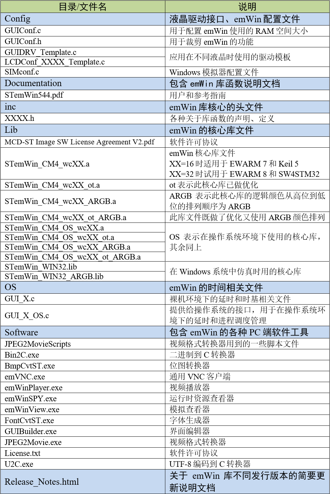

.. vim: syntax=rst

emWin文件和应用架构
====================

emWin的获取
~~~~~~~~~~~~~~~~

我们使用的平台是野火STM32开发板，所以我们使用STemWin版本的库，在本教程中我们使用的STemWin为V5.44a版本。

目前，ST官网中的STemWin版本停留在V5.32不再继续更新，ST已经将最新版本的STemWin放到了STM32 CUBE库中。
STM32 CUBE库可以从官网或者STM32CubeMX软件中获得，也可以直接从野火F249挑战者V2的配套资料中得到。

emWin目录结构
~~~~~~~~~~~~~~~~~

解压下载得到的STM32 CUBE库后，进入到如下目录：

**STM32Cube_FW_F4_V1.24.1\\Middlewares\\ST\\STemWin**

进入STemWin目录后见图 STemWin文件说明_ 。

.. image:: media/File_structure/Filest002.png
   :align: center
   :name: STemWin文件说明
   :alt: STemWin文件说明

STemWin库包含了如下内容：

-  Config文件夹：其中的GUIConf.c文件用于配置emWin的存储空间分配，GUIConf.h文件用于裁剪emWin的功能。
   其余的GUIDRV_Template.c、LCDConf_FlexColor.c、GUIDRV_wf.c是emWin应用在不同液晶时使用的不同驱动模板；

-  Documentation文件夹：它包含了《STemWin544.pdf》文件，是关于emWin库的用户手册，由于emWin库不是开源代码，
   所以在使用emWin的函数接口时，唯一可以参考的说明就是这个手册；

-  inc文件夹：它包含了全部的emWin库核心的头文件，各种关于库函数的声明、定义都在这些文件里面；

-  Lib文件夹：它包含了emWin的代码库文件，针对Cortex-M0、M3和M4这些不同 CPU内核以及是否优化，
   都有一个相对应的emWin库，在使用的时候我们要根据自己的平台选择合适的库文件；

-  OS文件夹：它包含了GUI_X.c及GUI_X_FreeRTOS.c文件，分别是对应裸机平台的GUI延时，
   和多任务系统平台的关于进程调度之类的一些emWin所需要的底层接口；

-  Simulation文件夹：它包含了用于PC端仿真时的lib库和一些依赖，但是不包含PC端仿真的完整工程。

-  Software文件夹：它包含了BmpCvt.exe、GUIBuilder.exe和FontCvt.exe 等PC端软件工具。
   BmpCvt.exe用于把图片数据转换成C文件，GUIBuilder.exe是一个使用图形界面方式开发emWin应用的工具(有点像Qt的图形开发方式)，
   而FontCvt.exe则用于字体文件转换；

-  Release_Notes.html文件：是关于emWin库不同发行版本的简要更新说明文档。

emWin文件说明
~~~~~~~~~~~~~~~~~

下面的针对具体的文件进行介绍，inc部分文件太多没有全部列出，见表格 emWin具体文件说明_ 。

STemWin V5.44a的库文件命名方式相比以前的版本有很大不同。除了依旧区分裸机平台和操作系统平台以外，
V5.44a中的库文件全部变为.a格式，文件名中不再直接写出编译器的类型，而是使用wc16和wc32区分不同的编译器，
标有wc16的可用于EWARM(IAR for ARM) 7和Keil5，
标有wc32的可用于EWARM(IAR for ARM) 8和SW4STM32(GCC)。
同时，相比于5.2x版本，V5.44a版中还提供了官方优化过的库文件，ot就是优化的单词 optimization的缩写。
而文件名中的ARGB则对应了emWin从5.30开始的一项变化，这部分内容将在颜色章节进行讲解。

emWin应用的软件架构
~~~~~~~~~~~~~~~~~~~~~~~~

典型的emWin构建程序其架构见图 emWin软件架构图_ 。

该架构看起来并不复杂，从最底层看起， 首先是硬件层，硬件层就是指最基本的板级支持软件包(BSP)，
也就是我们常说的底层驱动，它提供了对硬件平台资源最直接的访问；emWin软件库承上启下，它运行在硬件层之上，
与硬件层之间仅靠液晶驱动连接起来，而向应用层则提供了各种便于用户制作GUI应用的接口。

在没有使用emWin的软件架构中，很可能就是由硬件层直接过渡到应用层，甚至根本没有分层的概念，
这样的应用程序将十分依赖于某个特定的硬件平台，不容易迁移到其它设备之中。从这个架构图可以看出，
只需要编写好液晶驱动这个粘合emWin库和硬件BSP层的中间件，就可以正常使用emWin了，迁移应用到不同的平台也简单得多。

