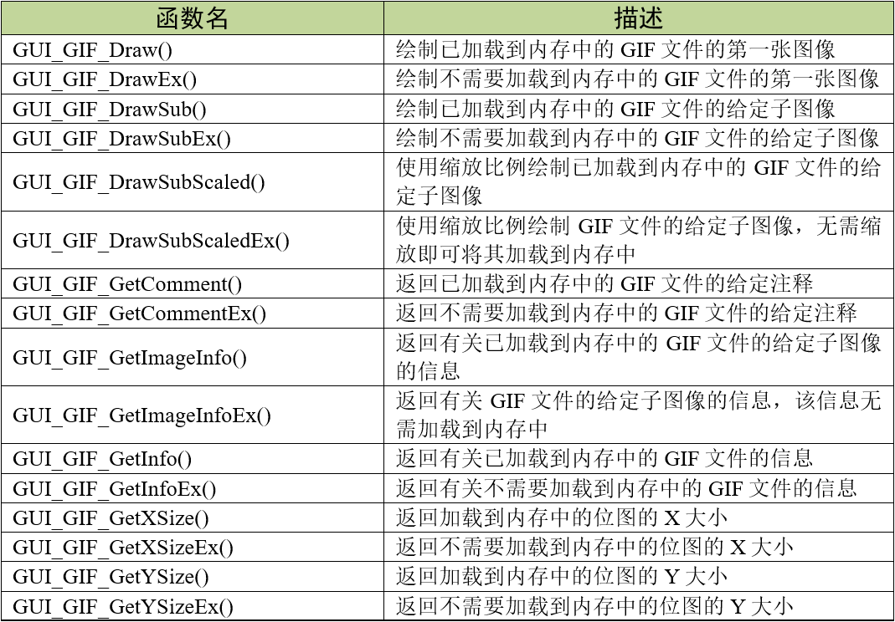
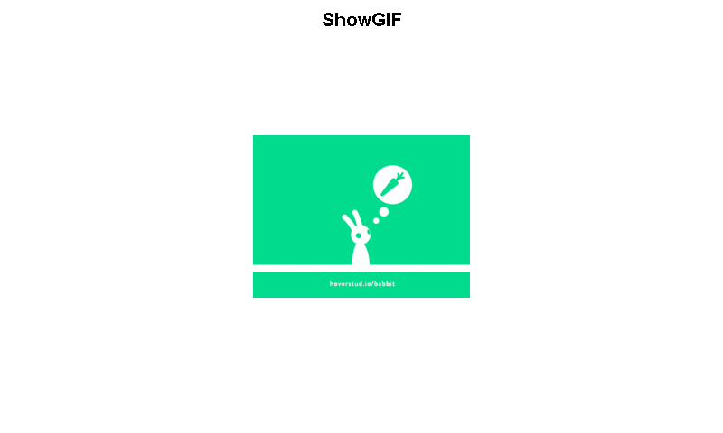

.. vim: syntax=rst

GIF图片显示
============

GIF（Graphics Interchange Format）即图形交换格式，
是由CompuServe公司在1980年代开发的一种图像文件格式。它被设计用来在数据网络之间传输图像。
GIF标准支持交错、透明度、应用程序定义的数据，动画和原始文本的渲染。
GIF文件使用LZW （Lempel-Zif-Welch）文件压缩方法来压缩图像数据。GIF格式有两种版本，
一种版本只能存储一张图像，而另一种版本加入了对多帧图像的支持，这便是我们熟知的动图。

emWin在做GIF解压的时候需要大约16KB左右的RAM空间。在完成图像绘制后，用于解压的RAM空间会被释放。

GIF显示相关API
~~~~~~~~~~~~~~~~~~~~~~~~~~~~

GUI_GIF_DrawSub()
^^^^^^^^^^^^^^^^^^^^^^

在当前窗口中的指定位置绘制gif文件的给定子图像，该文件已被加载到内存中。

.. code-block:: c
    :caption: 代码清单:GIF-1 函数原型
    :name: 代码清单:GIF-1
    :linenos:

    int GUI_GIF_DrawSub(const void *pGIF, U32 NumBytes, int x0, int y0,
                        int Index);

1) pGIF：
指向gif文件所在的存储区的开始的指针；

2) NumBytes：
gif文件的字节数；

3) x0：
GIF左上角在屏幕上的x位置；

4) y0：
GIF左上角在屏幕上的x位置；

5) Index：
要显示的子图像的索引，从0开始。

返回值：绘制成功返回0，绘制失败返回非0。

GUI_GIF_DrawSubEx()
'''''''''''''''''''

在当前窗口的指定位置绘制gif文件的给定子图像，该文件不必加载到内存中。

.. code-block:: c
    :caption: 代码清单:GIF-2 函数原型
    :name: 代码清单:GIF-2
    :linenos:

    int GUI_GIF_DrawSubEx(GUI_GET_DATA_FUNC *pfGetData, void *p, int x0,
                        int y0, int Index);

1) pfGetData：
指向用于获取数据的函数的指针；

2) p：
传递给pfGetData指向的函数的空指针；

3) x0：
GIF左上角在屏幕上的x位置；

4) y0：
GIF左上角在屏幕上的x位置；

5) Index：
要显示的子图像的索引，从0开始。

返回值：绘制成功返回0，绘制失败返回非0。

GUI_GIF_GetImageInfo()
^^^^^^^^^^^^^^^^^^^^^^^^^

返回已加载到内存中的GIF文件的给定子图像的信息。

.. code-block:: c
    :caption: 代码清单:GIF-3 函数原型
    :name: 代码清单:GIF-3
    :linenos:

    int GUI_GIF_GetImageInfo(const void *pGIF, U32 NumBytes,
                            GUI_GIF_IMAGE_INFO *pInfo, int Index);

1) pGIF：
指向gif文件所在的存储区的开始的指针；

2) NumBytes：
gif文件的字节数；

3) pInfo：
指向GUI_GIF_IMAGE_INFO结构的指针，该结构由函数填充；

4) Index：
要显示的子图像的索引，从0开始；

返回值：获取成功返回0，获取失败返回非0。

此函数主要用来获取GIF动图的一些基本信息，其中子图象的显示时长在播放动图的时候很有用，如果显示时长为0，则使用默认的10ms长度。

.. code-block:: c
    :caption: 代码清单:GIF-4 GUI_GIF_IMAGE_INFO结构原型
    :name: 代码清单:GIF-4
    :linenos:

    typedef struct {
        int xPos;
        int yPos;
        int xSize;
        int ySize;
        int Delay;
    } GUI_GIF_IMAGE_INFO;

1) xPos：
最后绘制图像的X位置；

2) yPos：
最后绘制图像的Y位置；

3) xSize：
最后绘制图像的X大小；

4) ySize：
最后绘制图像的Y大小；

5) Delay：
每张子图象的显示时长，单位10ms。

GUI_GIF_GetInfo()
'''''''''''''''''

返回一个信息结构，其中包含关于已加载到内存中的给定GIF文件中的子图像的大小和数量的信息。

.. code-block:: c
    :caption: 代码清单:GIF-5 函数原型
    :name: 代码清单:GIF-5
    :linenos:

    int GUI_GIF_GetInfo(const void *pGIF, U32 NumBytes, GUI_GIF_INFO
                        *pInfo);

1) pGIF：
指向gif文件所在的存储区的开始的指针；

2) NumBytes：
gif文件的字节数；

3) pInfo：
指向GUI_GIF_INFO结构的指针，该结构由这个函数填充。

返回值：获取成功返回0，获取失败返回非0。

.. code-block:: c
    :caption: 代码清单:GIF-6 GUI_GIF_INFO结构原型
    :name: 代码清单:GIF-6
    :linenos:

    typedef struct {
        int xSize;
        int ySize;
        int NumImages;
    } GUI_GIF_INFO;

1) xSize：
图像的X大小；

2) ySize：
图像的Y大小；

3) NumImages：
文件中子图像的数目。

GIF图片显示实验
~~~~~~~~~~~~~~~~~~~~~~~~~~~

接下来我们通过一个实验来讲解如何简单的显示GIF图片，更多API函数的演示实验可参考官方例程2DGL_DrawGIF.c，例程路径如下：

**SeggerEval_WIN32_MSVC_MinGW_GUI_V548\\Sample\\Tutorial\\2DGL_DrawGIF.c**

代码分析
^^^^^^^^^^^^

绘制外部存储器（SD卡）中的GIF
''''''''''''''''''''''''''''''''''''

.. code-block:: c
    :caption: 代码清单:GIF-7 \_ShowGIFEx函数（MainTask.c文件）
    :name: 代码清单:GIF-7
    :linenos:

    /**
    * @brief 直接从存储器中绘制BMP图片数据
    * @note 无
    * @param sFilename：需要加载的图片名
    * @retval 无
    */
    static void ShowGIFEx(const char *sFilename)
    {
        GUI_GIF_INFO Gifinfo = {0};
        GUI_GIF_IMAGE_INFO Imageinfo = {0};
        int i = 0;

        /* 进入临界段 */
        taskENTER_CRITICAL();
        /* 打开图片 */
        result = f_open(&file, sFilename, FA_READ);
        if ((result != FR_OK)) {
            printf("文件打开失败！\r\n");
            _acBuffer[0]='\0';
        }
        /* 退出临界段 */
        taskEXIT_CRITICAL();

        /* 获取GIF文件信息 */
        GUI_GIF_GetInfoEx(_GetData, &file, &Gifinfo);
        /* 循环显示所有的GIF帧 */
        for (i = 0; i < Gifinfo.NumImages; i++) {
            /* 获取GIF子图象信息 */
            GUI_GIF_GetImageInfoEx(_GetData, &file, &Imageinfo, i);
            /* 绘制GIF子图象 */
            GUI_GIF_DrawSubEx(_GetData, &file,
                            (LCD_GetXSize() - Gifinfo.xSize) / 2,
                            (LCD_GetYSize() - Gifinfo.ySize) / 2, i);
            /* 帧延时 */
            GUI_Delay(Imageinfo.Delay);
        }
        /* 读取完毕关闭文件 */
        f_close(&file);
    }

如 代码清单:GIF-7_ 所示，从外部存储器中直接绘制GIF图片前必须先通过文件系统函数f_open函数打开GIF文件，
图片打开成功后调用GUI_GIF_GetInfoEx函数获取GIF图片的X大小、Y大小和总帧数等信息，根据获取到的总帧数使用for循环绘制GIF子图象，
循环体中GUI_GIF_GetImageInfoEx函数主要用来获取GIF每一帧的显示时间，GUI_GIF_DrawSubEx负责绘制GIIF图像，GUI_Delay负责长度执行每一帧显示时间的演示。

GUI_GIF_DrawSubEx函数和直接绘制BMP一样，需要一个专门的数据读取函数才能绘制图片，见 代码清单:GIF-8_ 。

.. code-block:: c
    :caption: 代码清单:GIF-8 \_GetData函数（MainTask.c文件）
    :name: 代码清单:GIF-8
    :linenos:

    /**
    * @brief 从存储器中读取数据
    * @note 无
    * @param
    * @retval NumBytesRead：读到的字节数
    */
    int _GetData(void * p, const U8 ** ppData, unsigned NumBytesReq, U32
                Off)
    {
        static int FileAddress = 0;
        UINT NumBytesRead;
        FIL *Picfile;

        Picfile = (FIL *)p;

        if (NumBytesReq > sizeof(_acBuffer)) {
            NumBytesReq = sizeof(_acBuffer);
        }

        if (Off == 1) FileAddress = 0;
        else FileAddress = Off;
        result = f_lseek(Picfile, FileAddress);

        /* 进入临界段 */
        taskENTER_CRITICAL();
        result = f_read(Picfile, _acBuffer, NumBytesReq, &NumBytesRead);
        /* 退出临界段 */
        taskEXIT_CRITICAL();

        *ppData = (const U8 *)_acBuffer;

        return NumBytesRead;
    }

如 代码清单:GIF-8_ 所示，_GetData函数用于读取外部存储器中的图片数据，每调用一次就读取图片一整行的像素数据，
请确保数据缓冲区_acBuffer[]的大小足够装下一整行像素数据。_GetData函数将作为GUI_JPEG_DrawEx函数的其中一个参数使用，
当emWin从外部存储器直接绘制图片时，这个读取函数必须要有。事实上显示GIF图片的_GetData函数与用来显示BMP和JPEG的是同一个函数。

绘制已加载到内存中的GIF
'''''''''''''''''''''''''''

.. code-block:: c
    :caption: 代码清单:GIF-9 \_ShowGIF函数（MainTask.c文件）
    :name: 代码清单:GIF-9
    :linenos:

    /**
    * @brief 加载GIT图片到内存中并绘制
    * @note 无
    * @param sFilename：需要加载的图片名
    * @retval 无
    */
    static void ShowGIF(const char *sFilename)
    {
        WM_HMEM hMem;
        GUI_GIF_INFO Gifinfo = {0};
        GUI_GIF_IMAGE_INFO Imageinfo = {0};
        int i = 0;
        int j = 0;

        /* 进入临界段 */
        taskENTER_CRITICAL();
        /* 打开图片 */
        result = f_open(&file, sFilename, FA_READ);
        if ((result != FR_OK)) {
            printf("文件打开失败！\r\n");
            _acbuffer[0]='\0';
        }

        /* 申请一块动态内存空间 */
        hMem = GUI_ALLOC_AllocZero(file.fsize);
        /* 转换动态内存的句柄为指针 */
        _acbuffer = GUI_ALLOC_h2p(hMem);

        /* 读取图片数据到动态内存中 */
        result = f_read(&file, _acbuffer, file.fsize, &f_num);
        if (result != FR_OK) {
            printf("文件读取失败！\r\n");
        }
        /* 读取完毕关闭文件 */
        f_close(&file);
        /* 退出临界段 */
        taskEXIT_CRITICAL();

        /* 获取GIF文件信息 */
        GUI_GIF_GetInfo(_acbuffer, file.fsize, &Gifinfo);
        /* 显示2遍GIF */
        for (j = 0; j < 2; j++) {
            /* 循环显示所有的GIF帧 */
            for (i = 0; i<Gifinfo.NumImages; i++) {
                /* 获取GIF子图象信息 */
                GUI_GIF_GetImageInfo(_acbuffer, file.fsize, &Imageinfo, i);
                /* 绘制GIF子图象 */
                GUI_GIF_DrawSub(_acbuffer, file.fsize,
                                (LCD_GetXSize() - Gifinfo.xSize) / 2,
                                (LCD_GetYSize() - Gifinfo.ySize) / 2, i);
                /* 帧延时 */
                GUI_Delay(Imageinfo.Delay);
            }
        }
        /* 释放内存 */
        GUI_ALLOC_Free(hMem);
    }

如 代码清单:GIF-9_ 所示，加载GIT图片到内存中并绘制的操作与从外部存储器中直接绘制的操作几乎是相同的，
都是必须通过文件系统函数f_open函数打开图片文件，图片打开成功后调用GUI_GIF_GetInfoEx函数获取GIF图片的X大小、Y大小和总帧数等信息，
根据获取到的总帧数使用for循环绘制GIF子图象，循环体中GUI_GIF_GetImageInfoEx函数主要用来获取GIF每一帧的显示时间，
GUI_Delay负责长度执行每一帧显示时间的演示。不同的是绘制GIF子图象用的是GUI_GIF_DrawSub函数，不需要额外的数据读取函数。

MainTask函数
''''''''''''''''''

本实验我们用两种GIF绘制方法绘制3张GIF图片，见 代码清单:GIF-10_ 。

.. code-block:: c
    :caption: 代码清单:GIF-10 MainTask函数（MainTask.c文件）
    :name: 代码清单:GIF-10
    :linenos:

    /**
    * @brief GUI主任务
    * @note 无
    * @param 无
    * @retval 无
    */
    void MainTask(void)
    {
        /* 设置背景色 */
        GUI_SetBkColor(GUI_WHITE);
        GUI_Clear();
        /* 设置字体 */
        GUI_SetFont(GUI_FONT_24B_ASCII);
        GUI_SetColor(GUI_BLACK);
        while (1) {
            /* 直接从存储器中绘制BMP图片数据 */
            GUI_DispStringHCenterAt("ShowGIFEx", LCD_GetXSize()/2, 10);
            ShowGIFEx("0:/image/dolphin.gif");
            GUI_Delay(100);
            GUI_Clear();

            /* 加载GIT图片到内存中并绘制 */
            GUI_DispStringHCenterAt("ShowGIF", LCD_GetXSize()/2, 10);
            ShowGIF("0:/image/dolphin.gif");
            GUI_Delay(100);
            GUI_Clear();

            GUI_DispStringHCenterAt("ShowGIF", LCD_GetXSize()/2, 10);
            ShowGIF("0:/image/rabbit.gif");
            GUI_Delay(100);
            GUI_Clear();

            GUI_DispStringHCenterAt("ShowGIF", LCD_GetXSize()/2, 10);
            ShowGIF("0:/image/Groundhog.gif");
            GUI_Delay(100);
            GUI_Clear();
        }
    }

如 代码清单:GIF-10_ 所示，在while循环中调用ShowGIFEx、ShowGIF显示三张GIF图，
其中“dolphin.gif”分别被ShowGIFEx和ShowGIF各显示了一次，用来比较两种方式的显示效果。

实验现象
^^^^^^^^^^^^

GIF图片显示实验的实验现象如图 GIF图片显示实验现象_ 所示，
把实验代码下到开发板上可以看到，ShowGIFEx函数显示的GIF非常的不流畅，而ShowGIF函数显示的GIF就很流畅。

