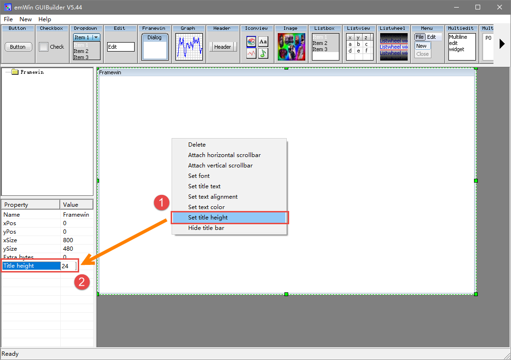
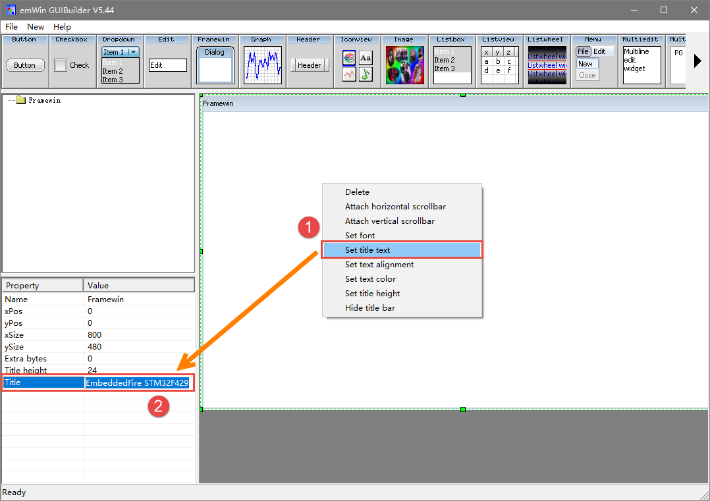

.. vim: syntax=rst

GUIBuilder的使用
===================

GUIBuilder是Segger公司为emWin开发的一款界面编辑软件工具，用于显示界面的前期设计，
或在不了解 C语言的情况下设计界面。emWin的控件在GUIBuilder可以直接通过拖放来放置和调整大小，而不必编写源代码。
可以按上下文菜单添加其他属性，可以通过编辑小部件的属性来微调。设计好的界面可以保存为 C文件，
直接添加进工程中使用。利用好GUIBuilder可以更快的完成emWin界面的初步设计。主界面见图 GUIBuilder主界面_ 。

GUIBuilder可以从Segger官方的模拟器工程中获得，也可以在STM32的CUBE库中找到。GUIBuilder在CUBE库中的路径如下：

**STM32Cube_FW_F4_V1.24.1\\Middlewares\\ST\\STemWin\\Software\\GUIBuilder.exe**

使用步骤
~~~~~~~~~~~~~~~

1) 创建框架窗口。首先点击GUIBuilder控件选择栏中的FrameWin控件，创建一个框架窗口。见图 添加FrameWin控件_ ；

2) 修改框架窗口尺寸。在控件属性框中，修改FrameWin控件的尺寸为800*480，见图 修改FrameWin控件大小_ ；

3) 设置标题栏高度。右键FrameWin控件，选择Set title height，在控件属性框中新增选项中设置标题栏高度为24，见图 设置标题栏高度_ ；

4) 设置标题内容。右键FrameWin控件，选择Set title text，输入“EmbeddedFire STM32F429”，见图 设置标题内容_ ；

5) 设置标题字体。同样右键FrameWin控件，选择Set font，在弹出的选择框中选择“GUI_FONT_24_ASCII”，见图 设置标题字体_ ；

6) 使用同样的方法添加一个按键和一个多选框，见图 添加按钮和多选框_ ；

7) 最后，保存并生成C文件。点击左上角菜单栏File->Save即可，GUIBuilder会自动生成对应的C文件。
   不过无法选择保存路径，生成的C文件会保存在GUIBuilder所在的文件夹中，见图 保存C文件_ 和图 C文件路径；

GUIBuilder生成的C文件完整内容见 代码清单:GUIBuilder-1_ ，由于篇幅限制，省略了部分注释代码。

.. code-block:: c
    :caption: 代码清单:GUIBuilder-1 FrameWin.c文件内容
    :name: 代码清单:GUIBuilder-1
    :linenos:

    #include "DIALOG.h"

    /*********************************************************************
    *
    *       Defines
    *
    **********************************************************************
    */
    #define ID_FRAMEWIN_0   (GUI_ID_USER + 0x00)
    #define ID_BUTTON_0   (GUI_ID_USER + 0x01)
    #define ID_CHECKBOX_0   (GUI_ID_USER + 0x02)

    /*********************************************************************
    *
    *       Static data
    *
    **********************************************************************
    */

    /*********************************************************************
    *
    *       _aDialogCreate
    */
    static const GUI_WIDGET_CREATE_INFO _aDialogCreate[] = {
        { FRAMEWIN_CreateIndirect, "Framewin", ID_FRAMEWIN_0, 0, 0, 800,
        480, 0, 0x64, 0 },
        { BUTTON_CreateIndirect, "Button", ID_BUTTON_0, 90, 60, 120, 40, 0,
        0x0, 0 },
        { CHECKBOX_CreateIndirect, "Checkbox", ID_CHECKBOX_0, 260, 65, 80,
        30, 0, 0x0, 0 },
        // USER START (Optionally insert additional widgets)
        // USER END
    };

    /*********************************************************************
    *
    *       Static code
    *
    **********************************************************************
    */

    /*********************************************************************
    *
    *       _cbDialog
    */
    static void _cbDialog(WM_MESSAGE * pMsg)
    {
        WM_HWIN hItem;
        int     NCode;
        int     Id;

        switch (pMsg->MsgId) {
        case WM_INIT_DIALOG:
            //
            // Initialization of 'Framewin'
            //
            hItem = pMsg->hWin;
            FRAMEWIN_SetTitleHeight(hItem, 24);
            FRAMEWIN_SetText(hItem, "EmbeddedFire STM32F429");
            FRAMEWIN_SetFont(hItem, GUI_FONT_24_ASCII);
            //
            // Initialization of 'Checkbox'
            //
            hItem = WM_GetDialogItem(pMsg->hWin, ID_CHECKBOX_0);
            CHECKBOX_SetText(hItem, "Check");
            break;
        case WM_NOTIFY_PARENT:
            Id    = WM_GetId(pMsg->hWinSrc);
            NCode = pMsg->Data.v;
            switch (Id) {
            case ID_BUTTON_0: // Notifications sent by 'Button'
                switch (NCode) {
                case WM_NOTIFICATION_CLICKED:
                    break;
                case WM_NOTIFICATION_RELEASED:
                    break;
                }
                break;
            case ID_CHECKBOX_0: // Notifications sent by 'Checkbox'
                switch (NCode) {
                case WM_NOTIFICATION_CLICKED:
                    break;
                case WM_NOTIFICATION_RELEASED:
                    break;
                case WM_NOTIFICATION_VALUE_CHANGED:
                    break;
                }
                break;
            }
            break;
        default:
            WM_DefaultProc(pMsg);
            break;
        }
    }

    /*********************************************************************
    *
    *       Public code
    *
    **********************************************************************
    */
    /*********************************************************************
    *
    *       CreateFramewin
    */
    WM_HWIN CreateFramewin(void);
    WM_HWIN CreateFramewin(void)
    {
        WM_HWIN hWin;

        hWin = GUI_CreateDialogBox(_aDialogCreate, GUI_COUNTOF(
                _aDialogCreate), _cbDialog, WM_HBKWIN, 0, 0);
        return hWin;
    }

从 代码清单:GUIBuilder-1_ 我们可以看出，GUIBuilder生成的只是一个代码框架，
整个界面需要实现的操作和控件自身的行为逻辑以及控件之间的通信等等都需要我们自己完成。

添加GUIBuilder代码到STM32
~~~~~~~~~~~~~~~~~~~~~~~~~~~

我们以FreeRTOS_emWin移植模版为例，讲解如何添加GUIBuilder生成的C文件到工程，添加过程其实非常的简单。

1) 首先，用FrameWin.c替换掉原来模版中的MainTask.c，见图 替换MainTask.c_ ；

2) 然后添加头文件GUI.h和MainTask.h，并在最后添加MainTask函数即可完成添加，
   见 代码清单:GUIBuilder-2_ 。

.. code-block:: c
    :caption: 代码清单:GUIBuilder-2 添加MainTask函数
    :name: 代码清单:GUIBuilder-2
    :linenos:

    // USER START (Optionally insert additional public code)
    void MainTask(void)
    {
        CreateFramewin();

        while (1) {
            GUI_Delay(100);
        }
    }
    // USER END

添加GUIBuilder代码到模拟器
~~~~~~~~~~~~~~~~~~~~~~~~~~~~

添加生成的C文件到模拟器的步骤与第4章添加BASIC_HelloWorld.c文件的步骤一致。同时，C文件需要添加的内容也与添加到STM32工程中时几乎相同，
需要在FrameWin.c文件中添加GUI.h和MainTask函数。唯一不同的是，模拟器中必须添加emWin初始化函数GUI_Init()，
否则无法运行代码。见 代码清单:GUIBuilder-3_ 。

.. code-block:: c
    :caption: 代码清单:GUIBuilder-3 模拟器中的MainTask函数
    :name: 代码清单:GUIBuilder-3
    :linenos:

    // USER START (Optionally insert additional public code)
    void MainTask(void)
    {
        GUI_Init();

        CreateFramewin();

        while (1) {
            GUI_Delay(100);
        }
    }
    // USER END

