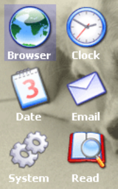

.. vim: syntax=rst

图标控件
=============

图标（Iconview）控件可用来设置基于图标的菜单，这些菜单在手机和电脑上非常常见，使用也很频繁。
它可以显示图标列表，其中每个图标都可以选择使用文本标记。 图标控件支持透明度和Alpha混合，因此桌面背景可以不受遮挡的显示内容。
当前被选中的图标可以用纯色或alpha混合效果突出显示。如有需要还可以使用滚动条显示更多图标。

图标控件没有固定外观，具体显示什么样的内容完全由用户决定，不过它的结构是不变的，
例如带透明度的图标控件如图 带透明度的图标控件样式_ 所示。

图标控件支持5种通知代码，以区分各种不同的操作动作，见表格 图标控件支持的通知代码_ 。

这5种通知代码是作为WM_NOTIFY_PARENT消息的一部分发送到其父窗口的。当用户点击按钮后，
窗口管理器会让图标控件向父窗口发送WM_NOTIFY_PARENT消息，并且会在消息结构的Data.v成员中附加相应的通知代码，
用户程序可以读取此成员来检测不同的按钮动作以及实现各种功能。

同时图标控件也支持输入焦点，它可以接收如所示的按键消息。

创建图标控件
~~~~~~~~~~~~~~~~~~

图标控件API
^^^^^^^^^^^^^^^^^^^

图标控件创建函数
^^^^^^^^^^^^^^^^^^^^^^^^

ICONVIEW_CreateEx()
''''''''''''''''''''''''''''

在指定位置创建指定大小的图标控件。

.. code-block:: c
    :caption: 代码清单:图标-1 函数原型
    :name: 代码清单:图标-1
    :linenos:

    ICONVIEW_Handle ICONVIEW_CreateEx(int x0, int y0, int xSize, int ySize,
                                    WM_HWIN hParent, int WinFlags, int
                                    ExFlags, int Id, int xSizeItems, int
                                    ySizeItems);

1)  x0：
图标控件在父坐标中的最左侧像素；

2)  y0：
图标控件在父坐标中的最顶侧像素；

3)  xSize：
图标控件的水平尺寸，以像素为单位；

4)  ySize：
图标控件的垂直尺寸，以像素为单位；

5)  hParent：
父窗口句柄。如果为0，则将桌面窗口作为其父窗口；

6)  WinFlags：
窗口创建标志。由于控件本质上是窗口，所以图标控件在创建时可以使用几乎所有的窗口创建标志。
这些标志中按钮最常用的是WM_CF_SHOW。全部创建标志请参考emWin手册的窗口管理器章节；

7)  ExFlags：
额外创建标志，用于选择是否使用滚动条；

8)  Id：
控件ID号；

9)  xSizeItem：
单个图标的水平尺寸，以像素为单位；

10) ySizeItem：
单个图标的垂直尺寸，以像素为单位。

返回值：创建成功后返回已创建的图标控件句柄，创建失败则返回0。

ICONVIEW_CreateIndirect()
'''''''''''''''''''''''''

从对话框资源表中创建图标控件。

.. code-block:: c
    :caption: 代码清单:图标-2 函数原型
    :name: 代码清单:图标-2
    :linenos:

    ICONVIEW_Handle ICONVIEW_CreateIndirect(const GUI_WIDGET_CREATE_INFO
                                            *pCreateInfo, WM_HWIN
                                            hWinParent, int x0, int y0,
                                            WM_CALLBACK *cb);

1) pCreateInfo：
指向GUI_WIDGET_CREATE_INFO结构的指针；

2) hParent：
父窗口的句柄；

3) x0：
图标控件在父坐标中的最左边像素；

4) y0：
图标控件在父坐标中的最顶部像素；

5) cb：
回调函数指针。

此函数的第一个参数指向的是 **代码清单:控件基础-3** 的资源表结构，把结构中的para参数分为高16位和低16位，
分别对应ySizeItem和xSizeItem。其中的Flags参数可选值与ICONVIEW_CreateEx()函数的ExFlags参数相同，用于设置是否启用滚动条。

图标制作
^^^^^^^^^^^^

图标控件所用图标的制作过程与控件贴图和显示位图的有些许不同，我们讲解一下专用于这个控件的图标制作步骤。

1) 添加图像文件。
点击File->Open添加一张PNG格式的图标文件，也可直接将图片拖到转换器空白处添加，见图 添加PNG文件_ ；

2) 保存C文件。
点击File->Save As，在弹出来的保存对话框中，选择需要保存的路径，这里我们保存到图标文件夹，
修改文件名，选择保存类型为.C文件。见图 保存C文件_ ；

3) 选择C文件的颜色格式。
在保存对话框中点击确定后，会弹出一个选择颜色格式的窗口，这里我们选择High color with Alpah(565)，见图 选择颜色格式_ 。

通过上述步骤，即可成功制作1个PNG格式图标的C数组文件。如果需要生成.dta格式的流位图，在保存文件时选择保存类型为.dta文件即可。

而背景图片通常由于分辨率比较高、色彩深度较大等原因，制作出来的C文件体积会很大，根本无法放进芯片的内部FLASH中。
对于背景图片，建议的做法是将图片源文件存放在外部FLASH或SD卡中，系统启动时再加载到RAM，这样就不用担心内部FLASH空间不足的问题了。

图标控件基础实验
~~~~~~~~~~~~~~~~~~~~~~~~

接下来我们通过一个实验来讲解如何创建一个只包含基本功能的图图标控件，完整的图标控件演示实验可参考官方例程WIDGET_Iconview.c，例程路径如下：

**SeggerEval_WIN32_MSVC_MinGW_GUI_V548\\Sample\\Tutorial\\WIDGET_IconView**

代码分析
^^^^^^^^^^^^

本实验与其他实验稍有不同，由于图标控件自身特性的限制，使用对话框的方式间接创建出来的图标控件整体效果不太好，所以这次实验我们使用直接创建的方式。

MainTask函数
''''''''''''''''''

既然是用直接方式创建图标控件，那就不再需要对话框资源表了，直接在GUI主任务中创建，见 代码清单:图标-3_ 。

.. code-block:: c
    :caption: 代码清单:图标-3 MainTask函数（IconviewDLG.c文件）
    :name: 代码清单:图标-3
    :linenos:

    /* 引用图像数据 */
    extern GUI_CONST_STORAGE GUI_BITMAP bmsetting;
    extern GUI_CONST_STORAGE GUI_BITMAP bmclock;
    extern GUI_CONST_STORAGE GUI_BITMAP bmcalender;
    extern GUI_CONST_STORAGE GUI_BITMAP bmmusic;
    extern GUI_CONST_STORAGE GUI_BITMAP bmmessege;
    extern GUI_CONST_STORAGE GUI_BITMAP bmfolder;
    extern GUI_CONST_STORAGE GUI_BITMAP bmnotebook;
    extern GUI_CONST_STORAGE GUI_BITMAP bmsearch;
    extern GUI_CONST_STORAGE GUI_BITMAP bmhome;
    extern GUI_CONST_STORAGE GUI_BITMAP bmimage;

    /* 用于图标的创建 */
    typedef struct {
        const GUI_BITMAP *pBitmap;
        const char *pText;
    } BITMAP_ITEM;

    static BITMAP_ITEM _abitmapItem[] = {
        {&bmhome,         "home"},
        {&bmfolder,     "folder"},
        {&bmclock,       "Clock"},
        {&bmmessege,   "messege"},
        {&bmcalender, "calender"},
        {&bmsearch,     "search"},
        {&bmmusic,       "music"},
        {&bmimage,       "image"},
        {&bmsetting,   "Setting"},
    };

    /**
    * @brief GUI主任务
    * @note 无
    * @param 无
    * @retval 无
    */
    void MainTask(void)
    {
        U8 i;
        WM_HWIN hWin;

        /* 加载BMP图片数据到内存设备 */
        LoadBMP_UsingMEMDEV("0:/image/wallpaper.bmp");

        /* 在指定位置创建ICONVIEW控件 */
        hWin = ICONVIEW_CreateEx(30,             /* 相对于父窗口坐标的最左像素 */
                                20,             /* 相对于父窗口坐标的最上像素 */
                                770,            /* 水平尺寸 */
                                272,            /* 垂直尺寸 */
                                WM_HBKWIN,      /* 父窗口句柄 */
                                WM_CF_SHOW | WM_CF_HASTRANS,/* 窗口创建标志 */
                                0,              /* 不设置自动滚动条 */
                                ID_ICONVIEW_0,  /* 控件ID */
                                64,             /* 单个图标的水平尺寸 */
                                64 + 16);       /* 单个图标的垂直尺寸 */
        /* 向控件中添加新图标 */
        for (i = 0; i < GUI_COUNTOF(_abitmapItem); i++) {
            ICONVIEW_AddBitmapItem(hWin, _abitmapItem[i].pBitmap, _abitmapItem[i].pText);
            ICONVIEW_SetTextColor(hWin, ICONVIEW_CI_SEL, GUI_WHITE);
        }
        /* 设置初始选择的图标，-1表示不选中任何图标 */
        ICONVIEW_SetSel(hWin, -1);
        /* 设置图标标题的字体 */
        ICONVIEW_SetFont(hWin, GUI_FONT_16B_1);
        /* 设置标题的对齐方式 */
        ICONVIEW_SetTextAlign(hWin, GUI_TA_HCENTER | GUI_TA_BOTTOM);
        /* 设置图标被选中时的背景色 */
        ICONVIEW_SetBkColor(hWin, ICONVIEW_CI_SEL, GUI_MAKE_COLOR((0x40uL << 24) | 0xFFFFFF));
        /* 设置图标的对齐方式 */
        ICONVIEW_SetIconAlign(hWin, ICONVIEW_IA_HCENTER | ICONVIEW_IA_TOP);
        /* 设置图标在X和Y方向上的间距 */
        ICONVIEW_SetSpace(hWin, GUI_COORD_X, 70);
        ICONVIEW_SetSpace(hWin, GUI_COORD_Y, 50);

        /* 重定向桌面窗口回调函数 */
        WM_SetCallback(WM_HBKWIN, _cbBkWindow);

        while (1) {
            GUI_Delay(50);
        }
    }

如 代码清单:图标-3_ 所示，首先需要引用所有用到的图标图像数据结构，
接着定义一个包含图像数据结构和图像名称的结构体BITMAP_ITEM，然后定义一个BITMAP_ITEM类型的数组_abitmapItem[]，
将实验用到的图像和各自的名称一一对应，这样添加或者修改图标图像就会比较方便，具体添加多少个图标也是由这个数组决定。

在GUI主任务MainTask函数刚开始的时候，需要把背景图片从外部存储器加载到emWin内存设备中，以备之后使用。
这么做可以加快较高分辨率和图像质量的图片的显示速度，大家目前并不需要了解其中的具体细节，之后会在图片显示章节详细讲解。

接下来是创建图标控件的重点，使用ICONVIEW_CreateEx函数创建图标控件，函数的前4个参数分别对应了控件的起始坐标和尺寸，
第5个参数是控件的父窗口句柄，我们选择桌面窗口WM_HBKWIN作为图标控件的父窗口，还有单个图标的垂直尺寸这个参数比较重要，
这个参数是包含图标下方文本信息的尺寸的，需要根据图标尺寸和实际字体大小来调整。然后用一个for循环，
在循环体中调用ICONVIEW_AddBitmapItem函数和ICONVIEW_SetTextColor函数为图标控件添加图标位图和字体。

然后是一些图标和文本的设置，如 代码清单:图标-3_ 所示，使用ICONVIEW_SetSel函数设置初始状态不选中任何图标，
设置图标文本的字体大小为16B，对齐方式是水平中心对齐和底部对齐，设置图标被选中时的背景颜色为带透明度的白色，
这里需要注意一点， ICONVIEW_SetBkColor函数的背景颜色如果带透明度，不知道是BUG还是什么，在系统颜色模式已经是ARGB模式的情况下，
它的透明度通道的参数值定义依然是完全不透明为0x00，完全透明为0xFF，这与ARGB模式下的透明度参数值定义相反，
所以为了统一，我们使用GUI_MAKE_COLOR宏把它转一下。

最后，使用WM_SetCallback函数重定向桌面窗口的回调函数，因为我们的背景图片要显示在桌面窗口上。

桌面窗口回调函数
''''''''''''''''''

其实不光是显示背景图片，图标控件的点击图标创建新窗口这个最重要的功能也必须在桌面窗口回调函数中完成，
因为和对话框方式类似，图标控件把桌面窗口作为了它的父窗口，那它的很多行为就都需要由桌面窗口来管理，见 代码清单:图标-4_ 。

.. code-block:: c
    :caption: 代码清单:图标-4 桌面窗口回调函数（IconviewDLG.c文件）
    :name: 代码清单:图标-4
    :linenos:

    /**
    * @brief 桌面窗口回调函数
    * @note 无
    * @param pMsg：消息指针
    * @retval 无
    */
    static void _cbBkWindow(WM_MESSAGE *pMsg)
    {
        int id;
        int NCode;

        switch (pMsg->MsgId) {
        case WM_PAINT:
            /* 将背景图片从内存设备写入LCD */
            GUI_MEMDEV_WriteOpaqueAt(hBMP, 0, 0);
            break;
        case WM_NOTIFY_PARENT:
            id = WM_GetId(pMsg->hWinSrc);
            NCode = pMsg->Data.v;
            switch (id) {
            case ID_ICONVIEW_0:
                switch (NCode) {
                case WM_NOTIFICATION_CLICKED:
                    break;
                case WM_NOTIFICATION_RELEASED:
                    switch (ICONVIEW_GetSel(pMsg->hWinSrc)) {
                    case 0:
                        FUN_ICON0Clicked();
                        break;
                    default:
                        break;
                    }
                    break;
                }
                break;
            }
            break;
        default:
            WM_DefaultProc(pMsg);
            break;
        }
    }

1. WM_PAINT消息

背景图片在回调函数的WM_PAINT消息中绘制。因为之前的MainTask函数中已经把背景图片加载到内存设备中了，
所以现在我们只需要调用GUI_MEMDEV_WriteOpaqueAt函数即可很快的将背景图片显示出来。
同样的，这里目前大家不需要了解其中的具体细节，之后会在图片显示章节详细讲解。

2. WM_NOTIFY_PARENT消息

WM_NOTIFY_PARENT消息和对话框方式的处理方法相同，在此消息中以控件ID来区分各个不同的控件。
首先使用ICONVIEW_GetSel函数获取当前被点击图标的索引号，接着根据这个索引号，
去调用相应的应用窗口创建函数FUN_ICON0Clicked。所有图标对应的窗口创建函数都在此处调用，
由于篇幅所限，我们只展示了第一个“home”图标的创建函数。

3. 其他消息

所有我们不关心或者没有用到的系统消息都可以调用默认消息处理函数WM_DefaultProc进行处理。

应用窗口创建函数
''''''''''''''''''

.. code-block:: c
    :caption: 代码清单:图标-5 应用窗口创建函数（IconviewDLG.c文件）
    :name: 代码清单:图标-5
    :linenos:

    /**
    * @brief 应用窗口创建函数
    * @note 无
    * @param 无
    * @retval 无
    */
    static void FUN_ICON0Clicked(void)
    {
        WM_HWIN hWin;
        WM_HWIN hChild;
        WM_HWIN hText;

        /* 创建框架窗口 */
        hWin = FRAMEWIN_CreateEx(100,          /* 相对于父窗口坐标的最左像素 */
                                20,           /* 相对于父窗口坐标的最上像素 */
                                600,          /* 水平尺寸 */
                                400,          /* 垂直尺寸 */
                                WM_HBKWIN,    /* 父窗口句柄 */
                                WM_CF_SHOW,   /* 窗口创建标志 */
                                0,            /* 额外创建标志 */
                                ID_FRAMEWIN_0,/* 控件ID */
                                "",           /* 标题栏文本 */
                                &_cbICON0);   /* 客户窗口回调函数 */
        FRAMEWIN_SetFont(hWin, GUI_FONT_24B_1);
        FRAMEWIN_SetText(hWin, "HOME");
        FRAMEWIN_AddCloseButton(hWin, FRAMEWIN_BUTTON_RIGHT, 0);
        /* 设置为模态窗口 */
        WM_MakeModal(hWin);
        /* 获取客户窗口句柄 */
        hChild = WM_GetClientWindow(hWin);
        /* 在客户窗口中创建子控件 */
        hText = TEXT_CreateEx(0, 0, 180, 34, hChild, WM_CF_SHOW, 0, ID_TEXT_0, "HOME APP");
        TEXT_SetFont(hText, GUI_FONT_32B_1);
        TEXT_SetTextColor(hText, GUI_WHITE);
    }

如 代码清单:图标-5_ 所示，新应用窗口的创建依然使用FRAMEWIN_CreateEx函数进行直接创建，
有关此函数的介绍见17.1.2。然后是设置标题栏字体为24B、文本为“HOME”，并且添加一个关闭按钮。最后，
通过WM_MakeModal函数把这个窗口设置为模态窗口，这样的话只有窗口内部的范围对触摸动作有反应，
窗口外部的其他控件不会响应触摸动作，可在一定程度上避免误触。

在第17章 中我们提到过，框架窗口有主窗口和客户窗口两部分，并且句柄是分开的，子控件放在客户窗口上。
所以使用WM_GetClientWindow函数先获取客户窗口的句柄，然后再在这基础上添加子控件。

应用窗口的回调函数如 代码清单:图标-6_ 所示。

.. code-block:: c
    :caption: 代码清单:图标-6 应用窗口回调函数（IconviewDLG.c文件）
    :name: 代码清单:图标-6
    :linenos:

    /**
    * @brief 应用窗口回调函数
    * @note 无
    * @param 无
    * @retval 无
    */
    static void _cbICON0(WM_MESSAGE *pMsg)
    {
        switch (pMsg->MsgId) {
        case WM_PAINT:
            /* 设置客户窗口的背景颜色 */
            GUI_SetBkColor(GUI_LIGHTGRAY);
            GUI_Clear();
            break;
        default:
            WM_DefaultProc(pMsg);
            break;
        }
    }

应用窗口内子控件的行为逻辑就由回调函数_cbICON0进行处理，如 代码清单:图标-6_ 所示，
我们在回调函数的WM_PAINT消息中使用GUI_SetBkColor函数设置客户窗口的背景颜色。子控件的WM_NOTIFY_PARENT消息也是在这个回调函数中处理。

实验现象
^^^^^^^^^^^^

图标控件基础实验现象如图 图标控件实验初始状态_ 和图 点击home图标后的现象_ 所示，
图 图标控件实验初始状态_ 是图标控件的初始状态，效果与手机和平板电脑上的很类似，
图 点击home图标后的现象_ 是图标被点击后的现象。

