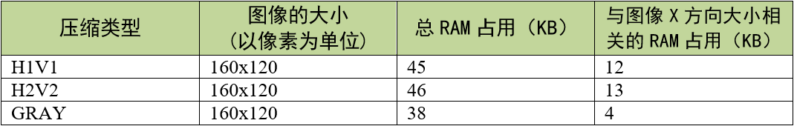
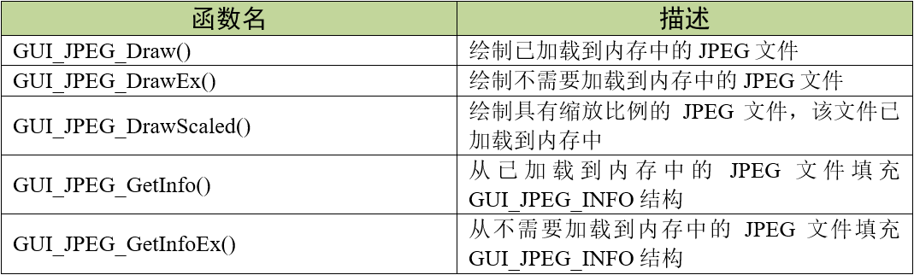
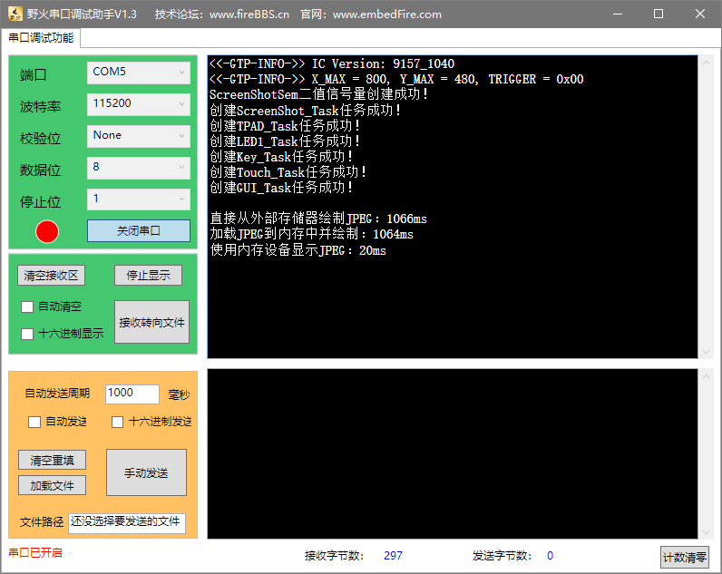

.. vim: syntax=rst

JPEG图片显示
==============

JPEG（发音为“jay-peg”）是一种标准的全色和灰度图像压缩方法，
同时也是Joint Photographic Experts Group（联合图像专家组）的缩写。JPEG通常用于压缩“真实世界”场景，
线条画、卡通和其他非写实图像的压缩不是它的强项。JPEG是有损压缩，这意味着压缩前后的图像并不完全相同。
因此，如果必须有相同的输出位，则不能使用JPEG。然而，在摄影图像上，在没有明显变化的情况下，
可以获得非常好的压缩水平，如果能够接受质量较低的图像，则可以获得非常高的压缩水平。

emWin内置了JPEG库，可实现JPEG基线、扩展顺序和渐进压缩过程，不过目前还没有实现一些不常见的参数设置。
由于法律原因，不得分发JPEG算术编码变体代码。JPEG规范的算术编码选项似乎包含在IBM、AT&T和三菱拥有的专利中。
因此，在未经许可授权的情况下使用算术编码是不合法的。出于这个原因，emWin的JPEG库仅支持解码，不支持编码。

emWin的JPEG库在解码图像时会固定占用33KB的RAM空间，这部分与图像大小无关，而总的RAM占用可通过下面的公式得到：

总RAM占用 = 图像X方向大小 \* 80字节 + 33KB

其中图像的X方向大小取决于JPEG图片所使用的压缩类型，具体见表格 JPEG解压的内存使用情况_ 。

emWin解压缩JPEG所占用的内存由emWin自身的内存管理系统动态分配。在绘制完成JPEG图像后， RAM会被完整的释放。

提供两种图片显示方式：一种是从外部存储器中读取数据并显示，一边读一边显示，占用RAM空间小，但显示速度很慢；
另一种是从外部存储器把图片数据全部读取出来再显示，显示速度较快，但占用大量RAM空间。

JPEG显示相关API
~~~~~~~~~~~~~~~~~~~

GUI_JPEG_Draw()
^^^^^^^^^^^^^^^^^^

在当前窗口中的指定位置绘制一个已加载到内存中的jpeg文件。

.. code-block:: c
    :caption: 代码清单:JPEG-1 函数原型
    :name: 代码清单:JPEG-1
    :linenos:

    int GUI_JPEG_Draw(const void *pFileData, int DataSize, int x0, int y0);

1) pFileData：
指向jpeg文件所在的存储区域的开头的指针；

2) DataSize：
jpeg文件的字节数；

3) x0：
JPEG左上角在屏幕上的x位置；

4) y0：
JPEG左上角在屏幕上的y位置。

返回值：绘制成功返回0，绘制失败返回非0。不过当前的实现是任何情况都返回0。

GUI_JPEG_DrawEx()
^^^^^^^^^^^^^^^^^^^^^^

在当前窗口的指定位置绘制一个jpeg文件，该文件不必加载到内存中。

.. code-block:: c
    :caption: 代码清单:JPEG-2 函数原型
    :name: 代码清单:JPEG-2
    :linenos:

    int GUI_JPEG_DrawEx(GUI_GET_DATA_FUNC *pfGetData, void *p, int x0, int y0);

1) pfGetData：
指向为获取数据而调用的函数的指针；

2) p：
传递给pfGetData指向的函数的空指针；

3) x0：
JPEG左上角在屏幕上的x位置；

4) y0：
JPEG左上角在屏幕上的y位置。

返回值：绘制成功返回0，绘制失败返回非0。不过当前的实现是任何情况都返回0。

JPEG图片显示实验
~~~~~~~~~~~~~~~~~~

接下来我们通过一个实验来讲解如何简单的显示一张JPEG图片，
更多API函数的演示实验可参考官方例程2DGL_DrawJPEG.c和2DGL_DrawJPEGScaled.c，例程路径如下：

**SeggerEval_WIN32_MSVC_MinGW_GUI_V548\\Sample\\Tutorial\\**

本实验我们将使用emWin的基本JPEG显示API函数显示一张800*480分辨率、24位色彩深度的JPEG图片。

代码分析
^^^^^^^^^^^^^^

绘制外部存储器（SD卡）中的JPEG
''''''''''''''''''''''''''''''''''''

.. code-block:: c
    :caption: 代码清单:JPEG-3 ShowJPEGEx函数（MainTask.c文件）
    :name: 代码清单:JPEG-3
    :linenos:

    /**
    * @brief 直接从存储器中绘制JPEG图片数据
    * @note 无
    * @param sFilename：需要加载的图片名
    * @retval 无
    */
    static void ShowJPEGEx(const char *sFilename)
    {
        /* 进入临界段 */
        taskENTER_CRITICAL();
        /* 打开图片 */
        result = f_open(&file, sFilename, FA_READ);
        if ((result != FR_OK)) {
            printf("文件打开失败！\r\n");
            _acBuffer[0]='\0';
        }
        /* 退出临界段 */
        taskEXIT_CRITICAL();

        GUI_JPEG_DrawEx(_GetData, &file, 0, 0);

        /* 读取完毕关闭文件 */
        f_close(&file);
    }

如 代码清单:JPEG-3_ 所示，从外部存储器种直接绘制JPEG图片的操作与绘制BMP图片的操作几乎是相同的，
都是必须通过文件系统函数f_open函数打开图片文件，图片打开成功后调用GUI_JPEG_DrawEx函数绘制，
这个函数和直接绘制BMP一样，需要一个专门的数据读取函数才能绘制图片，见 代码清单:JPEG-4_ 。

.. code-block:: c
    :caption: 代码清单:JPEG-4 \_GetData函数（MainTask.c文件）
    :name: 代码清单:JPEG-4
    :linenos:

    /**
    * @brief 从存储器中读取数据
    * @note 无
    * @param
    * @retval NumBytesRead：读到的字节数
    */
    int _GetData(void * p, const U8 ** ppData, unsigned NumBytesReq, U32 Off)
    {
        static int FileAddress = 0;
        UINT NumBytesRead;
        FIL *Picfile;

        Picfile = (FIL *)p;

        if (NumBytesReq > sizeof(_acBuffer)) {
            NumBytesReq = sizeof(_acBuffer);
        }

        if (Off == 1) FileAddress = 0;
        else FileAddress = Off;
        result = f_lseek(Picfile, FileAddress);

        /* 进入临界段 */
        taskENTER_CRITICAL();
        result = f_read(Picfile, _acBuffer, NumBytesReq, &NumBytesRead);
        /* 退出临界段 */
        taskEXIT_CRITICAL();

        *ppData = (const U8 *)_acBuffer;

        return NumBytesRead;
    }

如 代码清单:JPEG-4_ 所示，_GetData函数用于读取外部存储器中的图片数据，
每调用一次就读取图片一整行的像素数据，请确保数据缓冲区_acBuffer[]的大小足够装下一整行像素数据。
_GetData函数将作为GUI_JPEG_DrawEx函数的其中一个参数使用，当emWin从外部存储器直接绘制图片时，这个读取函数必须要有。

事实上显示JPEG图片的_GetData函数与用来显示BMP的是同一个函数。

绘制已加载到内存中的JPEG
'''''''''''''''''''''''''''

.. code-block:: c
    :caption: 代码清单:JPEG-5 \_ShowJPEG函数（MainTask.c文件）
    :name: 代码清单:JPEG-5
    :linenos:

    /**
    * @brief 加载JPEG图片到内存中并绘制
    * @note 无
    * @param sFilename：需要加载的图片名
    * @retval 无
    */
    static void ShowJPEG(const char *sFilename)
    {
        WM_HMEM hMem;

        /* 进入临界段 */
        taskENTER_CRITICAL();
        /* 打开图片 */
        result = f_open(&file, sFilename, FA_READ);
        if ((result != FR_OK)) {
            printf("文件打开失败！\r\n");
            _acbuffer[0]='\0';
        }

        /* 申请一块动态内存空间 */
        hMem = GUI_ALLOC_AllocZero(file.fsize);
        /* 转换动态内存的句柄为指针 */
        _acbuffer = GUI_ALLOC_h2p(hMem);

        /* 读取图片数据到动态内存中 */
        result = f_read(&file, _acbuffer, file.fsize, &f_num);
        if (result != FR_OK) {
            printf("文件读取失败！\r\n");
        }
        /* 读取完毕关闭文件 */
        f_close(&file);
        /* 退出临界段 */
        taskEXIT_CRITICAL();

        GUI_JPEG_Draw(_acbuffer, file.fsize, 0, 0);

        /* 释放内存 */
        GUI_ALLOC_Free(hMem);
    }

如 代码清单:JPEG-5_ 所示，绘制已加载到内存的JPEG的步骤与直接从外部存储器绘制的操作略有不同，
并且没有了专门的数据读取函数。首先还是必须要用f_open打开JPEG图片文件，然后不同的是用GUI_ALLOC_AllocZero函数申请一块动态内存，
并且用GUI_ALLOC_h2p把这段动态内存的句柄转为指针_acbuffer，方便之后使用，接着用f_read函数把图片数据读到刚刚申请到的动态内存中，
读取完成后关闭文件，使用GUI_JPEG_Draw函数将动态内存中的JPEG数据绘制到LCD上，如果之后的程序不再使用这张JPEG，
就必须使用GUI_ALLOC_Free函数释放动态内存。

使用内存设备绘制JPEG
'''''''''''''''''''''''''''

代码清单:JPEG-3_ 和 代码清单:JPEG-5_ 在显示的时候，
emWin都会先对图像信息进行解码，如果此时立刻绘制图像，则解码会花费很长时间。如果在调用频繁的代码中使用JPEG文件，
那代码可能会因为被卡在图像解码过程中而出错。解决这个问题最好的办法是使用内存设备，将图像绘制到内存设备中需要的时候再显示，
这样的话，JPEG解压只会执行一次。见 代码清单:JPEG-6_ 。

.. code-block:: c
    :caption: 代码清单:JPEG-6 LoadJPEG_UsingMEMDEV函数（MainTask.c文件）
    :name: 代码清单:JPEG-6
    :linenos:

    /**
    * @brief 加载JPEG图片数据到内存设备
    * @note 无
    * @param sFilename：需要加载的图片名
    * @retval 无
    */
    static WM_HMEM LoadJPEG_UsingMEMDEV(const char *sFilename)
    {
        WM_HMEM hMem;
        GUI_MEMDEV_Handle hJPEG;
        GUI_JPEG_INFO Jpeginfo;

        /* 进入临界段 */
        taskENTER_CRITICAL();
        /* 打开图片 */
        result = f_open(&file, sFilename, FA_OPEN_EXISTING | FA_READ);
        if ((result != FR_OK)) {
            printf("文件打开失败！\r\n");
            _acbuffer[0]='\0';
        }

        /* 申请一块动态内存空间 */
        hMem = GUI_ALLOC_AllocZero(file.fsize);
        /* 转换动态内存的句柄为指针 */
        _acbuffer = GUI_ALLOC_h2p(hMem);

        /* 读取图片数据到动态内存中 */
        result = f_read(&file, _acbuffer, file.fsize, &f_num);
        if (result != FR_OK) {
            printf("文件读取失败！\r\n");
        }
        /* 读取完毕关闭文件 */
        f_close(&file);
        /* 退出临界段 */
        taskEXIT_CRITICAL();

        GUI_JPEG_GetInfo(_acbuffer, file.fsize, &Jpeginfo);

        /* 创建内存设备 */
        hJPEG = GUI_MEMDEV_CreateEx(0, 0,                /* 起始坐标 */
                                    Jpeginfo.XSize,      /* x方向尺寸 */
                                    Jpeginfo.YSize,      /* y方向尺寸 */
                                    GUI_MEMDEV_HASTRANS);/* 带透明度的内存设备

        /* 选择内存设备 */
        GUI_MEMDEV_Select(hJPEG);
        /* 绘制JPEG到内存设备中 */
        GUI_JPEG_Draw(_acbuffer, file.fsize, 0, 0);
        /* 选择内存设备，0表示选中LCD */
        GUI_MEMDEV_Select(0);
        /* 释放内存 */
        GUI_ALLOC_Free(hMem);

        return hJPEG;
    }

如 代码清单:JPEG-6_ 所示，把JPEG图片数据加载到内存设备中的步骤其实和 代码清单:JPEG-5_ 差不多，
都是先用f_open函数打开BMP文件，然后用GUI_ALLOC_AllocZero函数申请一块动态内存，并且用GUI_ALLOC_h2p把这段动态内存的句柄转为指针_acbuffer，
方便之后使用，接着用f_read函数把图片数据读到刚刚申请到的动态内存中，读取完成后关闭文件。

不同的操作是，代码清单:JPEG-6_ 使用GUI_JPEG_GetInfo函数获取JPEG图像的X和Y方向大小，
然后使用GUI_MEMDEV_CreateEx创建一个带透明度的内存设备，GUI_MEMDEV_Select函数激活内存设备，
再调用GUI_JPEG_Draw函数把图片数据绘制到内存设备中，绘制完成后重复调用一次GUI_MEMDEV_Select函数选择LCD，方便之后的操作。

MainTask函数
'''''''''''''''''''''''''''

代码清单:JPEG-6_ 完成的工作只是把JPEG数据搬到内存设备中，
真正的显示需要调用专门的函数完成，见 代码清单:JPEG-7_ 。

.. code-block:: c
    :caption: 代码清单:JPEG-7 MainTask函数（MainTask函数）
    :name: 代码清单:JPEG-7
    :linenos:

    /**
    * @brief GUI主任务
    * @note 无
    * @param 无
    * @retval 无
    */
    void MainTask(void)
    {
        int i = 1;
        uint16_t t0 = 0;
        uint16_t t1 = 0;

        GUI_MEMDEV_Handle hJPEG;

        GUI_SetFont(GUI_FONT_24B_ASCII);
        GUI_SetTextMode(GUI_TM_TRANS);
        GUI_SetColor(GUI_WHITE);

        /* 加载JPEG图片数据到内存设备 */
        hJPEG = LoadJPEG_UsingMEMDEV("0:/image/FORD_GT.jpg");

        while (1) {
            i++;
            switch (i) {
            case 1:
                t0 = GUI_GetTime();
                /* 直接从外部存储器绘制BMP图片 */
                ShowJPEGEx("0:/image/FORD_GT.jpg");
                t1 = GUI_GetTime();
                GUI_DispStringHCenterAt("GUI_JPEG_DrawEx()", 400, 0);
                printf("\r\n直接从外部存储器绘制JPEG：%dms\r\n",t1 - t0);
                break;
            case 2:
                t0 = GUI_GetTime();
                /* 加载BMP图片到内存中并绘制 */
                ShowJPEG("0:/image/FORD_GT.jpg");
                t1 = GUI_GetTime();
                GUI_DispStringHCenterAt("GUI_JPEG_Draw()", 400, 0);
                printf("加载JPEG到内存中并绘制：%dms\r\n",t1 - t0);
                break;
            case 3:
                t0 = GUI_GetTime();
                /* 从内存设备写入LCD */
                GUI_MEMDEV_CopyToLCDAt(hJPEG, 0, 0);
                t1 = GUI_GetTime();
                GUI_DispStringHCenterAt("USE MEMDEV", 400, 0);
                printf("使用内存设备显示BMP：%dms\r\n",t1 - t0);
                break;
            default:
                i = 1;
                break;
            }
            GUI_Delay(2000);
            GUI_Clear();
        }
    }

本实验我们用三种JPEG绘制方法绘制同一张图片，看看每种方法各自需要多少时间。如 代码清单:JPEG-7_ 所示，
首先在一开始先加载JPEG数据到内存设备中以备之后使用，然后在while循环中调用ShowJPEGEx、ShowJPEG和GUI_MEMDEV_CopyToLCDAt，
分别记录各自花费的时间并通过串口1打印出来。

GUI_MEMDEV_CopyToLCDAt函数是内存设备专用函数，作用是将内存设备中的内容搬到LCD中，使用前请一定确保没有激活任何内存设备，
否则函数无法正常使用。此函数绘制JPEG图片速度很快，其他任何地方需要显示BMP图片都可以调用此函数，只要内存设备没被删掉。

实验现象
^^^^^^^^^^^^

JPEG图片显示实验的实验现象如 JPEG图片显示实验现象_ 所示，
可以在LCD上看到GUI_JPEG_DrawEx函数和GUI_JPEG_Draw函数有很明显的从下到上的显示过程，
而使用内存设备的JPEG几乎看不到显示过程，闪一下就出来了。

在串口助手上 窗口助手打印的信息_ 也可以看到三种方式所消耗的时间，
前两种方式由于每次显示都需要做解码，所以消耗的时间都已经到1000ms以上了，
而内存设备方式只在第一次加载的时候需要解码，所以20ms就能完成显示。相比于前两种方式，内存设备的加速效果可以说非常显著。

