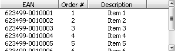
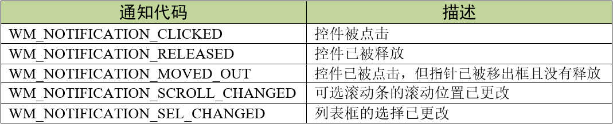
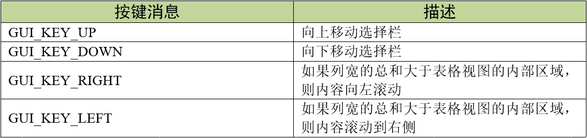
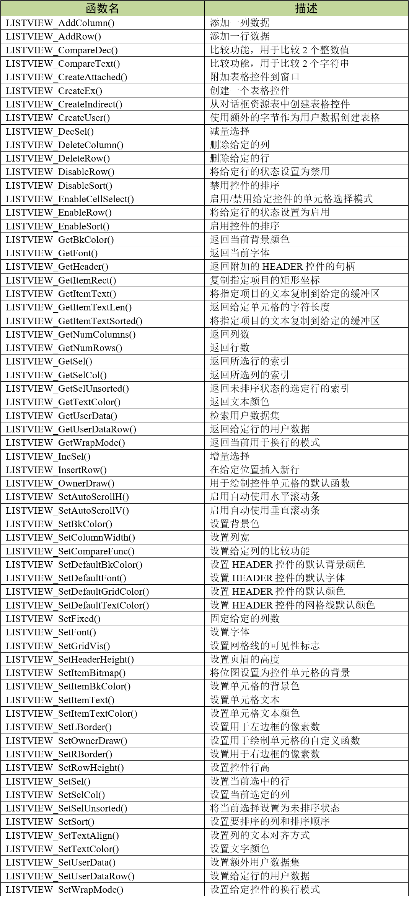
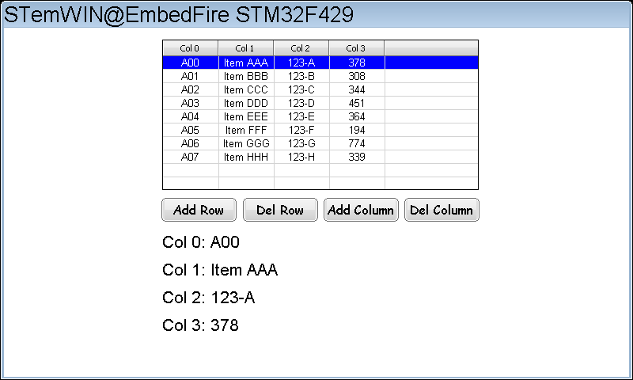
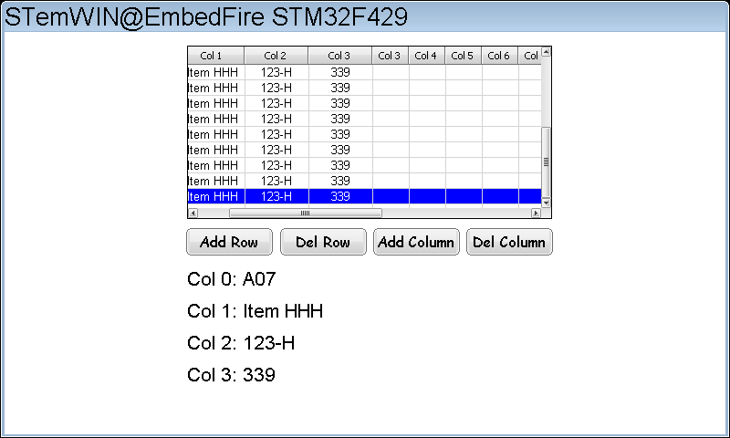

.. vim: syntax=rst

表格控件
============

表格（LISTVIEW）控件类似我们平常接触到的execl表格，主要是用于多种类型数据的选择和管理。
表格控件包含了一个HEADER控件，可以用来管理某一列数据。表格控件可以不需要父窗口单独创建，
也可以作为框架窗口的子控件创建。在表格控件具有输入焦点时，当表格视图内的项目被选中，它们会高亮显示。

表格控件的外观如图 表格控件外观_ 所示。

表格控件支持5种通知代码，以区分各种不同的操作动作，见表格 表格控件支持的通知代码_ 。

这5种通知代码是作为WM_NOTIFY_PARENT消息的一部分发送到其父窗口的。当用户点击表格后，
窗口管理器会让表格控件向父窗口发送WM_NOTIFY_PARENT消息，并且会在消息结构的Data.v成员中附加相应的通知代码，
用户程序可以读取此成员来检测不同的按钮动作以及实现各种功能。

同时表格控件也支持输入焦点，它可以接收如表格 表格控件支持的按键消息_ 所示的4种按键消息。

创建表格控件
~~~~~~~~~~~~~~~~~~

表格控件API
^^^^^^^^^^^^^^^^^^^

表格控件创建函数
^^^^^^^^^^^^^^^^^^^^^^^^

LISTVIEW_CreateEx()
''''''''''''''''''''''''''

在指定位置创建指定大小的表格控件。

.. code-block:: c
    :caption: 代码清单:表格-1 函数原型
    :name: 代码清单:表格-1
    :linenos:

    LISTVIEW_Handle LISTVIEW_CreateEx(int x0, int y0, int xSize, int ySize,
                                    WM_HWIN hParent, int WinFlags, int
                                    ExFlags, int Id);

1) x0：
表格控件在父坐标中的最左侧像素；

2) y0：
表格控件在父坐标中的最顶侧像素；

3) xSize：
表格的水平尺寸，以像素为单位；

4) ySize：
表格的垂直尺寸，以像素为单位；

5) hParent：
父窗口句柄。如果为0，则将桌面窗口作为其父窗口；

6) WinFlags：
窗口创建标志。由于控件本质上是窗口，所以表格控件在创建时可以使用几乎所有的窗口创建标志。
这些标志中按钮最常用的是WM_CF_SHOW。全部创建标志请参考emWin手册的窗口管理器章节；

7) ExFlags：
预留，未使用；

8) Id：
控件ID号。

返回值：创建成功后返回已创建的表格控件句柄，创建失败则返回0。

LISTVIEW_CreateIndirect()
''''''''''''''''''''''''''''''''

从对话框资源表中创建滑块控件。

.. code-block:: c
    :caption: 代码清单:表格-2 函数原型
    :name: 代码清单:表格-2
    :linenos:

    LISTVIEW_Handle LISTVIEW_CreateIndirect(const GUI_WIDGET_CREATE_INFO
                                            *pCreateInfo, WM_HWIN
                                            hWinParent, int x0, int y0,
                                            WM_CALLBACK *cb);

1) pCreateInfo：
指向GUI_WIDGET_CREATE_INFO结构的指针；

2) hParent：
父窗口的句柄；

3) x0：
表格控件在父坐标中的最左边像素；

4) y0：
表格控件在父坐标中的最顶部像素；

5) cb：
回调函数指针。

此函数的第一个参数指向的是 **代码清单:控件基础-3** 的资源表结构，但不使用其中的para参数，
其中的Flags参数的可选值与LISTVIEW_CreateEx()函数的ExFlags参数相同，
但是LISTVIEW_CreateEx()函数的ExFlags参数目前并没有被使用。

表格控件基础实验
~~~~~~~~~~~~~~~~~~~~~~~~

接下来我们来讲解如何以对话框的方式间接创建一个表格控件，通过API函数直接创建的实验可参考官方例程WIDGET_ListView.c，例程路径如下：

**SeggerEval_WIN32_MSVC_MinGW_GUI_V548\\Sample\\Tutorial\\WIDGET_ListView.c**

代码分析
^^^^^^^^^^^^

创建对话框
''''''''''''''

.. code-block:: c
    :caption: 代码清单:表格-3 创建对话框（ListviewDLG.c文件）
    :name: 代码清单:表格-3
    :linenos:

    /* 控件ID */
    #define ID_FRAMEWIN_0 (GUI_ID_USER + 0x00)
    #define ID_LISTVIEW_0 (GUI_ID_USER + 0x01)
    #define ID_BUTTON_0 (GUI_ID_USER + 0x02)
    #define ID_BUTTON_1 (GUI_ID_USER + 0x03)
    #define ID_BUTTON_2 (GUI_ID_USER + 0x04)
    #define ID_BUTTON_3 (GUI_ID_USER + 0x05)
    #define ID_TEXT_0 (GUI_ID_USER + 0x06)
    #define ID_TEXT_1 (GUI_ID_USER + 0x07)
    #define ID_TEXT_2 (GUI_ID_USER + 0x08)
    #define ID_TEXT_3 (GUI_ID_USER + 0x09)

    /* 资源表 */
    static const GUI_WIDGET_CREATE_INFO _aDialogCreate[] = {
        { FRAMEWIN_CreateIndirect, "Framewin", ID_FRAMEWIN_0, 0, 0, 800,
        480, 0, 0x0, 0 },
        { LISTVIEW_CreateIndirect, "Listview", ID_LISTVIEW_0, 200, 15, 400,
        190, 0, 0x0, 0 },
        { BUTTON_CreateIndirect, "Button0", ID_BUTTON_0, 199, 215, 95, 30,
        0, 0x0, 0 },
        { BUTTON_CreateIndirect, "Button1", ID_BUTTON_1, 302, 215, 95, 30,
        0, 0x0, 0 },
        { BUTTON_CreateIndirect, "Button2", ID_BUTTON_2, 404, 215, 95, 30,
        0, 0x0, 0 },
        { BUTTON_CreateIndirect, "Button3", ID_BUTTON_3, 506, 215, 95, 30,
        0, 0x0, 0 },
        { TEXT_CreateIndirect, "Text0", ID_TEXT_0, 200, 255, 400, 32, 0,
        0x64, 0 },
        { TEXT_CreateIndirect, "Text1", ID_TEXT_1, 200, 290, 400, 32, 0,
        0x64, 0 },
        { TEXT_CreateIndirect, "Text2", ID_TEXT_2, 200, 325, 400, 32, 0,
        0x64, 0 },
        { TEXT_CreateIndirect, "Text3", ID_TEXT_3, 200, 360, 400, 32, 0,
        0x64, 0 },
    };

    /**
    * @brief 以对话框方式间接创建控件
    * @note 无
    * @param 无
    * @retval hWin：资源表中第一个控件的句柄
    */
    WM_HWIN CreateFramewin(void)
    {
        WM_HWIN hWin;

        hWin = GUI_CreateDialogBox(_aDialogCreate, GUI_COUNTOF(
            _aDialogCreate), _cbDialog, WM_HBKWIN, 0, 0);
        return hWin;
    }

在代码清单:表格-3中我们定义了10个ID：1个框架窗口ID、1个表格控件ID、4个按钮控件和4个文本控件，
其中按钮控件用于增加和删除表格中的行列数据，文本控件用来显示某一行表格的数据。当然也可以使用emWin预定义好的表格控件ID，
但最多只有GUI_ID_LISTVIEW0到GUI_ID_LISTVIEW3，共4个ID可供使用。

对话框回调函数
'''''''''''''''''''''

1. WM_INIT_DIALOG消息

本实验的对话框回调函数代码较多，我们把回调函数按不同的消息分开来分析。
首先是WM_INIT_DIALOG消息，见 代码清单:表格-4_ 。

.. code-block:: c
    :caption: 代码清单:表格-4 WM_INIT_DIALOG消息（ListviewDLG.c文件）
    :name: 代码清单:表格-4
    :linenos:

    /* 代填入表格控件的数据 */
    static const char * _Table[][4] = {
        { "A00", "Item AAA", "123-A", "378" },
        { "A01", "Item BBB", "123-B", "308" },
        { "A02", "Item CCC", "123-C", "344" },
        { "A03", "Item DDD", "123-D", "451" },
        { "A04", "Item EEE", "123-E", "364" },
        { "A05", "Item FFF", "123-F", "194" },
        { "A06", "Item GGG", "123-G", "774" },
        { "A07", "Item HHH", "123-H", "339" }
    };
    /* WM_INIT_DIALOG消息 */
    case WM_INIT_DIALOG:
    {
        /* 初始化Framewin控件 */
        hItem = pMsg->hWin;
        FRAMEWIN_SetTitleHeight(hItem, 32);
        FRAMEWIN_SetText(hItem, "STemWIN@EmbedFire STM32F429");
        FRAMEWIN_SetFont(hItem, GUI_FONT_32_ASCII);
        /* 初始化Listview控件 */
        hItem = WM_GetDialogItem(pMsg->hWin, ID_LISTVIEW_0);
        LISTVIEW_SetHeaderHeight(hItem, 20);
        LISTVIEW_AddColumn(hItem, 70, "Col 0", GUI_TA_HCENTER |
                        GUI_TA_VCENTER);
        LISTVIEW_AddColumn(hItem, 70, "Col 1", GUI_TA_HCENTER |
                        GUI_TA_VCENTER);
        LISTVIEW_AddColumn(hItem, 70, "Col 2", GUI_TA_HCENTER |
                        GUI_TA_VCENTER);
        LISTVIEW_AddColumn(hItem, 70, "Col 3", GUI_TA_HCENTER |
                        GUI_TA_VCENTER);
        for (i = 0; i < GUI_COUNTOF(_Table); i++) {
            LISTVIEW_AddRow(hItem, _Table[i]);/* 添加数据 */
        }
        LISTVIEW_SetGridVis(hItem, 1);
        LISTVIEW_SetFont(hItem, GUI_FONT_16_ASCII);
        LISTVIEW_SetAutoScrollH(hItem, 1);
        LISTVIEW_SetAutoScrollV(hItem, 1);

        /* 初始化Button0 */
        hItem = WM_GetDialogItem(pMsg->hWin, ID_BUTTON_0);
        BUTTON_SetText(hItem, "Add Row");
        BUTTON_SetFont(hItem, GUI_FONT_COMIC18B_ASCII);
        /* 初始化Button1 */
        hItem = WM_GetDialogItem(pMsg->hWin, ID_BUTTON_1);
        BUTTON_SetText(hItem, "Del Row");
        BUTTON_SetFont(hItem, GUI_FONT_COMIC18B_ASCII);
        /* 初始化Button2 */
        hItem = WM_GetDialogItem(pMsg->hWin, ID_BUTTON_2);
        BUTTON_SetText(hItem, "Add Column");
        BUTTON_SetFont(hItem, GUI_FONT_COMIC18B_ASCII);
        /* 初始化Button3 */
        hItem = WM_GetDialogItem(pMsg->hWin, ID_BUTTON_3);
        BUTTON_SetText(hItem, "Del Column");
        BUTTON_SetFont(hItem, GUI_FONT_COMIC18B_ASCII);
        /* 初始化Text0 */
        hItem = WM_GetDialogItem(pMsg->hWin, ID_TEXT_0);
        TEXT_SetTextAlign(hItem, GUI_TA_LEFT | GUI_TA_VCENTER);
        TEXT_SetText(hItem, "Col 0: ");
        TEXT_SetFont(hItem, GUI_FONT_24_ASCII);
        /* 初始化Text1 */
        hItem = WM_GetDialogItem(pMsg->hWin, ID_TEXT_1);
        TEXT_SetTextAlign(hItem, GUI_TA_LEFT | GUI_TA_VCENTER);
        TEXT_SetText(hItem, "Col 1: ");
        TEXT_SetFont(hItem, GUI_FONT_24_ASCII);
        /* 初始化Text2 */
        hItem = WM_GetDialogItem(pMsg->hWin, ID_TEXT_2);
        TEXT_SetTextAlign(hItem, GUI_TA_LEFT | GUI_TA_VCENTER);
        TEXT_SetText(hItem, "Col 2: ");
        TEXT_SetFont(hItem, GUI_FONT_24_ASCII);
        /* 初始化Text3 */
        hItem = WM_GetDialogItem(pMsg->hWin, ID_TEXT_3);
        TEXT_SetTextAlign(hItem, GUI_TA_LEFT | GUI_TA_VCENTER);
        TEXT_SetText(hItem, "Col 3: ");
        TEXT_SetFont(hItem, GUI_FONT_24_ASCII);
        break;
    }

在 代码清单:表格-4_ 中，首先需要定义一个二维数组，用来存放准备添加到表格控件中的字符串文本。设置框架窗口的标题栏高度为32像素，
字体高度32像素，并在标题栏中显示 **STemWIN@EmbedFire STM32F429**。

表格控件相关API函数几乎都是使用句柄来操作的，但在建立对话框资源表的时候并没有定义它的句柄，
那就需要通过WM_GetDialogItem函数来自动建立并获取表格控件的句柄。成功获取到句柄后可以开始进一步设置表格控件。

我们重点关注 代码清单:表格-4_ 中表格控件的设置，其他控件的初始化设置在之前的章节已经介绍过就不再赘述了。

首先使用LISTVIEW_SetHeaderHeight函数设置表格控件的首行高度为20像素。然后使用LISTVIEW_AddColumn函数添加4列，
列宽度为70像素，列中的文本对齐方式是水平和垂直居中对齐。用一个for循环调用LISTVIEW_AddRow函数将二维数组中的文本信息添加到表格控件中，
其实表格控件中的文本不仅限于使用数组添加，还可以使用其他方式添加。接下来LISTVIEW_SetGridVis函数开启网格线，设置表格中的文本字体为16，
并且启用水平和垂直两个方向的自动滚动条。

2. WM_NOTIFY_PARENT消息

.. code-block:: c
    :caption: 代码清单:表格-5 WM_NOTIFY_PARENT消息（ListviewDLG.c文件）
    :name: 代码清单:表格-5
    :linenos:

    /* 表格数据缓冲区 */
    typedef struct {
        char Col0[10];
        char Col1[10];
        char Col2[10];
        char Col3[10];
    } _ListviewItem;
    _ListviewItem ListviewItem;

    int Listview_RowNum;

    /*WM_NOTIFY_PARENT消息 */
    case WM_NOTIFY_PARENT:
    {
        Id = WM_GetId(pMsg->hWinSrc);
        NCode = pMsg->Data.v;
        switch (Id) {
        case ID_LISTVIEW_0: // Notifications sent by 'Listview'
            switch (NCode) {
            case WM_NOTIFICATION_CLICKED:
                hItem = WM_GetDialogItem(pMsg->hWin, ID_LISTVIEW_0);
                Listview_RowNum = LISTVIEW_GetSel(hItem);
                LISTVIEW_GetItemText(hItem, 0, Listview_RowNum,
                                    ListviewItem.Col0, 10);
                LISTVIEW_GetItemText(hItem, 1, Listview_RowNum,
                                    ListviewItem.Col1, 10);
                LISTVIEW_GetItemText(hItem, 2, Listview_RowNum,
                                    ListviewItem.Col2, 10);
                LISTVIEW_GetItemText(hItem, 3, Listview_RowNum,
                                    ListviewItem.Col3, 10);
                break;
            case WM_NOTIFICATION_RELEASED:
                hItem = WM_GetDialogItem(pMsg->hWin, ID_TEXT_0);
                sprintf(buf, "Col 0: %s", ListviewItem.Col0);
                TEXT_SetText(hItem, buf);
                hItem = WM_GetDialogItem(pMsg->hWin, ID_TEXT_1);
                sprintf(buf, "Col 1: %s", ListviewItem.Col1);
                TEXT_SetText(hItem, buf);
                hItem = WM_GetDialogItem(pMsg->hWin, ID_TEXT_2);
                sprintf(buf, "Col 2: %s", ListviewItem.Col2);
                TEXT_SetText(hItem, buf);
                hItem = WM_GetDialogItem(pMsg->hWin, ID_TEXT_3);
                sprintf(buf, "Col 3: %s", ListviewItem.Col3);
                TEXT_SetText(hItem, buf);
                break;
            case WM_NOTIFICATION_SEL_CHANGED:
                break;
            }
            break;
        case ID_BUTTON_0: // Notifications sent by 'Add Row'
            switch (NCode) {
            case WM_NOTIFICATION_CLICKED:
                break;
            case WM_NOTIFICATION_RELEASED:
                hItem = WM_GetDialogItem(pMsg->hWin, ID_LISTVIEW_0);
                LISTVIEW_AddRow(hItem, _Table[7]);
                break;
            }
            break;
        case ID_BUTTON_1: // Notifications sent by 'Del Row'
            switch (NCode) {
            case WM_NOTIFICATION_CLICKED:
                break;
            case WM_NOTIFICATION_RELEASED:
                hItem = WM_GetDialogItem(pMsg->hWin, ID_LISTVIEW_0);
                listview_RowIndex = LISTVIEW_GetNumRows(hItem);
                if (listview_RowIndex == 1) {
                    break;
                }
                listview_RowIndex = listview_RowIndex - 1;
                LISTVIEW_DeleteRow(hItem, listview_RowIndex);
                break;
            }
            break;
        case ID_BUTTON_2: // Notifications sent by 'Add column'
            switch (NCode) {
            case WM_NOTIFICATION_CLICKED:
                break;
            case WM_NOTIFICATION_RELEASED:
                hItem = WM_GetDialogItem(pMsg->hWin, ID_LISTVIEW_0);
                listview_ColumnIndex = LISTVIEW_GetNumColumns(hItem);
                sprintf(buf, "Col %d", listview_ColumnIndex);
                LISTVIEW_AddColumn(hItem, 40, buf, GUI_TA_HCENTER |
                                GUI_TA_VCENTER);
                break;
            }
            break;
        case ID_BUTTON_3: // Notifications sent by 'Del column'
            switch (NCode) {
            case WM_NOTIFICATION_CLICKED:
                break;
            case WM_NOTIFICATION_RELEASED:
                hItem = WM_GetDialogItem(pMsg->hWin, ID_LISTVIEW_0);
                listview_ColumnIndex = LISTVIEW_GetNumColumns(hItem);
                if (listview_ColumnIndex == 1) {
                    break;
                }
                listview_ColumnIndex = listview_ColumnIndex - 1;
                LISTVIEW_DeleteColumn(hItem, listview_ColumnIndex);
                break;
            }
            break;
        }
        break;
    }

代码清单:表格-5_ 首先定义了1个结构体ListviewItem，用来存放从表格控件中读取的某一行的文本信息。

上述代码中的表格控件ID_LISTVIEW_0用到了2种通知代码，首先来看通知代码WM_NOTIFICATION_CLICKED，
当表格控件被点击时，使用LISTVIEW_GetSel函数获取当前被点击的行的索引值，然后LISTVIEW_GetItemText函数根据索引值去除对应行的文本信息，
存放在ListviewItem中。接下来是通知代码WM_NOTIFICATION_RELEASED，在这个通知代码中把刚刚获取到的文本信息通过TEXT_SetText函数送到屏幕上。

-   ID_BUTTON_0负责向表格控件中添加行数据，在被点击并释放后执行LISTVIEW_AddRow函数添加数据。

-   ID_BUTTON_1负责删除表格控件中的某一行，在被点击并释放后使用LISTVIEW_GetNumRows函数获取总行数，
    然后LISTVIEW_DeleteRow函数删除最后一行。

-   ID_BUTTON_2向表格控件新增列，被点击并释放后执行LISTVIEW_GetNumColumns获取当前列数，
    然后使用LISTVIEW_AddColumn函数添加新列。

-   ID_BUTTON_2负责删除表格控件中的某一列，在被点击并释放后使用LISTVIEW_GetNumColumns函数获取当前的总列数，
    然后LISTVIEW_DeleteColumn函数删除最后一列。

3. 其他消息

.. code-block:: c
    :caption: 代码清单:表格-6 default消息（ListviewDLG.c文件）
    :name: 代码清单:表格-6
    :linenos:

    default:
    WM_DefaultProc(pMsg);
    break;

如 代码清单:表格-6_ 所示，所有我们不关心或者没有用到的系统消息都可以调用默认消息处理函数WM_DefaultProc进行处理。

实验现象
^^^^^^^^^^^^

表格控件基础实验的实验现象如图 表格控件基础实验初始状态_ 和图 添加若干行和列之后的状态_ 所示，
点击表格控件中的某一行会在下发显示当前行的文本信息，点击“Add Row”按钮可以向表格中增加新的一行数据，
“Del Row”按钮可以删除表格的最后一行，“Add Column”按钮可以增加新的一列，“DelColumn”按钮可以删除表格的最后一列。

