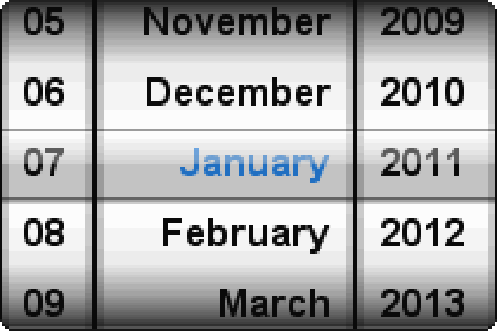

.. vim: syntax=rst

列表轮控件
=============

列表轮（Listwheel）控件在造型和使用上非常类似于安卓的那种选择日期和时间的控件，控件的整个数据区域可通过指针输入设备（PID）进行移动，
在数据区域移动的时候释放PID设备，数据区域会减慢运动速度，并通过在吸附位置捕捉一个新项目来停止。此外，列表轮控件的数据可以循环显示，
在最后一个数据项之后，会像一个轮子一样继续显示第一个数据项。

列表轮控件可以使用用户绘制机制加上Alpha混合做出很复杂美观的效果，如图 列表轮控件美化后的外观_ 所示，emwin默认的控件外观是很扁平很普通的。

列表轮控件支持4种通知代码，以区分各种不同的操作动作，见表格 列表轮支持的通知代码_ 。

这4种通知代码是作为WM_NOTIFY_PARENT消息的一部分发送到其父窗口的。当用户点击列表轮后，
窗口管理器会让表格控件向父窗口发送WM_NOTIFY_PARENT消息，并且会在消息结构的Data.v成员中附加相应的通知代码，
用户程序可以读取此成员来检测不同的控件动作以及实现各种功能。列表轮控件不支持任何的按键消息。

创建列表轮控件
~~~~~~~~~~~~~~~~~~~

列表轮控件API
^^^^^^^^^^^^^^

列表轮控件创建函数
^^^^^^^^^^^^^^^^^^

LISTWHEEL_CreateEx()
''''''''''''''''''''''''''''

在指定位置创建指定大小的列表轮控件。

.. code-block:: c
    :caption: 代码清单:列表轮-1 函数原型
    :name: 代码清单:列表轮-1
    :linenos:

    LISTWHEEL_Handle LISTWHEEL_CreateEx(int x0, int y0, int xSize, int
                                        ySize, WM_HWIN hParent, int
                                        WinFlags, int ExFlags, int Id,
                                        const GUI_ConstString *ppText);

1) x0：
列表轮控件在父坐标中的最左侧像素；

2) y0：
列表轮控件在父坐标中的最顶侧像素；

3) xSize：
列表轮的水平尺寸，以像素为单位；

4) ySize：
列表轮的垂直尺寸，以像素为单位；

5) hParent：
父窗口句柄。如果为0，则将桌面窗口作为其父窗口；

6) WinFlags：
窗口创建标志。由于控件本质上是窗口，所以列表轮控件在创建时可以使用几乎所有的窗口创建标志。
这些标志中按钮最常用的是WM_CF_SHOW。全部创建标志请参考emWin手册的窗口管理器章节；

7) ExFlags：
预留，未使用；

8) Id：
控件ID号；

9) ppText：
指向包含要显示的元素的字符串指针数组的指针。

返回值：创建成功后返回已创建的表格控件句柄，创建失败则返回0。如果使用参数ppText，则数组的最后一个元素需要为NULL。

LISTWHEEL_CreateIndirect()
''''''''''''''''''''''''''''''''''

从对话框资源表中创建滑块控件。

.. code-block:: c
    :caption: 代码清单:列表轮-2 函数原型
    :name: 代码清单:列表轮-2
    :linenos:

    LISTWHEEL_Handle LISTWHEEL_CreateIndirect(const GUI_WIDGET_CREATE_INFO
                                            *pCreateInfo, WM_HWIN
                                            hWinParent, int x0, int y0,
                                            WM_CALLBACK *cb);

1) pCreateInfo：
指向GUI_WIDGET_CREATE_INFO结构的指针；

2) hParent：
父窗口的句柄；

3) x0：
列表轮控件在父坐标中的最左边像素；

4) y0：
列表轮控件在父坐标中的最顶部像素；

5) cb：
回调函数指针。

此函数的第一个参数指向的是 **代码清单:控件基础-3** 的资源表结构，但不使用其中的para参数，
其中的Flags参数的可选值与LISTWHEEL_CreateEx()函数的WinFlags参数相同。

列表轮基础实验
~~~~~~~~~~~~~~~~~~~

接下来我们来讲解如何以对话框的方式间接创建一个列表轮控件，通过API函数直接创建的实验可参考官方例程MEMDEV_ListWheelEffects，例程路径如下：

**SeggerEval_WIN32_MSVC_MinGW_GUI_V548\\Sample\\Tutorial\\MEMDEV_ListWheelEffects**

代码分析
^^^^^^^^^

创建对话框
''''''''''''''''

.. code-block:: c
    :caption: 代码清单:列表轮-3 创建对话框（ListwheelDLG.c文件）
    :name: 代码清单:列表轮-3
    :linenos:

    /* 控件ID */
    #define ID_FRAMEWIN_0  (GUI_ID_USER + 0x00)
    #define ID_LISTWHEEL_0 (GUI_ID_USER + 0x01)
    #define ID_LISTWHEEL_1 (GUI_ID_USER + 0x02)
    #define ID_LISTWHEEL_2 (GUI_ID_USER + 0x03)

    /* 资源表 */
    static const GUI_WIDGET_CREATE_INFO _aDialogCreate[] = {
        { FRAMEWIN_CreateIndirect, "Framewin", ID_FRAMEWIN_0, 0, 0, 800,
        480, 0, 0x0, 0 },
        { LISTWHEEL_CreateIndirect, "", ID_LISTWHEEL_0, 210, 50, 120, 178,
        WM_CF_MEMDEV, 0x0, 0 },
        { LISTWHEEL_CreateIndirect, "", ID_LISTWHEEL_1, 330, 50, 140, 178,
        WM_CF_MEMDEV, 0x0, 0 },
        { LISTWHEEL_CreateIndirect, "", ID_LISTWHEEL_2, 470, 50, 120, 178,
        WM_CF_MEMDEV, 0x0, 0 },
    };

    /**
    * @brief 以对话框方式间接创建控件
    * @note 无
    * @param 无
    * @retval hWin：资源表中第一个控件的句柄
    */
    WM_HWIN CreateFramewin(void)
    {
        WM_HWIN hWin;

        hWin = GUI_CreateDialogBox(_aDialogCreate, GUI_COUNTOF(
            _aDialogCreate), _cbDialog, WM_HBKWIN, 0, 0);
        return hWin;
    }

在 代码清单:列表轮-3_ 中我们定义了4个ID：1个框架窗口ID和3个列表轮控件ID。
当然也可以使用emWin预定义好的列表轮控件ID，但最多只有GUI_ID_LISTWHEEL0到GUI_ID_LISTWHEEL3，共4个ID可供使用。

对话框回调函数
''''''''''''''''

1. WM_INIT_DIALOG消息

本实验的对话框回调函数代码较多，我们把回调函数按不同的消息分开来分析。首先是WM_INIT_DIALOG消息，见 代码清单:列表轮-4_ 。

.. code-block:: c
    :caption: 代码清单:列表轮-4 WM_INIT_DIALOG消息（ListwheelDLG.c文件）
    :name: 代码清单:列表轮-4
    :linenos:

    /* 控件ID */
    #define ID_FRAMEWIN_0  (GUI_ID_USER + 0x00)
    #define ID_LISTWHEEL_0 (GUI_ID_USER + 0x01)
    #define ID_LISTWHEEL_1 (GUI_ID_USER + 0x02)
    #define ID_LISTWHEEL_2 (GUI_ID_USER + 0x03)

    /* 资源表 */
    static const GUI_WIDGET_CREATE_INFO _aDialogCreate[] = {
        { FRAMEWIN_CreateIndirect, "Framewin", ID_FRAMEWIN_0, 0, 0, 800,
        480, 0, 0x0, 0 },
        { LISTWHEEL_CreateIndirect, "", ID_LISTWHEEL_0, 210, 50, 120, 178,
        WM_CF_MEMDEV, 0x0, 0 },
        { LISTWHEEL_CreateIndirect, "", ID_LISTWHEEL_1, 330, 50, 140, 178,
        WM_CF_MEMDEV, 0x0, 0 },
        { LISTWHEEL_CreateIndirect, "", ID_LISTWHEEL_2, 470, 50, 120, 178,
        WM_CF_MEMDEV, 0x0, 0 },
    };

    /**
    * @brief 以对话框方式间接创建控件
    * @note 无
    * @param 无
    * @retval hWin：资源表中第一个控件的句柄
    */
    WM_HWIN CreateFramewin(void)
    {
        WM_HWIN hWin;

        hWin = GUI_CreateDialogBox(_aDialogCreate, GUI_COUNTOF(
            _aDialogCreate), _cbDialog, WM_HBKWIN, 0, 0);
        return hWin;
    }

如 代码清单:列表轮-4_ 所示，首先定义了3个字符串数组用来存放三个列表轮的选项文本，
分别是年份_apYear、月份_apMonth、日期_apDay。设置框架窗口的标题栏高度为32像素，
字体高度32像素，并在标题栏中显示 **STemWIN@EmbedFire STM32F429**。

本实验中我们把3个列表轮控件的属性设置成完全一样的，那就需要使用for循环依次初始化3个列表轮控件，
其中LISTWHEEL_SetLineHeight函数设置的高度是包含字体高度的，LISTWHEEL_SetSnapPosition函数将列表轮停止时的选项吸附位置设置在中间，
使用LISTWHEEL_SetOwnerDraw函数设置一个用户绘制函数，用来美化控件。列表轮控件的基本属性设置好后，
使用LISTWHEEL_AddString函数向各个控件添加文本选项。

2. WM_NOTIFY_PARENT消息

.. code-block:: c
    :caption: 代码清单:列表轮-5 WM_NOTIFY_PARENT消息（ListwheelDLG.c文件）
    :name: 代码清单:列表轮-5
    :linenos:

    case WM_NOTIFY_PARENT:
    {
        /* 获取控件ID */
        Id = WM_GetId(pMsg->hWinSrc);
        /* 获取通知代码 */
        NCode = pMsg->Data.v;
        switch (Id) {
        case ID_LISTWHEEL_0: // Notifications sent by 'Listwheel'
            switch (NCode) {
            case WM_NOTIFICATION_CLICKED:
                hItem = WM_GetDialogItem(pMsg->hWin, ID_LISTWHEEL_0);
                LISTWHEEL_SetTextColor(hItem, LISTWHEEL_CI_SEL, 0x191919);
                break;
            case WM_NOTIFICATION_RELEASED:
                break;
            case WM_NOTIFICATION_SEL_CHANGED:
                hItem = WM_GetDialogItem(pMsg->hWin, ID_LISTWHEEL_0);
                LISTWHEEL_SetTextColor(hItem, LISTWHEEL_CI_SEL, 0x007dfe);
                /* 获取停留的位置 */
                U8 index = LISTWHEEL_GetPos(hItem);
                /* 选择停留位置的文本 */
                LISTWHEEL_SetSel(hItem, index);
                break;
            }
            break;
        case ID_LISTWHEEL_1: // Notifications sent by 'Listwheel'
            switch (NCode) {
            case WM_NOTIFICATION_CLICKED:
                hItem = WM_GetDialogItem(pMsg->hWin, ID_LISTWHEEL_1);
                LISTWHEEL_SetTextColor(hItem, LISTWHEEL_CI_SEL, 0x191919);
                break;
            case WM_NOTIFICATION_RELEASED:
                break;
            case WM_NOTIFICATION_SEL_CHANGED:
                hItem = WM_GetDialogItem(pMsg->hWin, ID_LISTWHEEL_1);
                LISTWHEEL_SetTextColor(hItem, LISTWHEEL_CI_SEL, 0x007dfe);
                /* 获取停留的位置 */
                U8 index = LISTWHEEL_GetPos(hItem);
                /* 选择停留位置的文本 */
                LISTWHEEL_SetSel(hItem, index);
                break;
            }
            break;
        case ID_LISTWHEEL_2: // Notifications sent by 'Listwheel'
            switch (NCode) {
            case WM_NOTIFICATION_CLICKED:
                hItem = WM_GetDialogItem(pMsg->hWin, ID_LISTWHEEL_2);
                LISTWHEEL_SetTextColor(hItem, LISTWHEEL_CI_SEL, 0x191919);
                break;
            case WM_NOTIFICATION_RELEASED:
                break;
            case WM_NOTIFICATION_SEL_CHANGED:
                hItem = WM_GetDialogItem(pMsg->hWin, ID_LISTWHEEL_2);
                LISTWHEEL_SetTextColor(hItem, LISTWHEEL_CI_SEL, 0x007dfe);
                /* 获取停留位置的文本索引 */
                U8 index = LISTWHEEL_GetPos(hItem);
                /* 选择停留位置的文本 */
                LISTWHEEL_SetSel(hItem, index);
                break;
            }
            break;
        }
        break;
    }

这个消息是对话框回调函数的重点，所有对话框子控件的具体行为逻辑都在此消息中设置和处理。在此消息中以控件ID来区分各个不同的控件。

代码清单:列表轮-5_ 中我们用到了两种通知代码，首先是WM_NOTIFICATION_CLICKED，
在这个通知代码中设置控件选项被选中时的颜色与未被选中时相同，这样在移动控件滚轮的时候不会出现突出显示选项。
然后是WM_NOTIFICATION_SEL_CHANGED，滚轮停下来之后选择中间选项的关键就
在此实现，使用LISTWHEEL_GetPos函数获取滚轮此时吸附的选项的索引，然后根据索引使用LISTWHEEL_SetSel函数选择当前吸附的文本，
就可以实现列表轮停止后选择中间选项的效果。

如果想要使用列表轮实现其他功能，例如用它给RTC设置日期和时间，
那么可以在 代码清单:列表轮-5_ 的基础上使用LISTWHEEL_GetItemText函数将此时列表轮吸附位置的文本获取下来即可。

3. 其他消息

.. code-block:: c
    :caption: 代码清单:列表轮-6 default消息（ListviewDLG.c文件）
    :name: 代码清单:列表轮-6
    :linenos:

    default:
    WM_DefaultProc(pMsg);
    break;

如 代码清单:列表轮-6_ 所示，所有我们不关心或者没有用到的系统消息都可以调用默认消息处理函数WM_DefaultProc进行处理。

用户绘制函数
''''''''''''''''

.. code-block:: c
    :caption: 代码清单:列表轮-7 用户绘制函数（ListwheelDLG.c文件）
    :name: 代码清单:列表轮-7
    :linenos:

    /**
    * @brief 用户绘制函数
    * @note 无
    * @param pDrawItemInfo：指向WIDGET_ITEM_DRAW_INFO结构的指针
    * @retval 默认绘制函数 或 0
    */
    static int _OwnerDraw(const WIDGET_ITEM_DRAW_INFO *pDrawItemInfo)
    {
        GUI_RECT aRect;

        switch (pDrawItemInfo->Cmd) {
        case WIDGET_ITEM_DRAW_OVERLAY:
            /* 获取控件坐标 */
            aRect.x0 = pDrawItemInfo->x0;
            aRect.x1 = pDrawItemInfo->x1;
            aRect.y1 = pDrawItemInfo->y1;
            /* 画分割线 */
            GUI_SetColor(GUI_GRAY_E7);
            GUI_DrawLine(aRect.x0, (aRect.y1 - 19 - 16) / 2, aRect.x1, (
                        aRect.y1 - 19 - 16) / 2);
            GUI_DrawLine(aRect.x0, (aRect.y1 + 19 + 16) / 2, aRect.x1, (
                        aRect.y1 + 19 + 16) / 2);
            break;
        default:
            return LISTWHEEL_OwnerDraw(pDrawItemInfo);
        }
        return 0;
    }

列表轮控件可以使用用户绘制函数来绘制或者一些外观，如 代码清单:列表轮-7_ 所示，
在用户绘制函数_OwnerDraw的WIDGET_ITEM_DRAW_OVERLAY消息中，获取列表轮控件自身的左上角起始坐标和右下角终点坐标，
利用这些坐标值就可以调用GUI_DrawLine函数在控件上画分割线了。

在 代码清单:列表轮-7_ 中，控件的坐标值是从WIDGET_ITEM_DRAW_INFO结构体内获取的，
此结构体的原型如 代码清单:列表轮-8_ 所示。

.. code-block:: c
    :caption: 代码清单:列表轮-8 WIDGET_ITEM_DRAW_INFO原型
    :name: 代码清单:列表轮-8
    :linenos:

    typedef struct {
        WM_HWIN hWin;
        int Cmd;
        int ItemIndex;
        int Col;
        int x0, y0, x1, y1;
        void *p;
    } WIDGET_ITEM_DRAW_INFO;

1) hWin：
控件句柄；

2) Cmd：
控件绘制消息，具体可选值见表格 Cmd参数可选值_ ；

3) ItemIndex：
需要绘制的项目的索引，从0开始；

4) Col：
需要绘制的项目的列索引，从0开始；

5) x0：
控件的左上角横坐标；

6) y0：
控件的左上角纵坐标；

7) x1：
控件的右下角横坐标；

8) y1：
控件的右下角纵坐标。

WIDGET_ITEM_DRAW_INFO结构体中四个坐标参数是相对于控件本身的，例如一个控件长100像素、宽50像素，
那么这四个坐标参数分别是：x0和y0都为0，x1为100-1，y1为50-1。

实验现象
^^^^^^^^^^^

列表轮基础实验的实验现象如图 列表轮基础实验现象_ 所示，分别上下滑动年月日3个控件可以选择不同的选项，每个控件的选项都是循环显示的。

