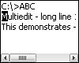
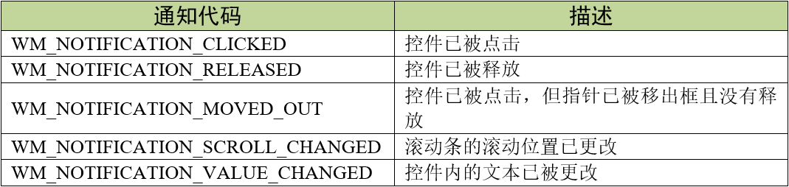
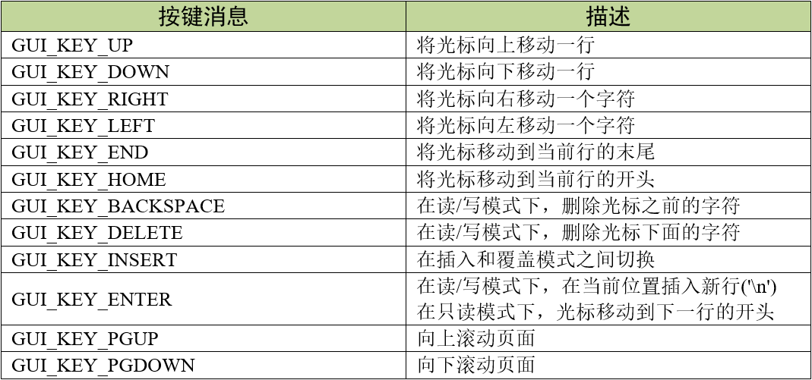
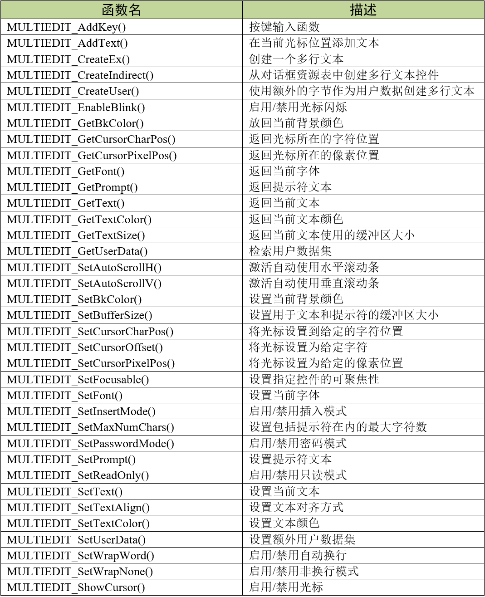
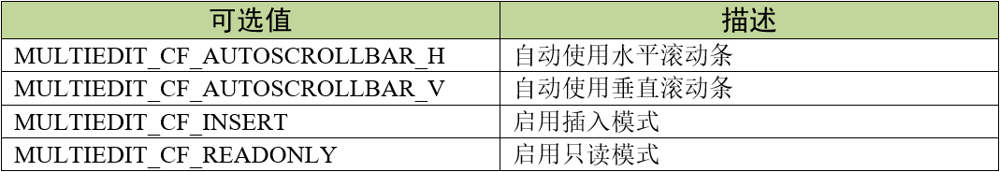
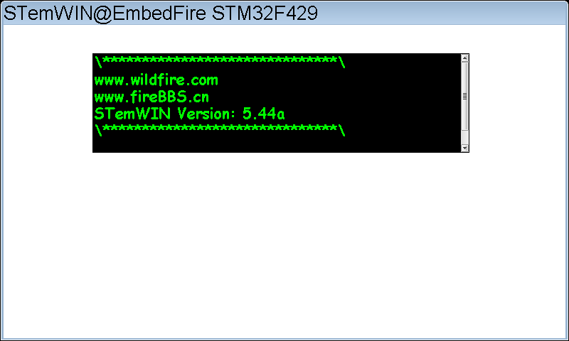

.. vim: syntax=rst

多行文本控件
==============

多行文本（MULTIEDIT）控件，顾名思义，它是一种能够编辑和显示若干行文本的控件。
前面讲的文本控件和编辑框控件都只能够显示或编辑一行的文本信息，想要显示好几行的话就要使用多个控件，
这样就不太方便了。多行文本控件的特点很适合用来做一些简单的阅读器或是用来显示多种信息。
实际上它就是一个简单的文本编辑器，同时也可以显示静态文本。

多行文本控件支持使用滚动条或不使用滚动条进行内容滚动。
控件在编辑模式并打开自动水平滚动条时的外观如图 多行文本控件外观_ 所示，它在不同模式下的外观是不同的。

多行文本控件支持5种通知代码，以区分各种不同的操作动作，见表格 多行文本控件支持的通知代码_ 。

这5种通知代码是作为WM_NOTIFY_PARENT消息的一部分发送到其父窗口的。当用户点击按钮后，
窗口管理器会让多行文本向父窗口发送WM_NOTIFY_PARENT消息，并且会在消息结构的Data.v成员中附加相应的通知代码，
用户程序可以读取此成员来检测不同的按钮动作以及实现各种功能。

同时多行文本控件也支持输入焦点，它可以接收如表格 多行文本控件支持的按键消息_ 表格 **24‑下拉框支持的按键消息** 所示的按键消息。

创建多行文本控件
~~~~~~~~~~~~~~~~~~~~~~~~

多行文本控件API
-----------------------

多行文本控件创建函数
------------------------------

MULTIEDIT_CreateEx()
^^^^^^^^^^^^^^^^^^^^^^^^^^^^^^

在指定位置创建具有指定大小的多行文本控件。

.. code-block:: c
    :caption: 代码清单:对话框-1 函数原型
    :name: 代码清单:对话框-1
    :linenos:

    MULTIEDIT_HANDLE MULTIEDIT_CreateEx(int x0, int y0, int xSize, int
                                        ySize, WM_HWIN hParent, int
                                        WinFlags, int ExFlags, int Id, int
                                        BufferSize, const char *pText);

1)  x0：
多行文本控件在父坐标中的最左侧像素；

2)  y0：
多行文本控件在父坐标中的最顶侧像素；

3)  xSize：
多行文本的水平尺寸，以像素为单位；

4)  ySize：
多行文本的垂直尺寸，以像素为单位；

5)  hParent：
父窗口句柄。如果为0，则将桌面窗口作为其父窗口；

6)  WinFlags：
窗口创建标志。由于控件本质上是窗口，所以多行文本控件在创建时可以使用几乎所有的窗口创建标志。
这些标志中按钮最常用的是WM_CF_SHOW。全部创建标志请参考emWin手册的窗口管理器章节；

7)  ExFlags：
多行文本模式选择，参数可选值见表格 ExFlags参数可选值_ ；

8)  Id：
控件ID号；

9)  BufferSize：
初始的文本缓冲区大小；

10) pText：
需要显示的文本字符串。

返回值：创建成功后返回已创建的多行文本控件句柄，创建失败则返回0。

MULTIEDIT_CreateIndirect()
^^^^^^^^^^^^^^^^^^^^^^^^^^^^^^^^^^^^^^^

从对话框资源表中创建多行文本控件。

.. code-block:: c
    :caption: 代码清单:对话框-2 函数原型
    :name: 代码清单:对话框-2
    :linenos:

    MULTIEDIT_HANDLE MULTIEDIT_CreateIndirect(const
                                            GUI_WIDGET_CREATE_INFO*
                                            pCreateInfo, WM_HWIN
                                            hWinParent, int x0, int y0,
                                            WM_CALLBACK * cb);

1) pCreateInfo：
指向GUI_WIDGET_CREATE_INFO结构的指针；

2) hParent：
父窗口的句柄；

3) x0：
多行文本控件在父坐标中的最左边像素；

4) y0：
多行文本控件在父坐标中的最顶部像素；

5) cb：
回调函数指针。

此函数的第一个参数指向的是 **代码清单:控件基础-3** 的资源表结构，
其中可选参数para与缓冲区大小参数BufferSize等效，参数Flags与多行文本模式选择参数ExFlags相同。

多行文本控件基础实验
~~~~~~~~~~~~~~~~~~~~~~~~~~~~~~

接下来我们来讲解如何以对话框的方式间接创建一个多行文本控件，
通过API函数直接创建的实验可参考官方例程WIDGET_Multiedit.c，例程路径如下：

**SeggerEval_WIN32_MSVC_MinGW_GUI_V548\\Sample\\Tutorial\\WIDGET_Multiedit.c**

代码分析
------------

创建对话框
^^^^^^^^^^^^

.. code-block:: c
    :caption: 代码清单:对话框-3 创建对话框（MultieditDLG.c文件）
    :name: 代码清单:对话框-3
    :linenos:

    /* 控件ID */
    #define ID_FRAMEWIN_0   (GUI_ID_USER + 0x00)
    #define ID_MULTIEDIT_0   (GUI_ID_USER + 0x01)

    /* 资源表 */
    static const GUI_WIDGET_CREATE_INFO _aDialogCreate[] = {
        { FRAMEWIN_CreateIndirect, "Framewin", ID_FRAMEWIN_0, 0, 0, 800,
            480, 0, 0x0, 0 },
        { MULTIEDIT_CreateIndirect, "Multiedit0", ID_MULTIEDIT_0, 125, 40,
            530, 140, 0, 0x0, 0 },
    };

    /**
    * @brief 以对话框方式间接创建控件
    * @note 无
    * @param 无
    * @retval hWin：资源表中第一个控件的句柄
    */
    WM_HWIN CreateFramewin(void)
    {
        WM_HWIN hWin;

        hWin = GUI_CreateDialogBox(_aDialogCreate, GUI_COUNTOF(
                _aDialogCreate), _cbDialog, WM_HBKWIN, 0, 0);
        return hWin;
    }

在 代码清单:对话框-3_ 中我们定义了2个ID：一个框架窗口ID和一个多行文本控件ID。
当然也可以使用emWin预定义好的多行文本控件ID号，但最多只有GUI_ID_MULTIEDIT0到GUI_ID_MULTIEDIT3，共4个ID可供使用。

比较重要的是多行文本控件资源表的倒数第二个参数Para，即文本缓冲区大小。代码清单:对话框-3_ 中此参数值为0x0，
这个值表示的并不是缓冲区大小为0，而是使用控件内部预设的默认值。不过官方手册上并没有说明默认值具体是多少，
如果想自定义缓冲区大小可以使用相应的API函数进行设置。

对话框回调函数
^^^^^^^^^^^^^^^^

.. code-block:: c
    :caption: 代码清单:对话框-4 对话框回调函数（MultiEditDLG.c文件）
    :name: 代码清单:对话框-4
    :linenos:

    /**
    * @brief 对话框回调函数
    * @note 无
    * @param pMsg：消息指针
    * @retval 无
    */
    static void _cbDialog(WM_MESSAGE* pMsg)
    {
        WM_HWIN hItem;
        int     NCode;
        int     Id;

        switch (pMsg->MsgId) {
        case WM_INIT_DIALOG:
            /* 初始化Framewin控件 */
            hItem = pMsg->hWin;
            FRAMEWIN_SetTitleHeight(hItem, 32);
            FRAMEWIN_SetText(hItem, "STemWIN@EmbedFire STM32F429");
            FRAMEWIN_SetFont(hItem, GUI_FONT_32_ASCII);
            /* 初始化MULTIEDIT控件 */
            hItem = WM_GetDialogItem(pMsg->hWin, ID_MULTIEDIT_0);
            MULTIEDIT_SetReadOnly(hItem, 1);
            MULTIEDIT_ShowCursor(hItem, 0);
            MULTIEDIT_SetBufferSize(hItem, 500);
            MULTIEDIT_SetAutoScrollV(hItem, 1);
            MULTIEDIT_SetFont(hItem, GUI_FONT_COMIC24B_ASCII);
            MULTIEDIT_SetBkColor(hItem, MULTIEDIT_CI_READONLY, GUI_BLACK);
            MULTIEDIT_SetTextColor(hItem, MULTIEDIT_CI_READONLY, GUI_GREEN)
                                    ;
            MULTIEDIT_SetTextAlign(hItem, GUI_TA_LEFT);
            /* 显示内容 */
            MULTIEDIT_AddText(hItem, "\\******************************\\\r\n");
            MULTIEDIT_AddText(hItem, "www.wildfire.com\r\nwww.fireBBS.cn\r\n");
            MULTIEDIT_AddText(hItem, "STemWIN Version: ");
            MULTIEDIT_AddText(hItem, GUI_GetVersionString());
            MULTIEDIT_AddText(hItem, "\r\n\\******************************\\\r\n");
            break;
        case WM_NOTIFY_PARENT:
            Id = WM_GetId(pMsg->hWinSrc);
            NCode = pMsg->Data.v;
            switch (Id) {
            case ID_MULTIEDIT_0: // Notifications sent by 'Multiedit'
                switch (NCode) {
                case WM_NOTIFICATION_CLICKED:
                    break;
                case WM_NOTIFICATION_RELEASED:
                    break;
                case WM_NOTIFICATION_VALUE_CHANGED:
                    break;
                }
                break;
            }
            break;
        default:
            WM_DefaultProc(pMsg);
            break;
        }
    }

1. WM_INIT_DIALOG消息

在上述代码中，设置了对话框也就是框架窗口的标题栏高度为32像素，
字体高度32像素，并在标题栏中显示 **STemWIN@EmbedFire STM32F429**。

和其他控件一样，多行文本控件相关API函数几乎都是使用句柄来操作的，但在建立对话框资源表的时候并没有定义它的句柄，
那就需要通过WM_GetDialogItem函数来自动建立并获取多行文本控件的句柄。

成功获取到句柄后就可以对控件进一步设置。在 代码清单:对话框-4_ 中将多行文本控件设置为只读模式，
打开光标，设置文本和提示符缓冲区为500个字符，启用自动垂直滚动条。
使用MULTIEDIT_SetBkColor函数和MULTIEDIT_SetTextColor函数分别设置控件背景颜色为黑色，
字体颜色为绿色，这两个函数的由于在前面已经设置多行文本为只读模式了，所以在设置控件颜色的时候需要对应不同的模式，
最后设置文本对齐方式为左对齐。多行文本控件的外观和功能设置好之后，使用MULTIEDIT_AddText函数添加需要显示的字符串文本。

2. 其他消息

所有我们不关心或者没有用到的系统消息都可以调用默认消息处理函数WM_DefaultProc进行处理。

实验现象
------------

多行文本控件基础实验的实验现象如图 多行文本控件基础实验实验现象_ 所示，
可以看到类似一个串口调试助手接收窗口的效果。

