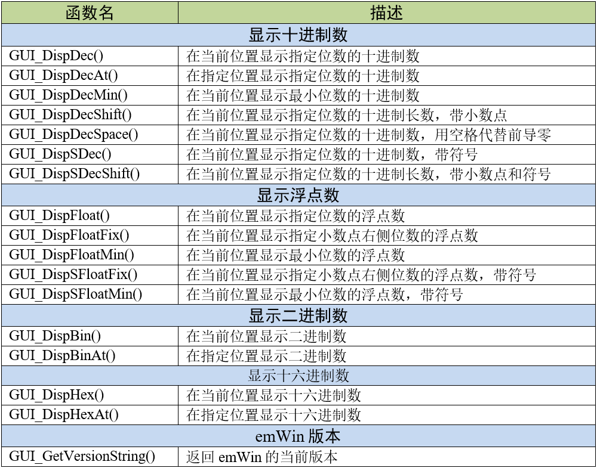
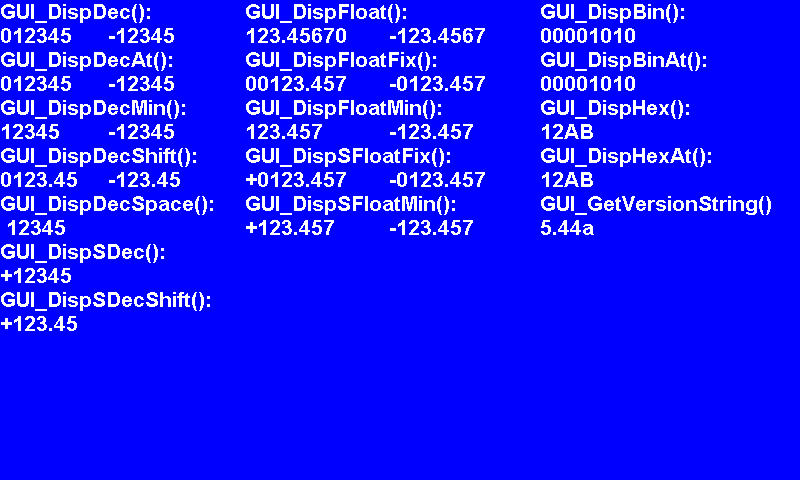

.. vim: syntax=rst

数值显示
===========

上一章我们讲解了如何在LCD屏幕上显示字符串，这一章我们来讲解emWin数值显示。emWin支持十进制、浮点数、
十六进制和二进制的数值显示。虽然我们可以用C库中的sprintf 函数将数值转换成字符串，
但是emWin的数值显示API可以节省部分内存空间和运行时间。

数值显示API
~~~~~~~~~~~~~~~~~~~

emWin所有的数值显示API函数如表格 数值显示API函数列表_ 所示。

数值显示实验
~~~~~~~~~~~~~~~~~~

代码设计
^^^^^^^^^^^^

代码清单:数值显示-1_ 展示了emWin的十进制显示API函数的用法。

.. code-block:: c
    :caption: 代码清单:数值显示-1 十进制显示函数（MainTask.c文件）
    :name: 代码清单:数值显示-1
    :linenos:

    /**
    * @brief 十进制数显示
    * @note 无
    * @param 无
    * @retval 无
    */
    static void Disp_DecNum(void)
    {
        GUI_SetFont(GUI_FONT_24B_ASCII);
        GUI_SetColor(GUI_WHITE);

        GUI_DispStringAt("GUI_DispDec():", 0, 0);
        GUI_DispNextLine();
        GUI_DispDec(12345, 6);
        GUI_GotoX(12 * 9);
        GUI_DispDec(-12345, 6);

        GUI_DispStringAt("GUI_DispDecAt():", 0, 24 * 2);
        GUI_DispDecAt(12345, 0, 24 * 3, 6);
        GUI_DispDecAt(-12345, 12 * 9, 24 * 3, 6);

        GUI_DispStringAt("GUI_DispDecMin():", 0, 24 * 4);
        GUI_DispNextLine();
        GUI_DispDecMin(12345);
        GUI_GotoX(12 * 9);
        GUI_DispDecMin(-12345);

        GUI_DispStringAt("GUI_DispDecShift():", 0, 24 * 6);
        GUI_DispNextLine();
        GUI_DispDecShift(12345, 7, 2);
        GUI_GotoX(12 * 9);
        GUI_DispDecShift(-12345, 7, 2);

        GUI_DispStringAt("GUI_DispDecSpace():", 0, 24 * 8);
        GUI_DispNextLine();
        GUI_DispDecSpace(12345, 6);

        GUI_DispStringAt("GUI_DispSDec():", 0, 24 * 10);
        GUI_DispNextLine();
        GUI_DispSDec(12345,6);

        GUI_DispStringAt("GUI_DispSDecShift():", 0, 24 * 12);
        GUI_DispNextLine();
        GUI_DispSDecShift(12345, 7, 2);
    }

所有十进制显示函数的数值类型都是有符号int型，
即可输入的数值范围为\ :math:`- 2^{31}`\ 至\ :math:`2^{31} - 1`\ 。使用这些函数需要注意以下问题：

(1) 待显示数值的最高位不能是0，
否则无法显示。例如需要显示的数是012345，不管指定的显示位数设置为多少，函数都无法显示。

(2) 指定的显示位数必须大于等于待显示数值的位数，否则无法显示。例如待显示数为12345，
当指定显示位数小于5时，函数无法显示，大于5时，会在待显示数值的最高位补零，其中GUI_DispDecSpace()函数会在最高位补空格。

(3) 如果待显示数值中含有负号或小数点，包括使用GUI_DispDecShift()和GUI_DispSDecShift()，
在指定显示位数时需要把这些符号也计算在内，否则函数无法正常显示。

浮点数显示函数的用法如 代码清单:数值显示-2_ 所示。

.. code-block:: c
    :caption: 代码清单:数值显示-2 浮点数显示函数（MainTask.c文件）
    :name: 代码清单:数值显示-2
    :linenos:

    /**
    * @brief 浮点数显示
    * @note 无
    * @param 无
    * @retval 无
    */
    static void Disp_FloatingNum(void)
    {
        int x0 = 245;

        GUI_SetFont(GUI_FONT_24B_ASCII);
        GUI_SetColor(GUI_WHITE);

        GUI_GotoX(x0);
        GUI_DispStringAt("GUI_DispFloat():", x0, 0);
        GUI_DispNextLine();
        GUI_GotoX(x0);
        GUI_DispFloat(123.4567, 9);
        GUI_GotoX(x0 + 12 * 12);
        GUI_DispFloat(-123.4567, 9);

        GUI_DispStringAt("GUI_DispFloatFix():", x0, 24 * 2);
        GUI_DispNextLine();
        GUI_GotoX(x0);
        GUI_DispFloatFix(123.4567, 9, 3);
        GUI_GotoX(x0 + 12 * 12);
        GUI_DispFloatFix(-123.4567, 9, 3);

        GUI_DispStringAt("GUI_DispFloatMin():", x0, 24 * 4);
        GUI_DispNextLine();
        GUI_GotoX(x0);
        GUI_DispFloatMin(123.4567, 3);
        GUI_GotoX(x0 + 12 * 12);
        GUI_DispFloatMin(-123.4567, 3);

        GUI_DispStringAt("GUI_DispSFloatFix():", x0, 24 * 6);
        GUI_DispNextLine();
        GUI_GotoX(x0);
        GUI_DispSFloatFix(123.4567, 9, 3);
        GUI_GotoX(x0 + 12 * 12);
        GUI_DispSFloatFix(-123.4567, 9, 3);

        GUI_DispStringAt("GUI_DispSFloatMin():", x0, 24 * 8);
        GUI_DispNextLine();
        GUI_GotoX(x0);
        GUI_DispSFloatMin(123.4567, 3);
        GUI_GotoX(x0 + 12 * 12);
        GUI_DispSFloatMin(-123.4567, 3);
    }

所有的浮点显示函数的数值参数类型都是float型。和十进制函数一样，浮点显示函数也需要注意显示位数和符号位的问题，
而待显示数值最高位为零的问题对其没有影响。不过需要注意的是，当指定的显示位数大于待显示数值的位数时，GUI_DispFloat函数是在最右侧补零。

二进制和十六进制显示函数的使用如 代码清单:数值显示-3_ 所示。

.. code-block:: c
    :caption: 代码清单:数值显示-3 二进制和十六进制显示函数（MainTask.c文件）
    :name: 代码清单:数值显示-3
    :linenos:

    /**
    * @brief 二进制数和十六进制数显示
    * @note 无
    * @param 无
    * @retval 无
    */
    static void Disp_BinHexNum(void)
    {
        int x0 = 540;

        GUI_SetFont(GUI_FONT_24B_ASCII);
        GUI_SetColor(GUI_WHITE);

        GUI_DispStringAt("GUI_DispBin():", x0, 0);
        GUI_DispNextLine();
        GUI_GotoX(x0);
        GUI_DispBin(10, 8);

        GUI_DispStringAt("GUI_DispBinAt():", x0, 24 * 2);
        GUI_DispBinAt(10, x0, 24 * 3, 8);

        GUI_DispStringAt("GUI_DispHex():", x0, 24 * 4);
        GUI_DispNextLine();
        GUI_GotoX(x0);
        GUI_DispHex(4779, 4);

        GUI_DispStringAt("GUI_DispHexAt():", x0, 24 * 6);
        GUI_DispNextLine();
        GUI_DispHexAt(4779, x0, 24 * 7, 4);

        GUI_DispStringAt("GUI_GetVersionString()", x0, 24 * 8);
        GUI_DispStringAt(GUI_GetVersionString(), x0, 24 * 9);
    }

二进制显示函数最大支持输入32 bit的十进制或十六进制数，十六进制显示函数最大支持输入16 bit十进制或十六进制数。
实际上这两组函数也支持输入二进制数，只不过Keil 5的C编译器不支持直接表示二进制数，在模拟器中就能很好的显示。

以上就是emWin数值显示API函数的全部内容。数值显示API函数也属于emWin的基础功能之一，但是这些函数的限制较多不容易用好。
不过我们还可以使用sprintf函数结合上一章的文本显示函数，这样对于数值本身的限制就不那么大了。

实验现象
^^^^^^^^^^^^

数值显示的实验现象如图 数值显示实验效果_ 所示。可以看出各种进制间不同函数的显示效果。

