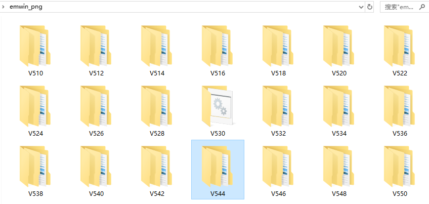
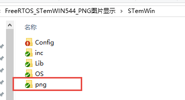
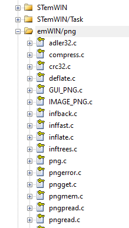
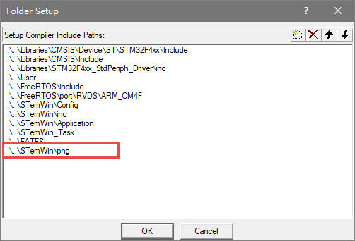
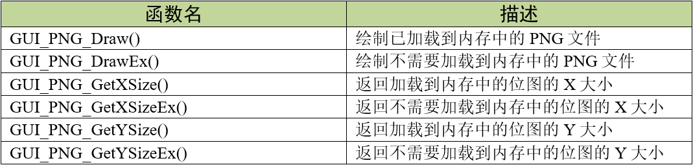

.. vim: syntax=rst

PNG图片显示
==============

PNG（Portable Network Graphics）格式，是一种光栅图形文件格式，支持无损数据压缩和透明度，
支持基于调色板的图像、灰度图像以及非调色板的全色RGB图像。1999年，Unisys公司进一步中止了对自由软件和非商用软件开发者的GIF专利免费许可，
从而使PNG格式获得了更多的关注。PNG是目前保证最不失真的格式，采用LZ77算法的派生算法进行压缩，
能把图像文件压缩到极限以利于网络传输，但又能保留所有与图像品质有关的信息。

移植PNG库
~~~~~~~~~~~~~~~~~~

emWin对PNG支持可以通过使用基于Glenn Randers-Pehrson，
Guy Eric Schalnat和Andreas Dilger的“libpng”库来实现。
但emWin内部并不包含PNG解码库，需要用户自行移植。

接下来我们讲解一下将PNG库移植到emWin工程中的步骤。

1) 下载并解压emWin_png压缩包。PNG解码库可以从emWin官网下载到，
链接如下：\ https://www.segger.com/downloads/emwin/emWin_PNG\ 。下载完成后解压得到的emWin_png压缩包，
可以看到如图 emWin_png压缩包内容_ 所示的结构，压缩包内包含了对应emWin各个版本的PNG解码库，
我们选取适合我们例程的版本即选择V544。

2) 添加PNG库到工程文件夹。选择好版本之后，将PNG库整个文件夹复制到工程文件夹下，其实随便那个文件夹都行，
只要在工程文件夹内。如图 添加PNG库到工程_ 所示，我们选择将PNG库放在工程的STemWin文件夹下，并重命名为png；

3) 添加PNG库文件到工程。在MDK工程内新建分组并把PNG库添加进新分组中，
如图 添加PNG库文件到工程_ 所示；

4) 添加PNG库头文件路径。最后一步，在工程设置中把PNG库的头文件路径添加进去，
见图 添加PNG库头文件路径_ 。

至此，emWin的PNG移植就完成了，可能最后工程编译完成后有较多警告，属于正常情况。

此PNG库在做解码操作的时候会固定占用21KB的RAM空间，这部分与图像大小无关，而总的RAM占用可通过下面的公式得到：

总RAM占用 = （图像xSize + 1）* 图像ySize + 21KB

PNG显示相关API
~~~~~~~~~~~~~~~~~~~~~~~~~~~~~~

GUI_PNG_Draw()
^^^^^^^^^^^^^^^^^^^

在当前窗口的指定位置绘制一个已加载到内存中的png文件。

.. code-block:: c
    :caption: 代码清单:PNG-1 函数原型
    :name: 代码清单:PNG-1
    :linenos:

    int GUI_PNG_Draw(const void *pFileData, int FileSize, int x0, int y0);

1) pFileData：
指向png文件所在的存储区域的开头的指针；

2) DataSize：
png文件的字节数；

3) x0：
png左上角在屏幕上的x位置；

4) y0：
png左上角在屏幕上的y位置。

返回值：绘制成功返回0，绘制失败返回非0。不过当前的实现是任何情况都返回0。

GUI_PNG_DrawEx()
^^^^^^^^^^^^^^^^^^^^^^^

在当前窗口的指定位置绘制一个png文件，该文件不必加载到内存中。

.. code-block:: c
    :caption: 代码清单:PNG-2 函数原型
    :name: 代码清单:PNG-2
    :linenos:

    int GUI_PNG_DrawEx(GUI_GET_DATA_FUNC *pfGetData, void *p, int x0, int y0);

1) pfGetData：
指向为获取数据而调用的函数的指针；

2) p：
传递给pfGetData指向的函数的空指针；

3) x0：
png左上角在屏幕上的x位置；

4) y0：
png左上角在屏幕上的y位置。

返回值：绘制成功返回0，绘制失败返回非0。不过当前的实现是任何情况都返回0

需要注意的是，PNG解码库会在其内部为整个图像分配一个缓冲区，这是此函数无法避免的。

PNG图片显示实验
~~~~~~~~~~~~~~~~~~~~~~~~~

接下来我们通过一个实验来讲解如何简单的显示PNG图片，更多API函数的演示实验可参考官方例程2DGL_DrawPNG.c，例程路径如下：

**SeggerEval_WIN32_MSVC_MinGW_GUI_V548\\Sample\\Tutorial\\2DGL_DrawPNG.c**

代码分析
^^^^^^^^^^^^

绘制外部存储器（SD卡）中的PNG
''''''''''''''''''''''''''''''

.. code-block:: c
    :caption: 代码清单:PNG-3 \_ShowPNGEx函数（MainTask.c文件）
    :name: 代码清单:PNG-3
    :linenos:

    /**
    * @brief 直接从存储器中绘制PNG图片数据
    * @note 无
    * @param sFilename：需要加载的图片名
    * @retval 无
    */
    static void ShowPNGEx(const char *sFilename, int x0, int y0)
    {
        /* 进入临界段 */
        taskENTER_CRITICAL();
        /* 打开图片 */
        result = f_open(&file, sFilename, FA_READ);
        if ((result != FR_OK)) {
            printf("文件打开失败！\r\n");
        }
        /* 退出临界段 */
        taskEXIT_CRITICAL();

        GUI_PNG_DrawEx(_GetData, &file, x0, y0);

        /* 读取完毕关闭文件 */
        f_close(&file);
    }

如 代码清单:PNG-3_ 所示，从外部存储器种直接绘制JPEG图片的操作与绘制BMP图片的操作几乎是相同的，
都是必须通过文件系统函数f_open函数打开图片文件，图片打开成功后调用GUI_JPEG_DrawEx函数绘制，
这个函数和直接绘制BMP一样，需要一个专门的数据读取函数才能绘制图片，见 代码清单:PNG-4_ 。

.. code-block:: c
    :caption: 代码清单:PNG-4 \_GetData函数（MainTask.c文件）
    :name: 代码清单:PNG-4
    :linenos:

    /**
    * @brief 从存储器中读取数据
    * @note 无
    * @param
    * @retval NumBytesRead：读到的字节数
    */
    static int _GetData(void * p, const U8 ** ppData, unsigned NumBytesReq,
                        U32 Off)
    {
        U8 *pData;
        FIL *Picfile;
        UINT NumBytesRead;
        static int FileAddr = 0;

        pData = (U8 *)*ppData;
        Picfile = (FIL *)p;

        if (Off == 1) FileAddr = 0;
        else FileAddr = Off;
        result = f_lseek(Picfile, FileAddr);

        /* 进入临界段 */
        taskENTER_CRITICAL();
        result = f_read(Picfile, pData, NumBytesReq, &NumBytesRead);
        /* 退出临界段 */
        taskEXIT_CRITICAL();

        return NumBytesRead;
    }

如 代码清单:PNG-4_ 所示，_GetData函数用于读取外部存储器中的图片数据，
此函数函数将作为GUI_PNG_DrawEx函数的其中一个参数使用，当emWin从外部存储器直接绘制图片时，
这个读取函数必须要有。需要注意的是，此函数与BMP、JPEG和GIF的_GetData函数是不同的。

绘制已加载到内存中的PNG
''''''''''''''''''''''''''''''

.. code-block:: c
    :caption: 代码清单:PNG-5 \_ShowPNG函数（MainTask.c文件）
    :name: 代码清单:PNG-5
    :linenos:

    /**
    * @brief 加载PNG图片到内存中并绘制
    * @note 无
    * @param sFilename：需要加载的图片名
    * @retval 无
    */
    static void ShowPNG(const char *sFilename, int x0, int y0)
    {
        WM_HMEM hMem;

        /* 进入临界段 */
        taskENTER_CRITICAL();
        /* 打开图片 */
        result = f_open(&file, sFilename, FA_READ);
        if ((result != FR_OK)) {
            printf("文件打开失败！\r\n");
            _acbuffer[0]='\0';
        }

        /* 申请一块动态内存空间 */
        hMem = GUI_ALLOC_AllocZero(file.fsize);
        /* 转换动态内存的句柄为指针 */
        _acbuffer = GUI_ALLOC_h2p(hMem);

        /* 读取图片数据到动态内存中 */
        result = f_read(&file, _acbuffer, file.fsize, &f_num);
        if (result != FR_OK) {
            printf("文件读取失败！\r\n");
        }
        /* 读取完毕关闭文件 */
        f_close(&file);
        /* 退出临界段 */
        taskEXIT_CRITICAL();

        GUI_PNG_Draw(_acbuffer, file.fsize, x0, y0);

        /* 释放内存 */
        GUI_ALLOC_Free(hMem);
    }

如 代码清单:PNG-5_ 所示，绘制已加载到内存的PNG的步骤与直接从外部存储器绘制的操作略有不同，
并且没有了专门的数据读取函数。首先还是必须要用f_open打开PNG图片文件，
然后不同的是用GUI_ALLOC_AllocZero函数申请一块动态内存，
并且用GUI_ALLOC_h2p把这段动态内存的句柄转为指针_acbuffer，
方便之后使用，接着用f_read函数把图片数据读到刚刚申请到的动态内存中，读取完成后关闭文件，
使用GUI_PNG_Draw函数将动态内存中的PNG数据绘制到LCD上，如果之后的程序不再使用这张PNG，
就必须使用GUI_ALLOC_Free函数释放动态内存。

MainTask函数
''''''''''''''''''''''''

本实验我们用两种PNG绘制方法绘制4张PNG图片，见 代码清单:PNG-6_ 。

.. code-block:: c
    :caption: 代码清单:PNG-6 MainTask函数（MainTask.c文件）
    :name: 代码清单:PNG-6
    :linenos:

    /**
    * @brief GUI主任务
    * @note 无
    * @param 无
    * @retval 无
    */
    void MainTask(void)
    {
        int i = 0;
        /* 设置背景颜色 */
        GUI_SetBkColor(GUI_LIGHTCYAN);
        GUI_Clear();

        GUI_SetTextMode(GUI_TM_TRANS | GUI_TM_XOR);
        GUI_SetFont(GUI_FONT_24B_ASCII);

        while (1) {
            i++;

            switch (i) {
            case 1:
                GUI_DispStringHCenterAt("ShowPNGEx", LCD_GetXSize()/2, 10);
                ShowPNGEx("0:/image/野火.png", 80, 153);
                break;
            case 2:
                GUI_DispStringHCenterAt("ShowPNG", LCD_GetXSize()/2, 10);
                ShowPNG("0:/image/one_punch_man.png", 45, 80);
                ShowPNG("0:/image/pokemon.png", 405, 60);
                break;
            case 3:
                GUI_DispStringHCenterAt("ShowPNG", LCD_GetXSize()/2, 10);
                ShowPNG("0:/image/滑稽.png", 280, 100);
                break;
            default:
                i = 0;
                break;
            }
            GUI_Delay(1000);
            GUI_Clear();
        }
    }

如 代码清单:PNG-6_ 所示，在while循环中调用ShowPNGEx、ShowPNG显示4张PNG图。
由于每调用一次显示API就要做一次PNG解码，所以在开发板上的ShowPNGEx和ShowPNG实际消耗的时间是差不多的。
如果需要频繁调用较大尺寸和质量的PNG图像，建议使用内存设备进行加速。

实验现象
^^^^^^^^^^

PNG图片显示实验的实验现象如图 PNG图片显示实验现象1_ 、图 PNG图片显示实验现象2_ 和图 PNG图片显示实验现象3_ 所示，
把程序下到开发板上后，可以观察到实验所显示的PNG图片会依次循环显示。

.. image:: media/PNG/PNG006.png
   :align: center
   :name: PNG图片显示实验现象1
   :alt: PNG图片显示实验现象1

