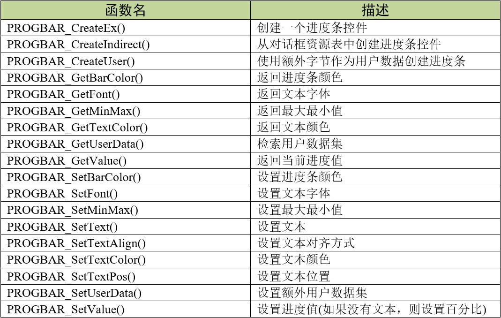
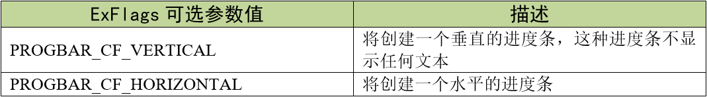
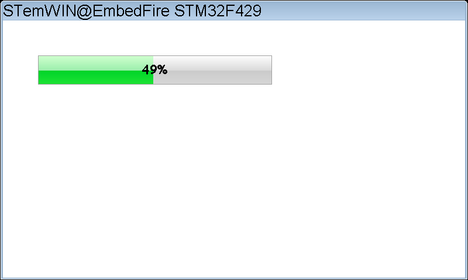

.. vim: syntax=rst

进度条控件
==============

进度条（Progbar）控件也是一种用户数据可视化的控件。类似的控件其实在我们生活中非常常见，例如某些网页的加载过程、
下载软件的下载进度和手机的电池电量等等都有出现进度条。

进度条控件的外观如图 进度条控件外观_ 所示。

.. image:: media/Progbar/Progba002.png
   :align: center
   :name: 进度条控件外观
   :alt: 进度条控件外观

进度条控件不支持任何的通知代码、聚焦操作和按键消息，
也就是说无法在对话框回调函数中通过通知代码操作进度条控件，控件自己也无法响应外部键盘的动作。

创建进度条控件
~~~~~~~~~~~~~~~~~~~

进度条控件API
^^^^^^^^^^^^^^^^

进度条控件创建函数
^^^^^^^^^^^^^^^^^^^

PROGBAR_CreateEx()
''''''''''''''''''''''''

在指定位置创建指定大小的进度条控件。

.. code-block:: c
    :caption: 代码清单:进度条-1 函数原型
    :name: 代码清单:进度条-1
    :linenos:

    PROGBAR_Handle PROGBAR_CreateEx(int x0, int y0, int xSize, int ySize,
                                    WM_HWIN hParent, int WinFlags, int
                                    ExFlags, int Id);

1) x0：
进度条控件在父坐标中的最左侧像素；

2) y0：
进度条控件在父坐标中的最顶侧像素；

3) xSize：
进度条的水平尺寸，以像素为单位；

4) ySize：
进度条的垂直尺寸，以像素为单位；

5) hParent：
父窗口句柄。如果为0，则将桌面窗口作为其父窗口；

6) WinFlags：
窗口创建标志。由于控件本质上是窗口，所以曲线图控件在创建时可以使用几乎所有的窗口创建标志。
这些标志中按钮最常用的是WM_CF_SHOW。全部创建标志请参考emWin手册的窗口管理器章节；

7) ExFlags：
额外创建标志，用于设置进度条方向，可选值见；

8) Id：
控件Id号。

返回值：返回值：创建成功后返回已创建的进度条控件句柄，创建失败则返回0。

PROGBAR_CreateIndirect()
''''''''''''''''''''''''''''''

从对话框资源表中创建进度条控件。

.. code-block:: c
    :caption: 代码清单:进度条-2 函数原型
    :name: 代码清单:进度条-2
    :linenos:

    PROGBAR_Handle PROGBAR_CreateIndirect(const GUI_WIDGET_CREATE_INFO
                                        *pCreateInfo, WM_HWIN hWinParent,
                                        int x0, int y0, WM_CALLBACK *cb);

1) pCreateInfo：
指向GUI_WIDGET_CREATE_INFO结构的指针；

2) hParent：
父窗口的句柄；

3) x0：
进度条控件在父坐标中的最左边像素；

4) y0：
进度条控件在父坐标中的最顶部像素；

5) cb：
回调函数指针。

此函数的第一个参数指向的是 代码清单:进度条-3_ 的资源表结构，但不使用其中的para参数，
其中的Flags参数的可选值与PROGBAR_CreateEx()函数的ExFlags参数相同，用于设置进度条方向。

进度条控件基础实验
~~~~~~~~~~~~~~~~~~~~~~~~~

接下来我们来讲解如何以对话框的方式间接创建一个进度条控件，通过API函数直接创建的实验可参考官方例程WIDGET_Progbar.c，例程路径如下：

**SeggerEval_WIN32_MSVC_MinGW_GUI_V548\\Sample\\Tutorial\\WIDGET_Progbar.c**

代码分析
^^^^^^^^

创建对话框
''''''''''''

.. code-block:: c
    :caption: 代码清单:进度条-3 创建对话框（ProgbarDLG.c文件）
    :name: 代码清单:进度条-3
    :linenos:

    /* 控件ID */
    #define ID_FRAMEWIN_0     (GUI_ID_USER + 0x00)
    #define ID_PROGBAR_0     (GUI_ID_USER + 0x01)

    /* 资源表 */
    static const GUI_WIDGET_CREATE_INFO _aDialogCreate[] = {
        { FRAMEWIN_CreateIndirect, "Framewin", ID_FRAMEWIN_0, 0, 0, 800,
        480, 0, 0x0, 0 },
        { PROGBAR_CreateIndirect, "Progbar", ID_PROGBAR_0, 60, 60, 400, 50,
        0, 0x0, 0 },
    };

    /**
    * @brief 以对话框方式间接创建控件
    * @note 无
    * @param 无
    * @retval hWin：资源表中第一个控件的句柄
    */
    WM_HWIN CreateFramewin(void)
    {
        WM_HWIN hWin;

        hWin = GUI_CreateDialogBox(_aDialogCreate, GUI_COUNTOF(
            _aDialogCreate), _cbDialog, WM_HBKWIN, 0, 0);
        return hWin;
    }

在 代码清单:进度条-3_ 中我们定义了2个ID：1个框架窗口ID和1个进度条控件。当然也可以使用emWin预定义好的滑块控件ID，
但最多只有GUI_ID_PROGBAR0到GUI_ID_PROGBAR3，共4个ID可供使用。

对话框回调函数
''''''''''''''''''

.. code-block:: c
    :caption: 代码清单:进度条-4 对话框回调函数（ProgbarDLG.c文件）
    :name: 代码清单:进度条-4
    :linenos:

    /**
    * @brief 对话框回调函数
    * @note 无
    * @param pMsg：消息指针
    * @retval 无
    */
    static void _cbDialog(WM_MESSAGE * pMsg)
    {
        WM_HWIN hItem;
        static U16 progbar_value = 0;

        switch (pMsg->MsgId) {
        case WM_INIT_DIALOG:
            /* 初始化Framewin控件 */
            hItem = pMsg->hWin;
            FRAMEWIN_SetTitleHeight(hItem, 32);
            FRAMEWIN_SetText(hItem, "STemWIN@EmbedFire STM32F429");
            FRAMEWIN_SetFont(hItem, GUI_FONT_32_ASCII);
            /* 初始化Progbar0 */
            hItem = WM_GetDialogItem(pMsg->hWin, ID_PROGBAR_0);
            PROGBAR_SetFont(hItem, GUI_FONT_COMIC24B_ASCII);
            PROGBAR_SetMinMax(hItem, 0, 100);
            break;
        case WM_PAINT:
            hItem = WM_GetDialogItem(pMsg->hWin, ID_PROGBAR_0);
            progbar_value = PROGBAR_GetValue(hItem);
            PROGBAR_SetValue(hItem, progbar_value+1);
            if (progbar_value == 100)
                PROGBAR_SetValue(hItem, 0);
            break;
        default:
            WM_DefaultProc(pMsg);
            break;
        }
    }

1. WM_INIT_DIALOG消息

在 代码清单:进度条-4_ 中，我们设置框架窗口的标题栏高度为32像素，
字体高度32像素，并在标题栏中显示 **STemWIN@EmbedFire STM32F429**。

进度条控件相关API函数几乎都是使用句柄来操作的，但在建立对话框资源表的时候并没有定义它的句柄，
那就需要通过WM_GetDialogItem函数来自动建立并获取进度条控件的句柄。

成功获取到进度条控件句柄后，接着进行进度条控件的初始化设置。使用PROGBAR_SetFont函数设置进度条上的文本字体为COMIC24B，
使用PROGBAR_SetMinMax函数设置进度条的最小值为0，最大值为100。

2. WM_PAINT消息

因为进度条控件不支持通知代码，所以也就不能在WM_NOTIFY_PARENT消息中更新进度条状态。
在 代码清单:进度条-4_ 中我们使用WM_PAINT消息更新进度条状态。在WM_PAINT消息中，
首先使用PROGBAR_GetValue函数获取进度条当前的值，然后将这个值加1后再通过PROGBAR_SetValue函数输入回进度条，
if语句判断进度条的值是否到达100，如果到达100则设值为0，从头开始。

3. 其他消息

所有我们不关心或者没有用到的系统消息都可以调用默认消息处理函数WM_DefaultProc进行处理。

MainTask函数
''''''''''''''''''

.. code-block:: c
    :caption: 代码清单:进度条-5 MainTask函数（ProgbarDLG.c文件）
    :name: 代码清单:进度条-5
    :linenos:

    /**
    * @brief GUI主任务
    * @note 无
    * @param 无
    * @retval 无
    */
    void MainTask(void)
    {
        WM_HWIN hWin;

        hWin = CreateFramewin();

        while (1) {
            GUI_Delay(10);
            WM_InvalidateWindow(hWin);
        }
    }

在本实验中，MainTask函数除了调用对话框创建函数以外，还需要在while循环中定时无效化窗口。
如 代码清单:进度条-5_ 所示，MainTask函数每隔10ms调用一次WM_InvalidateWindow函数无效化对话框，目的是使进度条数值更新，
因为对话框无效化后会执行回调函数中的MW_PAINT消息，这样就能自动更新进度条的值。

实验现象
^^^^^^^^

进度条控件基础实验的实验现象如图 进度条控件基础实验现象_ 所示，
进度条会从左侧0%一直增加到右侧100%，到100%后又从0%开始，如此反复。

