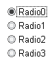
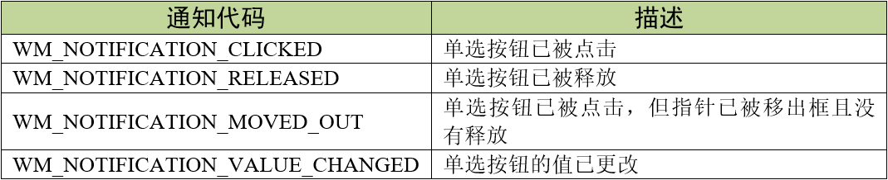
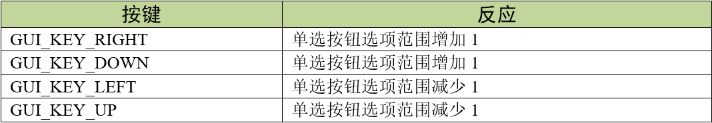
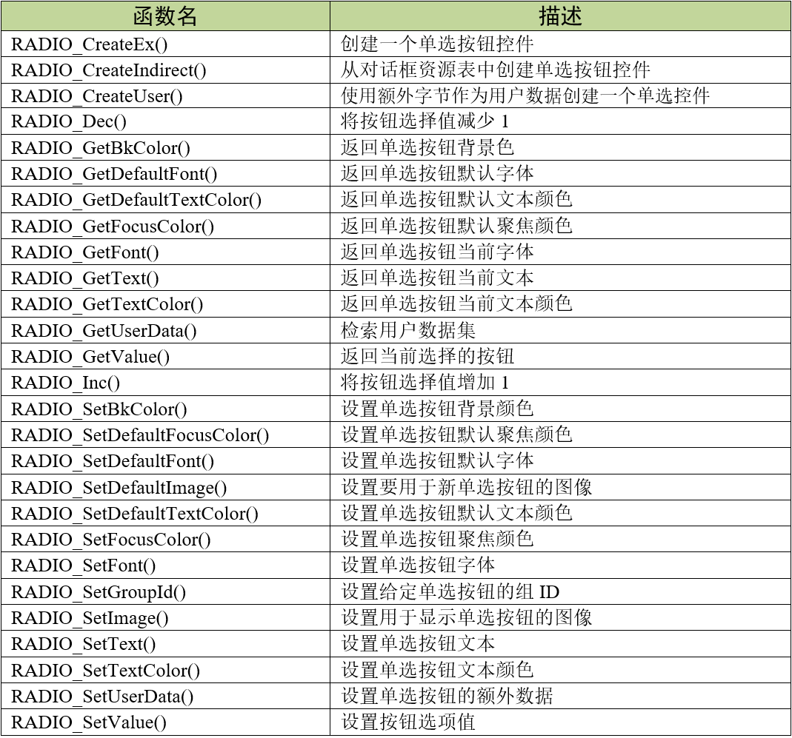
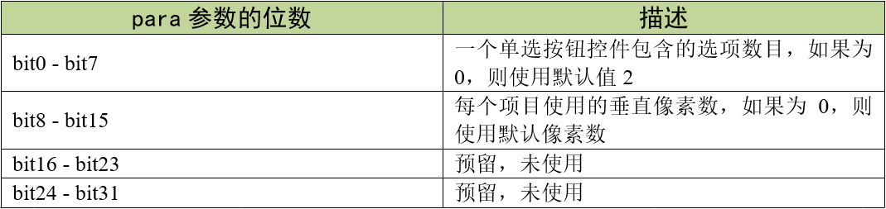
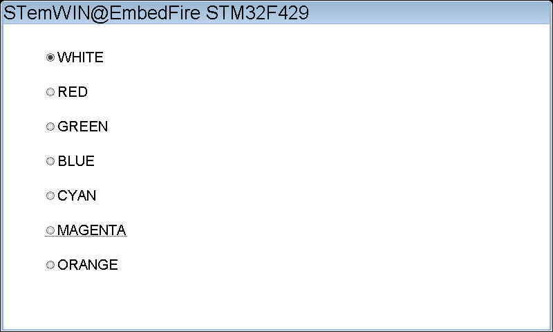
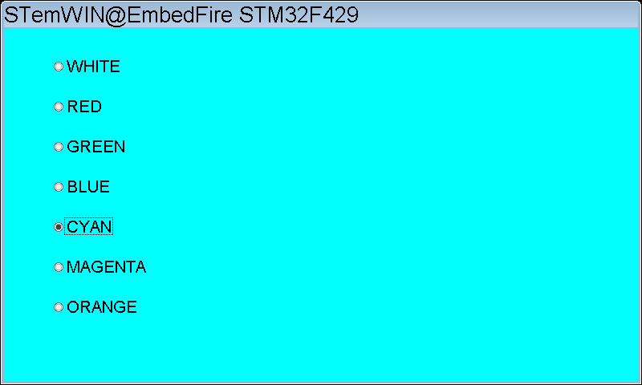

.. vim: syntax=rst

单选按钮控件
================

单选按钮（Radio Button）是一种经常用于选项选择的控件。用户可以选中或者取消选中单选按钮，和复选框不同，
单选按钮一次只能选中一个选项。一个单选按钮控件可以包含任意数量的选项按钮，这些选项按钮总是垂直排列的。

单选按钮控件的外观如图 单选按钮外观_ 所示。

单选按钮控件支持4种通知代码，以区分不同的控件行为，见表格 单选按钮支持的通知代码_ 。

这4种通知代码是作为WM_NOTIFY_PARENT消息的一部分发送到其父窗口的。当用户点击按钮后，
窗口管理器向父窗口发送WM_NOTIFY_PARENT消息时，会在消息结构的Data.v成员中附加相应的通知代码，
用户程序可以读取此成员来检测不同的按钮动作以及实现各种功能。

单选按钮控件支持输入焦点，支持键盘或其他类似键盘的外部输入设备对按钮的控制。如果按钮控件已被聚焦，
那它可以接收表格 单选按钮支持的按键消息_ 中的按键消息。

创建单选按钮控件
~~~~~~~~~~~~~~~~~~~~~~~~

单选按钮控件API
--------------------

单选按钮控件创建函数
------------------------------

RADIO_CreateEx()
^^^^^^^^^^^^^^^^^^^^^^^^^^^^^^^^

在指定位置创建具有指定大小的单选小部件。

.. code-block:: c
    :caption: 代码清单:单选按钮-1 单选按钮创建函数
    :name: 代码清单:单选按钮-1
    :linenos:

    RADIO_Handle RADIO_CreateEx(int x0, int y0, int xSize, int ySize,
                                WM_HWIN hParent, int WinFlags, int ExFlags,
                                int Id, int NumItems, int Spacing);

1)  x0：
单选按钮控件在父坐标中的最左侧像素；

2)  y0：
单选按钮控件在父坐标中的最顶侧像素；

3)  xSize：
单选按钮的水平尺寸，以像素为单位；

4)  ySize：
单选按钮的垂直尺寸，以像素为单位；

5)  hParent：
父窗口句柄。如果为0，则将桌面窗口作为其父窗口；

6)  WinFlags：
窗口创建标志。由于控件本质上是窗口，所以单选按钮控件在创建时可以使用几乎所有的窗口创建标志。
这些标志中按钮最常用的是WM_CF_SHOW。全部创建标志请参考emWin手册的窗口管理器章节；

7)  ExFlags：
预留，未使用；

8)  Id：
控件ID号；

9)  NumItems：
一个单选按钮控件包含的选项数，默认为2；

10) Spacing：
单选按钮控件的每个选项间的垂直间距，以像素为单位。

返回值：创建成功后返回已创建的单选按钮控件句柄，创建失败则返回0。

创建一个单选按钮控件时，请确保给定的控件的垂直尺寸ySize足以显示所有的选项。
ySize值应该至少是选项数目NumItems \* 垂直间距Spacing。如果NumItems的给定值小于等于0，则使用默认值2。

RADIO_CreateIndirect()
^^^^^^^^^^^^^^^^^^^^^^^^^^^^^^

从对话框资源表中创建单选按钮控件。

.. code-block:: c
    :caption: 代码清单:单选按钮-2对话框方式创建单选按钮函数
    :name: 代码清单:单选按钮-2
    :linenos:

    RADIO_Handle RADIO_CreateIndirect(const GUI_WIDGET_CREATE_INFO
                                    *pCreateInfo, WM_HWIN hWinParent,
                                    int x0, int y0, WM_CALLBACK *cb);

1) pCreateInfo：
指向GUI_WIDGET_CREATE_INFO结构的指针；

2) hParent：
父窗口的句柄；

3) x0：
单选按钮控件在父坐标中的最左边像素；

4) y0：
单选按钮控件在父坐标中的最顶部像素；

5) cb：
单选控件回调函数指针。

此函数的第一个参数指向的是 **代码清单:控件基础-3** 的资源表结构，不使用其中的Flag参数，但是使用para参数。

单选按钮控件对para参数的使用情况见表格 para参数使用情况_ 。

从上表可知，原本用于设置窗口创建标志的para参数，被单选按钮控件拿来用作自身的一些属性设置，
所以从对话框资源表中创建的单选按钮控件需要单独设置窗口创建标志。

单选按钮基础实验
~~~~~~~~~~~~~~~~~~~~~~~~

代码分析
------------

创建对话框
^^^^^^^^^^^^^^

在本实验中，我们通过对话框的方式来创建单选按钮控件，这样可以方便管理各种界面元素，见 代码清单:单选按钮-3_ 。

.. code-block:: c
    :caption: 代码清单:单选按钮-3 创建对话框（RadioDLG.c文件）
    :name: 代码清单:单选按钮-3
    :linenos:

    /* 控件ID */
    #define ID_FRAMEWIN_0   (GUI_ID_USER + 0x00)
    #define ID_RADIO_0      (GUI_ID_USER + 0x01)

    /* 资源表 */
    static const GUI_WIDGET_CREATE_INFO _aDialogCreate[] = {
        { FRAMEWIN_CreateIndirect, "Framewin", ID_FRAMEWIN_0, 0, 0, 800,
        480, 0, 0x0, 0 },
        { RADIO_CreateIndirect, "Radio0", ID_RADIO_0, 60, 40, 120, 400, 0,
        0x3207, 0 },
    };

    /**
    * @brief 以对话框方式间接创建控件
    * @note 无
    * @param 无
    * @retval hWin：资源表中第一个控件的句柄
    */
    WM_HWIN CreateFramewin(void)
    {
        WM_HWIN hWin;

        hWin = GUI_CreateDialogBox(_aDialogCreate, GUI_COUNTOF(
            _aDialogCreate), _cbDialog, WM_HBKWIN, 0, 0);
        return hWin;
    }

在上述代码中我们定义了两个ID：一个框架窗口ID和一个单选按钮控件ID。当然我们也可以使用emWin预定义好的单选按钮控件ID，
但最多只有GUI_ID_RADIO0到GUI_ID_RADIO7，共8个ID可供使用。

本实验的对话框资源表大部分与其他实验大同小异，就不展开讲了。我们来重点关注一下资源表中单选按钮控件的倒数第二个参数，
也就是para参数，它的值为0x3207。根据表格 20‑4可知，单选按钮控件的这个参数值并不是窗口创建标志，而是跟单选按钮控件的布局有关。
这个数值的低8位表示单选按钮控件ID_RADIO_0中包含7个选项，数值的高8位表示这个ID_RADIO_0中每个选项在垂直方向上占了50像素。
与复选框控件不同，单选按钮无法更改圆形框区域的尺寸大小。对于一些分辨率较高或屏幕较小的项目应用来说，可能会显得不太方便。

对话框回调函数
^^^^^^^^^^^^^^^^^^^^^

.. code-block:: c
    :caption: 代码清单:单选按钮-4 对话框回调函数（RadioDLG.c文件）
    :name: 代码清单:单选按钮-4
    :linenos:

    static const GUI_COLOR aColor[] = {GUI_RED, GUI_GREEN, GUI_BLUE,
                                    GUI_CYAN, GUI_MAGENTA, GUI_ORANGE};
    int value = 0;
    /**
    * @brief 对话框回调函数
    * @note 无
    * @param pMsg：消息指针
    * @retval 无
    */
    static void _cbDialog(WM_MESSAGE *pMsg)
    {
        WM_HWIN hItem;
        int NCode;
        int Id;

        switch (pMsg->MsgId) {
        case WM_INIT_DIALOG:
            /* 初始化Framewin控件 */
            hItem = pMsg->hWin;
            FRAMEWIN_SetTitleHeight(hItem, 32);
            FRAMEWIN_SetText(hItem, "STemWIN@EmbedFire STM32F429");
            FRAMEWIN_SetFont(hItem, GUI_FONT_32_ASCII);
            /* 初始化Radio控件0 */
            hItem = WM_GetDialogItem(pMsg->hWin, ID_RADIO_0);
            RADIO_SetFont(hItem, GUI_FONT_24_ASCII);
            RADIO_SetText(hItem, "WHITE", 0);
            RADIO_SetText(hItem, "RED", 1);
            RADIO_SetText(hItem, "GREEN", 2);
            RADIO_SetText(hItem, "BLUE", 3);
            RADIO_SetText(hItem, "CYAN", 4);
            RADIO_SetText(hItem, "MAGENTA", 5);
            RADIO_SetText(hItem, "ORANGE", 6);
            break;
        case WM_NOTIFY_PARENT:
            Id = WM_GetId(pMsg->hWinSrc);
            NCode = pMsg->Data.v;
            switch (Id) {
            case ID_RADIO_0: // Notifications sent by 'Radio0'
                switch (NCode) {
                case WM_NOTIFICATION_CLICKED:
                    break;
                case WM_NOTIFICATION_RELEASED:
                    break;
                case WM_NOTIFICATION_VALUE_CHANGED:
                    hItem = WM_GetDialogItem(pMsg->hWin, ID_RADIO_0);
                    value = RADIO_GetValue(hItem);
                    WM_InvalidateWindow(pMsg->hWin);
                    break;
                }
                break;
            }
        case WM_PAINT:
            GUI_SetBkColor(aColor[value]);
            GUI_Clear();
            break;
        default:
            WM_DefaultProc(pMsg);
            break;
        }
    }

1. WM_INIT_DIALOG消息

在 代码清单:单选按钮-4_ 中设置框架窗口的标题栏高度为32像素，字体高度32像素，
并在标题栏中显示 **STemWIN@EmbedFire STM32F429**。

单选按钮相关API函数几乎都是使用句柄来操作的，但在建立对话框资源表的时候并没有定义它的句柄，
那就需要通过WM_GetDialogItem函数来自动建立并获取单选按钮的句柄。成功获取到句柄后，使用RADIO_SetFont函数设置ID_RADIO_0的字体大小，
RADIO_SetText函数用来设置单选按钮各个选项的文本。

2. WM_NOTIFY_PARENT消息

这个消息是对话框回调函数的重点，所有对话框子控件的具体行为逻辑都在此消息中设置和处理。在此消息中以控件ID来区分各个不同的控件。

调用RADIO_GetValue函数获取单选按钮控件当前的选项编号，如果选项太多分不清编号的话，还可以调用RADIO_GetText函数获取选项文本。
在本实验中，我们通过不同的单选按钮选项来切换不同的对话框背景颜色。
想要实现这种效果就需要调用WM_InvalidateWindow函数使整个对话框的客户窗口无效化，因为如果不无效化整个客户窗口就直接在WM_PAINT消息中修改背景颜色，
只会修改单选按钮控件xSize和ySize范围内的背景颜色。

3. WM_PAINT消息

代码清单:单选按钮-4_ 在此消息中实现了对话框客户窗口的背景颜色重绘，根据在WM_NOTIFY_PARENT消息中获取到的单选按钮选项值，
使用GUI_SetBkColor函数修改背景颜色，背景颜色存放在一个GUI_COLOR类型的数组aColor[]中。
在WM_PAINT消息中除了可以使用颜色相关函数以外，还可以使用数值显示函数、文本显示函数和2D绘图函数等。

4. 其他消息

所有我们不关心或者没有用到的系统消息都可以调用默认消息处理函数WM_DefaultProc进行处理。

实验现象
------------

单选按钮控件基础实验的实验现象如图 初始选项实验现象_ 和图 选择不同选项时的实验现象_ 所示，
选择不同的选项，对话框的背景就会变为对应的颜色。

