.. vim: syntax=rst

SIF格式字体显示
=================

SIF格式，又被称为系统独立字体（System Independent Font）格式。也是一种包含字体信息的二进制数据块，
可以使用emWin配套的字体转换器生成。上一章讲到的XBF字体所有数据都需要从外部存储器加载，
所以在中文字符内容变化或窗口切换时影响系统流畅度。而SIF格式的字体就不存在这个问
题了，因为它在emWin运行时会全部加载在例如RAM中，使用时直接从RAM读取。不过SIF格式字体也有缺点，
就是需要消耗大量RAM空间，在RAM较小的系统上无法使用此格式的大规模字库。

生成SIF字库
~~~~~~~~~~~~~~~~~~~

SIF格式字库同样是通过字体转换器生成，全字库的生成步骤与生成XBF格式全字库的步骤完全一致，
不过这次我们稍微变化一下，只生成我们需要的部分。具体步骤如下：

1) 选择需要生成的字体类型。首先还是跟XBF格式一样，双击FontCvtST.exe打开字体转换器，
在弹出来的对话框中选择Extended, antialised, 4bpp，也就是带4bpp抗锯齿的扩展比例位图字体，
然后编码格式选择16Bit UNICODE，见图 选择需要生成的字体类型_ ；

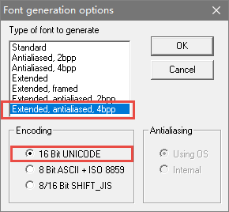

2) 点击OK后，选择字体为思源黑体，字形常规，大小36，尺寸单位选择Pixels，
见图 选择字体和大小_ ；

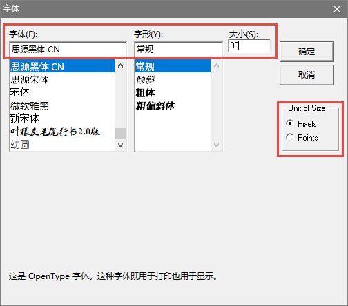

3) 失能所有字符。为了让字体转换器只生成我们想要的部分，需要失能所以字符，
字体转换器左上角菜单栏左键点击Edit-> Disable all characters，见 失能所有字符_ ；

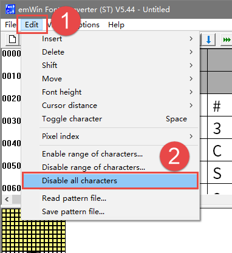

4) 制作模式文件。接着新建一个txt文件，把想要生成的字符输入txt文件并保存为UTF-16 LE编码格式，如果没有这个格式则保存为Unicode，
见图 制作模式文件_ 和图 保存为UTF-16_LE编码格式_ ；

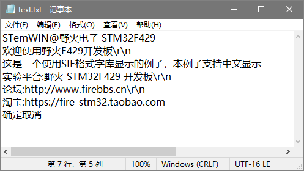

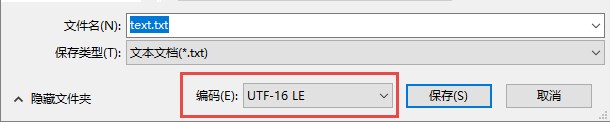

5) 导入模式文件。将制作好的模式文件导入字体转换器，在字体转换器左上角菜单栏左键单击Edit->Read parttern file，
见图 导入模式文件_ ；

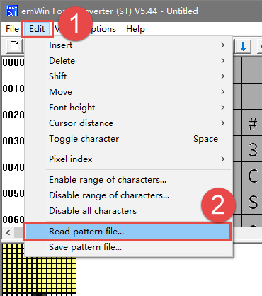

6) 保存字库。导入模式文件之后，点击字体转换器左上角的File，然后选择Save As，设置文件名为思源黑体36_4bpp，保存文件格式为.sif，
见图 保存字库_ 和图 选择保存类型_ 。

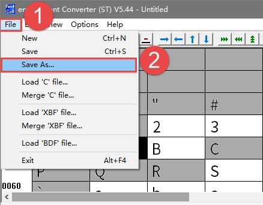

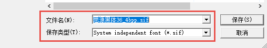

7) 最后，等待字体转换器转换完成。
完成后会在窗口左下角显示“Ready”，见图 等待转换完成_ 。

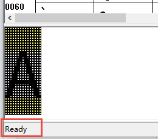

至此，一个SIF格式的字库就生成完毕了，使用相同的方法再制作一个新宋体18_4bpp.sif，和思源黑体36_4bpp.sif一起放到SD卡的Font目录下。

SIF字体相关API
~~~~~~~~~~~~~~~~~~~~~~~~~~~~~~

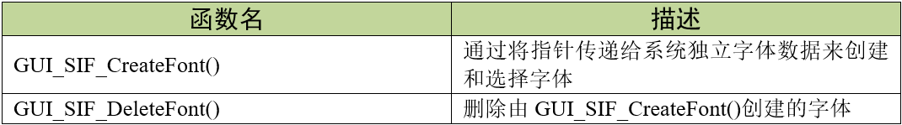

GUI_SIF_CreateFont()
^^^^^^^^^^^^^^^^^^^^^^^^^^

通过将指针传递给系统独立字体数据来设置要使用的字体。

.. code-block:: c
    :caption: 代码清单:SIF-1 函数原型
    :name: 代码清单:SIF-1
    :linenos:

    void GUI_SIF_CreateFont(const void *pFontData, GUI_FONT *pFont, const
                            GUI_SIF_TYPE *pFontType);

1) pFontData：
指向系统独立字体数据的指针；

2) pFont：
指向RAM中由该函数填充的GUI_FONT结构的指针；

3) pFontType：
字体类型，可选值见表格 pFontType可选值_ 。

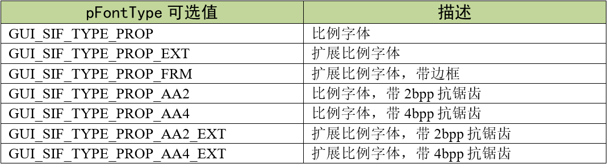

在使用这个函数的时候，emWin需要用字体信息填充GUI_FONT结构。用户需要在参数pFont中传递一个指向这个结构的指针。在使用字体期间，此结构的内容必须保持有效。

该函数不知道应该创建哪种字体。要告诉函数要创建的字体的类型，必须在参数pFontType中传递。这样做是为了避免不必要的代码链接。

GUI_SIF_DeleteFont()
^^^^^^^^^^^^^^^^^^^^^^^^

删除参数pFont指向的字体。

.. code-block:: c
    :caption: 代码清单:SIF-2 函数原型
    :name: 代码清单:SIF-2
    :linenos:

    void GUI_SIF_DeleteFont(GUI_FONT *pFont);

1) pFont：
指向要删除的字体的指针。

使用GUI_SIF_CreateFont()创建的字体之后，如果不再使用，应该删除该字体。

SIF格式字体显示实验
~~~~~~~~~~~~~~~~~~~~~~~~~~~~~~~

代码分析
^^^^^^^^^^

在本实验中我们提供了两种字库存放区域，一种是SPI FLASH的非文件系统区域，一种是SD卡文件系统区域，如代码清单:SIF-3。

.. code-block:: c
    :caption: 代码清单:SIF-3字库存放位置（GUIFont_Create.h文件）
    :name: 代码清单:SIF-3
    :linenos:

    //设置SIF字体存储的位置：
    //FLASH非文件系统区域（推荐）USE_FLASH_FONT  0
    //SD卡文件系统区域          USE_SDCARD_FONT 1
    #define SIF_FONT_SOURCE       1

    /*
    （速度最快）字库在FLASH的非文件系统区域，使用前需
    要往FLASH特定地址拷贝字体文件 */
    #define USE_FLASH_FONT        0
    /*
    （速度中等）字库存储在SD卡文件系统区域，调试比较
    方便，直接使用读卡器从电脑拷贝字体文件即可 */
    #define USE_SDCARD_FONT       1

上述代码中，SIF_FONT_SOURCE决定着程序从什么位置读取字库数据，为0时，从SPI FLASH中读取字库；为1时，
则从SD卡中读取字库。在GUIFont_Create.c文件中，提供了从SPI_FLASH或者SD卡读取字库数据的函数。我们选择从SD卡读取字库。

如果从SPI FLASH中读取字库，请先运行《刷外部FLASH程序（烧录STemWIN资源文件）》例程，
将emWin相关的资源烧录到SPI FLASH中，否则字库实验无法进行。

创建字体
'''''''''''''

.. code-block:: c
    :caption: 代码清单:SIF-4 FONT_SIF_GetData函数（GUIFont_Create.c文件）
    :name: 代码清单:SIF-4
    :linenos:

    /**
    * @brief  加载字体数据到SDRAM
    * @note 无
    * @param  res_name：要加载的字库文件名
    * @retval Fontbuffer：已加载好的字库数据
    */
    void *FONT_SIF_GetData(const char *res_name)
    {
        uint8_t *Fontbuffer;
        GUI_HMEM hFontMem;

    #elif (SIF_FONT_SOURCE == USE_SDCARD_FONT)

        if (storage_init_flag == 0) {
            /* 挂载sd卡文件系统 */
            res = f_mount(&fs,FONT_STORAGE_ROOT_DIR,1);
            storage_init_flag = 1;
        }

        /* 打开字库 */
        res = f_open(&fnew , res_name, FA_OPEN_EXISTING | FA_READ);
        if (res != FR_OK) {
            printf("Open font failed! res = %d\r\n", res);
            while (1);
        }

        /* 申请一块动态内存空间 */
        hFontMem = GUI_ALLOC_AllocZero(fnew.fsize);
        /* 转换动态内存的句柄为指针 */
        Fontbuffer = GUI_ALLOC_h2p(hFontMem);

        /* 读取内容 */
        res = f_read(&fnew, Fontbuffer, fnew.fsize, &br);
        if (res != FR_OK) {
            printf("Read font failed! res = %d\r\n", res);
            while (1);
        }
        f_close(&fnew);

        return Fontbuffer;
    #endif
    }

首先是字库数据加载函数，如 代码清单:SIF-4_ 所示，由于函数实际代码较长，
我们只截取了从SD卡中读取的部分。FONT_SIF_GetData函数负责将字库文件从SD卡加载到SDRAM中，操作步骤其实跟图片显示很类似，
都是先申请一块动态内存并转换为指针，然后使用f_read函数把字库读取到动态内存中。

.. code-block:: c
    :caption: 代码清单:SIF-5 Create_SIF_Font函数（GUIFont_create.c文件）
    :name: 代码清单:SIF-5
    :linenos:

    /* 字库结构体 */
    GUI_FONT      FONT_SIYUANHEITI_36_4BPP;
    GUI_FONT      FONT_XINSONGTI_18_4BPP;

    /* 字库缓冲区 */
    uint8_t *SIFbuffer36;
    uint8_t *SIFbuffer18;

    /**
    * @brief  创建SIF字体
    * @param  无
    * @retval 无
    */
    void Create_SIF_Font(void)
    {
        /* 获取字体数据 */
        SIFbuffer18 = FONT_SIF_GetData(FONT_XINSONGTI_18_ADDR);
        SIFbuffer36 = FONT_SIF_GetData(FONT_SIYUANHEITI_36_ADDR);

        /* 新宋体18 */
        GUI_SIF_CreateFont(SIFbuffer18,/* 已加载到内存中的字体数据 */
                        &FONT_XINSONGTI_18_4BPP,/* GUI_FONT 字体结构体指针 */
                        GUI_SIF_TYPE_PROP_AA4_EXT);/* 字体类型 */
        /* 思源黑体36 */
        GUI_SIF_CreateFont(SIFbuffer36,/* 已加载到内存中的字体数据 */
                        &FONT_SIYUANHEITI_36_4BPP,/* GUI_FONT 字体结构体指针 */
                        GUI_SIF_TYPE_PROP_AA4_EXT);/* 字体类型 */
    }

如 代码清单:SIF-5_ 所示，字库数据成功加载到SDRAM后，
调用GUI_SIF_CreateFont函数创建SIF字体，此函数的第三个参数为字体类型，必须严格等于字库转换器中选择的类型。

创建并转换待显示文本
'''''''''''''''''''''''''

由于keil5文本编辑器的BUG问题，SIF格式字体显示实验同样需要多一个单独转字符编码的步骤，
具体如何转换字符编码请查看37.4.1 小节，在此不再重复说明。

创建对话框
''''''''''''''''

转换好代码之后就还是像其他讲解控件的例程一样，创建对话框。

.. code-block:: c
    :caption: 代码清单:SIF-6 创建对话框（MainTask.c文件）
    :name: 代码清单:SIF-6
    :linenos:

    /* 控件ID */
    #define ID_FRAMEWIN_0   (GUI_ID_USER + 0x00)
    #define ID_TEXT_0   (GUI_ID_USER + 0x01)
    #define ID_TEXT_1   (GUI_ID_USER + 0x02)
    #define ID_MULTIEDIT_0   (GUI_ID_USER + 0x03)
    #define ID_BUTTON_0   (GUI_ID_USER + 0x04)
    #define ID_BUTTON_1   (GUI_ID_USER + 0x05)

    /* 资源表 */
    static const GUI_WIDGET_CREATE_INFO _aDialogCreate[] = {
        { FRAMEWIN_CreateIndirect, "Framewin", ID_FRAMEWIN_0, 0, 0, 800,
        480, 0, 0x0, 0 },
        { TEXT_CreateIndirect, "Text", ID_TEXT_0, 20, 35, 580, 50, 0, 0x64,
        0 },
        { TEXT_CreateIndirect, "Text", ID_TEXT_1, 20, 80, 740, 80, 0, 0x64,
        0 },
        { MULTIEDIT_CreateIndirect, "Multiedit", ID_MULTIEDIT_0, 20, 200,
        480, 130, 0, 0x0, 0 },
        { BUTTON_CreateIndirect, "Button", ID_BUTTON_0, 560, 200, 140, 36,
        0, 0x0, 0 },
        { BUTTON_CreateIndirect, "Button", ID_BUTTON_1, 560, 292, 140, 36,
        0, 0x0, 0 },
    };

    /**
    * @brief 以对话框方式间接创建控件
    * @note 无
    * @param 无
    * @retval hWin：资源表中第一个控件的句柄
    */
    WM_HWIN CreateFramewin(void)
    {
        WM_HWIN hWin;

        hWin = GUI_CreateDialogBox(_aDialogCreate, GUI_COUNTOF(
            _aDialogCreate), _cbDialog, WM_HBKWIN, 0, 0);
        return hWin;
    }

在 代码清单:SIF-6_ 中我们定义了6个ID：1个框架窗口ID、
2个文本控件ID、1个多行文本控件和2个按钮控件ID，这些控件都用来做中文显示。

对话框回调函数
'''''''''''''''

.. code-block:: c
    :caption: 代码清单:SIF-7 对话框回调函数
    :name: 代码清单:SIF-7
    :linenos:

    /**
    * @brief 对话框回调函数
    * @note 无
    * @param pMsg：消息指针
    * @retval 无
    */
    static void _cbDialog(WM_MESSAGE * pMsg)
    {
        WM_HWIN hItem;
        int     NCode;
        int     Id;

        switch (pMsg->MsgId) {
        case WM_INIT_DIALOG:
            /* 初始化Framewin控件 */
            hItem = pMsg->hWin;
            FRAMEWIN_SetTitleHeight(hItem, 32);
            FRAMEWIN_SetText(hItem, Framewin_text);
            FRAMEWIN_SetFont(hItem, &FONT_SIYUANHEITI_36_4BPP);
            /* 初始化TEXT0 */
            hItem = WM_GetDialogItem(pMsg->hWin, ID_TEXT_0);
            TEXT_SetText(hItem, text);
            TEXT_SetFont(hItem, &FONT_XINSONGTI_18_4BPP);
            /* 初始化TEXT1 */
            hItem = WM_GetDialogItem(pMsg->hWin, ID_TEXT_1);
            TEXT_SetText(hItem, text);
            TEXT_SetFont(hItem, &FONT_SIYUANHEITI_36_4BPP);
            /* 初始化MULTIEDIT0 */
            hItem = WM_GetDialogItem(pMsg->hWin, ID_MULTIEDIT_0);
            MULTIEDIT_SetReadOnly(hItem, 1);
            MULTIEDIT_SetBufferSize(hItem, 200);
            MULTIEDIT_SetWrapWord(hItem);
            MULTIEDIT_SetText(hItem, MULTIEDIT_text);
            MULTIEDIT_SetFont(hItem, &FONT_SIYUANHEITI_36_4BPP);
            MULTIEDIT_SetTextColor(hItem, MULTIEDIT_CI_READONLY, GUI_GREEN)
                                ;
            MULTIEDIT_SetBkColor(hItem, MULTIEDIT_CI_READONLY, GUI_BLACK);
            MULTIEDIT_ShowCursor(hItem, 0);
            /* 初始化Button0 */
            hItem = WM_GetDialogItem(pMsg->hWin, ID_BUTTON_0);
            BUTTON_SetFont(hItem, &FONT_SIYUANHEITI_36_4BPP);
            BUTTON_SetText(hItem, BUTTON_text[0]);
            /* 初始化Button1 */
            hItem = WM_GetDialogItem(pMsg->hWin, ID_BUTTON_1);
            BUTTON_SetFont(hItem, &FONT_SIYUANHEITI_36_4BPP);
            BUTTON_SetText(hItem, BUTTON_text[1]);
            break;
        case WM_NOTIFY_PARENT:
            Id    = WM_GetId(pMsg->hWinSrc);
            NCode = pMsg->Data.v;
            switch (Id) {
            case ID_MULTIEDIT_0: // Notifications sent by 'Multiedit'
                switch (NCode) {
                case WM_NOTIFICATION_CLICKED:
                    break;
                case WM_NOTIFICATION_RELEASED:
                    break;
                case WM_NOTIFICATION_VALUE_CHANGED:
                    break;
                }
                break;
            case ID_BUTTON_0: // Notifications sent by 'Button'
                switch (NCode) {
                case WM_NOTIFICATION_CLICKED:
                    break;
                case WM_NOTIFICATION_RELEASED:
                    break;
                }
                break;
            case ID_BUTTON_1: // Notifications sent by 'Button'
                switch (NCode) {
                case WM_NOTIFICATION_CLICKED:
                    break;
                case WM_NOTIFICATION_RELEASED:
                    break;
                }
                break;
            }
            break;
        default:
            WM_DefaultProc(pMsg);
            break;
        }
    }

1. WM_INIT_DIALOG消息

在上述代码中，设置了对话框也就是框架窗口的标题栏高度为32像素，
字体高度32像素，并在标题栏中显示 **STemWIN@EmbedFire STM32F429**。

代码清单:SIF-7_ 中TEXT0控件使用新宋体18号字体，
其余控件均使用思源黑体36号字体带2bpp抗锯齿。接着就都是各个控件的常规初始化配置，这些在前面的章节已有讲解，在此不再赘述了。

2. 其他消息

所有我们不关心或者没有用到的系统消息都可以调用默认消息处理函数WM_DefaultProc进行处理。

MainTask函数
''''''''''''''''

.. code-block:: c
    :caption: 代码清单:SIF-8 MainTask函数（MainTask.c文件）
    :name: 代码清单:SIF-8
    :linenos:

    /**
    * @brief GUI主任务
    * @note 无
    * @param 无
    * @retval 无
    */
    void MainTask(void)
    {
        /* 启用UTF-8编码 */
        GUI_UC_SetEncodeUTF8();
        /* 创建字体 */
        Create_SIF_Font();
        /* 创建窗口 */
        CreateFramewin();
        while (1) {
            GUI_Delay(100);
        }
    }

字体创建完成之后如果少了一步操作，那么整个中文字库还是不能用。如 代码清单:SIF-8_ 的GUI主任务函数MainTask所示，
在创建我们需要的中文字体之前必须首先使用GUI_UC_SetEncodeUTF8函数开启emwin的UTF-8编码，这样才能保证中文字符的正常显示。

实验现象
^^^^^^^^^^^^

SIF字体显示实验的现象如图 SIF格式字体显示实验现象_ 所示，
可以看到两种不同字体的显示效果。

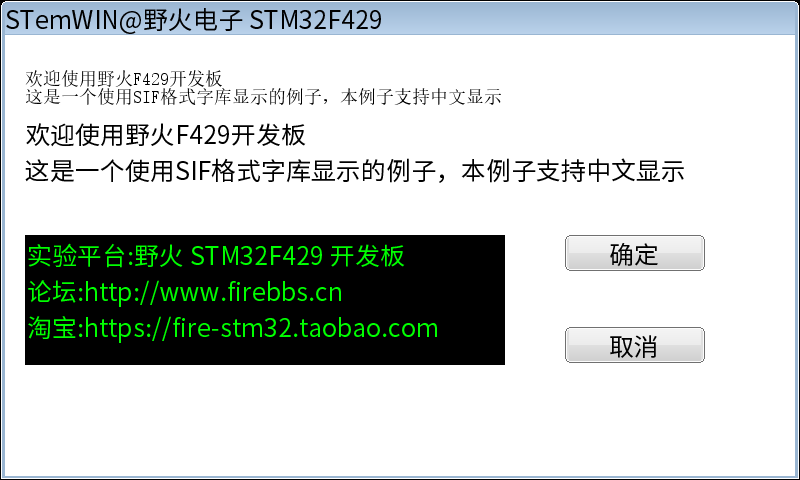

