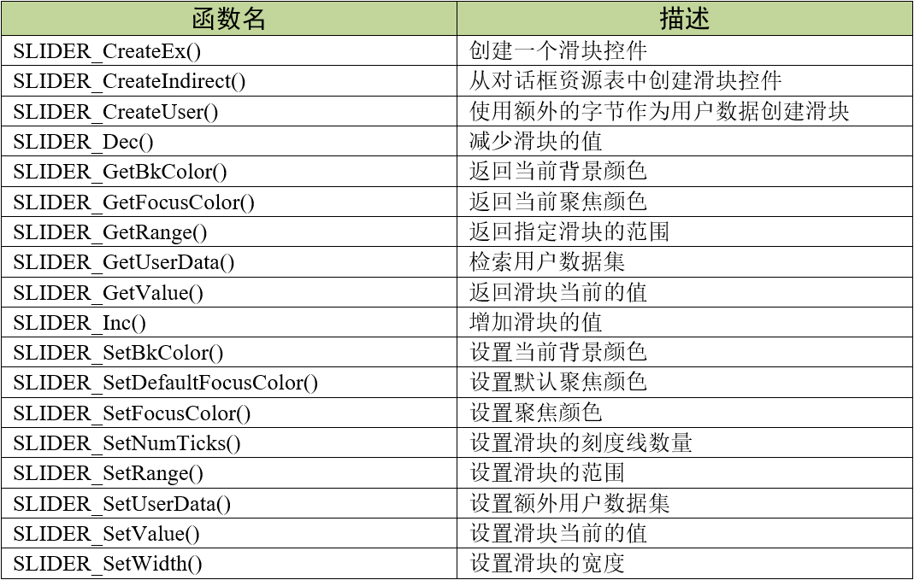

.. vim: syntax=rst

滑块控件
===========

滑块（Slider）控件通常用于在一定范围内修改数值，类似手机上用来调整屏幕亮度或音量的控件。
滑块控件由一个滑动条和条旁边的刻度标记组成，这些刻度标记可用于在拖动滑块时吸附滑块。

滑块控件的外观如图 滑块控件默认外观_ 所示。

滑块控件支持3种通知代码，以区分各种不同的操作动作，见表格 滑块控件支持的通知代码_ 。

这3种通知代码是作为WM_NOTIFY_PARENT消息的一部分发送到其父窗口的。当用户点击按钮后，
窗口管理器会让滑块控件向父窗口发送WM_NOTIFY_PARENT消息，并且会在消息结构的Data.v成员中附加相应的通知代码，
用户程序可以读取此成员来检测不同的按钮动作以及实现各种功能。

同时滑块控件也支持输入焦点，它可以接收如表格 滑块控件支持的按键消息_ 所示的按键消息。

创建滑块控件
~~~~~~~~~~~~~~~~~~

滑块控件API
^^^^^^^^^^^^^^^^^^^

滑块控件创建函数
^^^^^^^^^^^^^^^^^^^^^^^^

SLIDER_CreateEx()
'''''''''''''''''''''''''

在指定位置创建指定大小的滑块控件。

.. code-block:: c
    :caption: 代码清单:滑块-1 函数原型
    :name: 代码清单:滑块-1
    :linenos:

    SLIDER_Handle SLIDER_CreateEx(int x0, int y0, int xSize, int ySize,
                                WM_HWIN hParent, int WinFlags, int
                                ExFlags, int Id);

1) x0：
滑块控件在父坐标中的最左侧像素；

2) y0：
滑块控件在父坐标中的最顶侧像素；

3) xSize：
滑块的水平尺寸，以像素为单位；

4) ySize：
滑块的垂直尺寸，以像素为单位；

5) hParent：
父窗口句柄。如果为0，则将桌面窗口作为其父窗口；

6) WinFlags：
窗口创建标志。由于控件本质上是窗口，所以滑块控件在创建时可以使用几乎所有的窗口创建标志。
这些标志中按钮最常用的是WM_CF_SHOW。全部创建标志请参考emWin手册的窗口管理器章节；

7) ExFlags：
特殊创建标志。用于调整滑块方向，默认水平方向，可通过可选值SLIDER_CF_VERTICAL设置为垂直方向；

8) Id：
控件ID号。

返回值：创建成功后返回已创建的滑块控件句柄，创建失败则返回0。

SLIDER_CreateIndirect()
'''''''''''''''''''''''''''''''

从对话框资源表中创建滑块控件。

.. code-block:: c
    :caption: 代码清单:滑块-2 函数原型
    :name: 代码清单:滑块-2
    :linenos:

    SLIDER_Handle SLIDER_CreateIndirect(const GUI_WIDGET_CREATE_INFO
                                        *pCreateInfo, WM_HWIN hWinParent,
                                        int x0, int y0, WM_CALLBACK *cb);

1) pCreateInfo：
指向GUI_WIDGET_CREATE_INFO结构的指针；

2) hParent：
父窗口的句柄；

3) x0：
滑块控件在父坐标中的最左边像素；

4) y0：
滑块控件在父坐标中的最顶部像素；

5) cb：
回调函数指针。

此函数的第一个参数指向的是 **代码清单:控件基础-3** 的资源表结构，但不使用其中的para参数，
其中的Flags参数的可选值与SLIDER_CreateEx()函数的ExFlags参数相同。

滑块控件基础实验
~~~~~~~~~~~~~~~~~~~~~~~~

代码分析
^^^^^^^^^^^^

创建对话框
''''''''''''''''

.. code-block:: c
    :caption: 代码清单:滑块-3 创建对话框（SliderDLG.c文件）
    :name: 代码清单:滑块-3
    :linenos:

    /* 控件ID */
    #define ID_FRAMEWIN_0   (GUI_ID_USER + 0x00)
    #define ID_SLIDER_0     (GUI_ID_USER + 0x01)
    #define ID_SLIDER_1     (GUI_ID_USER + 0x02)
    #define ID_SLIDER_2     (GUI_ID_USER + 0x03)
    #define ID_EDIT_0       (GUI_ID_USER + 0x04)
    #define ID_EDIT_1       (GUI_ID_USER + 0x05)

    /* 资源表 */
    static const GUI_WIDGET_CREATE_INFO _aDialogCreate[] = {
        { FRAMEWIN_CreateIndirect, "Framewin", ID_FRAMEWIN_0, 0, 0, 800,
        480, 0, 0x0, 0 },
        { SLIDER_CreateIndirect, "Slider", ID_SLIDER_0, 100, 40, 600, 40,
        0, 0x0, 0 },
        { SLIDER_CreateIndirect, "Slider", ID_SLIDER_1, 100, 105, 40, 300,
        8, 0x0, 0 },
        { SLIDER_CreateIndirect, "Slider", ID_SLIDER_2, 220, 125, 480, 40,
        0, 0x0, 0 },
        { EDIT_CreateIndirect, "Edit", ID_EDIT_0, 40, 40, 50, 40, 0, 0x4,
        0 },
        { EDIT_CreateIndirect, "Edit", ID_EDIT_1, 40, 105, 50, 40, 0, 0x3,
        0 },
    };

    /**
    * @brief 以对话框方式间接创建控件
    * @note 无
    * @param 无
    * @retval hWin：资源表中第一个控件的句柄
    */
    WM_HWIN CreateFramewin(void)
    {
        WM_HWIN hWin;

        hWin = GUI_CreateDialogBox(_aDialogCreate, GUI_COUNTOF(
            _aDialogCreate), _cbDialog, WM_HBKWIN, 0, 0);
        return hWin;
    }

在 代码清单:滑块-3_ 中我们定义了6个ID：一个框架窗口ID、3个滑块控件ID和2个编辑框控件。
当然也可以使用emWin预定义好的滑块控件ID，但最多只有GUI_ID_SLIDER0到GUI_ID_SLIDER9，共10个ID可供使用。

我们重点关注滑块控件资源表的倒数第三个参数Flags，这个参数决定了滑块是水平方向还是垂直方向，
默认水平，可使用SLIDER_CF_VERTICAL或十进制数8设置为垂直方向。

对话框回调函数
''''''''''''''''

.. code-block:: c
    :caption: 代码清单:滑块-4 对话框回调函数（SliderDLG.c文件）
    :name: 代码清单:滑块-4
    :linenos:

    /**
    * @brief 对话框回调函数
    * @note 无
    * @param pMsg：消息指针
    * @retval 无
    */
    static void _cbDialog(WM_MESSAGE* pMsg)
    {
        WM_HWIN hItem;
        WM_HWIN hSlider;
        WM_HWIN hEdit;
        int     NCode;
        int     Id;
        int     value;

        switch (pMsg->MsgId) {
        case WM_INIT_DIALOG:
            /* 初始化Framewin控件 */
            hItem = pMsg->hWin;
            FRAMEWIN_SetTitleHeight(hItem, 32);
            FRAMEWIN_SetText(hItem, "STemWIN@EmbedFire STM32F429");
            FRAMEWIN_SetFont(hItem, GUI_FONT_32_ASCII);
            /* 初始化Slider0 */
            hItem = WM_GetDialogItem(pMsg->hWin, ID_SLIDER_0);
            SLIDER_SetRange(hItem, 0, 1000);
            /* 初始化Slider1 */
            hItem = WM_GetDialogItem(pMsg->hWin, ID_SLIDER_1);
            SLIDER_SetRange(hItem, 0, 100);
            SLIDER_SetWidth(hItem, 20);
            /* 初始化Slider2 */
            hItem = WM_GetDialogItem(pMsg->hWin, ID_SLIDER_2);
            SLIDER_SetSkinClassic(hItem);
            SLIDER_SetWidth(hItem, 30);
            /* 初始化Edit0 */
            hItem = WM_GetDialogItem(pMsg->hWin, ID_EDIT_0);
            EDIT_SetText(hItem, "0000");
            EDIT_SetTextAlign(hItem, GUI_TA_HCENTER | GUI_TA_VCENTER);
            EDIT_SetFont(hItem, GUI_FONT_COMIC18B_ASCII);
            EDIT_SetDecMode(hItem, 0, 0, 1000, 0, GUI_EDIT_NORMAL);
            /* 初始化Edit1 */
            hItem = WM_GetDialogItem(pMsg->hWin, ID_EDIT_1);
            EDIT_SetText(hItem, "000");
            EDIT_SetTextAlign(hItem, GUI_TA_HCENTER | GUI_TA_VCENTER);
            EDIT_SetFont(hItem, GUI_FONT_COMIC18B_ASCII);
            EDIT_SetDecMode(hItem, 0, 0, 100, 0, GUI_EDIT_NORMAL);
            break;
        case WM_NOTIFY_PARENT:
            Id = WM_GetId(pMsg->hWinSrc);
            NCode = pMsg->Data.v;
            switch (Id) {
            case ID_SLIDER_0: // Notifications sent by 'Slider0'
                switch (NCode) {
                case WM_NOTIFICATION_CLICKED:
                    break;
                case WM_NOTIFICATION_RELEASED:
                    break;
                case WM_NOTIFICATION_VALUE_CHANGED:
                    /*
                    滑块的值被改变，将改变后的值更新到EDIT
                    控件中 */
                    hSlider = WM_GetDialogItem(pMsg->hWin, ID_SLIDER_0);
                    hEdit = WM_GetDialogItem(pMsg->hWin, ID_EDIT_0);
                    value = SLIDER_GetValue(hSlider);
                    EDIT_SetValue(hEdit, value);
                    break;
                }
                break;
            case ID_SLIDER_1: // Notifications sent by 'Slider1'
                switch (NCode) {
                case WM_NOTIFICATION_CLICKED:
                    break;
                case WM_NOTIFICATION_RELEASED:
                    break;
                case WM_NOTIFICATION_VALUE_CHANGED:
                    /*
                    滑块的值被改变，将改变后的值更新到EDIT
                    控件中 */
                    hSlider = WM_GetDialogItem(pMsg->hWin, ID_SLIDER_1);
                    hEdit = WM_GetDialogItem(pMsg->hWin, ID_EDIT_1);
                    value = SLIDER_GetValue(hSlider);
                    EDIT_SetValue(hEdit, value);
                    break;
                }
                break;
            case ID_EDIT_0: // Notifications sent by 'EDIT0'
                switch (NCode) {
                case WM_NOTIFICATION_CLICKED:
                    break;
                case WM_NOTIFICATION_RELEASED:
                    break;
                case WM_NOTIFICATION_VALUE_CHANGED:
                    break;
                }
                break;
            case ID_EDIT_1: // Notifications sent by 'EDIT1'
                switch (NCode) {
                case WM_NOTIFICATION_CLICKED:
                    break;
                case WM_NOTIFICATION_RELEASED:
                    break;
                case WM_NOTIFICATION_VALUE_CHANGED:
                    break;
                }
                break;
            }
            break;
        default:
            WM_DefaultProc(pMsg);
            break;
        }
    }

1. WM_INIT_DIALOG消息

在 代码清单:滑块-4_ 中，我们设置框架窗口的标题栏高度为32像素，字体高度32像素，
并在标题栏中显示 **STemWIN@EmbedFire STM32F429**。

滑块控件相关API函数几乎都是使用句柄来操作的，但在建立对话框资源表的时候并没有定义它的句柄，
那就需要通过WM_GetDialogItem函数来自动建立并获取滑块控件的句柄。成功获取到句柄后可以开始进一步设置滑块控件。
我们重点关注滑块控件的设置，编辑框控件只是辅助显示滑块数值，它的初始化设置在第22章 已经讲过就不再赘述了。

首先使用SLIDER_SetRange设置ID_SLIDER_0的范围0~1000，ID_SLIDER_1的范围0~100，
SLIDER_SetWidth函数设置ID_SLIDER_1的宽度为20像素，ID_SLIDER_2的宽度为30像素，
SLIDER_SetSkinClassic函数将ID_SLIDER_2设置为经典皮肤。

滑块控件功能比较单一，所以需要设置的地方也比较少。

2. WM_NOTIFY_PARENT消息

这个消息是对话框回调函数的重点，所有对话框子控件的具体行为逻辑都在此消息中设置和处理。
在此消息中以控件ID来区分各个不同的控件。

滑块控件的值需要随着滑块的滑动一直更新，所以我们在通知代码WM_NOTIFICATION_VALUE_CHANGED中，
使用SLIDER_GetValue函数获取当前滑块的值，然后使用EDIT_SetValue函数把得到的值送到编辑框中。
这样就实现了滑动滑块控件的同时更新编辑框中数值的功能。

3. 其他消息

所有我们不关心或者没有用到的系统消息都可以调用默认消息处理函数WM_DefaultProc进行处理。

实验现象
^^^^^^^^^^^^

滑块控件基础实验的实验现象如图 滑块控件基础实验初始状态_ 和图 滑块控件基础实验滑动后的现象_ 所示，
可以看到滑动滑块后编辑框内的数值会跟着相应改变，ID_SLIDER_2的外观和前两个滑块不同。

