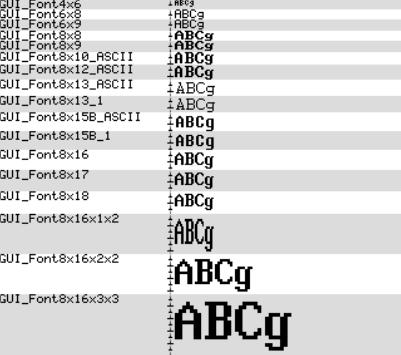

.. vim: syntax=rst

emWin支持的字体
================

熟悉各种字符编码后，我们来简要介绍以下emWin所支持的字体，本章节只是一种简短的介绍，详细的讲解和某些字体的使用步骤还请参考emWIn手册。

emWin将最常用的字体以C文件字库的形式包含在库中，并且所有字体文件都包含ASCII字符集，而且大多数还包含ISO 8859-1字符集。
这些字体文件允许最多256个不同的字符代码，其中前32个保留为控制字符。除了包含ASCII字符集和ISO 8859-1字符集外，
emWin的字体还包括抗锯齿、复合字符绘制（例如泰文）、位于外部不可寻址介质上的字体和TrueType支持。
其中TrueType为矢量字体格式，其他所有类型的字体都是位图字体。

支持的字体类型
~~~~~~~~~~~~~~~~~~~~~~~~~

emWin中的字库文件支持如下一些内部字体类型。

等宽位图字体
'''''''''''''''''''''

等宽位图字体的每个字符都具有相同的大小。在比例字体中，每个字符都有自己的宽度，而在等宽字体中，宽度只定义一次。
像素信息用1bpp即1位色彩深度保存，覆盖整个字符区域。图 emWin支持的等宽位图字体_ 是emWin内支持的所有等宽位图字体。

比例位图字体
'''''''''''''''''''''

比例位图字体的每个字符的高度相同，宽度不同。像素信息用1bpp即1位色彩深度保存，覆盖整个字符区域。
比例位图字体的显示效果如图 比例位图字体_ 所示。

2bpp抗锯齿字体
''''''''''''''''''''''''''''

每个2bpp抗锯齿字体的每个字符的高度相同，宽度不同。 像素信息用2bpp抗锯齿信息保存，并覆盖整个字符区域。
2bpp抗锯齿字体的显示效果如图 2bpp抗锯齿字体_ 所示。

4bpp抗锯齿字体
''''''''''''''''''''''''''''

每个4bpp抗锯齿字体的每个字符的高度相同，宽度不同。像素信息用4bpp抗锯齿信息保存，并覆盖整个字符区域。
4bpp抗锯齿字体的显示效果如图 4bpp抗锯齿字体_ 所示。

扩展比例位图字体
'''''''''''''''''''''''''

扩展比例位图字体的每个字符都有自己的高度和宽度。像素信息用1bpp保存，只覆盖字形位图的区域。
扩展比例位图字体的显示效果如图 扩展比例位图字体_ 所示。

带2bpp抗锯齿的扩展比例位图字体
''''''''''''''''''''''''''''''''''''''''''''''''''''''''''''''''

每个2bpp抗锯齿扩展比例字体字符都有自己的高度和宽度。像素信息用2bpp抗锯齿信息保存，只覆盖字形位图的区域。
带2bpp抗锯齿的扩展比例位图字体的显示效果如图 带2bpp抗锯齿的扩展比例位图字体_ 所示。

.. image:: media/Supported_fonts/Suppor007.png
   :align: center
   :name: 带2bpp抗锯齿的扩展比例位图字体
   :alt: 带2bpp抗锯齿的扩展比例位图字体

带4bpp抗锯齿的扩展比例位图字体
''''''''''''''''''''''''''''''''''''''''''''''''''''''''''''''''

每个4bpp抗锯齿扩展比例字体字符都有自己的高度和宽度。像素信息用4bpp抗锯齿信息保存，只覆盖字形位图的区域。
带4bpp抗锯齿的扩展比例位图字体的显示效果如图 带4bpp抗锯齿的扩展比例位图字体_ 。

带边框的扩展比例位图字体
''''''''''''''''''''''''''''''''''''''''''''

如果在编译时背景颜色未知，则最好使用框架字体。无论当前设置如何，边框字体总是以透明模式绘制。
字符像素是用当前选择的前景色绘制的，框架是用背景色绘制的。前景和背景颜色的良好对比确保文本可以在任何背景下阅读。
框架字体不适合泰国语这样的复合字符。它们也不适合阿拉伯字体。
带边框的扩展比例位图字体如图 带边框的扩展比例位图字体_ 所示。

支持的字体格式
~~~~~~~~~~~~~~~~~~~~~~~~~

C文件格式
''''''''''''''''''''

这是最常用的字体使用方式。在使用C文件形式的字体时，我们建议编译所有可用的字体并将它们链接为库模块，
或者将所有字体对象文件放在一个库中，以便与应用程序链接。通过这种方式，您可以确保只有应用程序所需的字体实际上是链接的。字体转换器可用于创建其他字体。

SIF格式
''''''''''''''''''''

SIF格式又叫系统独立字体格式，是包含字体信息的二进制数据块。
emWin自带的字体转换器可用于创建系统独立字体格式的字库，具体方法会在之后章节讲解。

XBF格式
''''''''''''''''''''

外部位图字体（XBF）格式，和SIF字体一样，XBF字体是包含字体信息的二进制数据块，
emWin自带的字体转换器可以用来创建XBF文件，具体方法会在之后章节讲解。

TTF格式
''''''''''''''''''''

TrueType格式是苹果公司开发的一种轮廓字体标准。它为字体开发人员提供了高度的控制，可以控制字体在各种字体高度上的显示方式。
与基于每个字符的位图的位图字体相反，TrueType字体基于矢量图形。 矢量表示的优点是无损可伸缩性。

声明自定义字体
~~~~~~~~~~~~~~~~~~~~~~~~~~~~~

最推荐的声明自定义字体原型的方法是将它们放入一个应用程序定义的头文件中，并且使用这些字体的所有源文件都应该要包含，
见 代码清单:声明自定义字体_ 。

.. code-block:: c
    :caption: 代码清单:声明自定义字体
    :name: 代码清单:声明自定义字体
    :linenos:

    #include "GUI.h"
    extern GUI_CONST_STORAGE GUI_FONT GUI_FontApp1;
    extern GUI_CONST_STORAGE GUI_FONT GUI_FontApp2;

