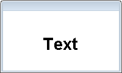
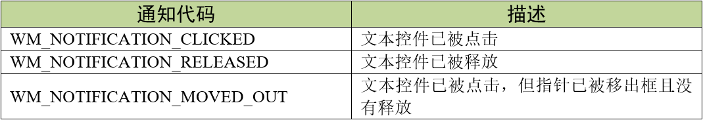
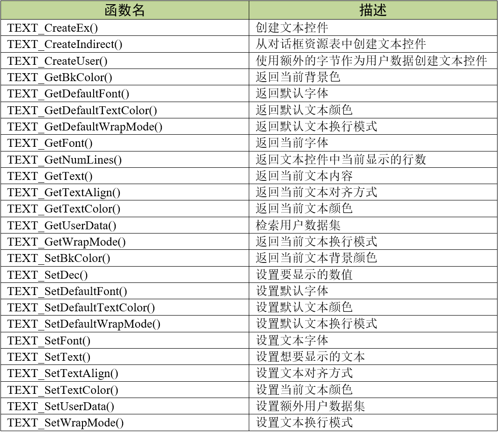
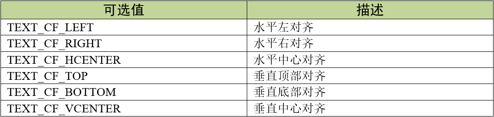
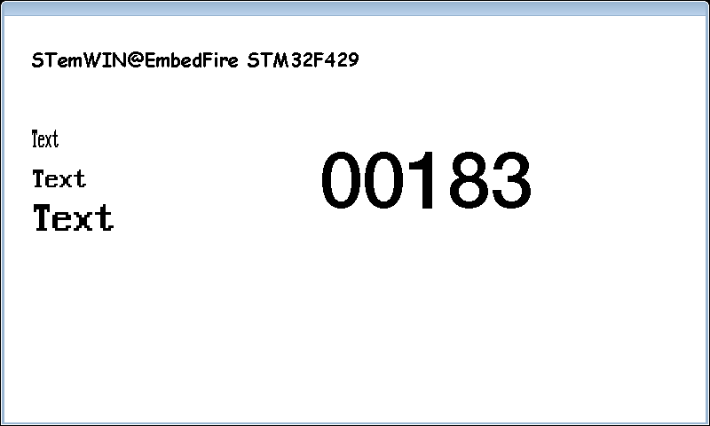

.. vim: syntax=rst

文本控件
=============

文本（TEXT）控件通常用于在对话框或窗口中显示各种文本字段，或者是与其他控件配合使用。
虽然前面章节讲到的文本显示和数值显示API函数同样可以在对话框中使用，但是多多少少有些不方便，
而且独立的控件便于统一管理和控制。文本控件在对话框中的显示效果如图 文本控件在对话框中的显示_ 。

文本控件支持3种通知代码，以区分不同的操作动作，见表格 文本控件支持的通知代码_ 。

实际上文本控件的这些通知代码基本上用不到，就连GUIBuilder生成的代码框架也没有添加这些通知代码。
文本控件不支持获得输入焦点，并且不会对键盘输入做出反应。

创建文本控件
~~~~~~~~~~~~~~~~~~

文本控件API
------------------

文本控件创建函数
------------------------

TEXT_CreateEx()
^^^^^^^^^^^^^^^^^^^^^^^^^

在指定位置创建指定大小的文本控件。

.. code-block:: c
    :caption: 代码清单:文本控件-1 函数原型
    :name: 代码清单:文本控件-1
    :linenos:

    TEXT_Handle TEXT_CreateEx(int x0, int y0, int xSize, int ySize,
                            WM_HWIN hParent, int WinFlags, int ExFlags,
                            int Id, const char *pText);

1) x0：
文本控件在父坐标中的最左侧像素；

2) y0：
文本控件在父坐标中的最顶侧像素；

3) xSize：
文本的水平尺寸，以像素为单位；

4) ySize：
文本的垂直尺寸，以像素为单位；

5) hParent：
父窗口句柄。如果为0，则将桌面窗口作为其父窗口；

6) WinFlags：
窗口创建标志。由于控件本质上是窗口，所以文本控件在创建时可以使用几乎所有的窗口创建标志。
这些标志中按钮最常用的是WM_CF_SHOW。全部创建标志请参考emWin手册的窗口管理器章节；

7) ExFlags：
文本的对齐方式，可选值见表格 ExFlags参数可选值_ ；

8) Id：
控件ID号；

9) pText：
指向要显示的文本的指针。

返回值：创建成功后返回已创建的文本控件句柄，创建失败则返回0。

TEXT_CreateIndirect()
^^^^^^^^^^^^^^^^^^^^^^^^^^^^^^

从对话框资源表中创建文本控件。

.. code-block:: c
    :caption: 代码清单:文本控件-2对话框方式创建文本控件函数
    :name: 代码清单:文本控件-2
    :linenos:

    TEXT_Handle TEXT_CreateIndirect(const GUI_WIDGET_CREATE_INFO *
                                    pCreateInfo, WM_HWIN hWinParent, int
                                    x0, int y0, WM_CALLBACK * cb);

1) pCreateInfo：
指向GUI_WIDGET_CREATE_INFO结构的指针；

2) hParent：
父窗口的句柄；

3) x0：
文本控件在父坐标中的最左边像素；

4) y0：
文本控件在父坐标中的最顶部像素；

5) cb：
回调函数指针。

此函数的第一个参数指向的是 **代码清单:控件基础-3** 的资源表结构，但不使用其中的para参数。
其中的Flags参数的可选值与表格 ExFlags参数可选值_ 相同。

文本控件基础实验
~~~~~~~~~~~~~~~~~~~~~~~~

代码分析
------------

创建对话框
^^^^^^^^^^^^

在本实验中，我们通过对话框的方式来创建文本控件，这样可以方便管理各种界面元素，见 代码清单:文本控件-3_ 。

.. code-block:: c
    :caption: 代码清单:文本控件-3 创建对话框（TextDLG.c文件）
    :name: 代码清单:文本控件-3
    :linenos:

    /* 控件ID */
    #define ID_FRAMEWIN_0   (GUI_ID_USER + 0x00)
    #define ID_TEXT_0   (GUI_ID_USER + 0x01)
    #define ID_TEXT_1   (GUI_ID_USER + 0x02)
    #define ID_TEXT_2   (GUI_ID_USER + 0x03)
    #define ID_TEXT_3   (GUI_ID_USER + 0x04)
    #define ID_TEXT_4   (GUI_ID_USER + 0x05)

    /* 资源表 */
    static const GUI_WIDGET_CREATE_INFO _aDialogCreate[] = {
        { FRAMEWIN_CreateIndirect, "", ID_FRAMEWIN_0, 0, 0, 800, 480, 0,
        0x0, 0 },
        { TEXT_CreateIndirect, "Text0", ID_TEXT_0, 30, 25, 460, 50, 0,
        0x0, 0 },
        { TEXT_CreateIndirect, "Text1", ID_TEXT_1, 30, 120, 100, 40, 0,
        0x0, 0 },
        { TEXT_CreateIndirect, "Text2", ID_TEXT_2, 30, 165, 100, 40, 0,
        0x0, 0 },
        { TEXT_CreateIndirect, "Text3", ID_TEXT_3, 30, 210, 100, 40, 0,
        0x0, 0 },
        { TEXT_CreateIndirect, "Text4", ID_TEXT_4, 350, 120, 250, 130, 0,
        0x0, 0 },
    };

    /**
    * @brief 以对话框方式间接创建控件
    * @note 无
    * @param 无
    * @retval hWin：资源表中第一个控件的句柄
    */
    WM_HWIN CreateFramewin(void)
    {
        WM_HWIN hWin;

        hWin = GUI_CreateDialogBox(_aDialogCreate, GUI_COUNTOF(
            _aDialogCreate), _cbDialog, WM_HBKWIN, 0, 0);
        return hWin;
    }

在 代码清单:文本控件-3_ 中我们定义了6个ID：一个框架窗口ID和5个文本控件ID。当然也可以使用emWin预定义好的文本控件ID，
但最多只有GUI_ID_TEXT0到GUI_ID_TEXT9，共10个ID可供使用。在对话框或窗口中显示的文本控件，它的起始坐标是相对于客户窗口的。

对话框回调函数
^^^^^^^^^^^^^^^^^^^^^^^^

.. code-block:: c
    :caption: 代码清单:文本控件-4 对话框回调函数（TextDLG.c文件）
    :name: 代码清单:文本控件-4
    :linenos:

    static void _cbDialog(WM_MESSAGE *pMsg)
    {
        WM_HWIN hItem;

        switch (pMsg->MsgId) {
        case WM_INIT_DIALOG:
            /* 初始化Text0 */
            hItem = WM_GetDialogItem(pMsg->hWin, ID_TEXT_0);
            TEXT_SetFont(hItem, GUI_FONT_COMIC24B_ASCII);
            TEXT_SetTextAlign(hItem, GUI_TA_LEFT | GUI_TA_VCENTER);
            TEXT_SetText(hItem, "STemWIN@EmbedFire STM32F429");
            /* 初始化Text1 */
            hItem = WM_GetDialogItem(pMsg->hWin, ID_TEXT_1);
            TEXT_SetFont(hItem, GUI_FONT_8X16X1X2);
            TEXT_SetTextAlign(hItem, GUI_TA_LEFT | GUI_TA_VCENTER);
            TEXT_SetText(hItem, "Text");
            /* 初始化Text2 */
            hItem = WM_GetDialogItem(pMsg->hWin, ID_TEXT_2);
            TEXT_SetFont(hItem, GUI_FONT_8X16X2X2);
            TEXT_SetTextAlign(hItem, GUI_TA_LEFT | GUI_TA_VCENTER);
            TEXT_SetText(hItem, "Text");
            /* 初始化Text3 */
            hItem = WM_GetDialogItem(pMsg->hWin, ID_TEXT_3);
            TEXT_SetFont(hItem, GUI_FONT_8X16X3X3);
            TEXT_SetTextAlign(hItem, GUI_TA_LEFT | GUI_TA_VCENTER);
            TEXT_SetText(hItem, "Text");
            /* 初始化Text4 */
            hItem = WM_GetDialogItem(pMsg->hWin, ID_TEXT_4);
            TEXT_SetFont(hItem, GUI_FONT_D48X64);
            TEXT_SetTextAlign(hItem, GUI_TA_HCENTER | GUI_TA_VCENTER);
            TEXT_SetDec(hItem, 0, 5, 0, 0, 0);
            break;
        default:
            WM_DefaultProc(pMsg);
            break;
        }
    }

1. WM_INIT_DIALOG消息

在本实验中，我们不再设置框架窗口的标题栏，而是直接设置文本控件。使用TEXT_SetTextAlign 函数把5个文本控件
的文本对齐方式全部设置为水平左对齐和垂直居中对齐，全部文本对齐方式见表格 ExFlags参数可选值_ ，
使用TEXT_SetFont函数分别给5个控件设置不同的字体，然后TEXT_SetText函数输入想要显示的文本内容，
其中最后一个控件使用TEXT_SetDec函数显示一个5位的不含小数和符号的十进制数。关于TEXT_SetDec函数的具体介绍请查看官方手册。

2. 其他消息

所有我们不关心或者没有用到的系统消息都可以调用默认消息处理函数WM_DefaultProc进行处理。

主任务函数
^^^^^^^^^^^^

在对话框回调函数中设置好文本之后，我们将ID_TEXT_4显示的数值不停的累加，实现一个简单的计数功能。
这个功能的实现方式很多，本实验讲解其中一种，见 代码清单:文本控件-5_ 。

.. code-block:: c
    :caption: 代码清单:文本控件-5 主任务函数（TextDLG.c文件）
    :name: 代码清单:文本控件-5
    :linenos:

    /**
    * @brief GUI主任务
    * @note 无
    * @param 无
    * @retval 无
    */
    void MainTask(void)
    {
        WM_HWIN hWin;
        WM_HWIN hItem;
        U32 temp = 0;

        /* 创建对话框 */
        hWin = CreateFramewin();
        /* 获取子控件句柄 */
        hItem = WM_GetDialogItem(hWin, ID_TEXT_4);
        while (1) {
            /* 使用文本控件显示数值 */
            TEXT_SetDec(hItem, temp, 5, 0, 0, 0);
            temp++;
            if (temp > 99999) {
                temp = 0;
            }
            /* 延时50ms */
            GUI_Delay(50);
        }
    }

在前面讲解框架窗口基础实验的时候提到过，对话框创建函数在创建成功后会返回资源表中第一个控件的句柄，
在本实验中第一个控件就是框架窗口。如 代码清单:文本控件-5_ 所示，根据返回来的框架窗口句柄，
利用WM_GetDialogItem函数和子控件ID号就可以得到对话框内子控件的句柄，即上述代码中的ID_TEXT_4的句柄。
得到子控件句柄后，在while循环中调用TEXT_SetDec函数显示数值temp，并循环累加。这样，一个非常简单的累加计数功能就完成了。

实验现象
------------

文本控件基础实验最终的实验现象如图 文本控件基础实验现象_ 所示，
可以看到各种文本控件的显示效果，并且对话框右侧的数值会不断累加。

