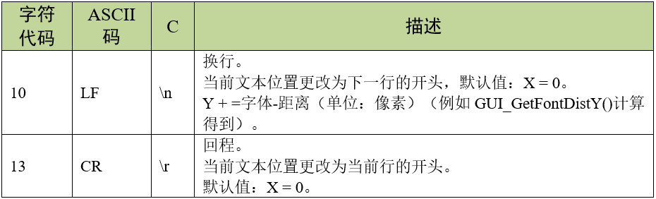
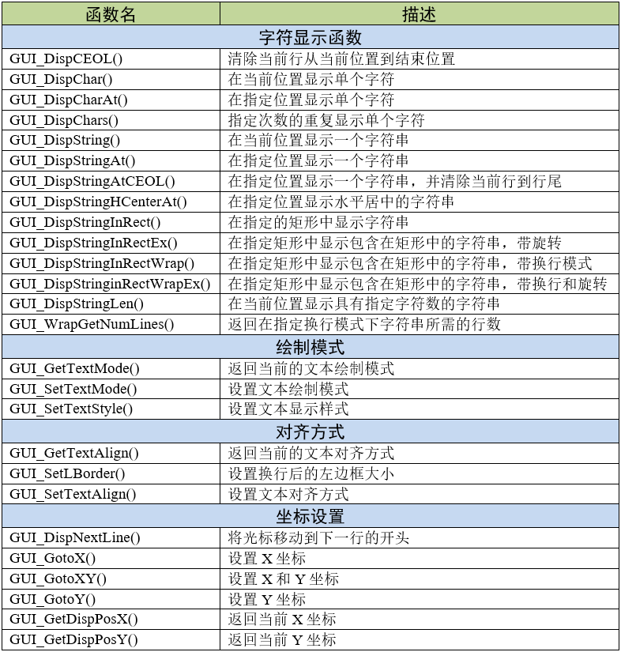
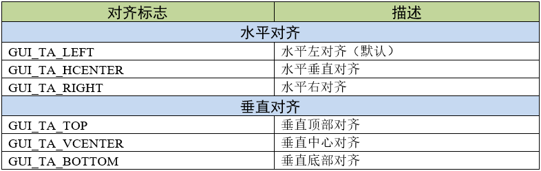
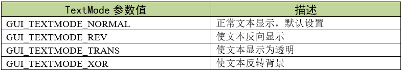
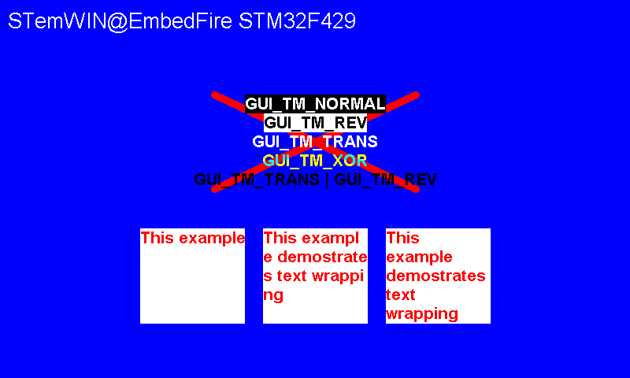

.. vim: syntax=rst

文本显示
============

从本章开始，我们将全程以野火F429挑战者V2开发板为例，讲解如何使用emWin的一些基本功能和控件等。
第8章及之后所有章节的内容均支持野火全系列开发板，使用时仅需针对开发板实际硬件做少量改动即可。

在本章节中，我们将会讲解emWin的文本显示功能。文本显示应该是LCD上用得最多的一个功能，
而在emWin中显示文本也是其最基础的功能。emWin提供了很多的文本显示API函数，使用这些API函数可以实现各种文本效果。

简单文本显示
~~~~~~~~~~~~~~~~~~

在4.4 小节中的BASIC_HelloWorld工程中，其实就是一个最简单的文本显示例程，它调用了GUI_DispString()函数，
并将需要显示的字符串作为参数，即可在屏幕上显示字符。

那如果我们想要只调用一个函数来显示多行字符怎么办呢？
在emWin中我们任然可以使用控制字符来处理多行字符串，表格 支持的控制字符表_ 中是emWin所支持的控制字符。

利用好换行符\n可以方便的显示多行字符。换行符可以作为字符串的一部分，这样就可以只用一个函数显示拥有多行字符的字符串了。

文本显示API
~~~~~~~~~~~~~~~~~~~

emWin为用户提供了很多的文本显示API，如表格 文本显示API函数列表_ 所示。

重要函数
~~~~~~~~~~~~

GUI_DispCEOL()
^^^^^^^^^^^^^^^^^^^

将当前窗口（或显示）中的当前行从当前文本位置清除到窗口末尾，行高度为当前字体的高度。

.. code-block:: c
    :caption: 代码清单:文本显示-1 GUI_DispCEOL()原型
    :name: 代码清单:文本显示-1
    :linenos:

    void GUI_DispCEOL(void);

GUI_DispStringInRectWrap()
^^^^^^^^^^^^^^^^^^^^^^^^^^^^^^^^^^^^^^

在当前窗口中，使用当前字体在指定矩形内的指定位置显示字符串，并可选择换行模式。

.. code-block:: c
    :caption: 代码清单:文本显示-2 GUI_DispStringInRectWrap()原型
    :name: 代码清单:文本显示-2
    :linenos:

    void GUI_DispStringInRectWrap(const char * s,
                                GUI_RECT * pRect,
                                int TextAlign,
                                GUI_WRAPMODE WrapMode);

1) s：
想要显示的字符串

2) pRect：
要写入的矩形(以像素为单位)。

3) TextAlign：
对齐标志。可使用“或”操作进行组合。水平对齐标志和垂直对齐标志应该组合使用。可用的标志见表格 对齐标志_ ：

4) WrapMode：
换行模式。有三种换行模式，分别是：

..

   GUI_WRAPMODE_NONE：不执行自动换行；

   GUI_WRAPMODE_WORD：按照字对齐，对文本进行自动换行；

   GUI_WRAPMODE_CHAR：按照字符对齐，对文本进行自动换行。

GUI_SetTextMode()
^^^^^^^^^^^^^^^^^^^^^^^^^^^^^^^^^^^^^^^^^^^^^^^^^

按照指定的参数设置文本绘制模式。

.. code-block:: c
    :caption: 代码清单:文本显示-3 GUI_SetTextMode()原型
    :name: 代码清单:文本显示-3
    :linenos:

    int GUI_SetTextMode(int TextMode);

1) TextMode：
要设置的文本模式。可以是TEXTMODE标志的任意组合。

参数TextMode允许的值见表格 TextMode参数值_ ；

这些参数值可通过“或”操作进行组合使用，例如透明反转文本就是通过参数GUI_TM_TRANS \| GUI_TM_REV设置的，
此绘制模式是透明文本和反转文本的组合，与透明文本一样，它不会覆盖背景，而且和反转文本一样，该文本会反转显示。

GUI_SetTextAlign()
^^^^^^^^^^^^^^^^^^^^^^^^^^^^^^^^^^^^^^^^^^^^^^^^^^^^^^

为当前窗口中的字符串显示设置文本对齐方式。

.. code-block:: c
    :caption: 代码清单:文本显示-4 GUI_SetTextAlign()原型
    :name: 代码清单:文本显示-4
    :linenos:

    int GUI_SetTextAlign(int TextAlign);

1) TextAlign：
要设置的文本对齐方式。允许的值如下，可使用“或”操作进行组合：

..

   水平对齐方式：GUI_TA_LEFT、GUI_TA_HCENTER、GUI_TA_RIGHT

   垂直对齐方式：GUI_TA_TOP、GUI_TA_VCENTER、GUI_TA_BOTTOM

文本显示实验
~~~~~~~~~~~~~~~~~~

代码设计
^^^^^^^^^^^^

这里只讲解核心的部分代码，部分函数的设置和头文件的包含等并没有涉及到，完整的代码请参考本章配套的工程。

编程要点
''''''''''''

1) 设置桌面背景色；

2) 设置字体背景色、字体颜色和字体大小；

3) 调用字符串显示函数，完成对字符串的显示。

每一种字符串显示都可以大致按照上述三个步骤，进行程序编写，这是最基础的框架。

代码分析
''''''''''''

(1) 初始化代码分析

我们先从main文件入手开始分析，main文件中除了操作系统的任务创建和每个任务各自的任务入口以外，
还包括了板子的外设初始化函数BSP_Init()，见 代码清单:文本显示-5_ 。

.. code-block:: c
    :caption: 代码清单:文本显示-5 BSP_Init外设初始化（main.c文件）
    :name: 代码清单:文本显示-5
    :linenos:

    /**
    * @brief 板级外设初始化
    * @note 所有板子上的初始化均可放在这个函数里面
    * @param 无
    * @retval 无
    */
    static void BSP_Init(void)
    {
        /* CRC和emWin没有关系，只是他们为了库的保护而做的
        * 这样STemWin的库只能用在ST的芯片上面，别的芯片是无法使用的。
        */
        RCC_AHB1PeriphClockCmd(RCC_AHB1Periph_CRC, ENABLE);

        /*
        * STM32中断优先级分组为4，即4bit都用来表示抢占优先级，范围为：0~15
        * 优先级分组只需要分组一次即可，以后如果有其他的任务需要用到中断，
        * 都统一用同一个优先级分组，千万不要再分组，切记。
        */
        NVIC_PriorityGroupConfig(NVIC_PriorityGroup_4);

        /* LED 初始化 */
        LED_GPIO_Config();
        /* 串口初始化  */
        Debug_USART_Config();
        /* 蜂鸣器初始化 */
        Beep_GPIO_Config();
        /* 初始化触摸屏 */
        GTP_Init_Panel();
        /* SDRAM初始化 */
        SDRAM_Init();
        /* LCD初始化 */
        LCD_Init();
        /* 禁用WiFi模块 */
        BL8782_PDN_INIT();
    }

我们看到，BSP_Init函数初始化了板子的各种外设，包括CRC时钟、NVIC、LED、串口、蜂鸣器、触摸屏、
外部SDRAM、液晶触摸屏和SD卡等等。这其中最重要的就是CRC时钟初始化，想要在STM32上使用emWin就必须在GUI初始化之前开启CRC时钟，
不然emWin将无法使用。但CRC时钟与emWin本身并没有什么联系，这只是ST为STemWin做的一个保护，这样STemWin就只能在ST的芯片上运行。

(2) GUI任务代码分析

在使用emWin之前，需要对其初始化，我们把emWin的初始化函数放到了GUI任务的开头，见 代码清单:文本显示-6_ 。

.. code-block:: c
    :caption: 代码清单:文本显示-6 GUI_Task任务函数（main.c文件）
    :name: 代码清单:文本显示-6
    :linenos:

    /**
    * @brief GUI任务主体
    * @note 无
    * @param 无
    * @retval 无
    */
    static void GUI_Task(void* parameter)
    {
        /* 初始化STemWin */
        GUI_Init();
        /* 开启多缓冲 */
        WM_MULTIBUF_Enable(1);

        while (1) {
            MainTask();
        }
    }

在 代码清单:文本显示-6_ 中，我们在FreeRTOS的GUI任务中调用了GUI_Init()函数和WM_MULTIBUF_Enable()函数，
然后在while(1)循环中调用emWin主函数MainTask。GUI_Init()函数主要是初始化emWin内部的数据结构和变量，
在使用几乎所有的emWin功能之前都必须首先调用此函数。WM_MULTIBUF_Enable()函数是开启自动使用多帧缓冲功能，
此功能可以有效的缓解控件移动或某些绘图操作产生的画面撕裂，并可在一定程度上提升系统流畅度。
开启自动使用多帧缓冲后，emWin的窗口管理器会将所有绘图函数的输出重定向到不可见的后台缓冲区，然后再绘制无效的窗口，
绘制完最后一个无效窗口后，窗口管理器使后台缓冲区可见。
不过此功能仅当显示驱动程序支持多个缓冲区且内存足以存储至少 2 个帧缓冲区时才可用。

(3) emWin主函数代码分析

我们在MainTask函数中展示了一些文本绘制函数的使用，见 代码清单:文本显示-7_ 。

.. code-block:: c
    :caption: 代码清单:文本显示-7 MainTask函数（MainTask.c文件）
    :name: 代码清单:文本显示-7
    :linenos:

    char acText[] = "This example demostrates text wrapping";
    GUI_RECT rect = {178, 290, 310, 410};
    GUI_WRAPMODE aWm[] = {GUI_WRAPMODE_NONE, GUI_WRAPMODE_CHAR,
                        GUI_WRAPMODE_WORD};

    /**
    * @brief GUI主任务
    * @note 无
    * @param 无
    * @retval 无
    */
    void MainTask(void)
    {
        U8 i;

        /* 设置背景色 */
        GUI_SetBkColor(GUI_BLUE);
        GUI_Clear();

        /* 设置字体大小 */
        GUI_SetFont(GUI_FONT_32_1);
        GUI_DispStringAt("STemWIN@EmbeddedFire STM32F429", 10, 10);

        /* 画线 */
        GUI_SetPenSize(10);
        GUI_SetColor(GUI_RED);
        GUI_DrawLine(272, 120, 528, 240);
        GUI_DrawLine(272, 240, 528, 120);

        /* 绘制文本 */
        GUI_SetBkColor(GUI_BLACK);
        GUI_SetColor(GUI_WHITE);
        GUI_SetFont(GUI_FONT_24B_ASCII);
        /* 正常模式 */
        GUI_SetTextMode(GUI_TM_NORMAL);
        GUI_DispStringHCenterAt("GUI_TM_NORMAL" , 400, 120);
        /* 反转显示 */
        GUI_SetTextMode(GUI_TM_REV);
        GUI_DispStringHCenterAt("GUI_TM_REV" , 400, 120 + 24);
        /* 透明文本 */
        GUI_SetTextMode(GUI_TM_TRANS);
        GUI_DispStringHCenterAt("GUI_TM_TRANS" , 400, 120 + 24 * 2);
        /* 异或文本 */
        GUI_SetTextMode(GUI_TM_XOR);
        GUI_DispStringHCenterAt("GUI_TM_XOR" , 400, 120 + 24 * 3);
        /* 透明反转文本 */
        GUI_SetTextMode(GUI_TM_TRANS | GUI_TM_REV);
        GUI_DispStringHCenterAt("GUI_TM_TRANS | GUI_TM_REV", 400, 120 + 24
                                * 4);

        /* 在矩形区域内显示文本 */
        GUI_SetFont(GUI_FONT_24B_ASCII);
        GUI_SetTextMode(GUI_TM_TRANS);
        for (i = 0; i < 3; i++) {
            GUI_SetColor(GUI_WHITE);
            GUI_FillRectEx(&rect);
            GUI_SetColor(GUI_RED);
            GUI_DispStringInRectWrap(acText, &rect, GUI_TA_LEFT, aWm[i]);
            rect.x0 += 156;
            rect.x1 += 156;
        }

        while (1) {
            GUI_Delay(100);
        }
    }

首先定义了三个全局变量，acText用来存放将要在矩形框中显示的字符串，rect是一个存放矩形框起始坐标的结构体，
aWm是一个用来存放文本对齐方式参数的枚举变量。GUI_RECT和GUI_WAPEMODE的原型如 代码清单:文本显示-8_ 所示。

MainTask()函数中，首先设置桌面背景颜色。这里需要注意的是，调用GUI_SetBkColor()后并不会更新桌面的背景颜色，
需要在这之后调用GUI_Clear()才会更新。接着是设置字体大小，emWin内置了很多不同的字体大小，这里我们选择字体大小为32的字体。
然后绘制背景图形，GUI_SetPenSize函数和GUI_DrawLine函数会在2D绘图章节中讲解。设置完背景颜色和图形之后，
开始设置字体背景色和字体颜色，设置接下来需要显示的字体大小，然后依次显示不同绘制模式的字体，
GUI_DispStringHCenterAt函数的功能是在指定位置显示水平居中的字符串，该函数的坐标参数是字符串的居中点坐标，
而不是起始坐标。在矩形框中绘制文本时，使用for循环来绘制三个不同对齐方式的矩形框文本。在while(1)中延时100毫秒，方便其他任务的运行。

.. code-block:: c
    :caption: 代码清单:文本显示-8 GUI_RECT和GUI_WAPEMODE原型
    :name: 代码清单:文本显示-8
    :linenos:

    typedef struct {
        I16 x0,y0,x1,y1;
    } LCD_RECT;
    typedef LCD_RECT        GUI_RECT;

    typedef enum { GUI_WRAPMODE_NONE, GUI_WRAPMODE_WORD, GUI_WRAPMODE_CHAR
                } GUI_WRAPMODE;

到此为止，一部分常用的文本显示API函数就讲完了。

实验现象
^^^^^^^^^^^^

文本绘制实验的实验现象如图 文本绘制实验显示效果_ 。可以看出不同的绘制模式和对齐方式的效果，例如异或文本会根据背景色改变局部字体颜色。

