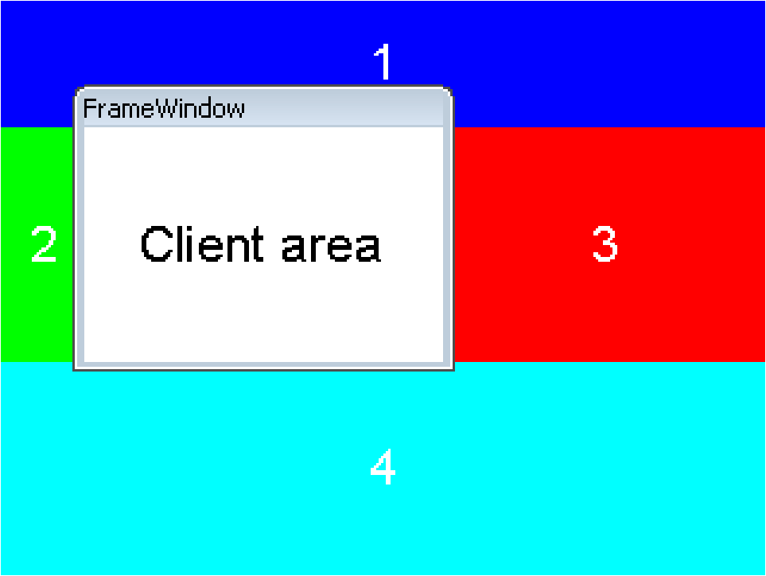
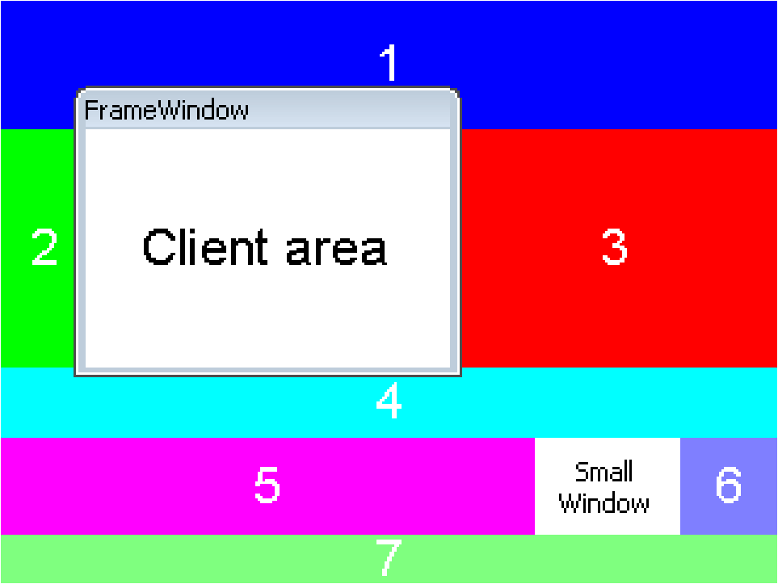
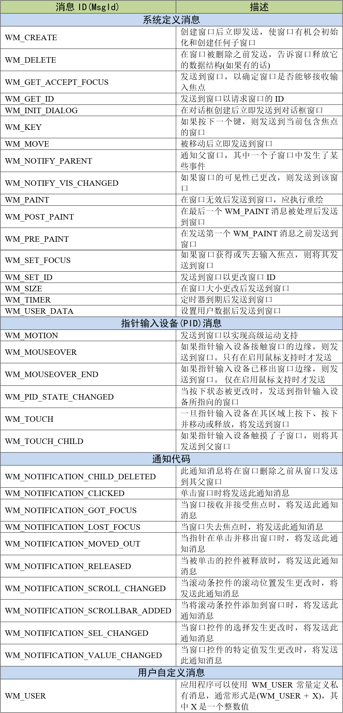
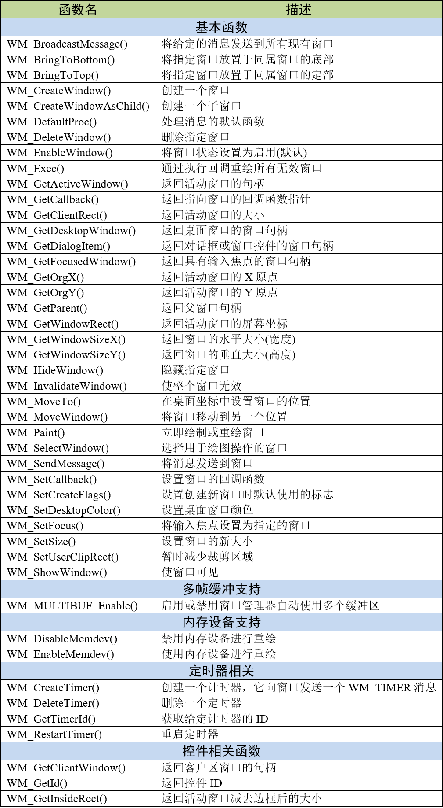
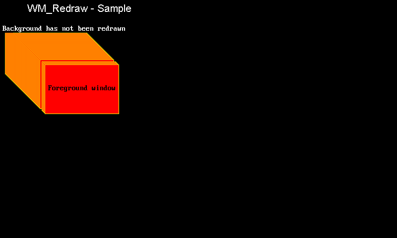
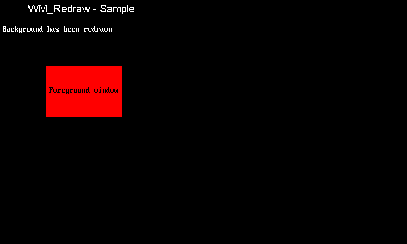
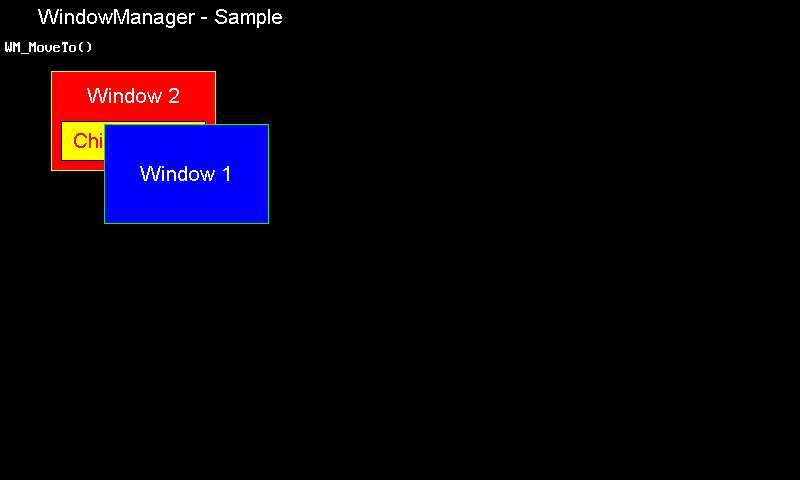

.. vim: syntax=rst

窗口管理器
=============

窗口管理器是emWin的核心功能。窗口就是应用程序对应的一个个矩形区域，而窗口管理器用来管理这些矩形区域。
窗口可以是任意大小，可以同时在屏幕上显示多个窗口，甚至部分或全部显示在其他窗口的上面。窗口管理器提供了大量API函数，
允许创建、移动、调整大小，以及以其他方式操作任意数量的窗口。本章内容非常重要，请读者一定要理解和掌握。

窗口管理器术语
~~~~~~~~~~~~~~~~~~~

窗口在形状上是矩形的，由它们的原点(左上角的X和y坐标)以及它们的X和y大小(分别为宽度和高度)来定义。emWin中的一个窗口具有以下特性：

            -  是矩形的；

            -  有一个Z位置；

            -  可能隐藏或显示；

            -  可能包含有效和/或无效区域；

            -  可能有也可能没有透明度；

            -  可能有也可能没有回调函数。

-   活动窗口

        当前用于绘图操作的窗口称为活动窗口。它不一定就是最上层的窗口。

-   回调函数

        回调函数由用户程序定义，指示图形系统在发生特定事件时调用特定函数。通常，当窗口的内容发生更改时，它们用于自动重绘窗口。

-   子窗口/父窗口，同属窗口

        子窗口是相对于其他窗口（称为父窗口）定义的。只要父窗口移动，其子窗口就会相应移动。子窗口始终完全包含在其父窗口中，
        并在必要时会被裁剪。具有相同父窗口的多个子窗口被视为同属窗口。

-   客户区

        客户区就是窗口的的可用区域。如果一个窗口包含一个框架或标题栏，那么客户端区域就是矩形的内部区域。如果没有这样的框架，
        则客户端区域的坐标与窗口本身的坐标相同。

-   裁剪，裁剪区域

        裁剪是将输出限制为窗口或窗口的一部分的过程。窗口的剪辑区域是其可见区域，是窗口区域减去被更高 Z 轴阶层的同属窗口遮挡的区域，
        然后减去没有放入父窗口可见区域的任何部分。

-   坐标

        坐标通常是二维坐标，以像素为单位表示。一个坐标由两个值组成。第一个值指定水平分量(也称为x坐标)，第二个值指定垂直分量(也称为y坐标)。

-   桌面坐标

        桌面坐标是桌面窗口的坐标。屏幕的左上角位置(原点)是(0,0)。

-   桌面窗口

        也叫背景窗口，是由窗口管理器自动创建的，并且总是覆盖整个显示区域。在多图层情况下，每一个图层都有自己的桌面窗口。
        桌面始终是最底层的窗口，当没有定义其他窗口时，它是默认的(活动的)窗口。所有窗口都是当前选定层的桌面窗口的后代(子窗口、孙窗口等)。
        桌面窗口在emWin 初始化完成后就创建好了，之后所有的操作都在桌面窗口基础上进行。

-   前期裁剪/后期裁剪

        前期裁剪是默认的裁剪模式。在此模式下，裁剪动作在窗口接收绘制事件之前执行。如果需要裁剪当前窗口，
        它将在单个绘图过程中接收多个WM_PAINT消息。在后期裁剪模式下，窗口始终只接收一条WM_PAINT消息，此时裁剪动作在绘图操作中执行。

-   句柄

        创建新窗口时，窗口管理器会为其分配一个名为句柄的唯一标识符。句柄用于在该特定窗口上执行的任何进一步操作。

-   隐藏/显示窗口

        一个隐藏的窗口是不可见的，尽管它仍然存在(有一个句柄)。创建窗口时，如果没有指定创建标志，则默认情况下它是隐藏的。
        显示窗口使其可见，隐藏窗口则使其不可见。

-   父坐标

        父坐标是相对于父窗口的窗口坐标。窗口的左上角位置（原点）是（0,0）。

-   窗口坐标

        窗口坐标是窗口的坐标。 窗口的左上位置（原点）是（0,0）。

-   透明度

        具有透明度的窗口包含不随窗口其余部分重新绘制的区域。这些区域的运作方式就像“透过”它们背后的窗口一样。在这种情况下，
        重要的是要在窗口之前以透明的方式重新绘制后面的窗口。窗口管理器自动按照正确的顺序处理重绘。

-   有效化/无效化

        一个有效的窗口是一个完全更新的窗口，它不需要重新绘制。无效窗口尚未反映所有更新，因此需要全部或部分重新绘制。
        当发生影响特定窗口的更改时，窗口管理器将该窗口标记为无效。下一次重新绘制窗口(手动或通过回调例程)时，将验证它。

-   Z轴位置，底部/顶部

        虽然窗口以X和Y的形式显示在二维屏幕上，但窗口管理器还可管理Z-位置(深度坐标)即虚拟三维中的一个位置，
        它决定了窗口从背景到前景的位置。因此，窗口可以出现在彼此的底部或顶部。
        将一个窗口设置为底部将把它“放在”它所有的同属窗口(如果有的话)下面；将它设置为顶部将会将它“置于”它的同属窗口之上。
        创建窗口时，如果没有指定创建标志，则默认将其设置为顶部。

窗口管理器的回调机制、无效化和渲染
~~~~~~~~~~~~~~~~~~~~~~~~~~~~~~~~~~~~~~~~~~~~~~~~~

emWin为窗口和控件对象提供了回调机制，其背后的思想是试图构建一个事件驱动系统。与大多数窗口界面系统一样，
事件驱动的原则是控制流不仅从用户程序流向图形系统，而且也从用户程序流向图形系统，并通过用户提供的回调函数返回到用户应用程序。
窗口管理器使用这种机制，主要是为了触发窗口的绘制与重绘。虽然这与经典编程不同，但它能很好的利用emWin窗口管理器的无效化逻辑。

使用回调函数渲染窗口
------------------------

想要创建具有回调的窗口，必须定义一个回调函数。当使用WM_CreateWindow()函数创建窗口时，这个回调函数将作为参数。

所有回调函数都必须具有 代码清单:窗口管理-1_ 所示的原型：

.. code-block:: c
    :caption: 代码清单:窗口管理-1 回调函数原型
    :name: 代码清单:窗口管理-1
    :linenos:

    void Callback(WM_MESSAGE * pMsg);

1) pMsg：
指向WM_MESSAGE类型结构体的指针。

回调函数中执行的具体操作取决于它接收的消息类型。窗口回调函数中需要构建一个switch语句，它使用一个或多个case语句为不同的消息定义不同的行为。
通常至少需要存在一个WM_PAINT消息。

窗口通过WM_PAINT消息重绘自身，不过在将此消息发送到窗口之前，窗口管理器需要确保需要重绘的窗口已被选中。普通窗口收到WM_PAINT消息后，
默认情况下会重绘自身整个区域。为了加快绘制过程，窗口管理器的裁剪机制会确保只重绘窗口的无效区域。

注意，在WM_PAINT消息中，除了重绘窗口内容外不得执行其他操作。不得在WM_PAINT消息中调用以下函数：WM_SelectWindow()、WM_PAINT()、
WM_DeleteWindow()和WM_CreateWindow()。此外，类似WM_Move()和WM_Resize()这类改变窗口属性的函数也都不得在WM_PAINT消息中调用。

桌面窗口重绘和回调
-----------------------

在窗口管理器初始化期间，会创建一个包含整个LCD区域的窗口作为桌面窗口。这个窗口的句柄是WM_HBKWIN。由于没有默认的背景颜色，
窗口管理器并不会自动重绘桌面窗口区域。这就意味着如果你创建了一个新的窗口然后删除它，这个窗口仍然可见不会消失。
解决办法是通过WM_SetDesktopColor()函数设置用于重绘桌面窗口的颜色。或者可以设置一个回调函数来处理这个问题。如果像上面一样创建并删除一个窗口，
回调函数将触发窗口管理器确认桌面窗口不再有效并自动重绘。

窗口无效化
-----------

无效窗口或窗口的一部分失效区域会告诉窗口管理器，在下一次调用重绘函数时重绘窗口的无效区域。emWin提供的无效化函数不负责重绘窗口的无效部分，
它们只负责管理窗口的无效区域。真正负责重绘的是GUI_Exec()或GUI_Delay()等函数。

裁剪机制
------------

在上面所讲的内容中，窗口的绘制或重绘通常是通过发送一次WM_PAINT消息来完成的。但是，如果一个窗口的部分区域被子窗口或任何其他窗口覆盖，
那么被覆盖的窗口将会重复接收到若干次的WM_PAINT消息。窗口管理器将窗口未被覆盖的区域裁剪成若干子矩形。在此过程中，窗口管理器将每个子矩形都设置为裁剪区域，
并将所有子矩形的WM_PAINT消息都发送给被覆盖的窗口。窗口被覆盖的区域越碎片，存在的矩形就越多，发送的消息就越多。因此，
在处理WM_PAINT消息的程序中不应该执行费时的操作。

图 裁剪机制演示_ 显示了窗口管理器如何通过裁剪机制绘制被框架窗口控件覆盖的桌面窗口。
框架窗口控件由主窗口和客户区组成。主窗口是一个透明窗口，它绘制在桌面窗口的顶部，对裁剪算法没有影响，
而客户区是不透明的，会导致桌面窗口被裁剪。窗口管理器会从上到下和从左到右的围绕控件客户区将桌面窗口裁剪成若干个区块。
裁剪算法裁剪出的区块数量随窗口被覆盖区域的数量而增加。

图 多窗口的裁剪机制演示_ 显示了附加一个小窗口时的裁剪机制。在开始绘制这个不透明小窗口的过程时，
窗口管理器首先向窗口发送WM_PRE_PAINT消息。之后，窗口周围所有的被裁剪区块都向被裁剪窗口发送一条WM_PAINT消息。
当绘制完最后一个区块后，窗口管理器会发送WM_POST_PAINT消息。
不透明窗口覆盖的区域越多，绘制窗口所需的区块就越多。

渲染透明窗口
------------------

如果需要绘制或重绘透明窗口，窗口管理器将自动确保在透明窗口收到 WM_PAINT 消息之前绘制窗口的背景。实现方法是，
在向透明窗口发送 WM_PAINT 消息前，先重绘透明窗口无效区域下的所有窗口区域，然后再向透明窗口发送WM_PAINT消息。
透明窗口的重绘操作必须在WM_PAINT消息内进行，否则可能无法正确绘制外观。透明窗口比普通不透明窗口更耗费CPU。
如果性能有问题，请尝试避免使用透明窗口。

自动使用内存设备
------------------------

窗口管理器的默认行为是向每个需要重绘的窗口发送WM_PAINT消息，这可能导致闪烁现象。使用内存设备可以在绘图操作时自动抑制每个窗口的闪烁现象。
通过在创建窗口时设置WM_CF_MEMDEV标志，或使用WM_SetCreateFlags()函数设置默认创建标志即可使用内存设备进行重绘操作，
或使用函数WM_EnableMemdev()为指定窗口开启内存设备。此时，窗口管理器将WM_PAINT消息的输出位置重定向到内存设备中，
重绘完成后把内存设备中的内容复制到屏幕上。如果没有足够的内存用于整个窗口的重绘，则会自动使用分段内存设备。
以上这些内存设备都是在窗口管理器发送WM_PAINT消息之前在内部创建的，并在重绘完成后立即删除。如果使用内存设备重绘透明窗口，
那么窗口无效区域下方的内容也会放到内存设备中进行重绘。

窗口消息
~~~~~~~~~~~~

消息结构
------------

上一节中讲到，窗口回调函数中执行的具体操作取决于pMsg参数接收到的消息类型。pMsg参数实际上是一个指向WM_MESSAGE数据结构的指针，
其原型如 代码清单:窗口管理-2_ 。

.. code-block:: c
    :caption: 代码清单:窗口管理-2 WM_MESSAGE数据结构原型
    :name: 代码清单:窗口管理-2
    :linenos:

    xstruct WM_MESSAGE {
        int MsgId;         /* 消息类型 */
        WM_HWIN hWin;      /* 目标窗口 */
        WM_HWIN hWinSrc;   /* 源窗口  */
        union {
            const void * p;/* 消息特定数据指针 */
            int v;
            GUI_COLOR Color;
            void (* pFunc)(void);
        } Data;
    };

1) MsgId：
消息类型；

2) hWin：
目标窗口；

3) hWinSrc：
源窗口；

4) Data：
数据联合体，其中比较重要的两个参数如下：

    -  p：消息特定数据指针；

    -  v：消息数据

消息类型
------------

emWin支持多种消息类型，主要分为四大类，见表格 emWin消息类型_ 。

窗口管理器API
~~~~~~~~~~~~~~~~~~~~~~~~

窗口管理器的功能非常强大， emWin为其提供了众多API函数供用户使用。这里我们只列出一些比较常用的API函数，见表格 窗口管理器部分API_ 。
全部的窗口管理器API函数请参考《STemWin5.44参考手册》。

WM_BringToBottom()
--------------------

将指定的窗口放在其同属窗口的底部。

.. code-block:: c
    :caption: 代码清单:窗口管理-3 函数原型
    :name: 代码清单:窗口管理-3
    :linenos:

    void WM_BringToBottom(WM_HWIN hWin);

1) hWin：
窗口句柄。

执行该函数后，窗口将被放置在所有其他同属窗口的下方，但仍将位于其父窗口的前面。WM_BringToTop()函数与其相反。

WM_CreateWindow()
------------------

在指定位置创建指定大小的窗口。

.. code-block:: c
    :caption: 代码清单:窗口管理-4 函数原型
    :name: 代码清单:窗口管理-4
    :linenos:

    WM_HWIN WM_CreateWindow(int x0, int y0, int xSize, int ySize, U32
                            Style, WM_CALLBACK * cb, int NumExtraBytes);

1) x0：
窗口坐标中的左上X位置；

2) y0：
窗口坐标中的左上Y位置；

3) xSize：
窗口的X方向大小；

4) ySize：
窗口的Y方向大小；

5) Style：
窗口创建标志，最常用的有WM_CF_MEMDEV、WM_CF_SHOW等标志。全部创建标志请参考emWin手册；

6) cb：
指向回调函数的指针，如果没有使用回调函数则填NULL；

7) NumExtraBytes：
要分配的额外字节数，通常为0。

返回值：创建好的窗口的句柄。

可以使用“或”运算符组合多个创建标志，函数的窗口坐标参数可以使用负位置坐标。

WM_CreateWindowAsChild()
--------------------------

将窗口创建为子窗口。

.. code-block:: c
    :caption: 代码清单:窗口管理-5 函数原型
    :name: 代码清单:窗口管理-5
    :linenos:

    WM_HWIN WM_CreateWindowAsChild(int x0, int y0, int xSize, int ySize,
                                WM_HWIN hWinParent, U32 Style,
                                WM_CALLBACK* cb, int NumExtraBytes);

1) x0：
窗口坐标中的左上X位置；

2) y0：
窗口坐标中的左上Y位置；

3) xSize：
窗口的X方向大小；

4) ySize：
窗口的Y方向大小；

5) hWinParent：
父窗口的句柄；

6) Style：
窗口创建标志，同WM_CreateWindow()；

7) cb：
指向回调函数的指针，如果没有使用回调函数则填NULL；

8) NumExtraBytes：
要分配的额外字节数，通常为0。

返回值：创建好的窗口的句柄。

如果hWinParent参数设置为0，则使用桌面窗口作为父窗口。默认情况下，最后创建的子窗口位于其父窗口和任何之前的同属窗口之上，
因此，如果它们的z位置没有变化，则最后创建的子窗口始终位于最上面。同属窗口的z位置有可能会改变，但无论z位置如何变化，这些子窗口始终位于父窗口之上。

WM_DefaultProc()
------------------

默认的消息处理函数。

.. code-block:: c
    :caption: 代码清单:窗口管理-6 函数原型
    :name: 代码清单:窗口管理-6
    :linenos:

    void WM_DefaultProc(WM_MESSAGE * pMsg);

1) x0：
消息指针。

该函数用来处理用户不关心或不处理的各种消息。

WM_DeleteWindow()
--------------------

删除指定窗口。

.. code-block:: c
    :caption: 代码清单:窗口管理-7 函数原型
    :name: 代码清单:窗口管理-7
    :linenos:

    void WM_DeleteWindow(WM_HWIN hWin);

1) hWin：
需要删除的窗口的句柄。

此函数用于删除指定窗口，并发送WM_DELETE消息。在删除窗口之前，窗口接收WM_DELETE消息。此消息通常用于删除任何窗口对象或控件，
并释放窗口动态分配的内存。如果指定的窗口具有子窗口，则在删除窗口本身之前，自动删除这些子窗口。因此，不需要单独调用此函数删除子窗口。
在调用此函数删除窗口时，这个窗口的子窗口会向它发送WM_NOTIFICATION_CHILD_DELETED消息。

WM_GetDialogItem()
----------------------

返回指定对话框中的指定控件的句柄。

.. code-block:: c
    :caption: 代码清单:窗口管理-8 函数原型
    :name: 代码清单:窗口管理-8
    :linenos:

    WM_HWIN WM_GetDialogItem(WM_HWIN hDialog, int Id);

1) hDialog：
对话框句柄；

2) Id：
控件ID。

返回值：控件句柄。

创建对话框时必须使用此函数，因为对话框中使用的控件ID必须在使用前转换为句柄。

WM_HideWindow()
-------------------

隐藏指定窗口。

.. code-block:: c
    :caption: 代码清单:窗口管理-9 函数原型
    :name: 代码清单:窗口管理-9
    :linenos:

    void WM_HideWindow(WM_HWIN hWin);

1) hWin：
需要隐藏的窗口的句柄。

调用此函数后，窗口不会立即隐藏。只有当执行WM_Exec()重绘后，才会被隐藏。如果需要立即隐藏一个窗口，
应该调用WM_Paint来重绘。WM_ShowWindow()函数与其类似。

WM_InvalidateWindow()
-----------------------

无效化指定窗口。

.. code-block:: c
    :caption: 代码清单:窗口管理-10 函数原型
    :name: 代码清单:窗口管理-10
    :linenos:

    void WM_InvalidateWindow(WM_HWIN hWin);

1) hWin：
需要无效化的窗口的句柄。

此函数告诉窗口管理器指定的窗口以被无效化， 这样可以确保重绘窗口。

WM_MoveTo()
--------------

将指定的窗口移动到指定位置。

.. code-block:: c
    :caption: 代码清单:窗口管理-11 函数原型
    :name: 代码清单:窗口管理-11
    :linenos:

    void WM_MoveTo(WM_HWIN hWin, int x, int y);

1) hWin：
需要移动的窗口的句柄；

2) x：
窗口在桌面坐标中的新x坐标；

3) y：
窗口在桌面坐标中的新y坐标。

WM_MoveWindow()
-----------------

将指定的窗口移动一定距离。

.. code-block:: c
    :caption: 代码清单:窗口管理-12 函数原型
    :name: 代码清单:窗口管理-12
    :linenos:

    void WM_MoveWindow(WM_HWIN hWin, int dx, int dy);

1) hWin：
需要移动的窗口的句柄；

2) dx：
水平移动距离；

3) dy：
垂直移动距离。

WM_SetCallback()
--------------------

设置要由窗口管理器执行的回调例程，可以是自定义回调。

.. code-block:: c
    :caption: 代码清单:窗口管理-13 函数原型
    :name: 代码清单:窗口管理-13
    :linenos:

    WM_CALLBACK * WM_SetCallback(WM_HWIN hWin, WM_CALLBACK * cb);

1) hWin：
需要设置的窗口的句柄；

2) cb：
指向回调函数的指针。

返回值：上一个回调函数的指针。

可以使用此函数设置窗口的自定义回调函数，以实现自定义功能。

WM_SetCreateFlags()
----------------------

设置创建新窗口时默认使用的标志。

.. code-block:: c
    :caption: 代码清单:窗口管理-14 函数原型
    :name: 代码清单:窗口管理-14
    :linenos:

    U8 WM_SetCreateFlags(U8 Flags);

1) Flags：
窗口创建标志，此参数值与WM_CreateWindow()函数的使用的创建标志共用。

返回值：前一个创建标志参数。

此函数设置的创建标志会影响到所有窗口，可以通过此函数在GUI_Init()之前设置创建标志。通常此函数与WM_CF_MEMDEV标志一起使用，用于在所有窗口上启用内存设备。

WM_SetDesktopColor()
------------------------

设置桌面窗口的颜色。

.. code-block:: c
    :caption: 代码清单:窗口管理-15 函数原型
    :name: 代码清单:窗口管理-15
    :linenos:

    GUI_COLOR WM_SetDesktopColor(GUI_COLOR Color);

1) Color：
需要设置的桌面窗口颜色，24位RGB值。

返回值：上一次的桌面颜色。

由于桌面窗口默认没有指定颜色，所以它没有重绘功能。使用此函数设置桌面窗口颜色后，桌面窗口就可以重绘自身。

窗口重绘实验
~~~~~~~~~~~~~~~~~~

窗口管理器相关的官方例程很好的展示了窗口管理器API的使用，接下来的三个实验我们以官方例程为例进行讲解。

代码分析
------------

.. code-block:: c
    :caption: 代码清单:窗口管理-16 \_DemoRedraw函数（WM_Redraw.c文件）
    :name: 代码清单:窗口管理-16
    :linenos:

    /**
    * @brief 窗口重绘DEMO
    * @note 无
    * @param 无
    * @retval 无
    */
    static void _DemoRedraw(void)
    {
        WM_CALLBACK * _cbOldBk;

        GUI_SetBkColor(GUI_BLACK);
        GUI_Clear();
        GUI_SetColor(GUI_WHITE);
        GUI_SetFont(&GUI_Font24_ASCII);
        GUI_DispStringHCenterAt("WM_Redraw - Sample", 160, 5);
        GUI_SetFont(&GUI_Font8x16);
        while (1) {
            /* 在桌面上移动窗口 */
            _MoveWindow("Background has not been redrawn");
            /* 清除桌面 */
            GUI_ClearRect(0, 50, 319, 239);
            GUI_Delay(1000);
            /* 重定向桌面窗口的回调函数 */
            _cbOldBk = WM_SetCallback(WM_HBKWIN, _cbBkWindow);
            /* 在桌面上移动窗口 */
            _MoveWindow("Background has been redrawn");
            /* 还原桌面窗口的回调函数 */
            WM_SetCallback(WM_HBKWIN, _cbOldBk);
        }
    }

此例程演示了如何使用自定义回调函数实现桌面窗口的重绘操作。首先定义一个WM_CALLBACK型的指针变量，用来存放默认的桌面窗口回调函数。
设置桌面窗口颜色绘制提示文字信息。接着直接在桌面背景上创建窗口并移动它，移动结束后使用WM_SetCallback函数把默认的背景窗口回调函数重定向为自定义回调函数，
再重新创建和移动窗口，第二次移动结束后再次使用WM_SetCallback函数恢复默认的背景窗口回调函数。

背景窗口回调函数
^^^^^^^^^^^^^^^^^^

.. code-block:: c
    :caption: 代码清单:窗口管理-17 \_cbBkWindow函数（WM_Redraw.c文件）
    :name: 代码清单:窗口管理-17
    :linenos:

    /**
    * @brief 背景窗口回调函数
    * @note pMsg：消息指针
    * @param 无
    * @retval 无
    */
    static void _cbBkWindow(WM_MESSAGE* pMsg)
    {
        switch (pMsg->MsgId) {
        case WM_PAINT:
            GUI_ClearRect(0, 50, 319, 239);
        default:
            WM_DefaultProc(pMsg);
        }
    }

前面我们提到过，WM_PAINT消息是用来处理窗口重绘的。在 代码清单:窗口管理-17_ 中使用GUI_ClearRect函数清除矩形窗口覆盖的区域。
在这个回调函数中，我们并不关心除了WM_PAINT消息以外的其他消息，所有其他的消息都交由WM_DefaultProc函数处理。

创建和移动窗口
^^^^^^^^^^^^^^^^^^

.. code-block:: c
    :caption: 代码清单:窗口管理-18 \_MoveWindow函数（WM_Redraw.c文件）
    :name: 代码清单:窗口管理-18
    :linenos:

    /**
    * @brief 窗口创建和移动函数
    * @note 无
    * @param 无
    * @retval 无
    */
    static void _MoveWindow(const char* pText)
    {
        WM_HWIN hWnd;
        int     i;

        /* 创建窗口 */
        hWnd = WM_CreateWindow(10, 50, 150, 100, WM_CF_SHOW, _cbWindow, 0);
        GUI_Delay(500);
        /* 移动窗口 */
        for (i = 0; i < 40; i++) {
            WM_MoveWindow(hWnd, 2, 2);
            GUI_Delay(10);
        }
        /* 移动结束后显示提示文字 */
        if (pText) {
            GUI_DispStringAt(pText, 5, 50);
            GUI_Delay(2500);
        }
        /* 删除窗口 */
        WM_DeleteWindow(hWnd);
        WM_Invalidate(WM_HBKWIN);
        GUI_Exec();
    }

使用WM_CreateWindow函数创建一个窗口，创建标志为WM_CF_SHOW即创建完成之后显示窗口，链接窗口回调函数，实际的窗口绘制和重绘工作由回调函数完成，
没有额外的用户数据。接着调用WM_MoveWindow函数移动窗口，每次水平和垂直移动的距离各2像素，移动40次，这里移动的距离是相对于窗口当前位置的。
移动结束后显示提示文字，最后使用WM_DeleteWindow删除窗口。最后调用WM_Invalidate和GUI_Exec，前者将桌面窗口无效化，后者执行重绘操作。
因为WM_DeleteWindow函数并不会立刻删除窗口，直到执行下一次重绘操作或调用GUI_Delay时才会真正的删除。把桌面窗口无效化是为了配合GUI_Exec立刻重绘桌面窗口。

窗口回调函数
^^^^^^^^^^^^^^^^^^

.. code-block:: c
    :caption: 代码清单:窗口管理-19 \_cbWindows函数
    :name: 代码清单:窗口管理-19
    :linenos:

    /**
    * @brief 窗口回调函数
    * @note pMsg：消息指针
    * @param 无
    * @retval 无
    */
    static void _cbWindow(WM_MESSAGE* pMsg)
    {
        GUI_RECT Rect;

        switch (pMsg->MsgId) {
        case WM_PAINT:
            /* 返回窗口客户区坐标 */
            WM_GetInsideRect(&Rect);
            /* 设置窗口背景颜色 */
            GUI_SetBkColor(GUI_RED);
            /* 设置前景颜色 */
            GUI_SetColor(GUI_YELLOW);
            /* 绘制窗口 */
            GUI_ClearRectEx(&Rect);
            GUI_DrawRectEx(&Rect);
            /* 设置文本颜色 */
            GUI_SetColor(GUI_BLACK);
            /* 设置文本格式 */
            GUI_SetFont(&GUI_Font8x16);
            /* 显示提示信息 */
            GUI_DispStringHCenterAt("Foreground window", 75, 40);
            break;
        default:
            WM_DefaultProc(pMsg);
        }
    }

与桌面窗口的回调函数一样，WM_PAINT消息负责窗口的绘制和重绘工作。首先获取窗口客户区尺寸坐标，客户区尺寸并不等于窗口尺寸，
一般需要减去窗口边框。调用GUI_SetBkColor和GUI_SetColor设置窗口的背景色和前景色，接着根据获取到的客户区坐标调用GUI_DrawRectEx绘制窗口，
最后显示提示文本。同样的，所有用不到的和不关心的消息全部交给WM_DefaultProc函数处理。

实验现象
------------

窗口重绘实验的实验结果如图 不执行桌面窗口的重绘_ 和 执行桌面窗口重绘_ 所示。可以看到，
不执行桌面窗口重绘的时候，窗口移动会产生重影，而使用了桌面窗口重绘则没有重影。

窗口管理器API实验
~~~~~~~~~~~~~~~~~~~~~~~~~~~~~~

官方的窗口管理器例程涉及到大量的API函数调用操作，可以很好的演示这些API函数的使用方法和效果。
不过由于篇幅限制，这里只讲解其中一部分，完整的例程请参考。

代码分析
------------

.. code-block:: c
    :caption: 代码清单:窗口管理-20 MainTask函数（WM_Sample.c文件）
    :name: 代码清单:窗口管理-20
    :linenos:

    /**
    * @brief GUI主任务
    * @note 无
    * @param 无
    * @retval 无
    */
    void MainTask(void)
    {
        GUI_SetBkColor(GUI_BLACK);
        WM_SetCreateFlags(WM_CF_MEMDEV);
        WM_EnableMemdev(WM_HBKWIN);
        while (1) {

            _DemoSetDesktopColor();
            _DemoCreateWindow();
            _DemoCreateWindowAsChild();
            _DemoInvalidateWindow();
            _DemoBringToTop();
            _DemoMoveTo();
            _DemoBringToBottom();
            _DemoMoveWindow();
            _DemoHideShowParent();
            _DemoHideShowChild();
            _DemoClipping();
            _DemoRedrawing();
            _DemoResizeWindow();
            _DemoSetCallback();
            _DemoDeleteWindow();
        }
    }

为了更好的演示效果，在DEMO开始运行前通过WM_SetCreateFlags函数把所有的窗口都设置为WM_CF_MEMDEV即自动使用内存设备绘制窗口。
前面介绍窗口管理器术语的时候有提到，桌面窗口在GUI_Init函数初始化之后就已经创建好了，而它的专属句柄是WM_HBKWIN。
通过WM_EnableMemdev函数把桌面窗口也设置为自动使用内存设备绘制。接着是15个窗口演示DEMO，这里我们只讲解其中比较重要的。

窗口和子窗口的创建
^^^^^^^^^^^^^^^^^^^^^^^^

1. 窗口创建函数

.. code-block:: c
    :caption: 代码清单:窗口管理-21 \_DemoCreateWindow和_DemoCreateWindowAsChild（WM_Sample.c文件）
    :name: 代码清单:窗口管理-21
    :linenos:

    /* 移动速度 */
    #define SPEED           1250
    /* 回调函数 */
    static WM_CALLBACK * _cbBkWindowOld;
    /* 句柄*/
    static WM_HWIN _hWindow1;
    static WM_HWIN _hWindow2;
    static WM_HWIN _hChild;

    /**
    * @brief 创建窗口
    * @note 无
    * @param 无
    * @retval 无
    */
    static void _DemoCreateWindow(void)
    {
        /* 重定向背景窗口回调函数 */
        _cbBkWindowOld = WM_SetCallback(WM_HBKWIN, _cbBkWindow);
        _ChangeInfoText("WM_CreateWindow()");
        GUI_Delay(SPEED);
        /* 创建窗口1 */
        _hWindow1 = WM_CreateWindow( 50,  70, 165, 100, WM_CF_SHOW |
                    WM_CF_MEMDEV, _cbWindow1, 0);
        GUI_Delay(SPEED/3);
        /* 创建窗口2 */
        _hWindow2 = WM_CreateWindow(105, 125, 165, 100, WM_CF_SHOW |
                    WM_CF_MEMDEV, _cbWindow2, 0);
        GUI_Delay(SPEED);
    }

    /**
    * @brief 创建子窗口
    * @note 无
    * @param 无
    * @retval 无
    */
    static void _DemoCreateWindowAsChild(void)
    {
        _ChangeInfoText("WM_CreateWindowAsChild()");
        GUI_Delay(SPEED);
        /* 创建子窗口 */
        _hChild = WM_CreateWindowAsChild(10, 50, 145, 40, _hWindow2,
                WM_CF_SHOW | WM_CF_MEMDEV, _cbChild, 0);
        GUI_Delay(SPEED);
    }

重定向背景窗口的回调函数并显示文本，使用WM_CreateWindow函数创建两个窗口_hWindow1和_hWindow2，他们的起始位置不同，
尺寸大小相同，都在创建完成后显示出来，拥有各自的回调函数。GUI_Delay负责延时和屏幕刷新工作。
使用WM_CreateWindowAsChild以_hWindow2为父窗口创建一个子窗口，设置子窗口回调函数。

2. 桌面窗口回调

.. code-block:: c
    :caption: 代码清单:窗口管理-22 自定义消息和桌面窗口回调函数（WM_Sample.c文件）
    :name: 代码清单:窗口管理-22
    :linenos:

    /* 自定义消息ID */
    #define MSG_CHANGE_TEXT (WM_USER + 0)
    /* 文本缓冲区 */
    static char _acInfoText[40];

    /**
    * @brief 设置自定义消息
    * @note 无
    * @param 无
    * @retval 无
    */
    static void _ChangeInfoText(char * pStr)
    {
        WM_MESSAGE Message;

        Message.MsgId  = MSG_CHANGE_TEXT;
        Message.Data.p = pStr;
        WM_SendMessage(WM_HBKWIN, &Message);
        WM_InvalidateWindow(WM_HBKWIN);
    }

    /**
    * @brief 桌面窗口回调函数
    * @note 无
    * @param 无
    * @retval 无
    */
    static void _cbBkWindow(WM_MESSAGE * pMsg)
    {
        switch (pMsg->MsgId) {
        case MSG_CHANGE_TEXT:
            strcpy(_acInfoText, (char const *)pMsg->Data.p);
        case WM_PAINT:
            GUI_SetBkColor(GUI_BLACK);
            GUI_Clear();
            GUI_SetColor(GUI_WHITE);
            GUI_SetFont(&GUI_Font24_ASCII);
            GUI_DispStringHCenterAt("WindowManager - Sample", 160, 5);
            GUI_SetFont(&GUI_Font8x16);
            GUI_DispStringAt(_acInfoText, 5, 40);
            break;
        default:
            WM_DefaultProc(pMsg);
        }
    }

在桌面窗口回调中，使用了一个带参数的用户自定义消息MSG_CHANGE_TEXT，在其内部使用strcpy接收自定义消息传过来的文本，
其余部分和上一节实验中的相同，WM_PAINT负责桌面窗口的重绘和文本显示，用不到的消息交给WM_DefaultProc函数处理。

\_ChangeInfoText函数用于构建和发送用户自定义消息，首先定义了一个WM_MESSAGE类型的变量Message，存放自定义消息的ID和参数，
其中自定义消息ID的定义必须以WM_USER为基准，避免与系统其他数值冲突。接着使用WM_SendMessage函数向桌面窗口发送消息，
函数第一个参数是目标窗口句柄，第二个参数用于传递带参消息。

3. 窗口回调

.. code-block:: c
    :caption: 代码清单:窗口管理-23 \_cbWindow1函数（WM_Sample.c文件）
    :name: 代码清单:窗口管理-23
    :linenos:

    /* 颜色 */
    static GUI_COLOR _WindowColor1 = GUI_GREEN;
    static GUI_COLOR _FrameColor1  = GUI_BLUE;
    /**
    * @brief 窗口1回调函数
    * @note 无
    * @param 无
    * @retval 无
    */
    static void _cbWindow1(WM_MESSAGE * pMsg)
    {
        GUI_RECT Rect;
        int      x;
        int      y;

        switch (pMsg->MsgId) {
        case WM_PAINT:
            WM_GetInsideRect(&Rect);
            GUI_SetBkColor(_WindowColor1);
            GUI_SetColor(_FrameColor1);
            GUI_ClearRectEx(&Rect);
            GUI_DrawRectEx(&Rect);
            GUI_SetColor(GUI_WHITE);
            GUI_SetFont(&GUI_Font24_ASCII);
            x = WM_GetWindowSizeX(pMsg->hWin);
            y = WM_GetWindowSizeY(pMsg->hWin);
            GUI_DispStringHCenterAt("Window 1", x / 2, (y / 2) - 12);
            break;
        default:
            WM_DefaultProc(pMsg);
        }
    }

窗口2和子窗口的回调函数与窗口1几乎是一样的，此仅以窗口1回调为例。代码清单:窗口管理-23_ 的窗口1回调函数通过WM_PAINT消息绘制自身。
通过WM_GetInsideRect函数获取客户区坐标，然后进行绘制操作，最后利用WM_GetWindowSizeX函数获取窗口尺寸并显示提示信息。
同样地，不关心的消息交给WM_DefaultProc函数处理。

窗口移动
^^^^^^^^^^^^

.. code-block:: c
    :caption: 代码清单:窗口管理-24 \_DemoMoveTo和_DemoMoveWindow（WM_Sample.c文件）
    :name: 代码清单:窗口管理-24
    :linenos:

    /**
    * @brief 移动到指定坐标
    * @note 无
    * @param 无
    * @retval 无
    */
    static void _DemoMoveTo(void)
    {
        int i;
        int tm;
        int tDiff;

        _ChangeInfoText("WM_MoveTo()");
        GUI_Delay(SPEED);
        for (i = 1; i < 56; i++) {
            tm = GUI_GetTime();
            WM_MoveTo(_hWindow1,  50 + i,  70 + i);
            WM_MoveTo(_hWindow2, 105 - i, 125 - i);
            tDiff = 15 - (GUI_GetTime() - tm);
            GUI_Delay(tDiff);
        }
        for (i = 1; i < 56; i++) {
            tm = GUI_GetTime();
            WM_MoveTo(_hWindow1, 105 - i, 125 - i);
            WM_MoveTo(_hWindow2,  50 + i,  70 + i);
            tDiff = 15 - (GUI_GetTime() - tm);
            GUI_Delay(tDiff);
        }
        GUI_Delay(SPEED);
    }
    /**
    * @brief 移动指定距离
    * @note 无
    * @param 无
    * @retval 无
    */
    static void _DemoMoveWindow(void)
    {
        int i;
        int tm;
        int tDiff;

        _ChangeInfoText("WM_MoveWindow()");
        GUI_Delay(SPEED);
        for (i = 0; i < 55; i++) {
            tm = GUI_GetTime();
            WM_MoveWindow(_hWindow1,  1,  1);
            WM_MoveWindow(_hWindow2, -1, -1);
            tDiff = 15 - (GUI_GetTime() - tm);
            GUI_Delay(tDiff);
        }
        for (i = 0; i < 55; i++) {
            tm = GUI_GetTime();
            WM_MoveWindow(_hWindow1, -1, -1);
            WM_MoveWindow(_hWindow2,  1,  1);
            tDiff = 15 - (GUI_GetTime() - tm);
            GUI_Delay(tDiff);
        }
        GUI_Delay(SPEED);
    }

代码清单:窗口管理-24_ 的两个函数都是移动窗口，不过一个是使用WM_MoveTo移动到屏幕的指定坐标，属于窗口的绝对位置移动；
另一个是使用WM_MoveWindow移动指定距离，这个距离是相对当前窗口而言，属于窗口的相对位置移动。

实验现象
------------

窗口管理器API实验的部分实验结果如图 窗口管理器API实验结果_ 所示。

除了以上两个实验外，emWin官方还提供了WM_LateClipping.c和WM_video.c两个例子。WM_LateClipping.c主要演示窗口管理器的裁剪机制方面的内容和消息的处理，
比较有参考价值；而WM_video.c主要演示了框架窗口的创建，删除，隐藏和显示。这两个官方例程都存放在以下路径中：

**SeggerEval_WIN32_MSVC_MinGW_GUI_V548\\Sample\\Tutorial\\**

