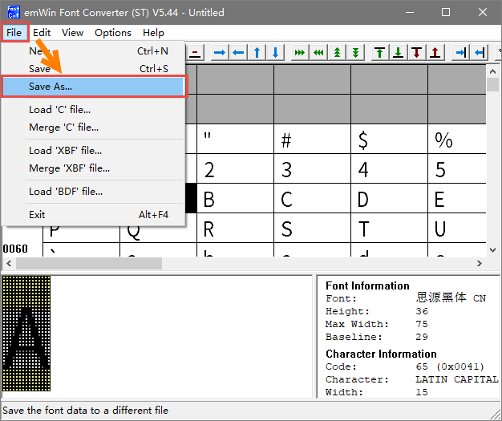

.. vim: syntax=rst

XBF格式字体显示
================

上一章讲了很多emWin支持的字体形式，从本章开始我们讲解如果利用这些字体形式来做中文显示。

首先讲解XBF格式字体的使用。XBF格式，又称为外部位图字体（External Bitmap Font）格式，
是一种包含字体信息的二进制数据块，可以使用emWin配套的字体转换器生成。使用XBF字体时字体文件不需要全部加载到内存中，
保留在任何外部存储器上即可。它的数据访问是由一个“GetData”回调函数完成的。也就是说XBF格式字体的优点是可以在RAM很少的系统上使用大规模字库。

并且XBF格式字体中的字符并不是直接按顺序排列的，而是带有一个内存偏移量，因此每个字符可以在相同的时间内找到。

具体来说，首先，它包含一小块一般的字体信息，包括最低字符码和最高字符码。然后接一个访问表，
其中包含最低和最高字符代码之间所有字符的偏移量和数据大小信息。如果某个字符不存在，则对应字符的此信息为零。
访问表后面是包含像素数据和字符大小信息的所有字符的数据。

字体转换器
~~~~~~~~~~~

字体转换器是SEGGER公司为emWin开发的一种主要用于将安装在Windows系统中的字体转换为emWin支持的字体的软件，
仅支持Windows系统环境。软件界面如图 字体转换器外观_ 所示。

.. image:: media/XBF/XBF002.png
   :align: center
   :name: 字体转换器外观
   :alt: 字体转换器外观

字体转换器可以从SEGGER官网的emWin页面下载，也可以在STM32的CUBE库中找到。转换器在CUBE库中的路径如下：

**STM32Cube_FW_F4_V1.24.1\\Middlewares\\ST\\STemWin\\Software\\FontCvtST.exe**

注意：字体转换器没有附带任何字体或使用任何PC安装字体进行转换的权限或许可。使用者有责任在使用字型时不侵犯任何第三者的知识产权，
并在字型的合法拥有人要求时取得授权。

生成XBF字库
~~~~~~~~~~~~~~~~~~~

下面我们以思源黑体为例，讲解如何使用字体转换器生成XBF格式字库。

1) 选择需要生成的字体类型。双击FontCvtST.exe打开字体转换器，在弹出来的对话框中选择Extended, antialised, 2bpp，
也就是带2bpp抗锯齿的扩展比例位图字体，然后编码格式选择16Bit UNICODE，见图 选择emWin字体类型_ 。

2) 点击OK后，选择字体为思源黑体，字形常规，大小36，尺寸单位选择Pixels，
见图 选择字体和大小_ 。

3) 保存字库文件。选择找字体类型和大小之后，点击字体转换器左上角的File，
然后选择Save As，见图 保存字库文件_ 。

4) 然后选择保存路径，设置文件名为思源黑体36_2bpp，
保存文件格式为.xbf，见图 选择保存路径_ 。

5) 最后，等待字体转换器转换完成。完成后会在窗口左下角显示“Ready”，
见图 等待转换完成_ 。

至此，一个XBF格式的字库就生成完毕了，使用相同的方法再制作一个新宋体18.xbf，和思源黑体36_2bpp.xbf一起放到SD卡的Font目录下。

有一点需要注意，字体转换器里设置的字体大小是包括字体上下边界的总大小，而不同的字体有着不同尺寸的上下边界，
例如思源黑体这样的字体上下边界就很宽，而新宋体的上下边界就比较窄。这也是为什么明明两种字体生成的都是同一种大小，显示出来却不一样大。

XBF字体显示相关API
~~~~~~~~~~~~~~~~~~~~~~~~~~~~~~~~~~~~

GUI_XBF_CreateFont()
^^^^^^^^^^^^^^^^^^^^^^

通过向回调函数传递指针来创建和选择字体，回调函数负责从XBF字体文件获取数据。

.. code-block:: c
    :caption: 代码清单:XBF-1 函数原型
    :name: 代码清单:XBF-1
    :linenos:

    int GUI_XBF_CreateFont(GUI_FONT *pFont, GUI_XBF_DATA *pXBF, const
                        GUI_XBF_TYPE *pFontType, GUI_XBF_GET_DATA_FUNC
                        *pfGetData, void *pVoid);

1) pFont：
指向RAM中由该函数填充的GUI_FONT结构的指针；

2) pXBF_Data：
指向RAM中由该函数填充的GUI_XBF_DATA结构的指针；

3) pFontType：
字体类型，见；

4) pfGetData：
指向回调函数的指针，该回调函数负责从字体文件中获取数据；

5) pVoid：
应用程序定义的指针传递给' GetData '回调函数。

返回值：字体创建成功时返回0，在字体创建失败时返回1。

参数pfGetData应该指向一个应用程序定义的回调例程，它负责从字体获取数据。当请求字体数据时，
参数pVoid被传递给回调函数。例如，可以使用它将文件句柄传递给回调函数。

该函数需要指向GUI_FONT结构和GUI_XBF_DATA结构。该函数将用字体信息填充这些结构。在使用字体期间，
这些结构的内容必须保持有效。该函数不知道应用程序要创建什么样的XBF字体，
因此必须使用参数pFontType来告诉函数要创建的字体的类型。这样做是为了避免不必要的代码链接。

GUI_XBF_DeleteFont()
^^^^^^^^^^^^^^^^^^^^^^^^

删除参数pFont指向的XBF字体。

.. code-block:: c
    :caption: 代码清单:XBF-2 函数原型
    :name: 代码清单:XBF-2
    :linenos:

    void GUI_XBF_DeleteFont(GUI_FONT * pFont);

1) pFont：
指向要删除的字体的指针。

使用GUI_XBF_CreateFont()创建的字体之后，如果不再使用，应该删除该字体。

XBF格式字体显示实验
~~~~~~~~~~~~~~~~~~~~~~~~~~~~~

接下来我们通过一个实验来讲解如何使用已经生成好的XBF格式字体，更多相关内容的演示实验可参考官方例程FONT_ShowXBF.c，例程路径如下：

**SeggerEval_WIN32_MSVC_MinGW_GUI_V548\\Sample\\Tutorial\\FONT_ShowXBF**

代码分析
^^^^^^^^^^

在本实验中我们提供了两种字库存放区域，一种是SPI FLASH的非文件系统区域，
一种是SD卡文件系统区域，如 代码清单:XBF-3_ 所示。

.. code-block:: c
    :caption: 代码清单:XBF-3 字库存放位置（GUIFont_Create.h文件）
    :name: 代码清单:XBF-3
    :linenos:

    //设置XBF字体存储的位置：
    //FLASH非文件系统区域（推荐）USE_FLASH_FONT  0
    //SD卡文件系统区域          USE_SDCARD_FONT 1
    #define XBF_FONT_SOURCE       1

    /*
    （速度最快）字库在FLASH的非文件系统区域，使用前需
    要往FLASH特定地址拷贝字体文件 */
    #define USE_FLASH_FONT        0
    /*
    （速度中等）字库存储在SD卡文件系统区域，调试比较
    方便，直接使用读卡器从电脑拷贝字体文件即可 */
    #define USE_SDCARD_FONT       1

上述代码中，XBF_FONT_SOURCE决定着程序从什么位置读取字库数据，为0时，从SPI FLASH中读取字库；为1时，
则从SD卡中读取字库。在GUIFont_Create.c文件中，提供了从SPI_FLASH或者SD卡读取字库数据的函数。我们选择从SD卡读取字库。

如果从SPI FLASH中读取字库，请先运行《刷外部FLASH程序（烧录STemWIN资源文件）》例程，
将emWin相关的资源烧录到SPI FLASH中，否则字库实验无法进行。

创建字体
''''''''''''

.. code-block:: c
    :caption: 代码清单:XBF-4 Create_XBF_Font函数（GUIFont_Create.c文件）
    :name: 代码清单:XBF-4
    :linenos:

    /* 字库结构体 */
    GUI_XBF_DATA  XBF_XINSONGTI_18_Data;
    GUI_FONT      FONT_XINSONGTI_18;

    GUI_XBF_DATA  XBF_SIYUANHEITI_36_Data;
    GUI_FONT      FONT_SIYUANHEITI_36;

    /* SD卡中的字库路径 */
    static const char FONT_STORAGE_ROOT_DIR[] = "0:";
    static const char FONT_XINSONGTI_18_ADDR[] = "0:/Font/新宋体18.xbf";
    static const char FONT_SIYUANHEITI_36_ADDR[] = "0:/Font/思源黑体36_2bpp.xbf";

    /**
    * @brief  创建XBF字体
    * @param  无
    * @retval 无
    */
    void Create_XBF_Font(void)
    {
        /* 新宋体18 */
        GUI_XBF_CreateFont(&FONT_XINSONGTI_18,/* GUI_FONT 字体结构体指针 */
                    &XBF_XINSONGTI_18_Data,/* GUI_XBF_DATA 结构体指针 */
                    GUI_XBF_TYPE_PROP_EXT, /* 字体类型 */
                    _cb_FONT_XBF_GetData,  /* 获取字体数据的回调函数 */
                    (void *)&FONT_XINSONGTI_18_ADDR);
        /* 思源黑体36 */
        GUI_XBF_CreateFont(&FONT_SIYUANHEITI_36,/* GUI_FONT 字体结构体指针 */
                    &XBF_SIYUANHEITI_36_Data,/* GUI_XBF_DATA 结构体指针 */
                    GUI_XBF_TYPE_PROP_AA2_EXT,/* 字体类型 */
                    _cb_FONT_XBF_GetData,    /* 获取字体数据的回调函数 */
                    (void *)&FONT_SIYUANHEITI_36_ADDR);
    }

如 代码清单:XBF-4_ 所示，首先声明字体结构体和定义字库文件在SD卡中的路径，然后在Create_XBF_Font函数中创建字体。

使用GUI_XBF_CreateFont函数创建字体，此函数的前两个参数就是最开始声明的结构体，第3个参数是字体类型，
必须和字体转换器所生成的字体类型相同，否则出错，第4个参数是实际用来获取字库数据的回调函数，由用户定义，
最后1个参数是需要传输给回调函数的自定义数据指针，此处传输的是字库的地址。

.. code-block:: c
    :caption: 代码清单:XBF-5 \_cb_FONT_XBF_GetData回调函数（GUIFont_Create.c文件）
    :name: 代码清单:XBF-5
    :linenos:

    /**
    * @brief  获取字体数据的回调函数
    * @param  Offset：要读取的内容在XBF文件中的偏移位置
    * @param  NumBytes：要读取的字节数
    * @param  pVoid：自定义数据的指针
    * @param  pBuffer：存储读取内容的指针
    * @retval 0 成功, 1 失败
    */
    static int _cb_FONT_XBF_GetData(U32 Offset, U16 NumBytes, void * pVoid,
                                    void * pBuffer)
    {
    #if (XBF_FONT_SOURCE == USE_SDCARD_FONT)

        if (storage_init_flag == 0) {
            /* 挂载sd卡文件系统 */
            res = f_mount(&fs,FONT_STORAGE_ROOT_DIR,1);
            storage_init_flag = 1;
        }

        /* 从pVoid中获取字库的存储地址(pvoid的值在GUI_XBF_Cre
                                                ateFont中传入) */
        res = f_open(&fnew , (char *)pVoid, FA_OPEN_EXISTING | FA_READ);

        if (res == FR_OK) {
            f_lseek (&fnew, Offset);/* 指针偏移 */
            /* 读取内容 */
            res = f_read( &fnew, pBuffer, NumBytes, &br );
            f_close(&fnew);
            return 0;
        } else
            return 1;
    #endif
    }

如 代码清单:XBF-5_ 所示，emWin获取XBF字体数据就是通过_cb_FONT_XBF_GetData回调函数完成的，由于函数实际代码较长，
我们只截取了从SD卡中读取的部分。首先挂载文件系统，然后通过f_open函数打开字体文件，然后用f_lseek函数与f_read函数配合就能读取数据了。
此回调函数的实现方法是固定的。

创建并转换待显示文本
''''''''''''''''''''''

keil5的文本编辑器目前暂不支持Unicode编码的中文字符，
仅支持UTF-8编码的中文字符，所以想要在emWin中显示中文还需要多一个步骤。

首先，在keil5工程中新建一个text.c文件，文件中添加如 代码清单:XBF-6_ 所示的内容。

.. code-block:: c
    :caption: 代码清单:XBF-6 text.c内容
    :name: 代码清单:XBF-6
    :linenos:

    const char Framewin_text[] = {"STemWIN@野火电子 STM32F429"};
    const char text[] = {"欢迎使用野火F429开发板\r\n
                        这是一个使用XBF格式字库显示的例子
                        ，本例子支持中文显示"
                        };
    const char MULTIEDIT_text[] = {"实验平台:野火 STM32F429
                                开发板\r\n
                                论坛:http://www.firebbs.cn\r\n
                                淘宝:https://fire-stm32.taobao.com"
                                };
    const char *BUTTON_text[] = {"确定", "取消"};

接着使用Notepad++软件打开text.c文件，点击软件顶部的编码选项，
选择转为UTF-8-BOM编码，如图 转换字符编码_ 所示。

其实emWin内部并不会区分UTF8编码到底带不带BOM，此处把待显示的中文字符转换为UTF-8-BOM编码并且单独存到一个c文件的目的，
主要是为了避开Keil5文本编辑器的一个BUG。

keil5目前在编译过程中只能识别带BOM的UTF-8编码中文字符，不带BOM的UTF-8编码中文字符会报错，但是一旦在keil5中修改了文件，
keil5又会把文件保存成不带BOM的UTF8编码，这就比较尴尬了，保存的编码在编译的时候不能识别，如果待显示的文本和代码放在同一个文件，
那么每次修改完代码编译之前都需要将整个文件转成UTF-8-BOM编码，非常麻烦。

所以本试验中的可能用到的中文字符都会单独存放到text.c文件中，避免每次修改代码之后都要转一次编码的麻烦，
不过如果修改了text.c中的内容还是需要转换编码的，但至少要好一些。

创建对话框
''''''''''''''''

转换好代码之后就还是像其他讲解控件的例程一样，创建一个对话框。

.. code-block:: c
    :caption: 代码清单:XBF-7 创建对话框（MainTask.c文件）
    :name: 代码清单:XBF-7
    :linenos:

    /* 控件ID */
    #define ID_FRAMEWIN_0   (GUI_ID_USER + 0x00)
    #define ID_TEXT_0   (GUI_ID_USER + 0x01)
    #define ID_TEXT_1   (GUI_ID_USER + 0x02)
    #define ID_MULTIEDIT_0   (GUI_ID_USER + 0x03)
    #define ID_BUTTON_0   (GUI_ID_USER + 0x04)
    #define ID_BUTTON_1   (GUI_ID_USER + 0x05)

    /* 资源表 */
    static const GUI_WIDGET_CREATE_INFO _aDialogCreate[] = {
        { FRAMEWIN_CreateIndirect, "Framewin", ID_FRAMEWIN_0, 0, 0, 800,
        480, 0, 0x0, 0 },
        { TEXT_CreateIndirect, "Text", ID_TEXT_0, 20, 35, 580, 50, 0, 0x64,
        0 },
        { TEXT_CreateIndirect, "Text", ID_TEXT_1, 20, 80, 740, 80, 0, 0x64,
        0 },
        { MULTIEDIT_CreateIndirect, "Multiedit", ID_MULTIEDIT_0, 20, 200,
        480, 130, 0, 0x0, 0 },
        { BUTTON_CreateIndirect, "Button", ID_BUTTON_0, 560, 200, 140, 36,
        0, 0x0, 0 },
        { BUTTON_CreateIndirect, "Button", ID_BUTTON_1, 560, 292, 140, 36,
        0, 0x0, 0 },
    };

    /**
    * @brief 以对话框方式间接创建控件
    * @note 无
    * @param 无
    * @retval hWin：资源表中第一个控件的句柄
    */
    WM_HWIN CreateFramewin(void)
    {
        WM_HWIN hWin;

        hWin = GUI_CreateDialogBox(_aDialogCreate, GUI_COUNTOF(
            _aDialogCreate), _cbDialog, WM_HBKWIN, 0, 0);
        return hWin;
    }

在 代码清单:XBF-7_ 中我们定义了6个ID：
1个框架窗口ID、2个文本控件ID、1个多行文本控件和2个按钮控件ID，这些控件都用来做中文显示。

对话框回调函数
'''''''''''''''''

.. code-block:: c
    :caption: 代码清单:XBF-8 对话框回调函数（MainTask.c文件）
    :name: 代码清单:XBF-8
    :linenos:

    /**
    * @brief 对话框回调函数
    * @note 无
    * @param pMsg：消息指针
    * @retval 无
    */
    static void _cbDialog(WM_MESSAGE * pMsg)
    {
        WM_HWIN hItem;
        int     NCode;
        int     Id;

        switch (pMsg->MsgId) {
        case WM_INIT_DIALOG:
            /* 初始化Framewin控件 */
            hItem = pMsg->hWin;
            FRAMEWIN_SetTitleHeight(hItem, 34);
            FRAMEWIN_SetText(hItem, Framewin_text);
            FRAMEWIN_SetFont(hItem, &FONT_SIYUANHEITI_36);
            /* 初始化TEXT0 */
            hItem = WM_GetDialogItem(pMsg->hWin, ID_TEXT_0);
            TEXT_SetText(hItem, text);
            TEXT_SetFont(hItem, &FONT_XINSONGTI_18);
            /* 初始化TEXT1 */
            hItem = WM_GetDialogItem(pMsg->hWin, ID_TEXT_1);
            TEXT_SetText(hItem, text);
            TEXT_SetFont(hItem, &FONT_SIYUANHEITI_36);
            /* 初始化MULTIEDIT0 */
            hItem = WM_GetDialogItem(pMsg->hWin, ID_MULTIEDIT_0);
            MULTIEDIT_SetReadOnly(hItem, 1);
            MULTIEDIT_SetBufferSize(hItem, 200);
            MULTIEDIT_SetWrapWord(hItem);
            MULTIEDIT_SetText(hItem, MULTIEDIT_text);
            MULTIEDIT_SetFont(hItem, &FONT_SIYUANHEITI_36);
            MULTIEDIT_SetTextColor(hItem, MULTIEDIT_CI_READONLY, GUI_GREEN)
                                ;
            MULTIEDIT_SetBkColor(hItem, MULTIEDIT_CI_READONLY, GUI_BLACK);
            MULTIEDIT_ShowCursor(hItem, 0);
            /* 初始化Button0 */
            hItem = WM_GetDialogItem(pMsg->hWin, ID_BUTTON_0);
            BUTTON_SetFont(hItem, &FONT_SIYUANHEITI_36);
            BUTTON_SetText(hItem, BUTTON_text[0]);
            /* 初始化Button1 */
            hItem = WM_GetDialogItem(pMsg->hWin, ID_BUTTON_1);
            BUTTON_SetFont(hItem, &FONT_SIYUANHEITI_36);
            BUTTON_SetText(hItem, BUTTON_text[1]);
            break;
        case WM_NOTIFY_PARENT:
            Id    = WM_GetId(pMsg->hWinSrc);
            NCode = pMsg->Data.v;
            switch (Id) {
            case ID_MULTIEDIT_0: // Notifications sent by 'Multiedit'
                switch (NCode) {
                case WM_NOTIFICATION_CLICKED:
                    break;
                case WM_NOTIFICATION_RELEASED:
                    break;
                case WM_NOTIFICATION_VALUE_CHANGED:
                    break;
                }
                break;
            case ID_BUTTON_0: // Notifications sent by 'Button'
                switch (NCode) {
                case WM_NOTIFICATION_CLICKED:
                    break;
                case WM_NOTIFICATION_RELEASED:
                    break;
                }
                break;
            case ID_BUTTON_1: // Notifications sent by 'Button'
                switch (NCode) {
                case WM_NOTIFICATION_CLICKED:
                    break;
                case WM_NOTIFICATION_RELEASED:
                    break;
                }
                break;
            }
            break;
        default:
            WM_DefaultProc(pMsg);
            break;
        }
    }

1. WM_INIT_DIALOG消息

在上述代码中，设置了对话框也就是框架窗口的标题栏高度为32像素，
字体高度32像素，并在标题栏中显示 **STemWIN@EmbedFire STM32F429**。

代码清单:XBF-7_ 中TEXT0控件使用新宋体18号字体，其余控件均使用思源黑体36号字体带2bpp抗锯齿。
接着就都是各个控件的常规初始化配置，这些在前面的章节已有讲解，在此不再赘述了。

2. 其他消息

所有我们不关心或者没有用到的系统消息都可以调用默认消息处理函数WM_DefaultProc进行处理。

MainTask函数
''''''''''''''''

.. code-block:: c
    :caption: 代码清单:XBF-9 MainTask函数（MainTask.c文件）
    :name: 代码清单:XBF-9
    :linenos:

    /**
    * @brief GUI主任务
    * @note 无
    * @param 无
    * @retval 无
    */
    void MainTask(void)
    {
        /* 启用UTF-8编码 */
        GUI_UC_SetEncodeUTF8();
        /* 创建字体 */
        Create_XBF_Font();
        /* 创建窗口 */
        CreateFramewin();
        while (1) {
            GUI_Delay(100);
        }
    }

字体创建完成之后如果少了一个步操作，那么整个中文字库还是不能用。如 代码清单:XBF-9_ 的GUI主任务函数MainTask所示，
在创建我们需要的中文字体之前必须首先使用GUI_UC_SetEncodeUTF8函数开启emwin的UTF-8编码，这样才能保证中文字符的正常显示。

实验现象
^^^^^^^^^^^^

XBF字体显示实验的现象如图 XBF字体显示实验现象_ 所示，可以看到两种不同字体的显示效果。

