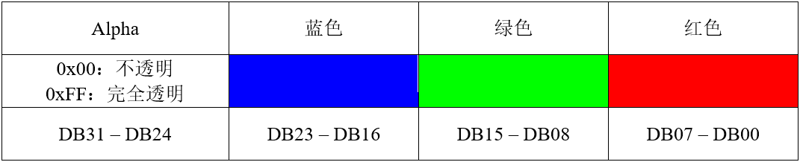
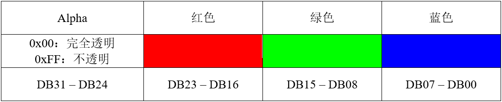
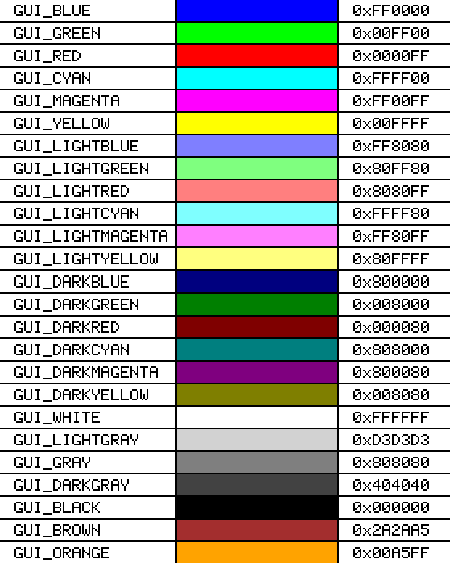
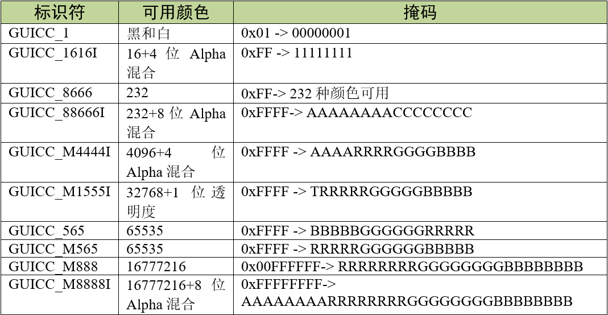
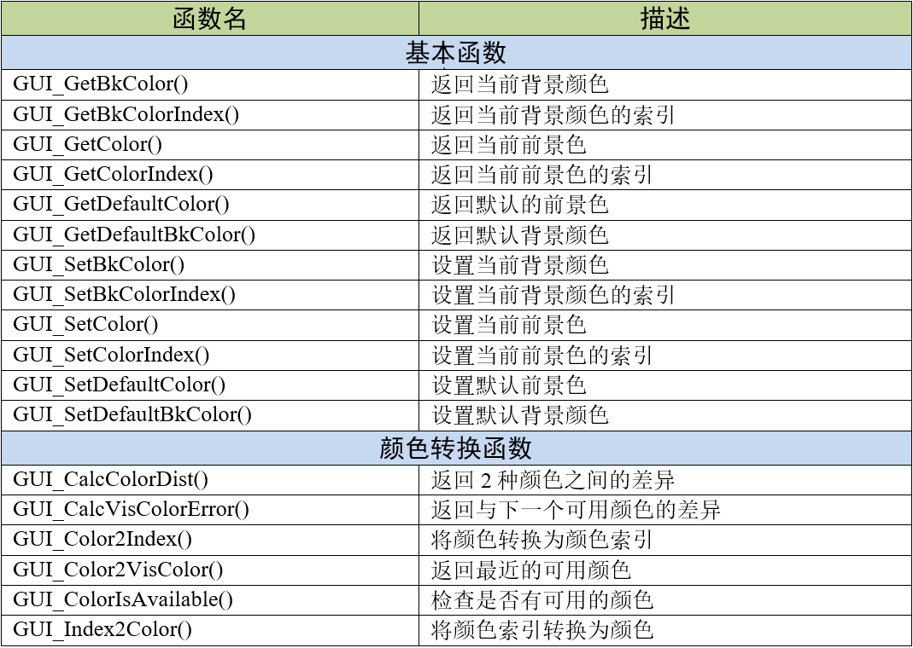
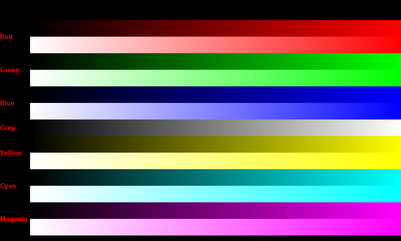

.. vim: syntax=rst

颜色
=====

emWin支持不同程度的色彩显示，比如彩色显示、多阶灰度显示和黑/白显示等。
用户现有的emWin应用程序只需修改位于GUIDRV_wf.c中的显示配置，就可以在不同类型的显示器上正常使用。

逻辑颜色和物理颜色
~~~~~~~~~~~~~~~~~~~~~~~~~

在emWin中颜色分为逻辑颜色和物理颜色。其中逻辑颜色是应用程序处理的颜色，
包含三个8位的颜色分量和一个8位的alpha通道。在emWin V5.30之前的很长一段时间内，
逻辑颜色都只有ABGR这一种颜色格式，如表格 ABGR逻辑颜色格式_ 所示。

随着越来越多的硬件平台开始使用和ABGR稍微不同的颜色格式，emWin从V5.30开始增加了对ARGB逻辑颜色格式的支持，
以便在某些情况下能够显着提高性能。ARGB逻辑颜色格式构成如表格 ARGB逻辑颜色格式_ 所示。

从上表可以看出，ARGB逻辑颜色格式除了将蓝色和红色调换了位置以外，Alpha通道值的定义也完全相反。

由于STM32F429的DMA2D采用的就是ARGB颜色格式，所以我们所有的例程全部使用ARGB格式。
因为emWin的逻辑颜色格式跟DMA2D的格式相同的话可以提升性能和运行效率。如果还是采用原来的ABGR格式，显示的时候每个像素都要进行格式转换，
这样对图形性能有较大影响，特别是显示24位和32位色彩深度的图形时影响会很大。如何开启ARGB颜色格式在emWin移植章节已有介绍，在此不再赘述。

物理颜色是显示器实际显示的颜色，在运行时，逻辑颜色映射到物理颜色。

预定义的颜色
~~~~~~~~~~~~~~~~~~

emWin预定义了一些标准颜色，这些颜色使用宏定义来表示，如图 emWin预定义颜色_ 所示。

这里需要注意一点，图 emWin预定义颜色_ 是官方手册给出的标准颜色宏定义，使用的是ABGR颜色格式。
程序中则给出了ARGB和ABGR两种格式下的标准颜色宏定义，见 代码清单:颜色-1_ 。

.. code-block:: c
    :caption: 代码清单:颜色-1 标准颜色定义
    :name: 代码清单:颜色-1
    :linenos:

    /*********************************************************************
    *
    *       Standard colors
    */
    #if (GUI_USE_ARGB) //ARGB格式的标准颜色定义
    #define GUI_BLUE          0xFF0000FF
    #define GUI_GREEN         0xFF00FF00
    #define GUI_RED           0xFFFF0000
    #define GUI_CYAN          0xFF00FFFF
    #define GUI_MAGENTA       0xFFFF00FF
    #define GUI_YELLOW        0xFFFFFF00
    #define GUI_LIGHTBLUE     0xFF8080FF
    #define GUI_LIGHTGREEN    0xFF80FF80
    #define GUI_LIGHTRED      0xFFFF8080
    #define GUI_LIGHTCYAN     0xFF80FFFF
    #define GUI_LIGHTMAGENTA  0xFFFF80FF
    #define GUI_LIGHTYELLOW   0xFFFFFF80
    #define GUI_DARKBLUE      0xFF000080
    #define GUI_DARKGREEN     0xFF008000
    #define GUI_DARKRED       0xFF800000
    #define GUI_DARKCYAN      0xFF008080
    #define GUI_DARKMAGENTA   0xFF800080
    #define GUI_DARKYELLOW    0xFF808000
    #define GUI_WHITE         0xFFFFFFFF
    #define GUI_LIGHTGRAY     0xFFD3D3D3
    #define GUI_GRAY          0xFF808080
    #define GUI_DARKGRAY      0xFF404040
    #define GUI_BLACK         0xFF000000
    #define GUI_BROWN         0xFFA52A2A
    #define GUI_ORANGE        0xFFFFA500
    #define GUI_TRANSPARENT   0x00000000

    #define GUI_GRAY_3F       0xFF3F3F3F
    #define GUI_GRAY_50       0xFF505050
    #define GUI_GRAY_55       0xFF555555
    #define GUI_GRAY_60       0xFF606060
    #define GUI_GRAY_7C       0xFF7C7C7C
    #define GUI_GRAY_9A       0xFF9A9A9A
    #define GUI_GRAY_AA       0xFFAAAAAA
    #define GUI_GRAY_C0       0xFFC0C0C0
    #define GUI_GRAY_C8       0xFFC8C8C8
    #define GUI_GRAY_D0       0xFFD0D0D0
    #define GUI_GRAY_E7       0xFFE7E7E7
    #define GUI_BLUE_98       0xFF000098
    #else              //ABGR格式的标准颜色定义
    #define GUI_BLUE          0x00FF0000
    #define GUI_GREEN         0x0000FF00
    #define GUI_RED           0x000000FF
    #define GUI_CYAN          0x00FFFF00
    #define GUI_MAGENTA       0x00FF00FF
    #define GUI_YELLOW        0x0000FFFF
    #define GUI_LIGHTBLUE     0x00FF8080
    #define GUI_LIGHTGREEN    0x0080FF80
    #define GUI_LIGHTRED      0x008080FF
    #define GUI_LIGHTCYAN     0x00FFFF80
    #define GUI_LIGHTMAGENTA  0x00FF80FF
    #define GUI_LIGHTYELLOW   0x0080FFFF
    #define GUI_DARKBLUE      0x00800000
    #define GUI_DARKGREEN     0x00008000
    #define GUI_DARKRED       0x00000080
    #define GUI_DARKCYAN      0x00808000
    #define GUI_DARKMAGENTA   0x00800080
    #define GUI_DARKYELLOW    0x00008080
    #define GUI_WHITE         0x00FFFFFF
    #define GUI_LIGHTGRAY     0x00D3D3D3
    #define GUI_GRAY          0x00808080
    #define GUI_DARKGRAY      0x00404040
    #define GUI_BLACK         0x00000000
    #define GUI_BROWN         0x002A2AA5
    #define GUI_ORANGE        0x0000A5FF
    #define GUI_TRANSPARENT   0xFF000000

    #define GUI_GRAY_3F       0x003F3F3F
    #define GUI_GRAY_50       0x00505050
    #define GUI_GRAY_55       0x00555555
    #define GUI_GRAY_60       0x00606060
    #define GUI_GRAY_7C       0x007C7C7C
    #define GUI_GRAY_9A       0x009A9A9A
    #define GUI_GRAY_AA       0x00AAAAAA
    #define GUI_GRAY_C0       0x00C0C0C0
    #define GUI_GRAY_C8       0x00C8C8C8
    #define GUI_GRAY_D0       0x00D0D0D0
    #define GUI_GRAY_E7       0x00E7E7E7
    #define GUI_BLUE_98       0x00980000
    #endif

从 代码清单:颜色-1_ 可以看出，似乎是有一部分颜色完全透明，另一部分完全不透明。
实际上除了GUI_TRANSPARENT以外所有的这些预定义颜色都是默认设置为完全不透明的，
但由于两种逻辑颜色格式对Alpha通道数值大小的定义相反，所以看起来会有些差别。

固定调色板
~~~~~~~~~~~~~

emWin内置了非常多的固定调色板模式，我们在这里只列举下面几种，见表格 emWin部分固定调色板_。
完整的调色板表格请参考《STemWin5.44参考手册》。

可能有读者会发现，上面的表格中调色板的标识符有些带有字母M，而另外一些则不带字母M。这也是跟之前的逻辑颜色格式有关，
含字母M的表示ARGB颜色格式下使用的调色板，不带M的表示在ABGR格式下使用的调色板。

在这里我们简单介绍下两个计算机图形学中的概念，一个叫色彩深度，另一个叫像素格式。

1. 色彩深度(color depth)，也称为位深度(bit depth)，表示图像中存储一个像素的色彩信息所占用的位数，单位是位/像素(**bits per pixel**)或bpp。
   通常说的什么8位、24位图像，这个多少位指的就是色彩深度。色彩深度越大，则单个像素包含的色彩信息越多，图像整体的颜色就越丰富。
   常见的色彩深度有1bpp、4bpp、8bpp、16bpp、24bpp和32bpp。

2. 像素格式(pixel format)，它表示为一个像素的颜色信息以什么样的方式和顺序进行存储。例如RGB565表示用16位的色彩深度存储单个像素的颜色信息，
   从高位到低位依次存放红绿蓝三色，其中红色和蓝色占5位，绿色占6位。同一种色彩深度可以对应不同的像素格式。还是刚才的RGB565像素格式，
   这次我交   换红色和蓝色的存放顺序，就变成了另一种像素格式BGR565，但色彩深度还是16位。

颜色API
~~~~~~~~~~~~~

表格 颜色API_ 列出了颜色显示相关的API函数。

这些颜色API函数里面颜色转换函数很少会用到。最常用的应该就是GUI_SetBkColor()和GUI_SetColor()了，这两个函数分别用来设置背景色和前景色。

颜色显示实验
~~~~~~~~~~~~~~~~~~

我们的颜色显示例程是从官方例程修改而来，完整的例程读者可参考位于模拟工程中的COLOR_ShowColorBar.c例程。

代码分析
^^^^^^^^^^^^

.. code-block:: c
    :caption: 代码清单:颜色-2 DemoShowColorBar函数（ColorBar_Task.c）
    :name: 代码清单:颜色-2
    :linenos:

    static const BAR_DATA _aBarData[] = {
        { 2, GUI_RED    , "Red" },
        { 2, GUI_GREEN  , "Green" },
        { 2, GUI_BLUE   , "Blue" },
        { 1, GUI_WHITE  , "Grey" },
        { 2, GUI_YELLOW , "Yellow" },
        { 2, GUI_CYAN   , "Cyan" },
        { 2, GUI_MAGENTA, "Magenta" },
    };

    static const GUI_COLOR _aColorStart[] = { GUI_BLACK, GUI_WHITE };

    /**
    * @brief 色条显示函数
    * @note 无
    * @param 无
    * @retval 无
    */
    static void _DemoShowColorBar(void)
    {
        GUI_RECT Rect;
        int      yStep;
        int      i;
        int      j;
        int      xSize;
        int      ySize;
        int      NumBars;
        int      NumColors;

        xSize = LCD_GetXSize();
        ySize = LCD_GetYSize();

        /* 可以显示的色条数 */
        NumColors = GUI_COUNTOF(_aBarData);
        for (i = NumBars = 0, NumBars = 0; i < NumColors; i++) {
            NumBars += _aBarData[i].NumBars;
        }
        yStep = (ySize - Y_START) / NumBars;

        /* 显示文本 */
        Rect.x0 = 0;
        Rect.x1 = X_START - 1;
        Rect.y0 = Y_START;
        GUI_SetFont(&GUI_Font16B_ASCII);
        for (i = 0; i < NumColors; i++) {
            Rect.y1 = Rect.y0 + yStep * _aBarData[i].NumBars - 1;
            GUI_DispStringInRect(_aBarData[i].s, &Rect, GUI_TA_LEFT |
                                GUI_TA_VCENTER);
            Rect.y0 = Rect.y1 + 1;
        }

        /* 绘制色条 */
        Rect.x0 = X_START;
        Rect.x1 = xSize - 1;
        Rect.y0 = Y_START;
        for (i = 0; i < NumColors; i++) {
            for (j = 0; j < _aBarData[i].NumBars; j++) {
                Rect.y1 = Rect.y0 + yStep - 1;
                GUI_DrawGradientH(Rect.x0, Rect.y0, Rect.x1, Rect.y1,
                                _aColorStart[j], _aBarData[i].Color);
                Rect.y0 = Rect.y1 + 1;
            }
        }
    }

首先，根据屏幕大小计算出可以显示多少色条，然后将每条色条的名称通过GUI_DispStringInRect函数显示出来，
最后调用GUI_DrawGradientH函数根据指定的颜色，绘制出所有的色条。

实验现象
^^^^^^^^^^^^

在RGB888像素格式下的颜色显示实验结果如图 实验结果_ 所示。
实际在LCD屏幕上看到的色条可能稍微会有一些不连续。读者可以更改GUIDRV_wf.c中的颜色模式，
看看不同像素格式下的色条显示情况。

