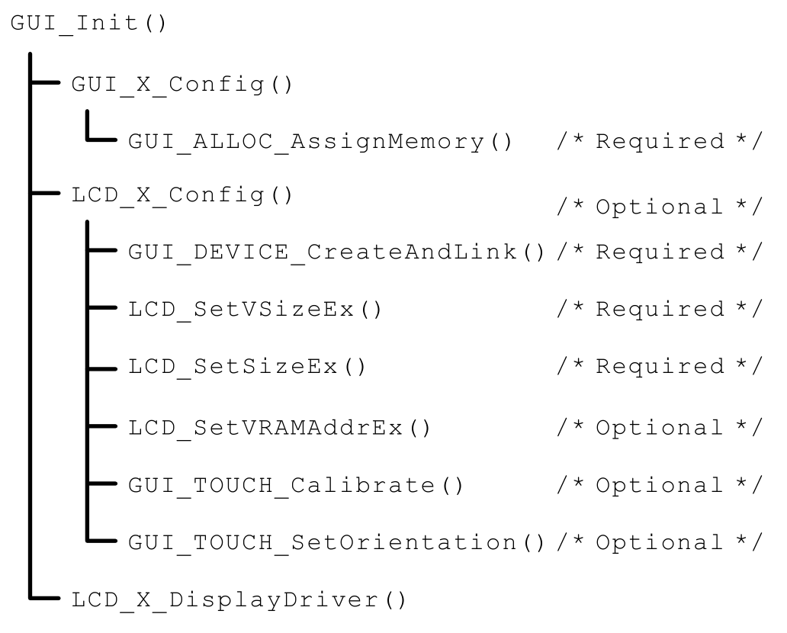
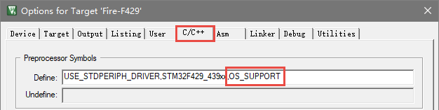
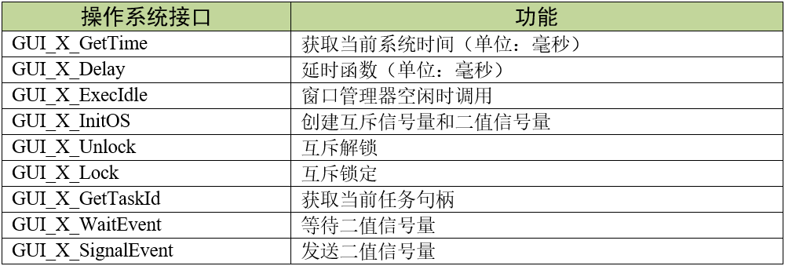
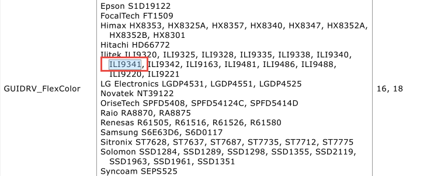
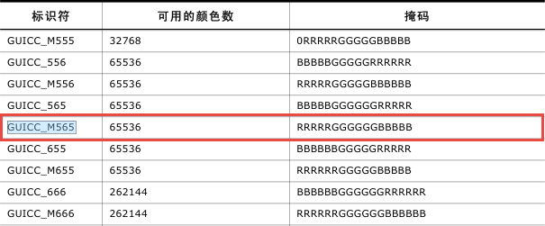
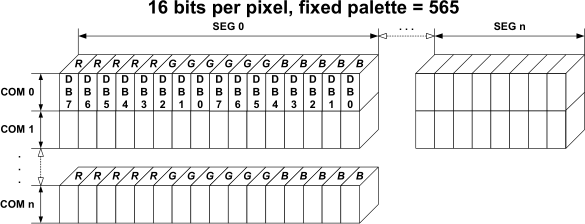
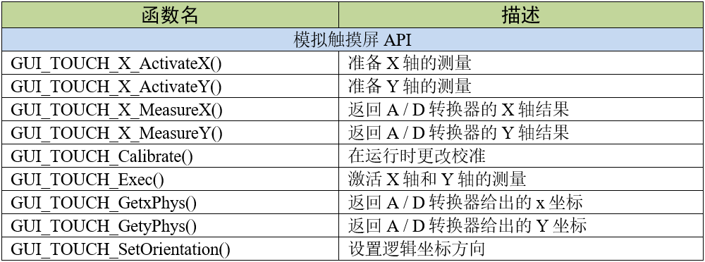
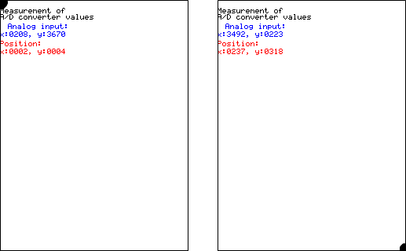
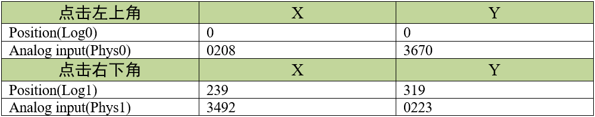
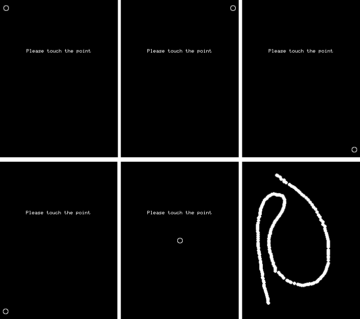

.. vim: syntax=rst

移植emWin到STM32—8080并口
=============================

要使emWin在特定的硬件平台上运行，需要为emWin提供与底层硬件操作相关的函数接口，主要为内存管理接口、液晶驱动接口和触摸屏接口。

本章以配套例程“FreeRTOS_STemWIN544_移植模版”为例，对emWin的执行过程和移植步骤进行解构，阅读时请打开该工程配套学习。

本章第1、2、3小节适用于野火STM32全系列开发板，第4、5、6小节适用于显示接口为8080并口（mini、指南者、霸道、霸天虎）的开发板，
适用于RGB接口开发板（F4\F7\H7挑战者、H743\H750 Pro）的移植过程单独放到下一章。

emWin的初始化
~~~~~~~~~~~~~~~~~~

在移植emWin之前，我们需要了解它的初始化过程以及它依赖的硬件接口。

相信读者已经通过上一章的emWin仿真教程章节知道，在使用emWin前，都要先调用GUI_Init函数初始化emWin运行所需要的环境，
在这个GUI_Init函数里，调用了emWin底层的配置函数，见图 emWin初始化流程_ 。
它按顺序分别调用了GUI_X_Config、LCD_X_Config及LCD_X_DisplayDriver函数，完成了存储器分配、屏幕类型配置及初始化液晶驱动的工作。
这些函数在前面的emWin仿真章节已经简要介绍过，在Win32仿真环境下的这些函数，已由Segger官方配置过，我们无需修改也能正常运行，
而在嵌入式平台上，就必须修改这几个函数，以适应特定平台的需求。

除了上述函数的修改，还有一些emWin配置文件和操作系统接口相关文件的修改，综合各文件和配置的修改情况，可整理出移植emWin所需要的配置：

   -  配置系统功能；

   -  配置操作系统接口；

   -  配置内存管理接口；

   -  配置显示驱动接口；

   -  配置触摸屏接口。

配置系统功能
~~~~~~~~~~~~~~~~~~

在emWin启动前需要对其功能进行适当的配置，它们的代码位于GUIConf.h文件中，见 代码清单:8080并口-1_ 。

.. code-block:: c
    :caption: 代码清单:8080并口-1 GUIConf.h文件内容
    :name: 代码清单:8080并口-1
    :linenos:

    #ifndef GUICONF_H
    #define GUICONF_H

    /*********************************************************************
    *
    *       Multi layer/display support
    */
    #define GUI_NUM_LAYERS            2    // Maximum number of available (1)
    layers

    /*********************************************************************
    *
    *       Multi tasking support
    */
    #ifdef OS_SUPPORT
    #define GUI_OS                    (1)  // Compile with multitasking   (2)
                                    support
    #else
    #define GUI_OS                    (0)
    #endif

    /*********************************************************************
    *
    *       Configuration of touch support
    */
    #ifndef   GUI_SUPPORT_TOUCH
    #define GUI_SUPPORT_TOUCH       (1)  // Support touchscreen           (3)
    #endif

    /*********************************************************************
    *
    *       Default font
    */
    #define GUI_DEFAULT_FONT          &GUI_Font6x8                        (4)

    /*********************************************************************
    *
    *         Configuration of available packages
    */
    #define GUI_SUPPORT_MOUSE             (1)    /* Support a mouse */    (5)
    #define GUI_WINSUPPORT                (1)    /* Use window manager */ (6)
    #define GUI_SUPPORT_MEMDEV            (1)    /* Memory device package (7)
                                        available */
    #define GUI_SUPPORT_DEVICES           (1)    /* Enable use of device  (8)
                                        pointers */

    /*********************************************************************
    *
    *       External memory support
    */
    #define USE_EXTMEMHEAP            (1)                                 (9)

    /*********************************************************************
    *
    *       ARGB support
    */
    #define GUI_USE_ARGB              (1)                                 (10)

    #endif  /* Avoid multiple inclusion */

(1) GUI_NUM_LAYERS设置了emWin最大支持的显示图层数。其实GUIConf.h文件中的此参数是无效的，对于8080并口的开发板，
由于芯片本身性能的限制不能很好的支持多图层显示；对于RGB接口的开发板，在配置显示驱动接口的时候会对这个宏进行重定义，真正起作用的是重定义之后的宏；

(2) GUI_OS定义了是否支持操作系统和多任务功能，为1时支持，可通过OS_SUPPORT宏来设置，
在教程配套的例程中我们将OS_SUPPORT宏定义放在了MDK的预编译选项中，见图 OS_SUPPORT宏的定义位置_ ；

(3) GUI_SUPPORT_TOUCH设置是否支持触摸操作，
为1时支持；

(4) GUI_DEFAULT_FONT设置默认字体大小，
这个宏一般不会修改；

(5) GUI_SUPPORT_MOUSE
设置是否启用鼠标；

(6) GUI_WINSUPPORT
设置是否使用窗口管理器；

(7) GUI_SUPPORT_MEMDEV
设置是否使用内存设备；

(8) GUI_SUPPORT_DEVICES
设置是否使用设备指针；

(9)  USE_EXTMEMHEAP是自行添加的宏，设置是否使用外部SDRAM作为emWin的内存堆，为1时使用外部SDRAM，
为0时使用内部RAM，作用于GUIConf.c文件；

(10) GUI_USE_ARGB设置emWin运行时的逻辑颜色格式，虽然emWin V5.30以后支持ARGB颜色格式，但默认格式仍然是ABGR，
所以需要使用该宏进行切换。对于野火F1系列开发板，只要使用名字带ARGB的emwin库即可，此宏不用设置。

配置操作系统接口
~~~~~~~~~~~~~~~~~~~~~~~~

使用操作系统时，需要给emWin提供操作系统的接口，emWin的内核使用这些接口管理系统资源，
便于适配不同的操作系统。以本教程配套的FreeRTOS系统为例，emWin对于该操作系统接口的示例文件为GUI_X_FreeRTOS.c，
见 代码清单:8080并口-2_ 。

.. code-block:: c
    :caption: 代码清单:8080并口-2 GUI_X_FreeRTOS.c内容
    :name: 代码清单:8080并口-2
    :linenos:

    /* Includes ----------------------------------------------------------*/

    #include "GUI.h"

    /* FreeRTOS头文件 */
    #include "FreeRTOS.h"
    #include "task.h"
    #include "semphr.h"
    /*********************************************************************
    *
    * Global data
    */
    static xSemaphoreHandle xQueueMutex = NULL;
    static xSemaphoreHandle xSemaTxDone = NULL;

    /*********************************************************************
    *
    * Timing:
    * GUI_X_GetTime()
    * GUI_X_Delay(int)

    Some timing dependent routines require a GetTime
    and delay function. Default time unit (tick), normally is
    1 ms.
    */
    int GUI_X_GetTime(void)
    {
        return ((int) xTaskGetTickCount());
    }

    void GUI_X_Delay(int ms)
    {
        vTaskDelay( ms );
    }

    /*********************************************************************
    *
    * GUI_X_Init()
    *
    * Note:
    * GUI_X_Init() is called from GUI_Init is a possibility to init
    * some hardware which needs to be up and running before the GUI.
    * If not required, leave this routine blank.
    */

    void GUI_X_Init(void)
    {
    }

    /*********************************************************************
    *
    * GUI_X_ExecIdle
    *
    * Note:
    * Called if WM is in idle state
    */

    void GUI_X_ExecIdle(void)
    {
        GUI_X_Delay(1);
    }

    /*********************************************************************
    *
    * Multitasking:
    *
    * GUI_X_InitOS()
    * GUI_X_GetTaskId()
    * GUI_X_Lock()
    * GUI_X_Unlock()
    *
    * Note:
    * The following routines are required only if emWin is used in a
    * true multi task environment, which means you have more than one
    * thread using the emWin API.
    * In this case the
    * #define GUI_OS 1
    * needs to be in GUIConf.h
    */

    /* Init OS */
    void GUI_X_InitOS(void)
    {
        /* 创建互斥信号量 用于资源共享 */
        xQueueMutex = xSemaphoreCreateMutex();
        configASSERT (xQueueMutex != NULL);
        /* 创建二值信号量 用于事件触发 */
        vSemaphoreCreateBinary( xSemaTxDone );
        configASSERT ( xSemaTxDone != NULL );
    }

    void GUI_X_Unlock(void)
    {
        /* 给出互斥量 */
        xSemaphoreGive(xQueueMutex);
    }

    void GUI_X_Lock(void)
    {
        if (xQueueMutex == NULL) {
            GUI_X_InitOS();
        }
        /* 获取互斥量 */
        xSemaphoreTake(xQueueMutex,   /* 互斥量句柄 */
                        portMAX_DELAY);/* 阻塞等待 */
    }

    /* Get Task handle */
    U32 GUI_X_GetTaskId(void)
    {
        return ((U32) xTaskGetCurrentTaskHandle());
    }

    void GUI_X_WaitEvent (void)
    {
        /* 获取信号量 */
        while (xSemaphoreTake(xSemaTxDone,           /* 信号量句柄 */
                            portMAX_DELAY) != pdTRUE);/* 阻塞等待 */
    }

    void GUI_X_SignalEvent (void)
    {
        /* 给出信号量 */
        xSemaphoreGive(xSemaTxDone);
    }

    /*********************************************************************
    *
    * Logging: OS dependent

    Note:
    Logging is used in higher debug levels only. The typical target
    build does not use logging and does therefor not require any of
    the logging routines below. For a release build without logging
    the routines below may be eliminated to save some space.
    (If the linker is not function aware and eliminates unreferenced
    functions automatically)

    */

    void GUI_X_Log (const char *s) { }
    void GUI_X_Warn (const char *s) { }
    void GUI_X_ErrorOut(const char *s) { }

    /*************************** End of file ****************************/

上述示例代码就是针对具体的操作系统进行封装，它封装的操作系统接口总结如表 需要提供给emWin的操作系统接口_ 所示，
主要包括互斥信号量和二值信号量的创建、
获取和释放的操作，还包含有获取任务句柄、当前系统时间戳以及延时相关的操作。

GUI_X_FreeRTOS.c中除了有操作系统接口之外，还有一些调试日志和错误输出接口，不过几乎很少会用到，在此不做介绍。

配置内存管理接口
~~~~~~~~~~~~~~~~~~~~~~~~

从这一小节开始，8080并口和RGB接口的移植步骤就不一样了，RGB接口的移植请直接跳到下一章。

emWin启动时，GUI_X_Config函数是GUI_Init调用的第一个初始化函数，这个函数初始化了emWin的运行内存，
代码位于GUIConf.c文件中，见 代码清单:8080并口-3_ 。

.. code-block:: c
    :caption: 代码清单:8080并口-3 GUIConf.c文件内容
    :name: 代码清单:8080并口-3
    :linenos:

    #include "GUI.h"
    #include "./sram/bsp_fsmc_sram.h"

    /*********************************************************************
    *
    *       Defines, configurable
    *
    **********************************************************************
    */
    /* 定义用于GUI的可用字节数 */
    #if USE_EXTMEMHEAP
    #define GUI_NUMBYTES  (1024 * 1024) // xByte                       (1)
    #else
    #define GUI_NUMBYTES  (1024 * 32)   // xByte
    #endif

    /*********************************************************************
    *
    *       Static data
    *
    **********************************************************************
    */
    #if USE_EXTMEMHEAP                                                 (2)
    static U32 HeapMem[GUI_NUMBYTES / 4] __attribute__((at(
                                                    Bank1_SRAM3_ADDR)));
    #else
    static U32 extMem[GUI_NUMBYTES / 4];
    #endif

    /*********************************************************************
    *
    *       Public code
    *
    **********************************************************************
    */
    /*********************************************************************
    *
    *       GUI_X_Config
    *
    * Purpose:
    *   Called during the initialization process in order to set up the
    *   available memory for the GUI.
    */
    void GUI_X_Config(void)
    {
    #if USE_EXTMEMHEAP
        GUI_ALLOC_AssignMemory(HeapMem, GUI_NUMBYTES);                  (3)
    #else
        GUI_ALLOC_AssignMemory(extMem, GUI_NUMBYTES);
    #endif
    }

上述代码中的第1部分定义了emWin所使用内存堆大小的宏GUI_NUMBYTES，第2部分是利用前1个宏定义了一个静态的，
大小为GUI_NUMBYTES / 4的数组HeapMem，并将数组的首地址定位到Bank1_SRAM3_ADDR处，
第3部分利用库函数GUI_ALLOC_AssignMemory把该静态数组分配给emWin作为内存块使用。
旧版例程中还用到了GUI_ALLOC_SetAvBlockSize函数配置每个小存储块的平均大小，
但在本教程使用的V5.44a版本已经不再需要GUI_ALLOC_SetAvBlockSiz函数。

用户可通过GUI_NUMBYTES改变emWin使用的内存块大小，在本示例中的1024KB。
也可通过GUIConf.h中的USE_EXTMEMHEAP宏来选择emWin的内存堆是在内部RAM还是外部SRAM。

请注意，应用程序无法使用全部的内存空间，因为emWin的内存管理系统本身使用了其中很小的一部分，大约12个字节用于系统管理。

配置显示驱动接口
~~~~~~~~~~~~~~~~~~~~~~~~

emWin的显示驱动接口主要包括在LCDConf_FlexColor.c文件中，移植时主要针对LCDConf_FlexColor.c文件进行修改，同时也是emWin移植的重点对象。

LCD_X_Config函数
^^^^^^^^^^^^^^^^^^^^^^^^^^^^^^^^^^^^^^^^^^

先来了解显示驱动函数LCD_X_Config的程序流程，它会在GUI_X_Config函数结束后被调用，具体见 代码清单:8080并口-4_ 。

.. code-block:: c
    :caption: 代码清单:8080并口-4 LCD_X_Config接口（LCDConf_FlexColor.c文件）
    :name: 代码清单:8080并口-4
    :linenos:

    void LCD_X_Config(void)
    {
        GUI_DEVICE * pDevice;
        CONFIG_FLEXCOLOR Config = {0};
        GUI_PORT_API PortAPI = {0};

        /* 第1部分，链接显示驱动和颜色转换程序 */
        pDevice = GUI_DEVICE_CreateAndLink(GUIDRV_FLEXCOLOR, GUICC_M565, 0, 0);
        /* 设置显示区域尺寸 */
        LCD_SetSizeEx (0, XSIZE_PHYS , YSIZE_PHYS);
        LCD_SetVSizeEx(0, VXSIZE_PHYS, VYSIZE_PHYS);

        /* 第2部分，设置液晶驱动基础选项 */
        Config.FirstCOM = 0;          //modify by fire
        Config.FirstSEG = 0;          //modify by fire
        Config.Orientation = GUI_MIRROR_Y|GUI_MIRROR_X;//modify by fire竖屏
        Config.NumDummyReads = 2;     //modify by fire读取的第二个数据才是真实数据

        GUIDRV_FlexColor_Config(pDevice, &Config);

        /* 第3部分，添加液晶读写函数 */
        PortAPI.pfWrite16_A0  = LcdWriteReg;
        PortAPI.pfWrite16_A1  = LcdWriteData;
        PortAPI.pfWriteM16_A1 = LcdWriteDataMultiple;
        PortAPI.pfReadM16_A1  = LcdReadDataMultiple;
        GUIDRV_FlexColor_SetFunc(pDevice, &PortAPI,
                                GUIDRV_FLEXCOLOR_F66709,
                                GUIDRV_FLEXCOLOR_M16C0B16);//modify by fire
    }

LCD_X_Config函数的作用是创建一个显示驱动器件，设置颜色转换程序，并配置物理显示尺寸。
如 代码清单:8080并口-4_ 所示，此函数可分为3个部分，每个部分各用到了1个配置结构体，共使用了3个。

GUI_DEVICE类型
''''''''''''''''''''''''

LCD_X_Config函数在创建显示驱动器件时，使用了GUI_DEVICE类型的变量来记录液晶驱动器的4种属性，
关于它的定义见 代码清单:8080并口-5_ 。

.. code-block:: c
    :caption: 代码清单:8080并口-5 GUI_DEVICE原型
    :name: 代码清单:8080并口-5
    :linenos:

    struct GUI_DEVICE {
        /* Linking */
        GUI_DEVICE * pNext;
        GUI_DEVICE * pPrev;
        /* Data */
        union {
            GUI_HMEM hContext; // Handle of payload data like sprite- or memory device context
            void   * pContext; // Pointer for context data in a fixed block
        } u;
        /* API pointers */
        const GUI_DEVICE_API     * pDeviceAPI;
        const LCD_API_COLOR_CONV * pColorConvAPI;
        U16 Flags;
        int LayerIndex;
    };

1) GUI_DEVICE_API：用于记录液晶的驱动类型，它指向显示驱动的指针。emWin为了兼容不同的液晶驱动器，分类设置了多种驱动方案供用户选择，
如GUIDRV_BitPlains、GUIDRV_Dist、GUIDRV_FlexColor和GUIDRV_Lin等，本章配套的移植模版使用的液晶驱动器是ILI9341，
通过在《STemWin5.44参考指南》中查找，得到ILI9341在emWin中使用的是GUIDRV_FlexColor类型驱动，
见图 emWin对液晶驱动器ILI9341的支持_ 。

2) LCD_API_COLOR_CONV：用于记录颜色转换程序。不同的液晶屏对图像颜色的处理可能会不同，如同样是16位的颜色数据，
有RGB565、RGB655等不同的格式，所以我们要根据液晶屏选择恰当的颜色转换程序，当emWin上层库函数解析颜色数据时，
会调用该函数按固定格式转换。ILI9341的颜色格式为RGB565，所以选择GUICC_M565，见图 颜色转换程序_ 。

3) Flags：这个标志估计是emWin官方设计预留的，
官方给出的说明是这个变量应赋值为0，没有其它解释。

4) LayerIndex：用于指定液晶驱动所对应的显示层。emWin支持以多层的形式来驱动液晶屏，
多层操作可以用于驱动多屏幕或者做一些多层融合的高级操作，但多层操作对内存的消耗非常大。
在我们的应用中，只用到了单层的，所以这个参数我们配置为第0层。

在LCD_X_Config 函数中，调用了GUI_DEVICE_CreateAndLink函数按上面的描述配置了指向液晶驱动的pDevice指针，
GUI_DEVICE_API属性为GUIDRV_FLEXCOLOR，LCD_API_COLOR_CONV属性为GUICC_M565，Flags值为0，
LayerIndex为0，也就是 代码清单:8080并口-4_ 第1部分内容。

CONFIG_FLEXCOLOR类型
''''''''''''''''''''''''''''''''''''

此类型的结构体用来记录关于液晶屏的基本配置选项，其原型如 代码清单:8080并口-6_ 所示。

.. code-block:: c
    :caption: 代码清单:8080并口-6 CONFIG_FLEXCOLOR原型
    :name: 代码清单:8080并口-6
    :linenos:

    typedef struct {
        /* Driver specific configuration items */
        int FirstSEG;
        int FirstCOM;
        int Orientation;
        U16 RegEntryMode;
        int NumDummyReads;
    } CONFIG_FLEXCOLOR;

1) FirstSEG和FirstCOM：分别用于配置显示控制器数据RAM使用的第一个段地址及第一个公用地址，这两个地址用于对液晶数据RAM的寻址，
见图 显示数据在RAM中的组织方式_ 。通常该值为0，修改该参数会使屏幕显示的数据平移。ILI9341的这两个参数都为0。

2) Orientation：这个属性用于指定液晶屏的方向。它可以使用GUI_MIRROR_X(X轴镜像显示)、
GUI_MIRROR_Y(Y轴镜像显示)及GUI_SWAP_XY(交换XY轴)的组合来配置方向。关于ILI9341液晶屏的这个值的配置，
我们是实验得出的，在横屏的情况下，该属性配置为GUI_SWAP_XY \| GUI_MIRROR_Y，
竖屏的情况下该属性值被配置为GUI_MIRROR_Y|GUI_MIRROR_X。

3) RegEntryMode：RegEntryMode也是用来配置液晶屏的方向的，但官方给出的说明太少，
不知道如何使用。在本实验中我们不修改这个参数值，保持默认。

4) NumDummyReads：在进行液晶屏读数据操作时，第几个读操作读出的才是有效数据。
如ILI9341液晶控制器在进行读数据操作时，第1个读操作是无效的，在第2次进行读操作才会读出正确的数据，所以在本实验中，我们把这个属性值设置为2。

在LCD_X_Config 函数中，由GUIDRV_FlexColor_Config函数完成这些液晶屏配置，该函数有两个输入参数，
分别为GUI_DEVICE类型的指向液晶各类的指针和指向CONFIG_FLEXCOLOR类型的配置结构体，
具体配置见 代码清单:8080并口-4_ 第2部分内容。

GUI_PORT_API类型
''''''''''''''''''''''''''

完成了上面的配置后，还需要为emWin提供液晶屏的基本读写函数，在emWin中，使用GUI_PORT_API类型的结构体来保存指向这些基本读写函数的指针，
由用户根据液晶屏完成具体的操作，其结构体原型见 代码清单:8080并口-7_ 。

.. code-block:: c
    :caption: 代码清单:8080并口-7 GUI_PORT_API原型
    :name: 代码清单:8080并口-7
    :linenos:

    typedef struct {
        /* 8 Bit access */
        void (* pfWrite8_A0)  (U8 Data);
        void (* pfWrite8_A1)  (U8 Data);
        void (* pfWriteM8_A0) (U8 * pData, int NumItems);
        void (* pfWriteM8_A1) (U8 * pData, int NumItems);
        U8   (* pfRead8_A0)   (void);
        U8   (* pfRead8_A1)   (void);
        void (* pfReadM8_A0)  (U8 * pData, int NumItems);
        void (* pfReadM8_A1)  (U8 * pData, int NumItems);
        /* 16 Bit access */
        void (* pfWrite16_A0) (U16 Data);
        void (* pfWrite16_A1) (U16 Data);
        void (* pfWriteM16_A0)(U16 * pData, int NumItems);
        void (* pfWriteM16_A1)(U16 * pData, int NumItems);
        U16  (* pfRead16_A0)  (void);
        U16  (* pfRead16_A1)  (void);
        void (* pfReadM16_A0) (U16 * pData, int NumItems);
        void (* pfReadM16_A1) (U16 * pData, int NumItems);
        /* 32 Bit access */
        void (* pfWrite32_A0) (U32 Data);
        void (* pfWrite32_A1) (U32 Data);
        void (* pfWriteM32_A0)(U32 * pData, int NumItems);
        void (* pfWriteM32_A1)(U32 * pData, int NumItems);
        U32  (* pfRead32_A0)  (void);
        U32  (* pfRead32_A1)  (void);
        void (* pfReadM32_A0) (U32 * pData, int NumItems);
        void (* pfReadM32_A1) (U32 * pData, int NumItems);
        /* SPI access */
        void (* pfSetCS)      (U8 NotActive);
        /* Common routines */
        void (* pfFlushBuffer)(void);
    } GUI_PORT_API;

从 代码清单:8080并口-7_ 中可以看到，它主要定义了8位、16位及32位这三大类的液晶操作函数指针。
我们使用的ILI9341是配置成16位形式的，所以在这里主要讲解16位的操作函数，其它位的函数其实是类似的，
掌握原理后读者可以轻松地把emWin移植到其它液晶驱动器上。

代码清单:8080并口-7_ 中用于16位液晶驱动器的操作函数有8个，但实际上并不需要实现全部8个函数，
据官方说明，GUIDRV_FlexColor类型的16位液晶驱动只需要实现写一个命令字、写一个数据字、写多个数据字及读多个数据字这四个操作函数就可以了。

首先是pfWrite16_A0，它是写一个命令字的指针。在程序中我们向它赋值LcdWriteReg，
一个具有向液晶屏寄存器写入命令功能的函数。函数见 代码清单:8080并口-8_ 。

.. code-block:: c
    :caption: 代码清单:8080并口-8 LcdWriteReg函数（LCDConf_FlexColor.c文件）
    :name: 代码清单:8080并口-8
    :linenos:

    /* LCD驱动器的访问地址 */
    #define macFSMC_ILI9341_REG *(__IO uint16_t *)(0x6C000000)

    /********************************************************************
    *
    *       LcdWriteReg
    *
    * Function description:
    *   Sets display register
    */
    static void LcdWriteReg(U16 Data)
    {
        // ... TBD by user
        macFSMC_ILI9341_REG = Data; //modify by fire
    }

代码非常简单，就只有一个赋值语句，操作就是向0x6C000000地址写入命令内容而已，在配置好FSMC外设的情况下，
只要向这个地址写入一个数据，ILI9341液晶屏就会把它当成指令来执行，在实际操作中使用的是宏macFSMC_ILI9341_REG。

然后是pfWrite16_A1，它是写一个数据字的指针。在程序中我们向它赋值LcdWriteData，
一个具有向液晶屏寄存器写入单字节数的函数。函数见 代码清单:8080并口-9_ 。

.. code-block:: c
    :caption: 代码清单:8080并口-9 LcdWriteData函数（LCDConf_FlexColor.c文件）
    :name: 代码清单:8080并口-9
    :linenos:

    /* LCD驱动器的访问地址 */
    #define macFSMC_ILI9341_RAM *(__IO uint16_t *)(0x6D000000)

    /********************************************************************
    *
    *       LcdWriteData
    *
    * Function description:
    *   Writes a value to a display register
    */
    static void LcdWriteData(U16 Data)
    {
        // ... TBD by user
        macFSMC_ILI9341_RAM = Data;//modify by fire
    }

如 代码清单:8080并口-9_ 所示，这个函数与前一个唯一不同的是向宏ILI9341_RAM赋值，该宏指向的地址为0x6D000000，
在配置好FSMC外设的情况下，向这个地址写入一个数据，ILI9341液晶屏就把它当普通数据的形式来理解。

接着是pfWriteM16_A1，它是写多个数据字的指针。在程序中我们向它赋值LcdWriteDataMultiple，
一个具有向液晶屏寄存器写入多个字节数的函数。函数见 代码清单:8080并口-10_ 。

.. code-block:: c
    :caption: 代码清单:8080并口-10 LcdReadDataMultiple函数（LCDConf_FlexColor.c文件）
    :name: 代码清单:8080并口-10
    :linenos:

    /* LCD驱动器的访问地址 */
    #define macFSMC_ILI9341_RAM *(__IO uint16_t *)(0x6D000000)

    /********************************************************************
    *
    *       LcdWriteDataMultiple
    *
    * Function description:
    *   Writes multiple values to a display register.
    */
    static void LcdWriteDataMultiple(U16 * pData, int NumItems)
    {
        while (NumItems--) {
            // ... TBD by user
            macFSMC_ILI9341_RAM = *pData++;           //modify by fire
        }
    }

与上面的写单字节数据的函数有一点区别，这个多字节写函数是对液晶数据赋值语句进行NumItems次循环，很好理解。

最后是pfReadM16_A1，它是读多个数据字的指针，在程序中我们向它赋值LcdReadDataMultiple，
一个具有向液晶屏寄存器写入多个字节数的函数。函数见 代码清单:8080并口-11_

.. code-block:: c
    :caption: 代码清单:8080并口-11 LcdReadDataMultiple函数（LCDConf_FlexColor.c文件）
    :name: 代码清单:8080并口-11
    :linenos:

    /* LCD驱动器的访问地址 */
    #define macFSMC_ILI9341_RAM *(__IO uint16_t *)(0x6D000000)

    /********************************************************************
    *
    *       LcdReadDataMultiple
    *
    * Function description:
    *   Reads multiple values from a display register.
    */
    static void LcdReadDataMultiple(U16 * pData, int NumItems)
    {
        while (NumItems--) {
            // ... TBD by user
            *pData++ = macFSMC_ILI9341_RAM;         //modify by fire
        }
    }

这个读数据函数是写数据函数的反操作，在做获取宏macFSMC_ILI9341_RAM这个地址中的内容时，ILI9341液晶控制器就会向STM32的FSMC外设输出数据。

所有四个函数都编写完毕后，就可以像 代码清单:8080并口-4_ 第3部分内容那样，对函数指针赋值。与此同时，
代码清单:8080并口-4_ 的最后调用了GUIDRV_FlexColor_SetFunc库函数配置液晶屏的总线、缓存及硬件程序，
此函数的pfFunc及pfMode参数是根据ILI9341驱动器在《STemWin5.44参考指南》中的说明来配置的，在此不作介绍。

至此，我们就完成了LCD_X_Config函数的配置，它的代码其实很简短，野火以大篇幅的内容介绍这个函数，
是为了让读者知道我们为什么这样修改代码，希望读者能够举一反三，在使用其它液晶驱动器的时候也能自己动手修改移植代码。

LCD_X_DisplayDriver函数
^^^^^^^^^^^^^^^^^^^^^^^^^^^^^^^^^^^^^^^^^^^^^^^^^^^^^^^^^^^^^

在LCDConf_FlexColor.c文件里，还有一个LCD_X_DisplayDriver函数，它是在GUI_Init库函数初始化过程中最后一个调用的，
使用它可以对不同的液晶层进行控制或初始化，见 代码清单:8080并口-12_ 。

.. code-block:: c
    :caption: 代码清单:8080并口-12 LCD_X_DisplayDriver函数（LCDConf_FlexColor.c文件）
    :name: 代码清单:8080并口-12
    :linenos:

    /*********************************************************************
    *
    *       LCD_X_DisplayDriver
    *
    * Function description:
    *   This function is called by the display driver for several purposes.
    *   To support the according task the routine needs to be adapted to
    *   the display controller. Please note that the commands marked with
    *   'optional' are not cogently required and should only be adapted if
    *   the display controller supports these features.
    *
    * Parameter:
    *   LayerIndex - Index of layer to be configured
    *   Cmd        - Please refer to the details in the switch statement
    below
    *   pData      - Pointer to a LCD_X_DATA structure
    *
    * Return Value:
    *   < -1 - Error
    *     -1 - Command not handled
    *      0 - Ok
    */
    int LCD_X_DisplayDriver(unsigned LayerIndex, unsigned Cmd, void *
                            pData)
    {
        int r;
        (void) LayerIndex;
        (void) pData;

        switch (Cmd) {
        case LCD_X_INITCONTROLLER: {
            /* Called during the initialization process in order to set
            up the display controller and put it into operation.
            If the display controller is not initialized by any
            external routine this needs to be adapted by the customer...
            */
            ILI9341_Init();           //modify by fire

            return 0;
        }
        default:
            r = -1;
        }
        return r;
    }

在模版示例中我们对它的修改非常简单，只是在它的Cmd参数为LCD_X_INITCONTROLLER时，调用了我们ILI9341液晶屏的底层初始化驱动函数ILI9341_Init函数，
完成了STM32的FSMC外设配置以及LCD屏基本参数初始化。

配置触摸接口
~~~~~~~~~~~~~~~~~~

触摸驱动
^^^^^^^^^^^^

emWin并没有将触摸设备接口整理为单独的.c文件，不过提供了触摸相关的库函数，
用户需自行编写触摸接口。emWin针对电阻屏提供了专门的库函数，见表 触摸设备API_ 。

emWin把触摸设备、外接鼠标和指点杆等都归为指针输入设备(Pointer input devices或PID)这一大类中。
其中触摸设备API分为通用触摸屏和模拟触摸屏两种，模拟触摸屏API为电阻屏专用。

在这里我们以模版示例中使用的3.2吋电阻屏为例，讲解如何配置触摸接口。首先是触摸接口的移植，见 代码清单:8080并口-13_ 。

.. code-block:: c
    :caption: 代码清单:8080并口-13 触摸接口移植（GUI_X_Touch_Analog.c文件）
    :name: 代码清单:8080并口-13
    :linenos:

    #include "GUI.h"
    #include ".\lcd\bsp_xpt2046_lcd.h"

    //modify by fire本文件的函数为触摸驱动，由emWin上层调用

    void GUI_TOUCH_X_ActivateX(void)
    {
        // XPT2046_WriteCMD(0x90);
    }

    void GUI_TOUCH_X_ActivateY(void)
    {
        //XPT2046_WriteCMD(0xd0);
    }

    int  GUI_TOUCH_X_MeasureX(void)
    {
        return XPT2046_ReadAdc_Fliter(macXPT2046_CHANNEL_Y);

    }

    int  GUI_TOUCH_X_MeasureY(void)
    {
        return XPT2046_ReadAdc_Fliter(macXPT2046_CHANNEL_X);
    }

上述代码中一共包含了4个函数，他们的具体内容需要由用户根据触摸屏驱动器来编写，在配套例程“FreeRTOS_STemWIN544_移植模版”中使用的电阻屏触摸驱动为XPT2046芯片，
关于此驱动器的控制原理请参考《零死角玩转STM32》教程。

代码清单:8080并口-13_ 中的前两个函数为空函数，实际上触摸数据的采集是后面两个函数完成的，为什么这么写呢？
因为在实际应用中，如果把XPT2046的原始数据直接交给emWin的话，
触摸屏幕光标就会随机跳动，会出现飞点。为了改善这种情况，
我们使用XPT2046_ReadAdc_Fliter函数对触摸数据进行多次采集，然后进行滤波处理，
以降低触摸信号的噪声，滤波函数见 代码清单:8080并口-14_ 。

.. code-block:: c
    :caption: 代码清单:8080并口-14 XPT2046_ReadAdc_Fliter函数（bsp_xpt2046_lcd.c文件）
    :name: 代码清单:8080并口-14
    :linenos:

    #define SAMP_CNT 4
    #define SAMP_CNT_DIV2 2
    /*
    *******************************************************
    * 函 数 名: XPT2046_ReadAdc_Fliter
    * 功能说明: 选择一个模拟通道，启动ADC，并返回ADC采样结果
    * 形    参：_ucCh = 0x90 表示Y通道； 0xd0 表示X通道
    * 返 回 值: 滤波后的12位ADC值
    *******************************************************
    */
    uint16_t XPT2046_ReadAdc_Fliter(uint8_t channel)
    {
        u8 i, j, min;
        u16 temp;
        u16 tempXY[SAMP_CNT];

        static uint16_t adc_x = 0, adc_y = 0;

        if (XPT2046_PENIRQ_Read() == XPT2046_PENIRQ_ActiveLevel) {
            for (i = 0; i < SAMP_CNT; i++) {
                XPT2046_WriteCMD(channel);
                tempXY[i] = XPT2046_ReadCMD();
            }
            // 降序排列
            for (i = 0; i < SAMP_CNT - 1; i++) {
                min = i;
                for (j = i + 1; j < SAMP_CNT; j++) {
                    if (tempXY[min] > tempXY[j])
                        min = j;
                }
                temp = tempXY[i];
                tempXY[i] = tempXY[min];
                tempXY[min] = temp;
            }

            // 设定阈值
            if ((tempXY[SAMP_CNT_DIV2] - tempXY[SAMP_CNT_DIV2 - 1]) > 5) {
                /* 若两个中间值相差太远，则舍弃这个新数据，返回上一次的触摸数据*/
                if (channel == macXPT2046_CHANNEL_Y)
                    return adc_x; //x通道
                else
                    return adc_y; //y通道
            }

            // 求中间值的均值
            if (channel == macXPT2046_CHANNEL_Y) {
                adc_x = (tempXY[SAMP_CNT_DIV2] + tempXY[SAMP_CNT_DIV2 - 1]) / 2;
                return adc_x;
            } else {
                adc_y = (tempXY[SAMP_CNT_DIV2] + tempXY[SAMP_CNT_DIV2 - 1]) / 2;
                return adc_y;
            }
        } else {
            return 0; //没有触摸，返回0
        }
    }

如 代码清单:8080并口-14_ 所示，本函数的滤波方法是，当触摸屏被按下时，采样触摸屏数据若干次，使用冒泡法排序，
取中间两个数据的差值；若差值大于阈值，则丢弃。由于引入了阈值判断，我们仅对数据采样4次，所得效果已经非常令人满意。
需要注意的是采样数据不宜过多，否则连续的线会变成离散的点。

触摸接口和滤波都完成后，就可以使用触摸屏了。在本章移植模板示例中，我们在单独一个任务中定时调用GUI_TOUCH_Exec函数，
让emWin去采集电阻屏各通道电压值，见 代码清单:8080并口-15_ 。

.. code-block:: c
    :caption: 代码清单:8080并口-15 Touch_Task函数（Main.c文件）
    :name: 代码清单:8080并口-15
    :linenos:

    /**
    * @brief 触摸检测任务主体
    * @note 无
    * @param 无
    * @retval 无
    */
    static void Touch_Task(void* parameter)
    {
        while (1) {
            GUI_TOUCH_Exec();//触摸屏定时扫描
            vTaskDelay(10);
        }
    }

如 代码清单:8080并口-15_ 所示，在Touch_Task任务中，每10ms调用一次GUI_TOUCH_Exec函数，为什么是10ms呢？
因为每调用一次GUI_TOUCH_Exec函数只会采集一个轴的值，采集完整的一个点需要调用两次GUI_TOUCH_Exec函数。

触摸校准
^^^^^^^^^^^^

初始化校准
''''''''''''

配置好基本的驱动接口之后，还要进行触摸校准，
在LCDConf_FlexColor.c文件中的LCD_X_Config函数里添加配置触摸屏方向及触摸校准的配置，见 代码清单:8080并口-16_ 。

.. code-block:: c
    :caption: 代码清单:8080并口-16 LCD_X_Config函数（LCDConf_FlexColor.c文件）
    :emphasize-lines: 30-38
    :name: 代码清单:8080并口-16
    :linenos:

    void LCD_X_Config(void)
    {
        GUI_DEVICE * pDevice;
        CONFIG_FLEXCOLOR Config = {0};
        GUI_PORT_API PortAPI = {0};

        /* 第1部分，链接显示驱动和颜色转换程序 */
        pDevice = GUI_DEVICE_CreateAndLink(GUIDRV_FLEXCOLOR, GUICC_M565, 0, 0);
        /* 设置显示区域尺寸 */
        LCD_SetSizeEx (0, XSIZE_PHYS , YSIZE_PHYS);
        LCD_SetVSizeEx(0, VXSIZE_PHYS, VYSIZE_PHYS);

        /* 第2部分，设置液晶驱动基础选项 */
        Config.FirstCOM = 0;          //modify by fire
        Config.FirstSEG = 0;          //modify by fire
        Config.Orientation = GUI_MIRROR_Y|GUI_MIRROR_X;//modify by fire竖屏
        Config.NumDummyReads = 2;     //modify by fire读取的第二个数据才是真实数据

        GUIDRV_FlexColor_Config(pDevice, &Config);

        /* 第3部分，添加液晶读写函数 */
        PortAPI.pfWrite16_A0  = LcdWriteReg;
        PortAPI.pfWrite16_A1  = LcdWriteData;
        PortAPI.pfWriteM16_A1 = LcdWriteDataMultiple;
        PortAPI.pfReadM16_A1  = LcdReadDataMultiple;
        GUIDRV_FlexColor_SetFunc(pDevice, &PortAPI,
                                GUIDRV_FLEXCOLOR_F66709,
                                GUIDRV_FLEXCOLOR_M16C0B16);//modify by fire

        /*第4部分，设置触摸原点 */
        GUI_TOUCH_SetOrientation((GUI_MIRROR_X * LCD_GetMirrorXEx(0)) |
                                (GUI_MIRROR_Y * LCD_GetMirrorYEx(0)) |
                                (GUI_SWAP_XY  * LCD_GetSwapXYEx (0)));
        /*设置触摸校准 */
        GUI_TOUCH_Calibrate(GUI_COORD_X, 0, 240-1, TOUCH_AD_RIGHT ,
                            TOUCH_AD_LEFT );
        GUI_TOUCH_Calibrate(GUI_COORD_Y, 0, 320-1,TOUCH_AD_BOTTOM ,
                            TOUCH_AD_TOP );
    }

如 代码清单:8080并口-16_ 粗体部分所示，在GUIDRV_FlexColor_SetFunc函数后添加了两个关于触摸屏的函数。

首先是GUI_TOUCH_SetOrientation函数，其函数原型如 代码清单:8080并口-17_ 所示。

.. code-block:: c
    :caption: 代码清单:8080并口-17 函数原型
    :name: 代码清单:8080并口-17
    :linenos:

    void GUI_TOUCH_SetOrientation(unsigned Orientation);

1) Orientation：触摸坐标轴方向，可使用“或”运算设置多个值。
此参数可选值见表 Orientation参数可选值_ 。

GUI_TOUCH_SetOrientation函数用于配置触摸屏方向。它配置好后可以自动与液晶屏匹配，而不需要对硬件程序进行任何的改动。
代码清单:8080并口-16_ 中此函数输入了3个类似参数GUI_MIRROR_X \*LCD_GetMirrorXEx(0)这样的，
其中的LCD_GetMirrorXEx函数就是在程序运行的时候获取液晶屏的状态，然后与标志位GUI_MIRROR_X相乘，
得出触摸屏是否需要旋转的结果，从而实现动态匹配触摸屏与液晶屏的方向。

然后是GUI_TOUCH_Calibrate函数，其函数原型如代码清单:8080并口-18所示。

.. code-block:: c
    :caption: 代码清单:8080并口-18 函数原型
    :name: 代码清单:8080并口-18
    :linenos:

    int GUI_TOUCH_Calibrate(int Coord, int Log0, int Log1, int Phys0, int Phys1);

1) Coord：
触摸坐标轴，x轴参数是GUI_COORD_X, y轴参数是GUI_COORD_Y；

2) Log0：
逻辑值0（以像素为单位）；

3) Log1：
逻辑值1（以像素为单位）；

4) Phys0：
Log0的A / D转换器值；

5) Phys1：
Log1的A / D转换器值。

如 代码清单:8080并口-18_ 所示，GUI_TOUCH_Calibrate函数有5个输入参数，
Coord可分别输入GUI_COORD_X或GUI_COORD_Y来配置两个方向的校准值。
其中Log0和Log1分别是指对应的屏幕像素值(逻辑值)，如我们的ILI9341液晶屏分辨率为240*320，在以竖屏方式使用时，X轴像素就是240，
所以在X轴方向的配置中，Log0和Log1的值我们分别配置为0和(240-1)。Y轴的像素是320，所以我们配置其Log0及Log1值分别为0和(320-1)。
Phys0及Phys1则是指对应到像素值为Log0及Log1时，触摸屏测量出的ADC原始数据，
这些原始数据就是前面我们配置触摸驱动接口时使用GUI_TOUCH_X_MeasureX和GUI_TOUCH_X_MeasureY在对应点获取到的数据。

在本章移植模板示例中我们使用了宏来表示这几个值，见 代码清单:8080并口-19_ 。

.. code-block:: c
    :caption: 代码清单:8080并口-19 触摸ADC值对应的宏
    :name: 代码清单:8080并口-19
    :linenos:

    #define TOUCH_AD_TOP          3670  //YPhys0
    #define TOUCH_AD_BOTTOM       223   //YPhys1
    #define TOUCH_AD_LEFT         208   //XPhys0
    #define TOUCH_AD_RIGHT        3492  //XPhys1

由于不同电阻屏之间的线性度参差不齐，所以这四个宏的值需要根据情况变化。那么怎样获取这几个值呢？移植模板示例中附带了一个校准函数，
让液晶屏在用户点击的位置显示“十”字，并把它的像素值坐标及物理原始数据显示出来，用户就可以通过点击屏幕，找到要配置点的像素值与触摸原始数据，
记录下来修改到程序的宏即可。见 代码清单:8080并口-20_ 。

.. code-block:: c
    :caption: 代码清单:8080并口-20 TOUCH_First_Calibrate函数（Touch_Calibration.c文件）
    :name: 代码清单:8080并口-20
    :linenos:

    /*********************************************************************
    *
    *       使用这个来读取ADC的值
    */
    void TOUCH_First_Calibrate(void)
    {
        GUI_CURSOR_Show();
        GUI_CURSOR_Select(&GUI_CursorCrossL);
        GUI_SetBkColor(GUI_WHITE);
        GUI_SetColor(GUI_BLACK);
        GUI_Clear();
        GUI_DispStringAt("Measurement of\nA/D converter values\n",0,10);
        while (1) {
            GUI_PID_STATE TouchState;
            int xPhys, yPhys;
            GUI_TOUCH_GetState(&TouchState);  /* Get the touch position in pixel */
            xPhys = GUI_TOUCH_GetxPhys();   /* Get the A/D mesurement result in x */
            yPhys = GUI_TOUCH_GetyPhys();  /* Get the A/D mesurement result in y */
            /* Display the measurement result */
            GUI_SetColor(GUI_BLUE);
            GUI_DispStringAt("Analog input:\n", 10, 30);
            GUI_GotoY(GUI_GetDispPosY() + 2);
            GUI_DispString("x:");
            GUI_DispDec(xPhys, 4);
            GUI_DispString(", y:");
            GUI_DispDec(yPhys, 4);
            /* Display the according position */
            GUI_SetColor(GUI_RED);
            GUI_GotoY(GUI_GetDispPosY() + 4);
            GUI_DispString("\nPosition:\n");
            GUI_GotoY(GUI_GetDispPosY() + 2);
            GUI_DispString("x:");
            GUI_DispDec(TouchState.x,4);
            GUI_DispString(", y:");
            GUI_DispDec(TouchState.y,4);
            /* Wait a while */
            GUI_Delay(100);
        };
    }

代码清单:8080并口-20_ 的TOUCH_First_Calibrate函数的整体功能就是实现了显示触摸光标，
并把光标所在的像素值、触摸原始数据值显示到屏幕上。
我们在主函数中调用此函数以获取校准数据，现象如图 TOUCH_First_Calibrate函数实验现象_ 所示。

TOUCH_First_Calibrate函数实验现象_ 是分别触摸点击屏幕左上角和右下角时显示的各个参数(由于截屏时不会对“十”字光标截图，
为了便于观察和理解，后期将点击区域用黑色圆点表示出来，图中的点与emWin的光标实际上不同)。

整理获取到的各个触摸参数，得到一张关于逻辑值和AD采样值的表格，见表 逻辑值和AD采样值表格_ 。

最后，我们把整理出来的这几个AD采样值参数值修改到工程文件中如 代码清单:8080并口-19_ 所示的位置，就完成了触摸屏初始化校准工作。

运行时校准
''''''''''''''

上一节所讲的初始化校准实际使用起来其实挺麻烦的，换一块触摸屏可能就得重新适配，而且最关键的是需要修改程序代码，
如果是做成产品，在使用过程中出现触摸不准的情况，用户也不可能去修改代码。好在emWin还提供了另一种在运行时校准触摸的方法，
见 代码清单:8080并口-21_ 。

.. code-block:: c
    :caption: 代码清单:8080并口-21 运行时校准触摸的方法
    :name: 代码清单:8080并口-21
    :linenos:

    #define NUM_CALIB_POINTS  5  //校准点数

    static int _aRefX[NUM_CALIB_POINTS];
    static int _aRefY[NUM_CALIB_POINTS];
    static int _aSamX[NUM_CALIB_POINTS];
    static int _aSamY[NUM_CALIB_POINTS];

    static void _Calibrate(void)
    {
        GUI_PID_STATE State;
        int i;
        int xSize, ySize;

        xSize = LCD_GetXSize();
        ySize = LCD_GetYSize();

        /* 根据LCD尺寸计算参考点 */
        _aRefX[0] = (xSize * 5) / 100;
        _aRefY[0] = (ySize * 5) / 100;
        _aRefX[1] = xSize - (xSize * 5) / 100;
        _aRefY[1] = _aRefY[0];
        _aRefX[2] = _aRefX[1];
        _aRefY[2] = ySize - (ySize * 5) / 100;
        _aRefX[3] = _aRefX[0];
        _aRefY[3] = _aRefY[2];
        _aRefX[4] = xSize / 2;
        _aRefY[4] = ySize / 2;

        /* 在LCD上绘制参考点 */
        GUI_TOUCH_GetState(&State);
        State.Pressed = 0;
        GUI_SetPenSize(3);
        for (i = 0; i < NUM_CALIB_POINTS; i++) {
            GUI_Clear();
            GUI_DispStringHCenterAt("Please touch the point", LCD_GetXSize(
                                    ) / 2, LCD_GetYSize() / 2 - 60);
            GUI_DrawCircle(_aRefX[i], _aRefY[i], 5);
            while (State.Pressed != 1) {
                GUI_Delay(250);
                GUI_TOUCH_GetState(&State);
            }
            if (State.Pressed == 1) {
                /* 储存采样点 */
                _aSamX[i] = GUI_TOUCH_GetxPhys();
                _aSamY[i] = GUI_TOUCH_GetyPhys();
            }
            State.Pressed = 0;
            GUI_Delay(250);
        }

        /* 将测量点传递给emWin */
        GUI_TOUCH_CalcCoefficients(NUM_CALIB_POINTS, _aRefX, _aRefY,
                                _aSamX, _aSamY, xSize, ySize);
    }

如 代码清单:8080并口-21_ 所示，这种方法的关键就是使用了GUI_TOUCH_CalcCoefficients 函数，
此函数负责计算适用于3个点以上的校准系数，
并且直接在内部设置校准系数，自动完成校准。用了这个函数，就可以在程序运行的时候随时随地校准触摸屏，不再需要修改代码。

emWin校准触摸的方法，
简单说就是从X轴和Y轴中取N个参考点（像素坐标）和N个样本值（AD采样结果）传递到相应的函数来完成校准，
所以理论上点越多校准结果越精确。所以这也是为什么 代码清单:8080并口-21_ 使用5个点来校准触摸。

运行时校准的效果如图 运行时校准效果_ 所示，依次点击5个校准点进行校准，校准完成后会显示一个画板程序，
可以用画板检测触摸是否准确，不准确就重新校准。

