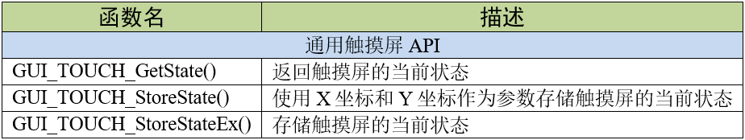

.. vim: syntax=rst

移植emWin到STM32—RGB接口
==========================

本章以配套例程“FreeRTOS_STemWIN544_移植模版”为例，对emWin的执行过程和移植步骤进行解构，阅读时请打开该工程配套学习。

适用于RGB接口开发板的emWin，它的系统功能与操作系统接口的配置操作与适用于8080并口开发板的完全相同，
不同的是配置内存管理、显示驱动和触摸驱动接口的配置。本章只关注不同的部分，相同部分可以参考第5章 的前3个小节，在这里就不再赘述了。

配置内存管理接口
~~~~~~~~~~~~~~~~~~~~~~~~

emWin启动时，GUI_X_Config函数是GUI_Init调用的第一个初始化函数，
这个函数初始化了emWin的运行内存，代码位于GUIConf.c文件中，见 代码清单:RGB接口-1_ 。

.. code-block:: c
    :caption: 代码清单:RGB接口-1 GUIConf.c文件内容
    :name: 代码清单:RGB接口-1
    :linenos:

    #include "GUI.h"

    /*********************************************************************
    *
    *       Defines, configurable
    *
    **********************************************************************
    */
    /* 定义用于GUI的可用字节数 */
    #if USE_EXTMEMHEAP
    #define GUI_NUMBYTES   (1024 * 1024 * 8)    // x Byte               (1)
    #define GUI_EXTBUFADD  (0xD2000000-GUI_NUMBYTES)              (2)
                            //32MBSDRAM的最后8MB作为STemWIN动态内存
    #else
    #define GUI_NUMBYTES  (1024 * 110)    // x KByte
    #endif

    /*********************************************************************
    *
    *       Static data
    *
    **********************************************************************
    */
    #if USE_EXTMEMHEAP
    static U32 HeapMem[GUI_NUMBYTES / 4] __attribute__((at(GUI_EXTBUFADD)))
                                                    ;               (3)
    #else
    static U32 extMem[GUI_NUMBYTES / 4];
    #endif

    /*********************************************************************
    *
    *       Public code
    *
    **********************************************************************
    */
    /*********************************************************************
    *
    *       Get_ExtMemHeap
    *
    * Purpose:
    *   Allocate heap from external memory
    */
    #if USE_EXTMEMHEAP
    U32* Get_ExtMemHeap (void)
    {
        return HeapMem;
    }
    #endif

    /*********************************************************************
    *
    *       GUI_X_Config
    *
    * Purpose:
    *   Called during the initialization process in order to set up the
    *   available memory for the GUI.
    */
    void GUI_X_Config(void)
    {
    #ifdef USE_EXTMEMHEAP
        GUI_ALLOC_AssignMemory(HeapMem, GUI_NUMBYTES);                  (4)
    #else
        GUI_ALLOC_AssignMemory(extMem, GUI_NUMBYTES);
    #endif
    }

上述代码中的第1部分定义了emWin所使用内存堆大小的宏GUI_NUMBYTES，第2部分定义了内存堆起始地址的宏GUI_EXTBUFADD，
第3部分是利用前两个宏定义了一个静态的，大小为GUI_NUMBYTES / 4的数组HeapMem，并将数组的首地址定位到GUI_EXTBUFADD处，
第4部分利用库函数GUI_ALLOC_AssignMemory把该静态数组分配给emWin作为内存块使用。
旧版例程中还用到了GUI_ALLOC_SetAvBlockSize函数配置存储块的平均大小，
但在本教程使用的V5.44a版本中已经不再需要GUI_ALLOC_SetAvBlockSiz函数。

用户可通过GUI_NUMBYTES改变emWin使用的内存块大小，在本示例中为8MB。
也可通过GUIConf.h中的USE_EXTMEMHEAP宏来选择emWin的内存堆是在内部RAM还是外部SDRAM。

请注意，应用程序无法使用全部的内存块空间，因为emWin的内存管理系统本身使用了其中很小的一部分，
每个内存块大约需要额外的12个字节用于系统管理。并且在此分配的内存块并不会用于多帧缓冲。

配置显示驱动接口
~~~~~~~~~~~~~~~~~~~~~~~~

emWin的显示驱动接口主要包括创建显示设备和显示设备驱动回调函数，移植时主要针对GUIDRV_wf.c文件进行修改，同时也是emWin移植的重点对象。

配置显示驱动
^^^^^^^^^^^^^^^^^^

先来了解显示驱动函数LCD_X_Config的程序流程，它会在GUI_X_Config函数结束后被调用，具体见 代码清单:RGB接口-2_ 。

.. code-block:: c
    :caption: 代码清单:RGB接口-2 LCD_X_Config接口（GUIDRV_wf.c文件）
    :name: 代码清单:RGB接口-2
    :linenos:

    void LCD_X_Config(void)
    {
        int i;
        /* 如果使用了多帧缓冲则初始化多帧缓冲区 */
    #if (NUM_BUFFERS > 1)
        for (i = 0; i < GUI_NUM_LAYERS; i++) {
            GUI_MULTIBUF_ConfigEx(i, NUM_BUFFERS);
        }
    #endif
        /* 设置第一层的显示驱动程序和颜色转换 */
        GUI_DEVICE_CreateAndLink(DISPLAY_DRIVER_0, COLOR_CONVERSION_0, 0,
                                0);
        /* 设置第1层的尺寸大小 */
        LCD_SetSizeEx (0, XSIZE_0, YSIZE_0);
        LCD_SetVSizeEx(0, XSIZE_0, YSIZE_0 * NUM_VSCREENS);

        /* 如果使能多图层
        则设置第二层的显示驱动程序和颜色转换及尺寸
        */
    #if (GUI_NUM_LAYERS > 1)
        GUI_DEVICE_CreateAndLink(DISPLAY_DRIVER_1, COLOR_CONVERSION_1, 0,
                                1);
        LCD_SetSizeEx (1, XSIZE_1, YSIZE_1);
        LCD_SetVSizeEx(1, XSIZE_1, YSIZE_1 * NUM_VSCREENS);
    #endif

        for (i = 0; i < GUI_NUM_LAYERS; i++) {
            _aPendingBuffer[i] = -1;
            /* 设置显存地址 */
            LCD_SetVRAMAddrEx(i, (void *)(_aAddr[i]));
            /* 记住色彩深度以便进一步操作 */
            _aBytesPerPixels[i] = LCD_GetBitsPerPixelEx(i) >> 3;
            /* 把CopyBuffer和CopyRect操作重定向为自定义函数
            */
            LCD_SetDevFunc(i, LCD_DEVFUNC_COPYBUFFER, (void(*)(void))
                        _LCD_CopyBuffer);
            LCD_SetDevFunc(i, LCD_DEVFUNC_COPYRECT,   (void(*)(void))
                        _LCD_CopyRect);
            /* 使用DMA2D重定向16bpp以下位图的绘图函数 */
            if (_GetPixelformat(i) <= LTDC_Pixelformat_ARGB4444) {
                LCD_SetDevFunc(i, LCD_DEVFUNC_FILLRECT, (void(*)(void))
                            _LCD_FillRect);
                LCD_SetDevFunc(i, LCD_DEVFUNC_DRAWBMP_8BPP, (void(*)(void))
                            _LCD_DrawBitmap8bpp);
            }
            /* 使用DMA2D重定向16bpp位图的绘图函数 */
            if (_GetPixelformat(i) == LTDC_Pixelformat_RGB565) {
                LCD_SetDevFunc(i, LCD_DEVFUNC_DRAWBMP_16BPP, (void(*)(void)
                            )_LCD_DrawBitmap16bpp);
            }
            /* 使用DMA2D重定向32bpp位图的绘图函数 */
            if (_GetPixelformat(i) == LTDC_Pixelformat_ARGB8888) {
                LCD_SetDevFunc(i, LCD_DEVFUNC_DRAWBMP_32BPP, (void(*)(void)
                            )_LCD_DrawBitmap32bpp);
            }
            /* 重定向ARGB1555颜色转换函数 */
            GUICC_M1555I_SetCustColorConv(_Color2IndexBulk_M1555I_DMA2D,
                                        _Index2ColorBulk_M1555I_DMA2D);
            /* 重定向RGB565颜色转换函数 */
            GUICC_M565_SetCustColorConv  (_Color2IndexBulk_M565_DMA2D,
                                        _Index2ColorBulk_M565_DMA2D);
            /* 重定向ARGB4444颜色转换函数 */
            GUICC_M4444I_SetCustColorConv(_Color2IndexBulk_M4444I_DMA2D,
                                        _Index2ColorBulk_M4444I_DMA2D);
            /* 重定向RGB888颜色转换函数 */
            GUICC_M888_SetCustColorConv  (_Color2IndexBulk_M888_DMA2D,
                                        _Index2ColorBulk_M888_DMA2D);
            /* 重定向ARGB8888颜色转换函数 */
            GUICC_M8888I_SetCustColorConv(_Color2IndexBulk_M8888I_DMA2D,
                                        _Index2ColorBulk_M8888I_DMA2D);
            /* 使用DMA2D重定向批量Alpha混合函数 */
            GUI_SetFuncAlphaBlending(_DMA_AlphaBlendingBulk);
            /* 使用DMA2D重定向调色板转换为索引值的函数 */
            GUI_SetFuncGetpPalConvTable(_LCD_GetpPalConvTable);
            /* 使用DMA2D重定向单一颜色混合函数*/
            GUI_SetFuncMixColors(_DMA_MixColors);
            /* 使用DMA2D重定向批量颜色混合函数*/
            GUI_SetFuncMixColorsBulk(_LCD_MixColorsBulk);
            /* 使用DMA2D重定向16bpp色深内存设备绘制函数*/
            GUI_MEMDEV_SetDrawMemdev16bppFunc(_LCD_DrawMemdev16bpp);
            /* 使用DMA2D重定向Alpha绘图函数*/
            GUI_SetFuncDrawAlpha(_LCD_DrawMemdevAlpha,
                                _LCD_DrawBitmapAlpha);
        }
    }

上述代码的说明如下：

-  第1部分。如果使用了多帧缓冲，则必须在LCD_X_Config函数的一开始初始化多帧缓冲接口并开启多帧缓冲功能。

-  第2部分。调用GUI_DEVICE_CreateAndLink函数创建显示驱动器设备和用于访问显示设备的颜色转换函数，
   并将显示驱动器设备链接到指定图层的设备列表中。LCD_SetSizeEx函数和LCD_SetVSizeEx函数分别设置物理屏幕和虚拟屏幕的显示区域大小。
   调用LCD_SetVRAMA ddrEx设置显存的起始地址，_aBytesPerPixels数值保存此时显示设备的色彩深度以便其他设置。
   移植时需要用户根据需要实现部分宏定义和变量。示例代码中输入使用的这些宏定义和变量在bsp_lcd.h头文件和GUIDRV_wf.c文件中，
   具体见 代码清单:RGB接口-3_ 。

.. code-block:: c
    :caption: 代码清单:RGB接口-3 相关宏定义和变量 （bsp_lcd.h和GUIDRV_wf.c文件）
    :name: 代码清单:RGB接口-3
    :linenos:

    /** bsp_lcd.h文件 **/
    /* LCD Size (Width and Height) */
    #define  LCD_PIXEL_WIDTH        ((uint16_t)800)
    #define  LCD_PIXEL_HEIGHT       ((uint16_t)480)

    #define  LCD_FRAME_BUFFER       ((uint32_t)0xD0000000)

    /** GUIDRV_wf.c文件 **/
    //
    // Physical display size
    //
    #define XSIZE_PHYS LCD_PIXEL_WIDTH
    #define YSIZE_PHYS LCD_PIXEL_HEIGHT

    //
    // Buffers / VScreens
    //
    #define NUM_BUFFERS  3 // Number of multiple buffers to be used
    #define NUM_VSCREENS 1 // Number of virtual screens to be used

    //
    // BkColor shown if no layer is active
    //
    #define BK_COLOR GUI_DARKBLUE

    //
    // Redefine number of layers for this configuration file. Must be equal or less than in GUIConf.h!
    //
    #undef  GUI_NUM_LAYERS
    #define GUI_NUM_LAYERS 1

    /*********************************************************************
    *
    *       Color mode definitions
    */
    #define _CM_ARGB8888 1
    #define _CM_RGB888   2
    #define _CM_RGB565   3
    #define _CM_ARGB1555 4
    #define _CM_ARGB4444 5
    #define _CM_L8       6
    #define _CM_AL44     7
    #define _CM_AL88     8

    /*********************************************************************
    *
    *       Layer 0
    */
    //
    // Color mode layer 0
    //
    #define COLOR_MODE_0 _CM_RGB888
    //
    // Layer size
    //
    #define XSIZE_0 LCD_PIXEL_WIDTH
    #define YSIZE_0 LCD_PIXEL_HEIGHT

    /*********************************************************************
    *
    *       Automatic selection of driver and color conversion
    */
    #if   (COLOR_MODE_0 == _CM_ARGB8888)
    #define COLOR_CONVERSION_0 GUICC_M8888I
    #define DISPLAY_DRIVER_0   GUIDRV_LIN_32
    #elif (COLOR_MODE_0 == _CM_RGB888)
    #define COLOR_CONVERSION_0 GUICC_M888
    #define DISPLAY_DRIVER_0   GUIDRV_LIN_24
    #elif (COLOR_MODE_0 == _CM_RGB565)
    #define COLOR_CONVERSION_0 GUICC_M565
    #define DISPLAY_DRIVER_0   GUIDRV_LIN_16
    #elif (COLOR_MODE_0 == _CM_ARGB1555)
    #define COLOR_CONVERSION_0 GUICC_M1555I
    #define DISPLAY_DRIVER_0   GUIDRV_LIN_16
    #elif (COLOR_MODE_0 == _CM_ARGB4444)
    #define COLOR_CONVERSION_0 GUICC_M4444I
    #define DISPLAY_DRIVER_0   GUIDRV_LIN_16
    #elif (COLOR_MODE_0 == _CM_L8)
    #define COLOR_CONVERSION_0 GUICC_8666
    #define DISPLAY_DRIVER_0   GUIDRV_LIN_8
    #elif (COLOR_MODE_0 == _CM_AL44)
    #define COLOR_CONVERSION_0 GUICC_1616I
    #define DISPLAY_DRIVER_0   GUIDRV_LIN_8
    #elif (COLOR_MODE_0 == _CM_AL88)
    #define COLOR_CONVERSION_0 GUICC_88666I
    #define DISPLAY_DRIVER_0   GUIDRV_LIN_16
    #else
    #error Illegal color mode 0!
    #endif

    /** 变量定义 **/
    static LTDC_Layer_TypeDef * _apLayer[] = { LTDC_Layer1, LTDC_Layer2 };
    static const U32 _aAddr[] = { LCD_FRAME_BUFFER, LCD_FRAME_BUFFER +
                                XSIZE_PHYS * YSIZE_PHYS * sizeof(U32) *
                                NUM_VSCREENS * NUM_BUFFERS };
    static int _aPendingBuffer[GUI_NUM_LAYERS];
    static int _aBufferIndex[GUI_NUM_LAYERS];
    static int _axSize[GUI_NUM_LAYERS];
    static int _aySize[GUI_NUM_LAYERS];
    static int _aBytesPerPixels[GUI_NUM_LAYERS];

在上述宏定义中，为了方便修改显示图层数，将 GUIConf.h中的GUI_NUM_LAYERS在这里重新定义。

GUIDRV_LIN_XX是emWin内置的液晶驱动，其中XX代表不同的色彩深度。此驱动支持所有液晶控制器，但仅管理显存内容，
它不向液晶控制器发送任何命令或假定任何特殊寄存器。以这种液晶驱动为基础，可以直接通过STM32F429上的LTDC液晶控制器驱动屏幕，
关于LTDC的驱动原理请参考野火的《零死角玩转STM32》教程。GUICC_XXXX是emWin内置的各种像素格式的固定调色板，
也就是颜色转换函数，其中XXXX代表不同的像素格式，当emWin上层库函数解析颜色数据时，会调用这些函数按固定格式转换。

\_aAddr数组存放了所有图层的显存地址，_aPendingBuffer和_aBufferIndex是所有图层的多帧缓冲区索引，
_axSize 和_aySize 存放了所有图层的宽高，_aBytesPerPixels存放每个图层正在使用的色彩深度索引。
emWin占用的显存大小与很多参数的有关，例如LCD分辨率大小、像素格式、多帧缓冲级别等等都会对显存大小造成影响。
在32位色彩深度单图层下总的显存占用大小计算方法如下：

XSIZE_PHYS \* YSIZE_PHYS \* 4 \* NUM_VSCREENS \* NUM_BUFFERS

上述公式里的4是因为32位色彩深度下单个像素数据占了4个字节，如果采用24位色彩深度则变为乘3。移植的时候需要用户根据实际情况配置。

代码清单:RGB接口-2_ 的第3部分。这个部分主要是针对DMA2D图形加速器接口的配置。调用LCD_SetDevFunc函数将帧缓冲区复制、
复制矩形、绘制不同色彩深度位图等操作重定向到自定义接口，GUICC_XXXXX_SetCustColorConv函数为相应的固定调色板模式设置自定义颜色转换接口，
GUI_SetFuncAlphaBlending设置自定义批量Alpha混合接口，GUI_SetFuncAlphaBlending函数将位图调色板转换为索引值的接口设置为自定义接口，
GUI_SetFuncMixColors和GUI_SetFuncMixColorsBulk分别设置自定义的单像素颜色混合接口和批量颜色混合接口。
移植时需要用户根据实际需要配置这些自定义接口。

配置驱动程序回调函数
^^^^^^^^^^^^^^^^^^^^^^^^^^^^^^

在讲解驱动程序回调函数的配置之前，先来讲解一个比较重要的用户接口，
那就是液晶控制器初始化接口_LCD_InitController，见 代码清单:RGB接口-4_ 。

.. code-block:: c
    :caption: 代码清单:RGB接口-4 _LCD_InitController接口(GUIDRV_wf.c文件)
    :name: 代码清单:RGB接口-4
    :linenos:

    static void _LCD_InitController(int LayerIndex)
    {
        LTDC_Layer_InitTypeDef LTDC_Layer_InitStruct = {0};
        static int xSize, ySize, BytesPerLine, BitsPerPixel, i;
        static U32 Pixelformat, Color;
        static int Done;

        if (LayerIndex >= GUI_COUNTOF(_apLayer)) {
            return;
        }
        if (Done == 0) {
            Done = 1;

            //
            // 使能LTDC行中断
            //
            LTDC_ITConfig(LTDC_IER_LIE, ENABLE);
            NVIC_SetPriority(LTDC_IRQn, 0);
            NVIC_EnableIRQ(LTDC_IRQn);
            //
            // Enable DMA2D transfer complete interrupt
            //
            DMA2D_ITConfig(DMA2D_CR_TCIE, ENABLE);
            NVIC_SetPriority(DMA2D_IRQn, 0);
            NVIC_EnableIRQ(DMA2D_IRQn);
            //
            // Clear transfer complete interrupt flag
            //
            DMA2D->IFCR = (U32)DMA2D_IFSR_CTCIF;
        }
        //
        // 图层设置
        //
        xSize = LCD_GetXSizeEx(LayerIndex);
        ySize = LCD_GetYSizeEx(LayerIndex);

        /* 层窗口配置 */
        /* 配置本层的窗口边界，注意这些参数是包含HBP HSW VBP VSW的 */
        //一行的第一个起始像素，该成员值应用为 (LTDC_InitStruct.LTDC_AccumulatedHBP+1)的值
        LTDC_Layer_InitStruct.LTDC_HorizontalStart = HBP + HSW;
        //一行的最后一个像素，该成员值应用为 (LTDC_InitStruct.LTDC_AccumulatedActiveW)的值
        LTDC_Layer_InitStruct.LTDC_HorizontalStop = HSW+HBP+xSize-1;
        //一列的第一个起始像素，该成员值应用为 (LTDC_InitStruct.LTDC_AccumulatedVBP+1)的值
        LTDC_Layer_InitStruct.LTDC_VerticalStart =  VBP + VSW;
        //一列的最后一个像素，该成员值应用为 (LTDC_InitStruct.LTDC_AccumulatedActiveH)的值
        LTDC_Layer_InitStruct.LTDC_VerticalStop = VSW+VBP+ySize-1;
        //
        // 像素格式设置
        //
        Pixelformat = _GetPixelformat(LayerIndex);
        LTDC_Layer_InitStruct.LTDC_PixelFormat = Pixelformat;
        //
        // Alpha constant (255 totally opaque)
        //
        LTDC_Layer_InitStruct.LTDC_ConstantAlpha = 255;
        //
        // Default Color configuration (configure A, R, G, B component values)
        //
        LTDC_Layer_InitStruct.LTDC_DefaultColorBlue  = 0;
        LTDC_Layer_InitStruct.LTDC_DefaultColorGreen = 0;
        LTDC_Layer_InitStruct.LTDC_DefaultColorRed   = 0;
        LTDC_Layer_InitStruct.LTDC_DefaultColorAlpha = 0;
        //
        // Configure blending factors
        //
        BytesPerLine = _GetBytesPerLine(LayerIndex, xSize);
        LTDC_Layer_InitStruct.LTDC_BlendingFactor_1 = LTDC_BlendingFactor1_PAxCA;;
        LTDC_Layer_InitStruct.LTDC_BlendingFactor_2 = LTDC_BlendingFactor2_PAxCA;
        LTDC_Layer_InitStruct.LTDC_CFBLineLength    = BytesPerLine + 3;
        LTDC_Layer_InitStruct.LTDC_CFBPitch         = BytesPerLine;
        LTDC_Layer_InitStruct.LTDC_CFBLineNumber    = ySize;
        //
        // Input Address configuration
        //
        LTDC_Layer_InitStruct.LTDC_CFBStartAdress = _aAddr[LayerIndex];
        LTDC_LayerInit(_apLayer[LayerIndex], &LTDC_Layer_InitStruct);
        //
        // Enable LUT on demand
        //
        BitsPerPixel = LCD_GetBitsPerPixelEx(LayerIndex);
        if (BitsPerPixel <= 8) {
            //
            // Enable usage of LUT for all modes with <= 8bpp
            //
            _LTDC_LayerEnableLUT(_apLayer[LayerIndex], ENABLE);
        } else {
            //
            // Optional CLUT initialization for AL88 mode (16bpp)
            //
            if (_apColorConvAPI[LayerIndex] == GUICC_88666I) {
                _LTDC_LayerEnableLUT(_apLayer[LayerIndex], ENABLE);
                for (i = 0; i < 256; i++) {
                    Color = LCD_API_ColorConv_8666.pfIndex2Color(i);
                    _LTDC_SetLUTEntry(LayerIndex, Color, i);
                }
            }
        }
        //
        // Enable layer
        //
        LTDC_LayerCmd(_apLayer[LayerIndex], ENABLE);
        //
        // Reload configuration
        //
        LTDC_ReloadConfig(LTDC_SRCR_IMR);
    }

液晶控制器接口_LCD_InitController首先进行了LTDC的硬件初始化，然后对LCD的图层进行初始化配置相关属性，最后为小于8位色深和AL88像素格式的图形开启颜色查找表。不过在本示例中我们没有在_LCD_InitController接口中做LTDC的硬件初始，而是将其放在了GUI_In
it之前。移植时需要用户根据实际情况配置接口。

接下来是LCD_X_DisplayDriver函数，此函数是在GUI_Init库函数初始化过程中最后一个调用的。
通常是由内部液晶驱动程序调用，用于管理液晶控制器的运行和设置。
在GUI_Init函数中调用主要是为了初始化液晶控制器，见 代码清单:RGB接口-5_ 。

.. code-block:: c
    :caption: 代码清单:RGB接口-5 LCD_X_DisplayDriver函数（GUIDRV_wf.c文件）
    :name: 代码清单:RGB接口-5
    :linenos:

    int LCD_X_DisplayDriver(unsigned LayerIndex, unsigned Cmd, void *
                            pData)
    {
        int r = 0;

        switch (Cmd) {
        case LCD_X_INITCONTROLLER: {
            /* Called during the initialization process in order to set up
            the display controller and put it into operation. */
            _LCD_InitController(LayerIndex);
            break;
        }
        case LCD_X_SETORG: {
            /* Required for setting the display origin which is passed in
            the 'xPos' and 'yPos' element of p */
            LCD_X_SETORG_INFO * p;

            p = (LCD_X_SETORG_INFO *)pData;
            _apLayer[LayerIndex]->CFBAR = _aAddr[LayerIndex] + p->yPos *
                                        _axSize[LayerIndex] *
                                        _aBytesPerPixels[LayerIndex];
            LTDC_ReloadConfig(LTDC_SRCR_VBR); // Reload on next blanking period
            break;
        }
        case LCD_X_SHOWBUFFER: {
            /* Required if multiple buffers are used. The 'Index' element
            of p contains the buffer index. */
            LCD_X_SHOWBUFFER_INFO * p;

            p = (LCD_X_SHOWBUFFER_INFO *)pData;
            _aPendingBuffer[LayerIndex] = p->Index;
            break;
        }
        case LCD_X_SETLUTENTRY: {
            /* Required for setting a lookup table entry which is passed
            in the 'Pos' and 'Color' element of p */
            LCD_X_SETLUTENTRY_INFO * p;

            p = (LCD_X_SETLUTENTRY_INFO *)pData;
            _LTDC_SetLUTEntry(LayerIndex, p->Color, p->Pos);
            break;
        }
        case LCD_X_ON: {
            /* Required if the display controller should support switching
            on and off */
            _LCD_DisplayOn();
            break;
        }
        case LCD_X_OFF: {
            /* Required if the display controller should support switching
            on and off */
            _LCD_DisplayOff();
            break;
        }
        case LCD_X_SETVIS: {
            /* Required for setting the layer visibility which is passed
            in the 'OnOff' element of pData */
            LCD_X_SETVIS_INFO * p;

            p = (LCD_X_SETVIS_INFO *)pData;
            LTDC_LayerCmd(_apLayer[LayerIndex], p->OnOff ? ENABLE :
                        DISABLE);
            break;
        }
        case LCD_X_SETPOS: {
            /* Required for setting the layer position which is passed in
            the 'xPos' and 'yPos' element of pData */
            LCD_X_SETPOS_INFO * p;

            p = (LCD_X_SETPOS_INFO *)pData;
            _LTDC_SetLayerPos(LayerIndex, p->xPos, p->yPos);
            break;
        }
        case LCD_X_SETSIZE: {
            /* Required for setting the layer position which is passed in
            the 'xPos' and 'yPos' element of pData */
            LCD_X_SETSIZE_INFO * p;
            int xPos, yPos;

            GUI_GetLayerPosEx(LayerIndex, &xPos, &yPos);
            p = (LCD_X_SETSIZE_INFO *)pData;
            _axSize[LayerIndex] = p->xSize;
            _aySize[LayerIndex] = p->ySize;
            _LTDC_SetLayerPos(LayerIndex, xPos, yPos);
            break;
        }
        case LCD_X_SETALPHA: {
            /* Required for setting the alpha value which is passed in the
            'Alpha' element of pData */
            LCD_X_SETALPHA_INFO * p;

            p = (LCD_X_SETALPHA_INFO *)pData;
            _LTDC_SetLayerAlpha(LayerIndex, p->Alpha);
            break;
        }
        case LCD_X_SETCHROMAMODE: {
            /* Required for setting the chroma mode which is passed in the
            'ChromaMode' element of pData */
            LCD_X_SETCHROMAMODE_INFO * p;

            p = (LCD_X_SETCHROMAMODE_INFO *)pData;
            _LTDC_LayerEnableColorKeying(_apLayer[LayerIndex], (p->
                                        ChromaMode != 0) ? ENABLE :
                                        DISABLE);
            break;
        }
        case LCD_X_SETCHROMA: {
            /* Required for setting the chroma value which is passed in
            the 'ChromaMin' and 'ChromaMax' element of pData */
            LCD_X_SETCHROMA_INFO * p;
            U32 Color;

            p = (LCD_X_SETCHROMA_INFO *)pData;
            Color = ((p->ChromaMin & 0xFF0000) >> 16) | (p->ChromaMin &
                    0x00FF00) | ((p->ChromaMin & 0x0000FF) << 16);
            _apLayer[LayerIndex]->CKCR = Color;
            LTDC_ReloadConfig(LTDC_SRCR_VBR); // Reload on next blanking period
            break;
        }
        default:
            r = -1;
        }
        return r;

该回调函数将命令和命令参数作为入口参数。传入的命令告诉回调函数应执行哪些动作，
如果命令带有参数，则这些参数通过数据指针 pData 传递。

上述代码中各个命令的具体含义如下：

-  LCD_X_INITCONTROLLER：初始化液晶控制器，此命令不传递任何参数。在本示例中实际上做的是LCD图层初始化，
   LCD的硬件初始化被放到了GUI_Init之前的BSP初始化函数中。

-  LCD_X_SETORG：设置显示的原点，或修改帧缓冲区起始地址，带有一个指向LCD_X_SETORG_INFO类型结构体的参数，
   原型见 代码清单:RGB接口-6_ 。

.. code-block:: c
    :caption: 代码清单:RGB接口-6 LCD_X_SETORG_INFO原型
    :name: 代码清单:RGB接口-6
    :linenos:

    typedef struct {
        int xPos, yPos;
    } LCD_X_SETORG_INFO;

-  LCD_X_SHOWBUFFER：此命令通常与多帧缓冲一起使用，带有一个指向LCD_X_SHOWBUFFER_INFO类型结构体的参数，
   原型见 代码清单:RGB接口-7_ 。它告诉回调函数，需要将具有指定索引的多帧缓冲区变为可见。设置多帧缓冲区可见的方式有两种，
   一种是通过立即设置正确的多帧缓冲区起始地址，或在LTDC的帧结束中断回调函数中执行相应操作。

.. code-block:: c
    :caption: 代码清单:RGB接口-7 LCD_X_SHOWBUFFER_INFO原型
    :name: 代码清单:RGB接口-7
    :linenos:

    typedef struct {
        int Index;
    } LCD_X_SHOWBUFFER_INFO;

-  LCD_X_SETLUTENTRY：设置颜色查找表入口地址和此地址对应的RGB值，
   此命令带有一个指向LCD_X_SETLUTENTRY_INFO类型结构体的参数，原型见 代码清单:RGB接口-8_ 。

.. code-block:: c
    :caption: 代码清单:RGB接口-8 LCD_X_SETLUTENTRY_INFO原型
    :name: 代码清单:RGB接口-8
    :linenos:

    typedef struct {
        LCD_COLOR Color;
        U8 Pos;
    } LCD_X_SETLUTENTRY_INFO;

-  LCD_X_ON和LCD_X_OFF：控制屏幕的开启和关闭，此命令不传递任何参数。

-  LCD_X_SETVIS：用于在运行时设置图层的可见性，
   带有一个指向LCD_X_SETVIS_INFO类型结构体的参数，原型见 代码清单:RGB接口-9_ 。

.. code-block:: c
    :caption: 代码清单:RGB接口-9 LCD_X_SETVIS_INFO原型
    :name: 代码清单:RGB接口-9
    :linenos:

    typedef struct {
        int OnOff;
    } LCD_X_SETVIS_INFO;

-  LCD_X_SETPOS：用于设置图层位置，此命令带有一个指向LCD_X_SETPOS_INFO类型结构体的参数，
   原型见代码清单6‑10。通常图层不能超过屏幕的物理范围，不过可以在不修改多帧缓冲区内容的情况下，
   实现图层位于显示屏外部的效果。这种效果可用于将图片移动到屏幕的可见区域或将其移出屏幕，而无需消耗额外的CPU负载进行重绘。

.. code-block:: c
    :caption: 代码清单:RGB接口-10 LCD_X_SETPOS_INFO原型
    :name: 代码清单:RGB接口-10
    :linenos:

    typedef struct {
        int xPos, yPos;
        int xLen, yLen;
        int BytesPerPixel;
        U32 Off;
    } LCD_X_SETPOS_INFO;

-  LCD_X_SETSIZE：用于在运行时设置图层的大小，带有一个指向LCD_X_SETSIZE_INFO类型的参数，见 代码清单:RGB接口-11_ 。

.. code-block:: c
    :caption: 代码清单:RGB接口-11 LCD_X_SETSIZE_INFO原型
    :name: 代码清单:RGB接口-11
    :linenos:

    typedef struct {
        int xSize, ySize;
    } LCD_X_SETSIZE_INFO;

-  LCD_X_SETALPHA：设置所需的图层alpha 值，
   带有一个指向LCD_X_SETALPHA_INFO类型的参数，见 代码清单:RGB接口-12_ 。

.. code-block:: c
    :caption: 代码清单:RGB接口-12 LCD_X_SETALPHA_INFO原型
    :name: 代码清单:RGB接口-12
    :linenos:

    typedef struct {
        int Alpha;
    } LCD_X_SETALPHA_INFO;

-  LCD_X_SETCHROMAMODE：开启或关闭色度混合模式，
   带有一个指向LCD_X_SETCHROMAMODE_INFO类型的参数，见 代码清单:RGB接口-13_ 。

.. code-block:: c
    :caption: 代码清单:RGB接口-13 LCD_X_SETCHROMAMODE_INFO原型
    :name: 代码清单:RGB接口-13
    :linenos:

    typedef struct {
        int ChromaMode;
    } LCD_X_SETCHROMAMODE_INFO;

-  LCD_X_SETCHROMA：设置用于色度模式的颜色，
   带有一个指向LCD_X_SETCHROMA_INFO类型的参数，见 代码清单:RGB接口-14_ 。

.. code-block:: c
    :caption: 代码清单:RGB接口-14 LCD_X_SETCHROMA_INFO原型
    :name: 代码清单:RGB接口-14
    :linenos:

    typedef struct {
        LCD_COLOR ChromaMin;
        LCD_COLOR ChromaMax;
    } LCD_X_SETCHROMA_INFO;

以上这些驱动程序回调函数命令的执行接口，移植时用户需要根据自己的LCD控制器进行配置。

配置触摸接口
~~~~~~~~~~~~~~~~~~

emWin并没有将触摸设备接口整理为单独的.c文件，不过提供了触摸相关的库函数，
用户需自行编写触摸接口。emWin提供了两套不同的库函数，见表格 触摸设备API_ 。

emWin把触摸设备、外接鼠标和指点杆等都归为指针输入设备(Pointer input devices或PID)这一大类中。
其中触摸设备API分为通用触摸屏和模拟触摸屏两种，模拟触摸屏API为电阻屏专用。在这里我们以模版示例中使用的5吋电容屏为例，
讲解如何配置触摸接口。触摸接口的配置和移植都非常简单，以本示例中的GT9xx_GetOnePiont为例，见 代码清单:RGB接口-15_ 。

.. code-block:: c
    :caption: 代码清单:RGB接口-15 触摸接口移植（gt9xx.c文件）
    :name: 代码清单:RGB接口-15
    :linenos:

    void GT9xx_GetOnePiont(void)
    {
        GUI_PID_STATE State;
        GTP_DEBUG_FUNC();

        __disable_irq();

        Goodix_TS_Work_Func();

        __enable_irq();

        if ((pre_x==-1) || (pre_y==-1)) {
            State.x = -1;
            State.y = -1;
            State.Pressed = 0;
            State.Layer = 0;
            GUI_TOUCH_StoreStateEx(&State);
            return;
        }
        State.Pressed = 1;
        State.x = pre_x;
        State.y =pre_y;
        State.Layer = 0;
        GUI_TOUCH_StoreStateEx(&State);
    }

GT9xx_GetOnePiont位于触摸屏驱动文件gt9xx.c中。它的功能是读取触摸坐标，并返回触摸屏的状态，
它通过调用gt9xx.c文件中的Goodix_TS_Work_Func函数读取触摸坐标，该函数根据原驱动中的同名函数修改而来，只读取一个触摸点，
关于触摸屏的控制原理请参考《零死角玩转STM32》教程。GUI_PID_STATE类型的变量State，用来存放触摸设备的触摸坐标、
状态和激活层数等信息，原型见 代码清单:RGB接口-16_ 。

.. code-block:: c
    :caption: 代码清单:RGB接口-16 GUI_PID_STATE原型
    :name: 代码清单:RGB接口-16
    :linenos:

    typedef struct {
        int x,y;
        U8  Pressed;
        U8  Layer;
    } GUI_PID_STATE;

配置触摸驱动时需要注意，原gt9xx.c文件中使用了中断读取触摸坐标，
而本示例通过在FreeRTOS中创建一个触摸任务每20ms调用一次GT9xx_GetOnePiont函数读取触摸信息，所以触摸驱动移植时需要关闭触摸中断。
